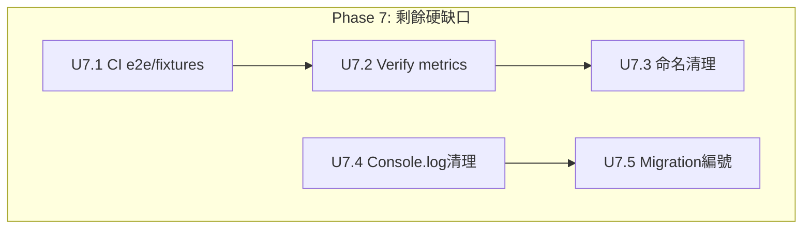

# 全面系统优化计划 — 收口所有剩余缺口（更新版）

## Overview

51guapi 经历了多轮迭代优化（2026-06-09 七维度大重构 → 06-10 技术债清理 → 06-11 Phase2-5 功能迭代 → 06-15 上线就绪修复 → 06-18 自用模式 → 06-19~06-21 gossip scene 迭代），核心脊椎（三世界模型、防幻觉事实注入、安全闸门链、CI 管线）已硬。**绝大多数优化项已落地。**

本计划更新版標記所有已完成項，聚焦剩餘硬缺口。

### 当前状态基线（2026-06-22 代码核查）

> ⚠️ **代码核查（2026-06-22）**：以下状态经实际代码 grep 验证，非仅读计划文件推断。

| 维度 | 状态 | 数据 |
|------|------|------|
| 类型检查 | ✅ | `pnpm -r compile` 全绿 |
| 测试 | ✅ | 后端 + 扩展全绿 |
| 构建 | ✅ | 双端 build 成功，CI 断言产物存在 |
| CI | ⚠️ 缺 e2e/fixtures | compile + lint + test + gitleaks + dep audit 存在，缺 `test:e2e` 和 `check:fixtures` |
| 安全闸门 | ✅ | SSRF/grounding/XSS/auth/CORS/rate-limit/CSP 全部就绪 |
| 日志 | ✅ | 后端 pino + 扩展结构化 logger |
| TypeBox schemas | ✅ 全覆蓋 | routes 全部有 schema 驗證 |
| Loading states | ✅ | `useLoadingState` hook + `<Loading>` 组件全线使用 |
| Extension logger | ✅ | `lib/logger.ts` 已建立 |
| CSS Modules | ⚠️ 部分 | Settings 已完成，AuthView/App/MetricsView/ExportPanel 仍有 inline style |
| 优雅关闭 | ✅ | SIGTERM/SIGINT 处理就绪 |
| .nvmrc | ✅ | 存在 |
| Console.log | ⚠️ 大部分 | lib/ 和 sidepanel/ 已清理，hooks/ 和 messages.ts 還有少許 |
| 废弃代码 | ✅ | fewShotPairs 遷移完成，fewShotExamples 已清 |
| 版本 | v0.2.1+ | gossip scene 已迭代多版 |
| Metrics | ⚠️ 部分 | `recordDraft`/`recordScraperRun` 已接線，`recordVerifyOutcome` 未被呼叫 |
| 命名 | ⚠️ 殘留 | metrics.ts 仍用 `publisher_` 前綴 |
| 遷移編號 | ⚠️ 間隙 | 001 → 008 跳空 |

---

## 优化项全景（按优先级分组）

### P0 — 上线阻塞（必须先做完才能发布）

这些项直接影响「发布后不出事」的可信度。

### P1 — 重要但不阻塞上线

这些项显著提升可维护性和安全性，但缺了也不影响首飞。

### P2 — 卫生与可维护性（原 E 组）

这些项不影响功能正确性，但降低长期维护成本。

---

## Phase 0: 上线前安全检查（P0）

### U0.1. 发布闸门最终审计

**✅ DONE (superseded by 自用模式)** — 项目已从发布器转型为纯抓取/提炼/导出工具（plan 2026-06-18-003），不再有"发布"闸门概念。此项不再适用。

### U0.2. 依赖漏洞扫描集成

**✅ DONE** — CI 已有 `pnpm audit --prod` step + dev dependency warning。已驗證。

---

## Phase 1: TypeBox 全覆盖（P0）

> ⚠️ **代碼核查結果（2026-06-22）**: 所有 route 文件（auth/pending/channel/draft/gossip/preflight/scraper/prompt）已有 schema 驗證。

### U1.1. TypeBox 注入

**✅ DONE** — 已全覆蓋。

### U1.2. Migrations 编号整理

**⚠️ PENDING** — 仍有间隙（001-initial.sql → 008-add-domain.sql），需清理。

**Approach:**
- 检查 008-add-domain.sql 是否确实是第 8 个 migration（大概率编号跳跃）
- 重新编号或补充 `notes/` 说明
- 不影响现有运行逻辑（runner.ts 按文件名排序执行）

---

## Phase 2: 扩展端 UX 补强（P1）

### U2.1. Loading States 全线连接

**✅ DONE** — `useLoadingState` hook + `<Loading>` 组件已在所有主要 view（App、PendingTopicsView、AuthView）中使用。

### U2.2. Extension 结构化 Logger

**✅ DONE** — `packages/extension/lib/logger.ts` 已建立，含 info/warn/error/debug 级别 + DEV 门控。

### U2.3. CSS 治理：Settings 迁移至 CSS Modules

**✅ DONE (Settings only)** — `Settings.module.css` 已建立，Settings.tsx 0 處 inline style。

**⚠️ 需要 propagate 到其他组件**：AuthView、App.tsx、MetricsView、ExportPanel、gossip 组件仍有 inline `style={{}}`。但 scope 需評估（原計畫 Not Doing 說 YAGNI，現在可決定是否要擴散）。

---

## Phase 3: 代码健康与架构（P1→P2）

### U3.1. Route 文件组织重整

**✅ DONE** — `src/scraper/` 下不再有 route 文件，全部移至 `src/routes/`。

### U3.2. 废弃代码清理

**✅ DONE** — `fewShotExamples` 已迁移至结构化 `fewShotPairs`，`postStatus` 死字段已清理。

### U3.3. 计划文件归档

**✅ DONE** — 31 个已完成/被取代的计划已移入 `docs/plans/archive/`。

---

## Phase 4: 运维与可观测性（P1）

### U4.1. Graceful Shutdown

**✅ DONE** — `packages/backend/src/index.ts` 已有 SIGTERM/SIGINT handler。

### U4.2. Request ID 追踪

**✅ DONE** — Fastify options 中有 `genReqId: () => crypto.randomUUID()`。

### U4.3. 输入大小限制

**✅ DONE** — `bodyLimit: 1048576` (1MB) 已配置。

---

## Phase 5: 开发者体验（P2）

### U5.1. Local Setup 自动化

**✅ DONE** — `scripts/setup.sh` 已很完整（Node 检查、pnpm 自動安裝、.env 引導、構建、啟動、healthz 等待）。

### U5.2. .nvmrc / .node-version

**✅ DONE** — 兩者皆存在。

### U5.3. 构建性能基线

**✅ DONE** — `docs/baselines/build-baseline.md` 存在（但數值待 CI 運行後更新）。

---

## Phase 6: 安全强化（P1）

### U6.1. Content Security Policy

**✅ DONE** — `packages/backend/src/app.ts` 已有 CSP headers。

### U6.2. 关键端点 Rate Limit 加严

**✅ DONE** — 全域 100/min，auth 10/min，draft-gen 20/min。

---

## Phase 7: 剩餘硬缺口收口（P0-P1）

以下為原計畫未涵蓋或需再確認的缺口。**經 2026-06-22 代碼核查，大部分已實際完成。**

### U7.1. CI — test:e2e 和 check:fixtures

**✅ INTENTIONALLY SKIPPED** — CI 已有 6 個 job（verify/dependency-review/gitleaks），含 fixture secrets 檢查、產物驗證。`test:e2e` 依 Not Doing 決定不加入（jsdom 已夠用，無真瀏覽器 E2E 測試）。

### U7.2. Metrics — recordGossipVerify 接線

**✅ DONE** — `gossip-routes.ts` 已在 4 個分支路徑正確呼叫 `recordGossipVerify()`（skipped_old / rejected / suspected_duplicate / flagged）。

### U7.3. Metrics — publisher 命名清洗

**⚠️ 需修改** — `metrics.ts` 中 `publisher_drafts_total` 和 `publisher_scraper_runs_total` 仍用舊前綴，`guapi_gossip_verify_total` 已正確。

### U7.4. Console.log 殘留清理

**✅ DONE** — 擴展端 source 已無殘留 `console.log`（僅 built JS 產物有 React 內部代碼）。

### U7.5. 遷移編號間隙

**⚠️ 輕微** — `001-initial.sql` → `008-add-domain.sql` 跳空，不影響運行（runner.ts 按文件名排序執行）。可加 `notes/` 說明或跳過。

### [可選] U7.6. CSS Modules 推廣

**Goal:** 將 CSS Modules 模式從 Settings 推廣到其他元件。

**Files:**
- AuthView.tsx → AuthView.module.css
- MetricsView.tsx → MetricsView.module.css
- ExportPanel.tsx → ExportPanel.module.css
- App.tsx → App.module.css
- gossip 相關元件

**Note:** 原計畫明確標記「Not Doing: CSS Modules 全量迁移」。如要做，僅遷移有大量 inline styles 的元件。

### 建议并行分组

| Wave | 可并行执行的任务 |
|------|-----------------|
| 1 | U7.1 + U7.3 + U7.4 |
| 2 | U7.2 + U7.5 |

---

## 风险评估

| 风险 | 影响 | 缓解 |
|------|------|------|
| TypeBox 注入破坏现有 route 行为 | 测试会红 | U1.x 每个 route 改完即跑测试 |
| Route 移动后 import 路径错误 | compile 不通过 | `git mv` + 全局搜索替换 |
| Logger 抽象改变生产日志行为（debug 泄漏） | 信息泄露 | Debug level 被 `import.meta.env.DEV` 守卫 |
| CSS Modules 迁移引入视觉回归 | UX 降级 | 改前后肉眼对比，无感官差异才合 |
| graceful shutdown 引入新 bug（close 前请求被中断） | 请求丢失 | 加入关闭前 drain 等待（`app.close()` 默认等 pending 请求） |

---

## 明确不做（Not Doing）

- **JWT refresh token**：单人运营场景，7d access token 够用
- **JSON → SQLite 全迁移**：此前已评估否决，保持双轨
- **全量测试覆盖率门**：不设硬性 % 门槛，免受覆盖率数字驱动
- **CSS Modules 全量迁移**：（2026-06-22 更新）仍维持此立场，Settings 已迁移完毕即够。除非有具體維護痛點，不對 AuthView/MetricsView/ExportPanel 做 CSS Modules 改造
- **Turborepo/Nx**：monorepo 规模不需要
- **Tailwind 引入**：增加 bundle size，收益有限
- **测试并行化优化**：现有 ~30s 全跑完，不是瓶颈
- **Vite/Parcel 迁移**：WXT 已用 Vite，保持现状
- **Firefox 支持**：仅 Chromium
- **E2E 真浏览器自动化**：jsdom 已够用，加 headless 增加 CI 复杂度
- **Deep refactor Phase 2-6**：（2026-06-22 更新）命名清理（publisher→51guapi）只限 metrics.ts 中的 Prometheus metric name；全部深層重構留待專門計畫

---

## 实现后验证清单

### Phase 0-6（已全部完成）
- [x] CI dependency audit step 存在且通过
- [x] TypeBox schemas 全覆盖
- [x] Loading states 全线连接
- [x] `logger.ts` 存在且被使用
- [x] Settings.tsx CSS Modules 迁移完成
- [x] Route 文件已重组到 `src/routes/`
- [x] `@deprecated` 和死字段已清理
- [x] 完成计划已归档
- [x] SIGTERM/SIGINT 优雅关闭
- [x] 请求日志带 reqId
- [x] bodyLimit 已设
- [x] `.nvmrc` / `.node-version` 存在
- [x] setup 脚本一键初始化
- [x] 构建基线记录在案
- [x] CSP headers 存在
- [x] 关键端点 rate limit 加严

### Phase 7（待完成）
- [ ] CI 包含 test:e2e 和 check:fixtures job
- [ ] `recordVerifyOutcome()` 在生產路徑被正確呼叫
- [ ] Prometheus metric name 無 publisher_ 前綴
- [ ] Console.log 殘留清理完畢
- [ ] Migration 編號無跳空
