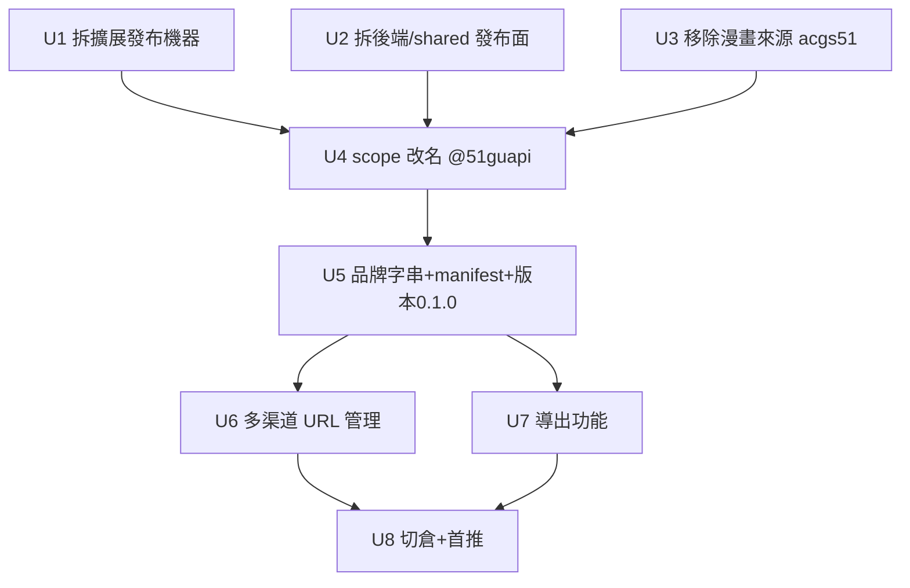

# 吃瓜小幫手 v0.1 — 產品轉型實施計畫

## Overview

把產品從「AI 生成草稿 → 填入 51 後台發帖」轉型為「鎖定 URL → 爬取目標站 → AI 提煉吃瓜草稿 → 導出」。本計畫做四件事，依賴排序執行：

1. **拆**：刪除整套「填入後台 / 自動發布」機器（三世界注入、Quill 橋、填充、發布閘門、批量編排、首飛）。
2. **清**：移除漫畫來源（`acgs51` adapter、`ACGS51_*` 環境變數、`51acgs.com` SSRF 白名單）。
3. **改名**：`@51guapi` → `@51guapi`、品牌字串 → 吃瓜小幫手、版本歸零 `0.1.0`。
4. **建**：多渠道 URL 管理（可配置 SSRF allowlist + UI）、導出（JSON/Markdown）。

順序刻意是「先刪後改名再建新功能」——避免去重命名/搬運注定要刪的檔案，新功能也直接帶上正確 scope 出生。

## Problem Frame

現有 `51guapi 發帖填充助手` 核心是把 AI 草稿填入第三方後台發帖。產品方向已變：不再發布，要的是持續從多個目標站爬取資源、AI 提煉成吃瓜草稿、導出自用。代碼庫已半路轉型（`gossip-*` 骨架已存在且穩定），但仍夾帶發布機器與漫畫來源兩條舊尾巴，品牌仍是「51guapi/發帖」。（see origin: docs/brainstorms/2026-06-16-guapi-v0.1-rebrand-requirements.md）

## Requirements Trace

- R1. 顯示名/描述/README/UI 文案改「吃瓜小幫手」，清除「51guapi / 發帖」。→ U5
- R2. npm scope `@51guapi/*` → `@51guapi/*`，import / package.json deps / tsconfig paths 同步。→ U4
- R3. 三包版本統一 `0.1.0`。→ U5
- R4. 代碼注釋/文檔品牌詞替換，archive 歷史 plan 不逐字清洗。→ U5
- R5. 移除「填入後台」整條鏈路（content/quill-bridge/fillers/safety-gate/grounding-gate/publish-orchestrator/batch-orchestrator/Quill/host_permissions）。→ U1, U2
- R6. 移除發布綁定的測試與 e2e fixture。→ U1, U2
- R7. 清理無人引用的型別/訊息橋/設定，`pnpm compile` 全綠。→ U1, U2
- R8. 刪 `acgs51-adapter`（含 test）。→ U3
- R9. 移除 `ACGS51_*` 環境變數及其條件分支。→ U3
- R10. 從 SSRF allowlist 與文檔移除 `51acgs.com`，不以單一域名取代。→ U3, U6
- R11. 多渠道 URL 管理：操作者持續新增爬取目標，動態進 SSRF allowlist（fail-closed）。→ U6
- R12. 爬取結果 → `gossip-fact-extractor` 提煉 → 側邊欄預覽/編輯。→ U6（保留既有管線，接上多渠道入口）
- R13. 導出 JSON / Markdown。→ U7
- R14. ✅ 新 repo `redredchen02-rgb/51guapi` 已建；改造完成後推首版。→ U8

## Scope Boundaries

- **不保留任何發布/填充能力**，不留「以後可能發帖」的開關或死代碼。
- 不重做欄位映射 / Quill 填充——整個刪除，不是改寫。
- 不在 v0.1 引入新爬取站 adapter 框架擴張；多渠道靠既有 `generic-adapter` + 可配置 allowlist，先走通單一通用 adapter 對多域名。
- archive 內歷史 plan 文檔不逐字清洗。
- 不動後端 fail-closed 啟動約束、脫敏閘門、pre-commit hook、shared 先 build 的構建順序。

## Context & Research

### Relevant Code and Patterns

**發布機器（刪除面，依賴已勘準）**
- 三世界注入：`packages/extension/entrypoints/content.ts`、`quill-bridge.content.ts`
- 填充/橋接：`lib/fillers.ts`、`publish.ts`、`body-responder.ts`、`body-bridge.ts`、`frame-resolve.ts`、`sanitize.ts`、`selectors.ts`、`quill-paste.ts`、`refill.ts`
- 閘門/編排：`lib/safety-gate.ts`、`grounding-gate.ts`、`publish-orchestrator.ts`、`batch-orchestrator.ts`、`first-flight.ts`、`first-flight-orchestrator.ts`、`batch.ts`、`batch-sync.ts`、`published-posts-client.ts`、`publish-feedback.ts`、`read-tracker.ts`、`trajectory.ts`
- 批量 UI：`entrypoints/sidepanel/batch-review/`（整目錄）、`today-batch/`（整目錄）、`BatchReviewPanel.tsx`、`BatchView.tsx`、`TodayBatchView.tsx`、`FillResultPanel.tsx`、`DryRunReport.tsx`、`FirstFlightWizard.tsx`、`HistoryPanel.tsx`、`MetricsPanel.tsx`
- 後端：`src/routes/batch-routes.ts`、`published-posts-routes.ts`
- shared：`src/batch.ts`、`quality-gate.ts`、`post-assembler.ts`（發布側耦合，見 Open Questions）
- background 消息路由：`entrypoints/background.ts` 第 1130–1171 行，14 個消息類型，發布相關 11 個刪、生成/讀取 3 個留

**保留並接上的爬取管線**
- `packages/backend/src/scraper/`：`gossip-fact-extractor.ts`、`gossip-site-store.ts`、`pending-store.ts`、`scheduler.ts`、`web-enricher.ts`、`adapters/generic-adapter.ts`
- 路由 `src/routes/gossip-routes.ts`（`/api/v1/gossip/*`）、`pending-routes.ts`、`prompt-routes.ts`
- 數據流：URL → `generic-adapter.fetchContent()` → `gossipExtractFacts()` → `pending-store.savePendingTopic()`（SQLite）→ 擴展經 `/api/v1/gossip/*` 讀 → `GossipView` / `PendingTopicsView`
- UI 保留：`GossipView.tsx`、`PendingTopicsView.tsx`、`DraftPreview.tsx`（轉導出預覽）、`Settings.tsx`（刪安全檔位）、`AuthView.tsx`、`App.tsx`（重構去發布）

**SSRF / 多渠道**
- `src/scraper/ssrf-guard.ts`：`safeFetch()` 已內建私有 IP 阻擋 + 輸入層拒 IP literal
- `src/scraper/ssrf-allowlist.ts`：硬編碼 allowlist（含 `dx-999-adm.ympxbys.xyz`、`example.com`、`acgs51.com`）——需改為可配置（操作者新增渠道域名）

### Institutional Learnings

- 吃瓜管線 2026-06-12 已規劃完成（`docs/plans/archive/2026-06-12-002-feat-gossip-site-pipeline-plan.md`）：與 ACG 並存、共用 `pending_topics` 表靠 `domain` 欄位（'acg'|'gossip'）分流。**刪 acgs51 後須處理該欄位殘留資料/型別**。
- SSRF TOCTOU 殘差由「輸入層拒 IP literal（`new URL(input).hostname` 為 IP 直接 400）」消除——多渠道新增域名時沿用此校驗，勿開後門。
- 包改名先例（`docs/plans/archive/2026-06-09-001`）：scope 變更牽動 package.json `name` + workspace deps + 全源 import + tsconfig paths；**shared 先 build 出 dist 的構建順序不變**。
- 脫敏閘門 + pre-commit hook 是硬約束（`scripts/git-hooks/pre-commit` + `pnpm check:fixtures`）；刪發布 fixture 時連帶清理勿觸發誤報。
- ⚠️ 本地分支與遠端 main 已分叉、遠端領先；切倉/推送策略見 U8，勿破壞遠端已合併 PR。

### External References

- 無。本地代碼庫即 source of truth，爬取/SSRF/monorepo 模式均有現成範例，跳過外部研究。

## Key Technical Decisions

- **刪除順序先於重命名**：先 U1–U3 刪掉 ~50+ 檔，再 U4 改 scope，避免重命名注定要刪的檔；新功能 U6/U7 在改名後誕生，直接帶 `@51guapi`。
- **多渠道用既有 `generic-adapter` + 可配置 allowlist**，不建 adapter registry 擴張（YAGNI）。新增渠道 = 寫入 allowlist 配置 + UI 列表，爬取走通用 adapter。
- **allowlist 從硬編碼改為持久化配置**：複用既有 SQLite config 軌（pending/config 已用 SQLite），`ssrf-allowlist.ts` 改為運行時讀配置而非常量；保留輸入層 IP-literal 拒絕與私有 IP 阻擋。
- **導出取代發布作為終點**：新增 `lib/export.ts`（純函式）+ `ExportPanel.tsx`；`DraftPreview.tsx` 轉為導出預覽。v0.1 只做 JSON + Markdown，CSV 列為延後。
- **版本歸零 0.1.0**：刻意不延續 0.2.x，標記新產品身分首個正式版（操作者已確認）。
- **batch 狀態機收斂**：`shared/src/batch.ts` 的 `BatchItemStatus` 全是發布狀態，隨 batch 一併刪；若 `GossipView` 仍需「生成中/已生成/失敗」輕量狀態，於 U6 就地新增最小型別，不複用發布狀態機。

## Open Questions

### Resolved During Planning

- **多渠道 adapter 怎麼選？** → 用既有 `generic-adapter`，不建 registry。
- **allowlist 存哪？** → 複用 SQLite config 軌，運行時讀取。
- **新目標域名？** → 非單一站，操作者動態新增；`51cg1.com` 為首個範例種子。

### Deferred to Implementation

- **`post-assembler.ts` / `grounding-gate.ts` 去留**：兩者提供「事實 verbatim 注入 / 防幻覺」內容品質，但現狀只被發布側（`refill.ts` / `batch-orchestrator` / 批量 UI）引用。U1 執行時確認其是否被「生成草稿」路徑（非發布）引用：只被發布側引用則刪；若提煉草稿品質需要，則解耦保留為純生成邏輯。**這是去留判斷，非產品行為變更。**
- **`pending_topics` 的 `domain` 欄位**：刪 acgs51 後，是否清掉 'acg' 列舉值與既有資料，或保留欄位只用 'gossip'。U3 看遷移成本決定（傾向保留欄位、移除 'acg' 寫入路徑）。
- **CSV 導出**是否需要、欄位如何對應吃瓜事實結構——延後到 U7 或 v0.2。
- **與 `2026-06-16-001-refactor-maintainability-test-refactor-plan.md`（scraper routes 歸位 src/routes/）的協調**：若該重構先落地，gossip/pending 路由路徑可能變；執行時確認當前路由位置。

## High-Level Technical Design

> *以下說明意圖形狀，是供審閱的方向性指引，不是實作規格。實作者應視為脈絡，而非照抄的代碼。*

轉型前後的數據流對照：

```
舊（51guapi）
  選題 → AI 生成草稿 → [三世界注入] → 填入 Quill 表單 → [安全閘門] → 提交發布

新（吃瓜小幫手 v0.1）
  操作者新增渠道(URL/域名) → [SSRF allowlist 校驗] → generic-adapter 爬取
    → gossipExtractFacts 提煉 → pending_topics(SQLite)
    → 擴展讀 /api/v1/gossip/* → GossipView 預覽/編輯 → ExportPanel 導出(JSON/MD)
```

刪除邊界：上圖「[三世界注入] → … → 提交發布」整段移除，終點由「提交」改為「導出」。

## Implementation Units



- [ ] **Unit 1: 拆除擴展端發布/填充機器**

**Goal:** 刪除三世界注入、Quill 橋、填充、發布閘門、批量編排、首飛、批量 UI，並清理 background 消息路由與懸空型別。

**Requirements:** R5, R6, R7

**Dependencies:** 無（起點）

**Files:**
- Delete（entrypoints）：`content.ts`、`quill-bridge.content.ts`
- Delete（sidepanel）：`batch-review/`（整目錄）、`today-batch/`（整目錄）、`BatchReviewPanel.tsx`、`BatchView.tsx`、`TodayBatchView.tsx`、`FillResultPanel.tsx`、`DryRunReport.tsx`、`FirstFlightWizard.tsx`、`HistoryPanel.tsx`、`MetricsPanel.tsx`
- Delete（lib + 對應 *.test.ts）：`fillers.ts`、`publish.ts`、`body-responder.ts`、`body-bridge.ts`、`frame-resolve.ts`、`sanitize.ts`、`selectors.ts`、`quill-paste.ts`、`refill.ts`、`safety-gate.ts`、`grounding-gate.ts`、`publish-orchestrator.ts`、`batch-orchestrator.ts`、`first-flight.ts`、`first-flight-orchestrator.ts`、`batch.ts`、`batch-sync.ts`、`published-posts-client.ts`、`publish-feedback.ts`、`read-tracker.ts`、`trajectory.ts`
- Delete（e2e）：`tests/e2e/fill-core-path.test.ts`、`dynamic-submit.test.ts`、`publish-gate.test.ts`、`validate-grounding.test.ts`、`unit5-batch-publish.test.ts` 及相關 fixture
- Modify：`entrypoints/background.ts`（移除 11 個發布消息 handler 與首飛互鎖 / 啟動 reset）、`lib/messaging.ts`（刪發布消息型別）、`lib/storage.ts`（刪發布狀態欄位）、`entrypoints/sidepanel/App.tsx`（移除發布 UI 入口）、`Settings.tsx`（刪安全檔位選項）、`wxt.config.ts`（移除發帖站 host_permissions 與 content/quill-bridge 注入聲明）

**Approach:**
- 先刪 entrypoints + UI，再刪其專屬 lib，最後改 `background.ts` / `messaging.ts` / `storage.ts` 收尾懸空引用，`pnpm --filter 51guapi-extension compile` 逐步逼綠。
- background 保留 `GENERATE_DRAFT` / `RUN_BATCH`（改造為只生成+讀取）/ `GET_BATCH`（只讀）。
- `post-assembler.ts` / `grounding-gate.ts` 去留依 Open Questions 判斷。

**Execution note:** 大量刪除——逐目錄刪 + 每步 compile，勿一次刪 300 檔再修；別動脫敏閘門與 pre-commit。

**Patterns to follow:** WXT entrypoint 由 manifest 自動生成，刪 entrypoint 後須同步 `wxt.config.ts`。

**Test scenarios:**
- 整理：刪除上列發布測試後，剩餘擴展單測/e2e 全綠（`pnpm --filter 51guapi-extension test`）。
- Edge case：`background.ts` 收到已刪除的發布消息類型時，不應崩潰（無對應 handler 即忽略/回錯，不拋未捕獲異常）。
- 回歸：生成路徑（`GENERATE_DRAFT`）與 `GET_BATCH` 只讀仍可用。

**Verification:** `pnpm --filter 51guapi-extension compile` 與 `test` 全綠；代碼庫搜不到 `fillers` / `safety-gate` / `batch-orchestrator` / `first-flight` 引用。

---

- [ ] **Unit 2: 拆除後端與 shared 的發布面**

**Goal:** 刪除後端發布/已發布路由與 shared 發布/批量型別，保留爬取/生成/pending/prompt 路由。

**Requirements:** R5, R7

**Dependencies:** 可與 U1 並行，但合併前須一起 compile

**Files:**
- Delete：`packages/backend/src/routes/batch-routes.ts`（+ test）、`published-posts-routes.ts`（+ test）
- Delete：`packages/shared/src/batch.ts`、`quality-gate.ts`（+ 對應 test）
- Modify：`packages/backend/src/index.ts`/`app.ts`（移除 `registerBatchRoutes` / `registerPublishedPostsRoutes`）、`packages/shared/src/types.ts`（刪 `PublishResult` / `SafetyMode` / `FirstFlightRunResult` / `BatchItemStatus` 等發布 union）、`packages/shared/src/index.ts`（移除 re-export）

**Approach:** 先改 shared `types.ts`/`index.ts` 並 `pnpm --filter @51guapi/shared build`，再讓 backend compile 暴露所有引用點逐一清理。

**Patterns to follow:** 路由註冊集中在 `index.ts` 的 `register*Routes(server)`；`PUBLIC_ROUTES` 白名單若含已刪路由須同步移除。

**Test scenarios:**
- 整理：後端單測全綠（`pnpm --filter 51guapi-backend test`），JWT preHandler 與保留路由不受影響。
- Edge case：請求已刪除的 `/api/v1/batch` / `/published-posts` 端點回 404，不洩漏堆疊。
- 回歸：`/api/v1/gossip/*`、`/pending`、`/prompt` 路由仍正常。

**Verification:** `pnpm -r compile` 全綠；shared/types 搜不到發布相關型別。

---

- [ ] **Unit 3: 移除漫畫來源（acgs51 + 環境變數 + SSRF 條目）**

**Goal:** 刪 acgs51 adapter 與 `ACGS51_*` 環境變數及其在啟動/scheduler/env-check 的分支，移除 `51acgs.com` SSRF 白名單與文檔硬編碼。

**Requirements:** R8, R9, R10

**Dependencies:** U2（共用 backend compile 面）

**Files:**
- Delete：`packages/backend/src/scraper/adapters/acgs51-adapter.ts`（+ test）
- Modify：`packages/backend/src/config/env-check.ts`（+ test：移除 `ACGS51_ENABLED/START_URL/LIST_URL/CRON` 校驗）、`packages/backend/src/app.ts`、`src/scraper/scheduler.ts`（+ test：移除 acgs51 啟動條件與 cron 分支）、`src/scraper/pending-store.ts`（+ test：處理 `domain` 欄位 'acg' 殘留，見 Open Questions）、`src/scraper/ssrf-allowlist.ts`（+ test：移除 `acgs51.com`）、`packages/backend/.env.example`、`docs/field-mapping-guide.md` 及其他含 `51acgs.com` 文檔

**Approach:** adapter 與 env 一起刪，再修 scheduler/env-check 的條件分支；`pending_topics` 傾向保留 `domain` 欄位但移除 'acg' 寫入路徑，避免破壞性遷移。

**Patterns to follow:** scheduler 啟動需 `ACGS51_ENABLED=true`+LLM 齊全的 fail-closed 模式；移除後確認剩餘 gossip 抓取啟動條件仍 fail-closed。

**Test scenarios:**
- Happy path：移除後後端可啟動，gossip 抓取管線不受影響。
- Security/Edge：SSRF allowlist 不再含 `acgs51.com`；非 allowlist 域名 `safeFetch()` 被拒（fail-closed）；IP literal 輸入仍 400。
- 整理：全庫搜不到 `acgs51` / `ACGS51_` / `51acgs.com`；env-check 測試綠。

**Verification:** `pnpm -r test` 全綠；`grep -ri "acgs51\|51acgs" packages docs` 無命中（archive 除外）。

---

- [ ] **Unit 4: npm scope 改名 `@51guapi` → `@51guapi`**

**Goal:** 包作用域全面改名，import / workspace deps / tsconfig paths 同步，構建順序不變。

**Requirements:** R2

**Dependencies:** U1, U2, U3（先刪後改，少改注定要刪的檔）

**Files:**
- Modify：`packages/shared/package.json`（`name`: `@51guapi/shared`）、`packages/backend/package.json` + `packages/extension/package.json`（deps `@51guapi/*` → `@51guapi/*`）、根 `package.json`、各 `tsconfig.json` 的 `paths` 別名
- Modify：所有 `import ... from "@51guapi/shared"` → `@51guapi/shared`（backend ~20 檔、extension 刪後剩餘檔）

**Approach:** 全庫搜替 `@51guapi` → `@51guapi`；先 `pnpm --filter @51guapi/shared build` 產出 dist，再 `pnpm -r compile`。`pnpm install` 重建 workspace 連結。

**Execution note:** Execution target: external-delegate（純機械搜替，適合委派）。

**Patterns to follow:** `docs/plans/archive/2026-06-09-001` 的 scope 變更清單；shared 先 build 的硬依賴。

**Test scenarios:**
- Test expectation：none — 純重命名無行為變更；以 `pnpm -r compile` + `pnpm -r test` 全綠作為通過判據。
- Edge case：`grep -r "@51guapi" packages` 無命中（archive 文檔除外）；`pnpm install` 無 unmet workspace 依賴。

**Verification:** `pnpm -r compile`、`pnpm -r test`、`bash scripts/check-all.sh` 全綠。

---

- [ ] **Unit 5: 品牌字串 + manifest + README + 版本 0.1.0**

**Goal:** 面向用戶可見的品牌全部改「吃瓜小幫手」，三包版本歸零 0.1.0，更新項目文檔。

**Requirements:** R1, R3, R4

**Dependencies:** U4

**Files:**
- Modify：`packages/extension/wxt.config.ts`（manifest `name`/`description` → 吃瓜小幫手）、`README.md`、`CLAUDE.md`/`AGENTS.md`（品牌詞 + build order 說明中的包名）、各 `package.json` `version` → `0.1.0`、UI 文案中含「51guapi/發帖」的字串（`App.tsx`、`Settings.tsx`、`AuthView.tsx` 等）
- Modify：代碼注釋中的品牌詞（非 archive）

**Approach:** 搜替 `51guapi` / `發帖填充助手` / `發帖` → 吃瓜小幫手語境；版本字段三包對齊 `0.1.0`。archive 歷史 plan 不動。

**Test scenarios:**
- Test expectation：none — 文案/版本變更無行為邏輯；通過判據為 compile 綠 + 人工掃 UI 無殘留舊品牌。
- Edge case：擴展載入後側邊欄標題顯示「吃瓜小幫手」；`grep -ri "51guapi\|發帖" packages --include=*.ts --include=*.tsx --include=*.json` 僅剩可接受殘留（如歷史注釋）。

**Verification:** 構建擴展 `pnpm build:extension` 成功，manifest 顯示新名；三包 `version` 均 `0.1.0`。

---

- [ ] **Unit 6: 多渠道 URL 管理（可配置 SSRF allowlist + UI）**

**Goal:** 操作者可持續新增爬取渠道（URL/域名），每條動態進 allowlist；鎖定渠道後對其 URL 發起爬取，接上既有提煉管線。

**Requirements:** R10, R11, R12

**Dependencies:** U5

**Files:**
- Modify：`packages/backend/src/scraper/ssrf-allowlist.ts`（+ test：從常量改為運行時讀 SQLite config）
- Create：`packages/backend/src/routes/channel-routes.ts`（+ test：`GET/POST/DELETE /api/v1/channels` 管理渠道域名）
- Modify：`src/scraper/gossip-site-store.ts`（若渠道與既有 site-store 重疊則複用，不另立一套）、`src/index.ts`（註冊 channel 路由）
- Create：`packages/extension/lib/channel-client.ts`（+ test）
- Modify：`entrypoints/sidepanel/GossipView.tsx`（+ test：新增渠道輸入/列表 UI，觸發爬取）、`lib/messaging.ts`（新增渠道相關消息）

**Approach:**
- allowlist 改為「常量基線 ∪ 操作者配置域名」，運行時讀配置；保留私有 IP 阻擋與輸入層 IP-literal 拒絕。
- 爬取沿用 `generic-adapter.fetchContent()` → `gossipExtractFacts()` → `pending-store`，UI 經 `/api/v1/gossip/*` 讀回。

**安全約束（動態 allowlist 把信任邊界從部署期降為運行期攻擊面，下列為計畫層硬要求）：**
- **入庫即解析校驗**：新增渠道時當場 DNS 解析候選 hostname + 私網/元資料 IP（含 `169.254.169.254`）檢查，解析到私網者拒絕入庫——不能只靠 IP-literal 拒絕（擋不住 A 記錄指向私網的合法域名）。
- **寫入需人手確認手勢**，與發布閘門同級；allowlist 寫接口**不可由爬取管線/LLM 自身觸發**（防 prompt 注入自開渠道）。列為最高敏感檔，不入 `PUBLIC_ROUTES`。
- **redirect 每一跳重過 allowlist**（不只過私網檢查）：改 `redirect: manual`、逐跳校驗，或對動態渠道關閉跨域 redirect——堵住「加 `news-a.com`，一個 302 導向任意公網站」的現狀缺口。
- **條目鎖死 `https`、禁通配 `*.`（或通配需二次確認）**，存 punycode + 拒混合腳本 IDN 同形域名，並記審計欄位（誰/何時/為何新增）。
- **命中 host ≠ 全域可爬**：單條渠道綁路徑前綴 / 抓取深度 / 單次響應體大小上限，兜住「被誘導成爬蟲放大器 / 帶寬炸彈」與越權爬同域敏感路徑。
- **fail-closed 不可退化**：確認無任何代碼路徑在「列表為空」時退回硬編碼默認或放行；條目設數量上限 + 定期複核（避免攻擊面只增不減）。

**Patterns to follow:** pending/config 走 SQLite（better-sqlite3）；既有 `ssrf-guard` 的 fail-closed 與 TOCTOU 補償；寫入手勢比照零提交硬約束/grounding-gate 的「授權動作人手確認、LLM 碰不到」原則。

**Test scenarios:**
- Happy path：新增渠道 `51cg1.com` → 出現在渠道列表 → 對其 URL 爬取 → pending_topics 出現提煉結果 → GossipView 可見。
- Security：新增後 `safeFetch` 允許該域名；未新增的域名仍被拒（fail-closed）；輸入 IP literal（如 `http://127.0.0.1`）被拒 400。
- Security（入庫解析校驗）：候選域名 A 記錄解析到私網/元資料 IP（`169.254.169.254`、`10.x`）→ 拒絕入庫，不寫 allowlist。
- Security（redirect）：渠道 `news-a.com` 回 302 導向未在 allowlist 的公網 host → 抓取被拒（逐跳重過 allowlist），不跟隨。
- Security（寫入手勢）：模擬爬取管線/未帶人手手勢的請求調用 allowlist 寫接口 → 被拒，無法自開渠道。
- Security（IDN）：輸入混合腳本同形域名（如西里爾 `аpple.com`）→ 拒絕或存 punycode 並標注，不靜默放行。
- Edge case：重複新增同域名去重；刪除渠道後該域名即從 allowlist 移除、再爬被拒；空/非法 URL 回錯不寫入；通配 `*.` 被拒或需二次確認；allowlist 為空時全拒（不退回硬編碼默認）。
- Integration：跨層——POST 新增渠道（帶手勢）→ SQLite 寫入 → 同進程 `safeFetch` 立即放行該域名（驗證運行時讀配置而非啟動快照）。

**Verification:** `pnpm -r test` 綠；手動冒煙：加 `51cg1.com` → 爬一條 → 側邊欄看到吃瓜草稿；非清單域名爬取被拒。

---

- [ ] **Unit 7: 導出功能（JSON / Markdown）**

**Goal:** 把提煉後的吃瓜草稿導出為 JSON 與 Markdown，取代「填入後台」終點。

**Requirements:** R13

**Dependencies:** U5

**Files:**
- Create：`packages/shared/src/export.ts`（+ test：`ExportFormat`、`assembleMarkdown`/`assembleJSON` 純函式）
- Create：`packages/extension/lib/export.ts`（+ test：`exportDraftAsJSON` / `exportDraftAsMarkdown` / `copyToClipboard` / 觸發下載）
- Create：`packages/extension/entrypoints/sidepanel/ExportPanel.tsx`（+ test）
- Modify：`entrypoints/sidepanel/DraftPreview.tsx`（轉為導出預覽，接 ExportPanel）

**Approach:** 導出為純函式（shared 放格式組裝，extension 放瀏覽器側下載/剪貼板）；JSON 含吃瓜事實結構 + 元資料，Markdown 為可讀草稿。CSV 延後。

**Patterns to follow:** 吃瓜事實型別來自 `shared/src/gossip-facts.ts`；草稿結構沿用既有 `ContentDraft`/`draft.ts`。

**Test scenarios:**
- Happy path：給定一條吃瓜草稿，`exportDraftAsMarkdown` 產出含標題/正文/來源的 Markdown；`exportDraftAsJSON` 產出可被 `JSON.parse` 還原的結構。
- Edge case：缺欄位（無配圖/無來源連結）時導出不拋錯，缺項以空/省略呈現；正文含特殊字元（`#`、`|`、換行）在 Markdown 中正確轉義。
- Integration：ExportPanel 點「導出 Markdown」→ 觸發瀏覽器下載；「複製」→ 剪貼板內容與預覽一致。

**Verification:** `pnpm -r test` 綠；手動冒煙：選一條草稿導出 JSON 與 MD，內容正確、可開啟。

---

- [ ] **Unit 8: 切倉到 51guapi + 首版推送**

**Goal:** 把改造完成的代碼推到新 repo `redredchen02-rgb/51guapi`，CI 綠後作為 v0.1 正式起點。

**Requirements:** R14

**Dependencies:** U6, U7（功能完成且全綠）

**Files:**
- Modify：`.github/workflows/ci.yml` / `release.yml`（若含舊倉名/包名引用）、git remote 設定

**Approach:**
- 全綠後（`bash scripts/check-all.sh`），將當前分支整理為乾淨提交，新增 `51guapi` 為 remote，推 main 與 tag。
- ⚠️ 不覆寫舊 `51guapi` 遠端已合併 PR；新倉是獨立起點。CI workflow 內的倉名/scope 引用同步更新。

**Execution note:** 推送/建 tag 是不可逆外部操作，執行前向操作者確認分支與提交內容。

**Test scenarios:**
- Test expectation：none — 倉庫操作；通過判據為新倉 CI（fixture 閘 + compile + lint + test + e2e + 產物校驗 + gitleaks）全綠。

**Verification:** `51guapi` repo CI 綠；clone 新倉後 `pnpm install && pnpm -r compile && pnpm -r test` 全綠。

## System-Wide Impact

- **Interaction graph:** background 消息路由收斂（14→3 保留）；content/quill-bridge 注入面整體移除，連帶 `wxt.config.ts` host_permissions 清空發帖站；SSRF allowlist 從啟動常量變運行時配置，影響所有 `safeFetch` 調用點。
- **Error propagation:** 已刪路由/消息應 fail-safe（404 / 忽略），不洩漏堆疊；新增渠道的校驗錯誤須回明確 400 而非靜默。
- **State lifecycle risks:** `pending_topics` 的 `domain` 欄位殘留資料；刪 batch 狀態機後 `GossipView` 若需輕量生成狀態須新建，勿複用發布狀態。
- **API surface parity:** 後端對外端點收斂為 gossip/pending/prompt/channels/export/auth；`PUBLIC_ROUTES` 白名單同步。
- **Integration coverage:** 多渠道「新增域名 → 同進程即時放行」與「爬取 → 提煉 → pending → UI」兩條跨層鏈需整合測試，單測 mock 證不了。
- **Unchanged invariants:** 後端 fail-closed 啟動、脫敏閘門、pre-commit hook、shared 先 build 的構建順序、SSRF 私有 IP 阻擋與 IP-literal 拒絕——本計畫不改這些，只在其上增刪。

## Risks & Dependencies

| Risk | Mitigation |
|------|------------|
| 大規模刪除引發連鎖 compile 紅、難收斂 | 逐目錄刪 + 每步 compile；U1/U2 分擴展/後端兩面推進 |
| `post-assembler`/`grounding-gate` 誤刪傷及草稿品質 | U1 先確認是否被生成路徑引用，再決定去留（Open Questions） |
| SSRF allowlist 改可配置：信任邊界降為運行期攻擊面 | U6 六條安全約束：入庫即 DNS+私網校驗、寫入需人手手勢（LLM 不可觸發）、redirect 逐跳重過 allowlist、鎖 https+拒通配/IDN 同形、host 命中≠全域可爬（路徑/深度/體積上限）、fail-closed 不退化 |
| `pending_topics` domain 欄位破壞性遷移 | 傾向保留欄位、僅移除 'acg' 寫入路徑，不刪歷史資料 |
| 與 routes 歸位重構（2026-06-16-001）撞車 | 執行時先確認當前路由實際位置再改 |
| 切倉破壞舊倉遠端歷史 | U8 新倉為獨立起點，不覆寫舊倉；推送前人工確認 |
| 脫敏閘門誤判刪除中的 fixture | 刪 fixture 與引用一起清，`pnpm check:fixtures` 過閘再提交 |

## Documentation / Operational Notes

- 更新 `CLAUDE.md`/`AGENTS.md`：移除三世界注入/發布閘門/漫畫管線描述，改為「多渠道爬取 + 導出」；包名與 build order 說明同步 `@51guapi`。
- `.env.example` 移除 `ACGS51_*`，若多渠道需新 env 則補充。
- `docs/field-mapping-guide.md`：發帖欄位映射已無意義，標記為廢棄或刪除。

## Sources & References

- **Origin document:** [docs/brainstorms/2026-06-16-guapi-v0.1-rebrand-requirements.md](docs/brainstorms/2026-06-16-guapi-v0.1-rebrand-requirements.md)
- 既有吃瓜管線規劃：`docs/plans/archive/2026-06-12-002-feat-gossip-site-pipeline-plan.md`
- 包改名先例：`docs/plans/archive/2026-06-09-001-refactor-comprehensive-optimization-plan.md`
- 路由歸位重構（需協調）：`docs/plans/2026-06-16-001-refactor-maintainability-test-refactor-plan.md`
- 新 repo：https://github.com/redredchen02-rgb/51guapi

## Execution Summary (2026-06-16)

U1–U7 全部完成，全包 `compile` / `test`（backend 432 + extension 424）/ `lint:ci` / `build:extension` 全綠。分支 `feat/guapi-v0.1-rebrand`，相對 main：210 檔變更、+2459/−22127（淨刪約 2 萬行發布機器）。

| 單元 | commit | 狀態 |
|------|--------|------|
| U1 拆擴展發布機器 | b98db2bc | ✅ |
| U2 拆後端/shared 發布面 | 1024300b | ✅ |
| U3 移除漫畫來源 + 修脫敏閘 | 7e793a69 | ✅ |
| U4 scope 改名 @51guapi | 7c1e16e2 | ✅ |
| U5 品牌字串 + 版本 0.1.0 | 42027689 | ✅ |
| U6 多渠道 SSRF | 529cd4bb | ✅ |
| U7 導出 JSON/Markdown | 07f0edb2 | ✅ |
| U6 P0 修復（path_prefix + 流式 max_bytes） | baf0a00d | ✅ |

**執行期決定（偏離原計畫，已驗證合理）**：
- `post-assembler.ts` 與 `quality-gate.ts` **保留**（grep 證實在「生成草稿」路徑被 `llm.ts` 調用，非發布專屬，刪則斷 backend）。對應 Open Questions 已解。
- `ssrf-allowlist.ts` 本就是 env 驅動（`ALLOWED_HOSTS`），無硬編碼域名；多渠道在此基礎上擴展為「env 基線 ∪ SQLite 渠道」。
- `max_depth` 欄位保留但標 reserved（v0.1 無遞歸爬取，未強制）。

**安全複查殘留風險（P1/P2，已記錄，未阻塞 v0.1）**：
- DNS rebinding TOCTOU：`assertUrlSafe` 與底層 fetch 各解析一次，無 socket-level IP pinning（注釋已坦承）。建議後續上 undici custom-lookup dispatcher。
- confirm 手勢（`x-operator-confirm` header + body）防誤觸不防越權：任何持 JWT 的調用方加兩個常量即可寫 allowlist。非新 SSRF 缺口。
- IDN 同形：覆蓋拉丁+西里爾/希臘混用；純單一非拉丁脚本的同形 label（如切羅基）未覆蓋。建議後續引 confusables 表。

**待辦（低優先，未做）**：
- 內部包名 `51guapi-monorepo` / `51guapi-backend` / `51guapi-extension` 仍含 "publisher"（非 scope、非用戶可見）；改動會牽動 CI/腳本/命令的 `--filter` 引用，價值低，留待後續。
- U8 切倉推送 `redredchen02-rgb/51guapi`：待操作者確認後執行。
