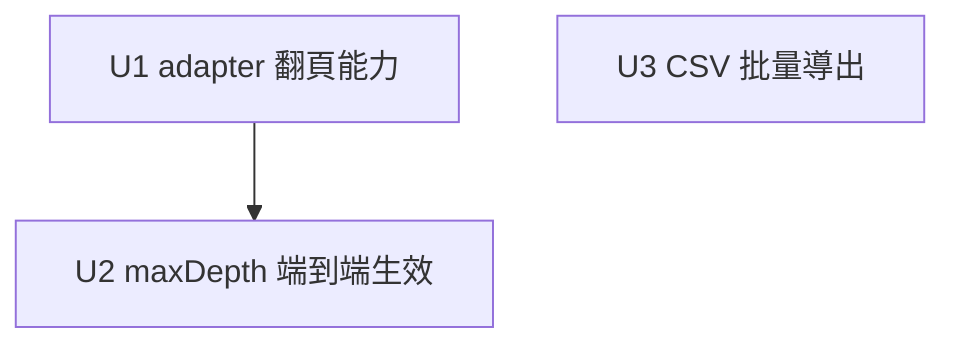

# v0.2 — 完成爬取 → 導出閉環

## Overview

v0.1 的多渠道爬取是「一個列表頁抓一次、≤20 條、無翻頁」，`channel.maxDepth` 是 reserved 沒生效；導出只有單條。這輪把產品主線打通成真正的閉環：

1. **遞歸多頁爬取**：`fetchList` 跟隨翻頁，受 `channel.maxDepth` 約束，讓多渠道能持續拉資源——`maxDepth` 從 reserved 轉為實際生效。
2. **CSV 批量導出**：把待審池整批導出為 CSV，補上「單條 JSON/MD」之外的批量出口。

刻意小而完整：複用既有 SSRF 逐跳校驗、`source_url` 去重、`downloadFile`，不擴張架構。

## Requirements Trace

- R1. `fetchList` 支援跟隨翻頁，累積多頁的詳情 URL。→ U1
- R2. 翻頁深度受 `channel.maxDepth` 約束並端到端生效（scheduler + discover 路由），`maxDepth` 不再標 reserved。→ U2
- R3. 每個翻頁 URL 都過既有 SSRF（`allowlistCheck` 逐跳 + `enforcePathPrefix`）；跨頁去重防迴圈；總量受 `SCRAPER_LIST_BUDGET` 上限。→ U1, U2
- R4. 待審池可批量導出為 CSV（含吃瓜事實 8 欄），正確轉義。→ U3

## Scope Boundaries

- **不做無限深爬**：翻頁上限 = `channel.maxDepth`，且 visited set 防迴圈、budget 封頂。
- **不改 SSRF 核心**：複用 `safeFetch` / `allowlistCheck` / `enforcePathPrefix` / `readBodyCapped`，不動其內部。
- **不新增後端 CSV 路由**：CSV 在擴展側用已載入的待審池組裝（YAGNI）；後端流式導出留待「超出單頁載入量」時再做（見 Deferred）。
- **不碰** v0.2 backlog 的其他項（安全 P1/P2、內部包名、Docker 打包、CI Node 升級）——本輪不處理。
- 不改去重機制（`source_url` UNIQUE + `pendingTopicExistsBySourceUrl` 已足夠）。

## Context & Research

### Relevant Code and Patterns

**爬取管線**
- `packages/backend/src/scraper/adapters/generic-adapter.ts`：
  - `fetchList(listUrl): Promise<DiscoveredUrl[]>`（單頁、≤20、正則抽 `<a href>` + `DETAIL_PATH_RE`、`enforcePathPrefix` + `safeFetch({allowlistCheck})` + `readBodyCapped`）
  - `fetchContent(url): Promise<RawContent>`
  - `enforcePathPrefix(target)` → `getChannelByHostname(hostname)`（回 Channel 或 null）
- `packages/backend/src/scraper/scheduler.ts`：`runListDiscovery` 調 `fetchList` 一次 → 逐條 `fetchContent` + `extractFacts` → `savePendingTopic`；session set + `pendingTopicExistsBySourceUrl` 去重；`SCRAPER_LIST_BUDGET` 封頂；連續 3 失敗告警
- `packages/backend/src/routes/gossip-routes.ts`：`POST /sites/:id/discover`（調 `fetchList` 一次，回前 20 條未入庫 URL，`{ok,discovered,hasMore,total}`）
- `packages/backend/src/scraper/channel-store.ts`：`Channel.maxDepth`（reserved，預設 1）、`getChannelByHostname`
- `packages/backend/src/scraper/site-adapter.ts`：`SiteAdapter.fetchList` 介面、`DiscoveredUrl{url,title?}`、`RawContent`

**SSRF（複用，不改）**
- `ssrf-guard.ts`：`safeFetch(url, init, {maxHops,timeoutMs,allowlistCheck})`，逐跳重過 allowlist + 私網
- `ssrf-allowlist.ts`：`loadSSRFAllowlist()` = env `ALLOWED_HOSTS` ∪ channels 表

**導出**
- `packages/shared/src/export.ts`：`assembleDraftJSON` / `assembleDraftMarkdown`、`ExportedDraft`
- `packages/extension/lib/export.ts`：`downloadFile(filename, content, mime)`（通用，CSV 可直接複用）、`safeFilename`
- `packages/extension/entrypoints/sidepanel/PendingTopicsView.tsx`：持有 `fetchPendingTopics({status,sort_by,domain})` 的列表；現有批量選擇/拒絕
- `packages/extension/lib/pending-client.ts`：`PendingTopic{id,sourceUrl,siteName,title,facts,confidence,status,coverImageUrl?,domain,createdAt,...}`
- `packages/shared/src/gossip-facts.ts`：`GossipFactsBlock` 8 欄（當事人/事件摘要/起因/經過/結果/來源連結/發生時間/熱度標籤）、`GOSSIP_FACT_KEYS`

### Institutional Learnings

- U6 P0 修復確立：所有抓取入口先過 `enforcePathPrefix`，響應體走 `readBodyCapped`——遞歸新增的每個頁面請求必須同樣經過，勿開旁路。
- shared 用 composite 增量編譯，改完先 `pnpm --filter @51guapi/shared build`（清 tsbuildinfo 若 dist 不更新）。

## Key Technical Decisions

- **`maxDepth` 語義 = 翻頁頁數上限**（跟隨「下一頁」最多 N 頁），不是連結層級遞歸。理由：契合「持續拉資源」直覺、實作有界、風險可控；連結級遞歸易爆炸且價值低。
- **下一頁偵測**：在 `fetchList` 的 HTML 裡找 `rel="next"` 或常見分頁 pattern，回傳 `nextPageUrl?`。偵測不到即停（深度未滿也停），保守。
- **每頁同主機**：翻頁 URL 必須與起始 listUrl 同 host（且過 `enforcePathPrefix` + `allowlistCheck`）；跨 host 的「下一頁」一律拒絕跟隨。
- **防迴圈 + 封頂**：visited set（已抓的 list URL）防環；累積詳情 URL 仍受既有 `SCRAPER_LIST_BUDGET` 與每頁 20 條上限約束。
- **CSV 純前端組裝**：複用 `PendingTopicsView` 已載入的待審池 + `downloadFile`，不新增後端路由。

## Open Questions

### Resolved During Planning
- **maxDepth 是頁數還是層級？** → 頁數（翻頁上限）。
- **CSV 在前端還後端？** → 前端，用已載入列表組裝。
- **去重要不要新做？** → 不用，`source_url` UNIQUE + 既有檢查足夠。

### Deferred to Implementation
- **下一頁 pattern 的覆蓋度**：不同站的分頁標記差異大；v0.2 先支援 `rel=next` + 1-2 種常見 pattern，覆蓋不到的站維持單頁（不報錯）。實作時看 fixture 決定 pattern 集。
- **後端流式 CSV 導出**：若未來要導出「超過單頁載入量」的全量待審池，再加 `GET /api/v1/pending-topics/export.csv` 流式端點。v0.2 不做。
- **CSV 是否含 raw body / enrichment**：欄位集實作時定，先以「元資料 + 8 個吃瓜事實欄」為準，避免超寬表。

## Implementation Units

- [ ] **Unit 1: generic-adapter 翻頁能力**

**Goal:** 讓 `fetchList` 能偵測並回傳下一頁 URL，新增有界的「跟隨翻頁」抓取，累積多頁詳情 URL，每頁複用既有 SSRF / pathPrefix / byteCap。

**Requirements:** R1, R3

**Dependencies:** 無

**Files:**
- Modify: `packages/backend/src/scraper/adapters/generic-adapter.ts`（`fetchList` 抽 `nextPageUrl?`；新增 `fetchListPaged(listUrl, maxPages)` 跟隨翻頁、visited set、同 host 校驗、累積去重至 budget/上限）
- Modify: `packages/backend/src/scraper/site-adapter.ts`（`DiscoveredUrl` 或 fetchList 回傳型別加可選 `nextPageUrl`；如型別在此定義）
- Test: `packages/backend/src/scraper/adapters/generic-adapter.test.ts`

**Approach:**
- `fetchList` 內偵測下一頁（`rel="next"` 或分頁 pattern），回 `{ urls, nextPageUrl? }` 或在 DiscoveredUrl 外回傳；保持與既有呼叫相容（單頁呼叫仍可用）。
- `fetchListPaged(listUrl, maxPages)`：迴圈最多 `maxPages` 次，每次 `fetchList` 該頁 → 收 URL → 取 nextPageUrl；nextPageUrl 必須同 host 且未在 visited；無下一頁或達上限即停。每頁請求天然經 `fetchList` 既有的 `enforcePathPrefix` + `safeFetch({allowlistCheck})` + `readBodyCapped`。
- 累積結果去重（URL set），總數受既有每頁 20 + 後續 budget 約束。

**Patterns to follow:** `fetchList` 既有的正則抽取與 `enforcePathPrefix`/`safeFetch` 用法；`SsrfError` 拋出語義。

**Test scenarios:**
- Happy：兩頁列表，page1 有 `rel=next` 指向 page2（同 host），`fetchListPaged(url, 2)` 回兩頁合併去重後的詳情 URL。
- Edge：`maxPages=1` 只抓首頁不跟隨；無 next 標記時即使 maxPages>1 也只抓一頁；重複 next 指回已訪問頁 → visited 阻止迴圈。
- Security：next 指向**不同 host** → 不跟隨（不請求）；next 路徑不符 channel `pathPrefix` → `enforcePathPrefix` 拒（複用既有，斷該頁不中斷整體看實作）；DNS 在測試 mock。
- Edge：累積詳情 URL 超上限時截斷。

**Verification:** `pnpm --filter publisher-backend test` 綠；`fetchListPaged` 在 mock 下正確跟隨/停止/防環/拒跨 host。

---

- [ ] **Unit 2: maxDepth 端到端生效**

**Goal:** 把 `channel.maxDepth` 從 reserved 接成實際翻頁上限，scheduler 與 discover 路由用渠道的 maxDepth 驅動 `fetchListPaged`，並更新 reserved 註釋。

**Requirements:** R2, R3

**Dependencies:** U1

**Files:**
- Modify: `packages/backend/src/scraper/scheduler.ts`（`runListDiscovery` 改調 `fetchListPaged`，maxPages 取自 listUrl host 對應的 `getChannelByHostname(...).maxDepth`，無渠道記錄則預設 1=單頁）
- Modify: `packages/backend/src/routes/gossip-routes.ts`（`POST /sites/:id/discover` 同樣按渠道 maxDepth 走 `fetchListPaged`）
- Modify: `packages/backend/src/scraper/channel-store.ts`（移除 `maxDepth` 的 "reserved/未強制" 註釋，改為「翻頁頁數上限」）
- Modify: `packages/backend/src/migrations/runner.ts`、`packages/backend/src/routes/channel-routes.ts`（若有 maxDepth 的 reserved 註釋同步更新；不改 DDL）
- Test: `packages/backend/src/scraper/scheduler.test.ts`、`packages/backend/src/routes/channel-routes.test.ts`（如涉及）、`gossip-routes` 相關 test

**Approach:**
- 在 `runListDiscovery` 與 discover 路由：解析 `new URL(site.listUrl).hostname` → `getChannelByHostname` → `maxDepth`（無則 1）→ `fetchListPaged(listUrl, maxDepth)`。
- 既有 session set + `pendingTopicExistsBySourceUrl` + `SCRAPER_LIST_BUDGET` 不變，作用於多頁累積結果。
- 文檔/註釋去 reserved。

**Patterns to follow:** scheduler 現有 `runListDiscovery` 的去重與 budget 流程；`getChannelByHostname` 在 `enforcePathPrefix` 的用法。

**Test scenarios:**
- Happy：渠道 maxDepth=3 的站，discover 跟隨最多 3 頁；maxDepth=1（或無渠道）退化為單頁（與 v0.1 同行為，不回歸）。
- Integration：discover 路由跨層——多頁累積 URL 經去重後只回未入庫者；已入庫的跨頁重複 URL 不重複返回/入庫。
- Edge：budget 在多頁下仍封頂（達 `SCRAPER_LIST_BUDGET` 即止）。

**Verification:** `pnpm -r test` 綠；maxDepth 在 scheduler 與 discover 兩路徑生效；單頁退化不回歸；全庫無 "maxDepth reserved" 殘留。

---

- [ ] **Unit 3: CSV 批量導出**

**Goal:** 待審池可一鍵導出為 CSV（元資料 + 8 個吃瓜事實欄），正確轉義，前端組裝下載。

**Requirements:** R4

**Dependencies:** 無（與 U1/U2 獨立）

**Files:**
- Create/Modify: `packages/shared/src/export.ts`（新增 `assembleTopicsCSV(topics): string`，純函式：表頭 + 逐列；CSV 轉義引號/逗號/換行；欄位 = id,title,siteName,sourceUrl,confidence,score?,domain,createdAt + 8 個 `GOSSIP_FACT_KEYS`）
- Modify: `packages/shared/src/index.ts`（導出）
- Modify: `packages/extension/lib/export.ts`（`exportTopicsAsCSV(topics): string` 包裝 shared；複用既有 `downloadFile(name, csv, "text/csv")`）
- Modify: `packages/extension/entrypoints/sidepanel/PendingTopicsView.tsx`（加「導出 CSV」按鈕，對當前載入/篩選的待審池調用並下載）
- Test: `packages/extension/lib/export.test.ts`、`packages/extension/entrypoints/sidepanel/PendingTopicsView.test.tsx`

**Approach:**
- shared `assembleTopicsCSV`：第一行表頭，逐 topic 一列；每格 `escapeCsv`（含 `,"`\n` 時用雙引號包裹並把 `"`→`""`）；facts 為 null 的欄位輸出空。
- 擴展側用 `PendingTopicsView` 已 `fetchPendingTopics` 的列表（尊重當前 status/domain/sort 篩選），組 CSV → `downloadFile("topics-<date>.csv", csv, "text/csv")`。
- 不新增後端路由。

**Patterns to follow:** `export.ts` 既有 `assembleDraftMarkdown` 的轉義思路；`downloadFile`/`safeFilename` 既有用法；`ExportPanel.tsx` 的按鈕/測試風格。

**Test scenarios:**
- Happy：3 條待審池（含完整 facts）→ CSV 有表頭 + 3 列，欄位對齊吃瓜事實 8 欄。
- Edge：facts 部分為 null → 對應格為空不報錯；標題/來源含逗號、雙引號、換行 → 正確轉義（可被標準 CSV 解析還原）；空列表 → 只有表頭（或友善提示，不下載空檔，看實作）。
- Integration：點「導出 CSV」→ `downloadFile` 被以 `text/csv` 與正確內容調用（mock 驗證）。

**Verification:** `pnpm -r test` 綠；手動冒煙：待審池導出 CSV 用 Excel/Numbers 開啟欄位正確、含逗號的標題不錯位。

## System-Wide Impact

- **Interaction graph:** `fetchListPaged` 成為 scheduler 與 discover 路由的新列表入口；每頁請求仍走 SSRF 逐跳 + pathPrefix，無旁路。CSV 純前端，不碰後端。
- **Error propagation:** 翻頁中某頁失敗（SSRF 拒/網路錯）應降級為「停止翻頁、保留已抓」，不讓整次 discover 崩；沿用 `runListDiscovery` 既有的失敗計數/告警。
- **State lifecycle risks:** 多頁累積需 visited set 防環、budget 封頂，避免渠道被誘導成「無限翻頁」放大器。
- **API surface parity:** discover 路由回傳結構 `{ok,discovered,hasMore,total}` 不變，只是 discovered 來自多頁。
- **Unchanged invariants:** SSRF 逐跳校驗、`enforcePathPrefix`、`readBodyCapped`、`source_url` 去重、`SCRAPER_LIST_BUDGET`、fail-closed allowlist——本輪不改，只在其上累積多頁與加 CSV。

## Risks & Dependencies

| Risk | Mitigation |
|------|------------|
| 下一頁偵測誤判/漏判（站間分頁差異大） | 只支援 `rel=next` + 少數 pattern，偵測不到即單頁（不報錯）；fixture 驗證 |
| 翻頁被誘導成爬蟲放大器 | maxDepth 上限 + visited 防環 + budget 封頂 + 同 host + pathPrefix |
| 跨頁 SSRF 旁路 | 每頁走 `fetchList` 既有 `enforcePathPrefix` + `safeFetch({allowlistCheck})`，不新開請求路徑 |
| CSV 轉義不全導致表錯位 | 標準轉義（引號包裹 + `""`）+ 含逗號/換行/引號的測試用例 |
| maxDepth 改動回歸單頁行為 | maxDepth=1/無渠道時必須與 v0.1 等價，測試守護 |

## Sources & References

- **Origin backlog:** docs/v0.2-backlog.md
- 爬取管線：`packages/backend/src/scraper/adapters/generic-adapter.ts`、`scheduler.ts`、`channel-store.ts`
- SSRF：`ssrf-guard.ts`、`ssrf-allowlist.ts`
- 導出：`packages/shared/src/export.ts`、`packages/extension/lib/export.ts`、`PendingTopicsView.tsx`
- 前序計畫：`docs/plans/2026-06-16-003-feat-guapi-v0.1-rebrand-plan.md`（U6/U7）
