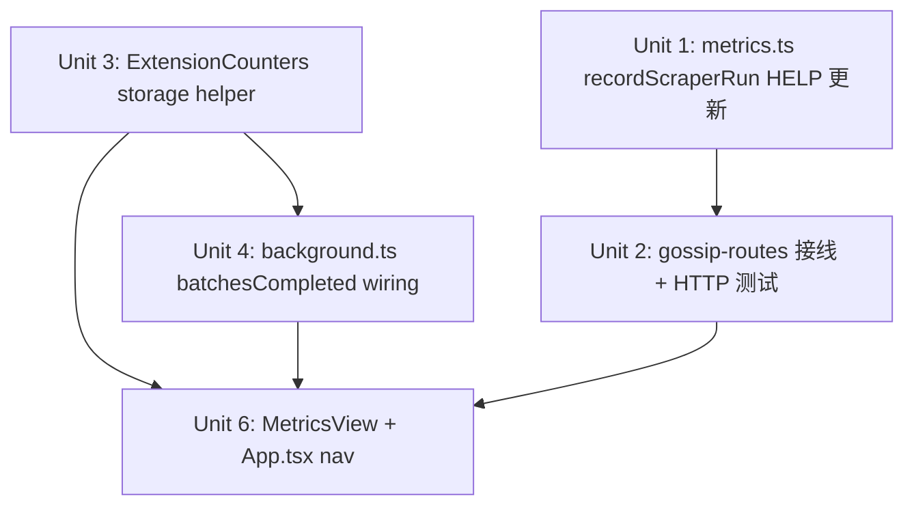

# feat: Metrics wiring + extension counters + metrics view

> **Freshness 核對（2026-06-17，對齊 v0.2 後的 main / PR #1 已合併）**：本計畫掛點全部仍有效——`metrics.ts` 的 `recordScraperRun`/`recordDraft`/`recordBatchCompleted` 都在；gossip-routes 尚未接 `recordScraperRun`（U2 待做）；`background.ts` 的 `handleRunBatch`/`RUN_BATCH` 還在（U4 掛點）；`App.tsx` view-switch 模式還在（U6）；`storage.ts` 尚無 `ExtensionCounters`（U3 待做）。**注意**：`lib/trajectory.ts` 已於 v0.1 隨發布機器刪除——本計畫已正確剔除 trajectory（Unit 5 作廢、MetricsView 不讀 trajectory），但**來源 brainstorm 的 R9/R10 仍引用 trajectory，已過時，以本計畫為準**。先前一次 `git stash` 誤操作曾把此功能的部分 WIP（background.ts ExtensionCounters 接線）帶入工作區，已還原、未提交——執行 U3/U4 時視為從零實作。

## Overview

两项工作：(1) 后端 gossip-routes.ts 接入已有 `recordScraperRun` 计数函数，让 `/api/v1/metrics` 在内容爬取时返回非零值；(2) 扩展端新增 `batchesCompleted` 本地计数器 + 度量视图 UI，让运营者可回顾批次完成量与内容抓取/草稿生成成功率。

**评审后关键修正（文档评审 2026-06-17）：**
- `recordDraft` 已在 `app.ts:25` 接线草稿路由，gossip-routes 应调用 `recordScraperRun(ok: boolean)`（已导出），不得重复调用 `recordDraft`（语义错误：scrape 次数 ≠ 草稿次数）
- `gossipFetchSuccess` 字段无法写入 TrajectoryRecord：gossip 流程不调用 `appendTrajectory`（发布/填充机器已拆除），Unit 5 整体作废
- `getTrajectory` 在仓库根 `lib/storage.ts`，packages/extension 无法确认跨包访问；加之 trajectory 无 gossip 数据，MetricsView 不依赖 trajectory
- MetricsView 简化为 2 个数据源（Prometheus + ExtensionCounters），展示 3 张卡片
- `publishAttempts` 无法接线：background.ts 的 PUBLISH_ITEM handler 已删除，类型保留为 future placeholder

## Problem Frame

v0.2.1.0 落地后：后端 `recordDraft()` 函数已定义但 gossip-routes.ts 从未调用，`/api/v1/metrics` 永远报全 0；扩展端没有度量视图，运营者无法回顾发布质量数据。(see origin: docs/brainstorms/2026-06-17-001-p1-iteration-requirements.md)

## Requirements Trace

- R1. gossip-routes.ts 成功/失败路径调用 **recordScraperRun(true/false)**（非 recordDraft，已在 app.ts 接线草稿路由）
- R2. metrics.ts 的 **recordScraperRun** HELP 文本更新，语义明确为 gossip 内容爬取事件
- R3. gossip-routes.test.ts 补 HTTP 级别测试：触发后 `/api/v1/metrics` 返回 **publisher_scraper_runs_total{status="success"} >= 1**
- R4. 扩展端新增 `local:extensionCounters` storage key（含 publishAttempts placeholder + batchesCompleted）
- R6. background.ts handleRunBatch 成功退出时递增 batchesCompleted
- R7. 计数器跨会话持久（chrome.storage.local）
- R8. sidepanel 新增 metrics view，使用 view-switch 模式
- R9. 度量视图展示 4 个指标（手动编辑率、token 用量、内容抓取成功率、草稿生成成功率）
- R11. 空态（后端首次启动无数据）+ 后端离线两种降级态
- R12. 组件测试覆盖空态 / 有数据 / 后端离线

> R5（publishAttempts wiring）已从计划中删除：background.ts 没有 publish 流程入口点。
> R10（gossipFetchSuccess 字段）已从计划中删除：gossip 流程不写 TrajectoryRecord，无写入点。

## Scope Boundaries

- 不实现 publishAttempts wiring（handler 不存在）
- 不引入图表库（CSS 数字卡片）
- 不做度量数据实时推送
- 不做 DegradeStats / UsageStats / FillStats 新类型
- CI 无需修改（audit 已有）

## Context & Research

### Relevant Code and Patterns

**后端**
- `packages/backend/src/routes/gossip-routes.ts` — POST `/gossip/topics/from-url` 有三条分支：fetchContent 失败（502）、gossipExtractFacts 失败（502）、成功（201）；409 重复路径不计数
- `packages/backend/src/services/metrics.ts` — `recordDraft(ok: boolean)` 已定义，L12 附近无注释；getMetrics() 返回 Prometheus 文本格式
- `packages/backend/src/routes/gossip-routes.test.ts` — 现有测试用 `buildApp()` + `app.inject`；需确认 metrics 路由是否在 buildApp 中注册（否则 GET /api/v1/metrics 测试需另注册）
- `packages/backend/src/services/metrics.test.ts` — 现有测试直接读内存 counters，未经 HTTP；需补 HTTP 级别断言

**扩展端**
- `packages/extension/lib/storage.ts` — 现有 storage key 命名为 `local:*`，有 getItem/setItem wrapper；添加 `ExtensionCounters` 类型和 helper 沿用此模式
- `packages/extension/entrypoints/background.ts` — `handleRunBatch` 有明确成功返回点（`return batch`）；PUBLISH_ITEM handler 已删除
- `packages/extension/entrypoints/sidepanel/App.tsx` — `useState<'main'|'settings'|'pending'|'auth'|'gossip'>('main')` + workflow-card button grid 导航；添加 `'metrics'` 到 union type + if-return 渲染块 + nav 按钮
- TrajectoryRecord / appendTrajectory — 位置待实施时确认（预计在 background.ts 或 lib/batch.ts）；gossipFetchSuccess 字段添加到找到的类型定义处

### Institutional Learnings

- `docs/solutions/` 中无直接相关 learnings
- `docs/solutions/extension-http-client-testability-injection-seam.md` — 扩展 HTTP client 注入缝 pattern，与 background.ts 的 deps 注入模式相关

### External References

- Prometheus text format: `# HELP`, `# TYPE`, `metric_name{labels} value` — metrics.ts 已按此格式实现，无需查外部文档

## Key Technical Decisions

- **gossip-routes 用 recordScraperRun，不用 recordDraft**：`recordDraft` 已在 `app.ts` 接线草稿路由，语义为 LLM 草稿生成；gossip 爬取用 `recordScraperRun`，Prometheus 指标 `publisher_scraper_runs_total` 语义匹配
- **409 重复路径不调用 recordScraperRun**：URL 重复时 fetch + 提取未发生（早退），计数会误导成功率；保持语义干净
- **publishAttempts 类型保留为 placeholder**：ExtensionCounters 接口中保留 `publishAttempts` 字段，将来若 publish 流程恢复可直接接线；当前 wiring 不做
- **MetricsView 只用 Prometheus + ExtensionCounters（不用 trajectory）**：gossip 流程不写 TrajectoryRecord，且 trajectory 跨包访问路径不确定；度量视图简化为 3 张卡片，数据源干净可靠
- **MetricsView 3 张卡片**：内容抓取成功率（`publisher_scraper_runs_total`）、草稿生成成功率（`publisher_drafts_total`，app.ts 已接线）、批次完成数（`ExtensionCounters.batchesCompleted`）
- **Prometheus 两类指标时间窗口差异**：Prometheus in-memory 重启归零，ExtensionCounters 跨会话持久；UI 应在卡片说明行标注"自上次启动"以避免误解
- **度量面板后端数据解析 Prometheus text**：`/api/v1/metrics` 返回 Prometheus 文本格式，MetricsView 用简单正则解析；后端不可用时显示「后端离线」

## Open Questions

### Resolved During Planning

- **gossip-routes 三条分支位置**：fetchContent 失败、gossipExtractFacts 失败、201 成功前各一处（见 Context 部分）
- **409 是否计数**：不计（见 Key Technical Decisions）
- **publishAttempts 如何处理**：类型保留、wiring 不做（见 Key Technical Decisions）
- **内容抓取成功率数据来源**：trajectory.gossipFetchSuccess，非 extensionCounters（见 Key Technical Decisions）

### Deferred to Implementation

- **buildApp() 是否注册 metrics 路由**：Unit 2 测试前需确认；若未注册，测试 helper 需手动 `registerMetricsRoutes(app)`（参考 gossip-routes.test.ts 现有 buildApp 模式）
- **batchesCompleted 语义**：handleRunBatch 外层 catch 返回 `getBatch()` 而非 null，无法靠返回值区分成功/失败；语义约定为「外层未抛出 = 完成」，在 line 143 `return batch` 前递增（含 item 级失败但整体未抛出的场景）

## High-Level Technical Design

> *以下为方向性设计指引，非实现规范。实施代理应以此为背景，而非逐字复现。*

```
后端流程（Unit 1-2）:
  gossip-routes.ts POST /gossip/topics/from-url
    ├── fetchContent 失败 → recordScraperRun(false) → 502
    ├── gossipExtractFacts 失败 → recordScraperRun(false) → 502
    ├── 重复 URL → (不计数) → 409
    └── 成功 → recordScraperRun(true) → 201

  GET /api/v1/metrics → Prometheus 文本（两组指标都已存在）
    publisher_scraper_runs_total{status="success"} N   ← Unit 2 接线后非零
    publisher_scraper_runs_total{status="failed"} M
    publisher_drafts_total{status="success"} X          ← app.ts 已接线，始终有效
    publisher_drafts_total{status="failed"} Y

扩展端流程（Unit 3-4）:
  background.ts handleRunBatch
    └── return batch 前（外层未抛出=完成）→ getExtensionCounters → batchesCompleted++ → saveExtensionCounters

度量视图数据聚合（Unit 6）:
  MetricsView.tsx onMount（Promise.allSettled，任一失败不崩溃）:
    ① fetchBackendMetrics() → GET /api/v1/metrics
       - 解析 publisher_scraper_runs_total → 内容抓取成功率（"自上次启动"）
       - 解析 publisher_drafts_total → 草稿生成成功率（"自上次启动"）
       - 失败 → 两个 Prometheus 卡片均显示「后端离线」
    ② getExtensionCounters() → batchesCompleted（跨会话持久）

  ⚠️ trajectory 不读取（gossip 流不写 trajectory，跨包访问路径未确认）
```

## Implementation Units



> Unit 5（TrajectoryRecord gossipFetchSuccess）已删除：gossip 流程不写 trajectory，无可行写入点。

---

- [ ] **Unit 1: metrics.ts recordScraperRun HELP 文本更新**

**Goal:** 明确 recordScraperRun 的语义是 gossip 内容爬取事件，供 Unit 2 接线后文档自洽

**Requirements:** R2

**Dependencies:** 无

**Files:**
- Modify: `packages/backend/src/services/metrics.ts`

**Approach:**
- 找到 `recordScraperRun` 函数及其 `# HELP publisher_scraper_runs_total` 文本
- 更新 HELP 文字为：`Total gossip content fetch+extraction events by gossip-routes`
- 在函数上方加 JSDoc：仅由 gossip-routes POST /gossip/topics/from-url 调用；ok=true 表示 fetchContent + gossipExtractFacts + pending 存储全部成功
- 注意：`recordDraft` 已在 `app.ts` 独立接线草稿路由，不修改

**Test scenarios:**
- Test expectation: none — 纯注释/文档变更，无行为改变

**Verification:**
- `pnpm --filter 51guapi-backend compile` 无类型错误
- metrics.ts 中 recordScraperRun 有 JSDoc 且 HELP 文本已更新

---

- [ ] **Unit 2: gossip-routes.ts 接线 recordScraperRun + HTTP 测试**

**Goal:** 让 `/api/v1/metrics` 在内容爬取后返回 `publisher_scraper_runs_total >= 1`（不再全 0）

**Requirements:** R1, R3

**Dependencies:** Unit 1（HELP 文本先改清楚语义）

**Files:**
- Modify: `packages/backend/src/routes/gossip-routes.ts`
- Modify: `packages/backend/src/routes/gossip-routes.test.ts`（新增 metrics wiring 测试块）

**Approach:**
- 在 gossip-routes.ts 顶部 import `recordScraperRun` from `../services/metrics.js`（不 import recordDraft）
- 三处插入（顺序：fetchContent 失败 → recordScraperRun(false)；gossipExtractFacts 失败 → recordScraperRun(false)；201 前 → recordScraperRun(true)）
- 409 重复路径：不插入（早退，未真正爬取）
- 测试：先确认 `buildApp()` 是否已注册 metrics 路由；若否，测试 helper 中手动 register；**测试前 import counters 并在 beforeEach 重置**（counters 是模块级单例，不重置会跨测试污染）；POST from-url 触发成功后 GET /api/v1/metrics，断言 `publisher_scraper_runs_total{status="success"} 1`

**Patterns to follow:**
- 现有 gossip-routes.test.ts 中 `buildApp()` + `app.inject` 模式
- `metrics.test.ts` 中 `beforeEach` 重置 counters 的模式（⚠️ 必须复用，否则测试顺序敏感）
- scraper-routes.ts 中已有的 `recordScraperRun` 接线方式

**Test scenarios:**
- Happy path: POST /gossip/topics/from-url 成功 → GET /api/v1/metrics 返回 `publisher_scraper_runs_total{status="success"} 1`
- Error path — fetchContent 失败: mock fetchContent 抛出 → metrics 返回 `publisher_scraper_runs_total{status="failed"} 1`
- Error path — gossipExtractFacts 失败: mock 提取抛出 → same as above
- Edge case — 409 重复 URL: mock 返回已存在 → scraper_runs_total 不变（仍为 0）
- Isolation: beforeEach 重置后各 test 独立（counters 不跨 test 泄漏）

**Verification:**
- `pnpm --filter 51guapi-backend test` 全绿
- HTTP 测试中 `/api/v1/metrics` 返回 `scraperRunsSuccess >= 1`

---

- [ ] **Unit 3: ExtensionCounters storage helper**

**Goal:** 为扩展端发布/批次计数提供 chrome.storage.local 持久化基础

**Requirements:** R4, R7

**Dependencies:** 无

**Files:**
- Modify: `packages/extension/lib/storage.ts`
- Modify: `packages/extension/lib/storage.test.ts`（或同目录的 chrome-storage-utils.test.ts）

**Approach:**
- 新增常量 `EXTENSION_COUNTERS_KEY = 'local:extensionCounters'`，与现有 key 命名约定一致
- 新增接口 `ExtensionCounters { publishAttempts: { success: number; failed: number }; batchesCompleted: number }`（publishAttempts 为 future placeholder，初始值 0/0）
- 新增 `getExtensionCounters(): Promise<ExtensionCounters>` — 读不到时返回 default 值（structuredClone 防止外部修改 default 对象）
- 新增 `saveExtensionCounters(c: ExtensionCounters): Promise<void>`
- 沿用现有 storage.ts 中 `storage.getItem<T>` / `storage.setItem` 模式

**Patterns to follow:**
- `packages/extension/lib/storage.ts` 现有 key/getter/setter 模式
- `packages/extension/lib/chrome-storage-utils.ts` 中已有 mock 模式

**Test scenarios:**
- Happy path: getExtensionCounters() 首次调用返回 `{ publishAttempts: { success: 0, failed: 0 }, batchesCompleted: 0 }`
- Happy path: saveExtensionCounters({ ..., batchesCompleted: 3 }) 后 getExtensionCounters() 返回 batchesCompleted = 3
- Edge case: storage 中存在不完整旧数据（缺 batchesCompleted 字段）→ getExtensionCounters() 返回 default 而不 crash

**Verification:**
- `pnpm --filter 51guapi-extension test` 中 storage 测试全绿
- TypeScript 类型检查通过

---

- [ ] **Unit 4: background.ts batchesCompleted wiring**

**Goal:** 批次完成时递增扩展端计数器，跨会话持久

**Requirements:** R6

**Dependencies:** Unit 3

**Files:**
- Modify: `packages/extension/entrypoints/background.ts`
- Modify or create: `packages/extension/entrypoints/background.test.ts`（如已存在则添加测试块）

**Approach:**
- 在 `handleRunBatch` 成功返回前（`return batch` 之前）：`getExtensionCounters()` → `counters.batchesCompleted++` → `saveExtensionCounters(counters)`
- 失败路径不递增（只有成功批次计数）
- 如果 background.ts 有 `BackgroundHandlerDeps` 注入 pattern，可将 incrementBatchCompleted 作为 injectable dep；若无，直接调用 storage helper

**Patterns to follow:**
- background.ts 中已有 deps 注入模式（如存在）
- handleRunBatch 的现有错误路径处理

**Test scenarios:**
- Happy path: handleRunBatch 成功 → batchesCompleted 从 0 变为 1
- Edge case: handleRunBatch 失败（中途抛出）→ batchesCompleted 不变
- Integration: handleRunBatch 两次成功 → batchesCompleted = 2（读 storage 确认，非内存）

**Verification:**
- `pnpm --filter 51guapi-extension test` 中 background 相关测试全绿
- `pnpm compile` 无类型错误

---

~~**Unit 5: TrajectoryRecord gossipFetchSuccess（已删除）**~~

> gossip 流程不调用 `appendTrajectory`（发布/填充机器已拆除）。无可行写入点。内容抓取成功率改由 Prometheus `publisher_scraper_runs_total` 提供（Unit 2 接线后可用）。

---

- [ ] **Unit 6: MetricsView 组件 + App.tsx nav**

**Goal:** 运营者可通过 sidepanel 主视图进入度量面板，查看 3 个质量指标（爬取成功率、草稿生成率、批次完成数）

**Requirements:** R8, R9, R11, R12

**Dependencies:** Unit 2（recordScraperRun 接线，publisher_scraper_runs_total 有效）、Unit 3（getExtensionCounters）、Unit 4（batchesCompleted wiring）

**Files:**
- Create: `packages/extension/entrypoints/sidepanel/MetricsView.tsx`
- Create: `packages/extension/entrypoints/sidepanel/MetricsView.test.tsx`
- Modify: `packages/extension/entrypoints/sidepanel/App.tsx`

**Approach:**

*App.tsx 修改（三处）:*
1. **union type 加 `'metrics'`**（显式字符串联合声明处）：`useState<'main'|'settings'|'pending'|'auth'|'gossip'|'metrics'>`
2. if-return 渲染块（gossip 块之后）：`if (view === 'metrics') return <Wrap><MetricsView onBack={() => setView('main')} /></Wrap>`
3. workflow-card grid 加「数据指标」导航按钮（与现有 pending/gossip 按钮并列）

*MetricsView.tsx 数据层（不读 trajectory）:*
- onMount 并发读取两个数据源（Promise.allSettled，任一失败不 crash）：
  1. GET /api/v1/metrics（try/catch，失败 → backendOffline = true）
  2. getExtensionCounters()
- 从 Prometheus text 解析：
  - `publisher_scraper_runs_total{status="success/failed"}` → 内容抓取成功率
  - `publisher_drafts_total{status="success/failed"}` → 草稿生成成功率
  - 正则：`/publisher_scraper_runs_total\{status="success"\}\s+(\d+)/`
- 从 ExtensionCounters：batchesCompleted（累计批次完成数）
- 展示：CSS 数字卡片（3 张），无外部图表库；卡片标题 + 数值 + 说明行（Prometheus 卡片注明「自上次启动」，batchesCompleted 注明「跨会话累计」）

*降级态:*
- 后端不可用 → 两个 Prometheus 卡片均显示「后端离线」，batchesCompleted 卡片正常
- batchesCompleted = 0 且 Prometheus 全为 0 → 展示「暂无数据，完成一次批次任务后将显示统计」

**Patterns to follow:**
- `packages/extension/entrypoints/sidepanel/GossipView.tsx` — 同类 view 结构（onBack prop + Wrap）
- `packages/extension/entrypoints/sidepanel/PendingTopicsView.tsx` — 数据加载模式
- `packages/extension/lib/api-fetch.ts` — 扩展端调用后端的 fetch helper（authHeaders + 401 清 token）

**Test scenarios:**
- Happy path: mock GET /metrics 返回含 scraper/drafts 计数的 Prometheus 文本，mock ExtensionCounters.batchesCompleted=5 → 3 张卡片渲染正确数值
- Backend offline: GET /metrics 抛出网络错误 → 两个 Prometheus 卡片显示「后端离线」，batchesCompleted 卡片正常显示 5
- Zero state: metrics 全 0，batchesCompleted=0 → 显示「暂无数据」提示，不 throw
- Integration: App.tsx 点击「数据指标」→ view 切换为 'metrics' → MetricsView 渲染

**Verification:**
- `pnpm --filter 51guapi-extension test` 全绿
- sidepanel 主视图有「数据指标」入口卡片
- 点击后展示 3 个指标卡片，后端不可用时爬取/草稿卡片显示「后端离线」

## System-Wide Impact

- **Interaction graph:** gossip-routes.ts 现在对 metrics.ts 有 import 依赖（新的 coupling），与现有 scraper-routes 已有的同样 coupling 模式一致；background.ts 新增 storage.ts import（ExtensionCounters）
- **Error propagation:** recordDraft 调用失败不应影响路由响应——若 recordDraft 抛出，需确认是否有 try/catch；metrics.ts 的 recordDraft 是同步纯内存操作，不会失败
- **State lifecycle risks:** ExtensionCounters 是 get-modify-save 模式，若并发调用 incrementBatchCompleted 可能有 race；但批次完成是串行操作（handleRunBatch 完成后才触发），实际并发风险低
- **Unchanged invariants:** 后端 `/api/v1/metrics` 输出格式不变（Prometheus text）；scraper counter 已接线部分不受影响；App.tsx 其他 view 不受影响

## Risks & Dependencies

| Risk | Mitigation |
|------|------------|
| buildApp() 未注册 metrics 路由导致 Unit 2 HTTP 测试返回 404 | 测试前确认；若未注册，在测试 helper 中手动 register（参考 gossip-routes.test.ts buildApp 模式） |
| counters 模块级单例导致 Unit 2 测试跨文件污染 | gossip-routes.test.ts 中 beforeEach reset counters（参考 metrics.test.ts 已有 reset 模式） |
| Prometheus 文本解析脆弱 | 用简单正则 `/publisher_scraper_runs_total\{status="success"\}\s+(\d+)/` 解析；后端格式稳定，失败时显示「后端离线」兜底 |
| handleRunBatch 成功语义不明 | 约定「外层未抛出 = 完成」，在 line 143 `return batch` 前递增；测试覆盖 item 级错误但整体不抛出的场景 |

## Sources & References

- **Origin document:** [docs/brainstorms/2026-06-17-001-p1-iteration-requirements.md](docs/brainstorms/2026-06-17-001-p1-iteration-requirements.md)
- Related code: `packages/backend/src/services/metrics.ts`, `packages/backend/src/routes/gossip-routes.ts`, `packages/backend/src/routes/scraper-routes.ts`（参考已接线的 recordScraperRun）
- Related code: `packages/extension/lib/storage.ts`, `packages/extension/entrypoints/background.ts`, `packages/extension/entrypoints/sidepanel/App.tsx`
- Related: `docs/solutions/extension-http-client-testability-injection-seam.md`（扩展端 deps 注入模式参考）

## Execution Summary (2026-06-17)

完成並合併（PR #2）。U1–U4 + U6 全做，U5 作廢（trajectory 已刪）。整合了先前留在工作樹的部分 WIP（background U4 + App/MetricsView U6），補齊 U1/U2（gossip-routes recordScraperRun 接線 + HTTP 測試）+ U3（ExtensionCounters storage helper，解除編譯錯誤）。correctness 複查確認計數無雙計/漏計、409 不污染、無除零；修掉一個 P2（空態守衛漏 draftsFailed）。backend 455 + extension 441 全綠。commits：e6cff063 / 3ec6d64f / de295cd9。

殘留（P2，未阻塞）：卡片標題「內容抓取成功率」僅涵蓋 from-url 路徑，口徑可後續澄清；background get-modify-save 非原子（MV3 單線程 + 批次串行，實際 race 風險低）。
