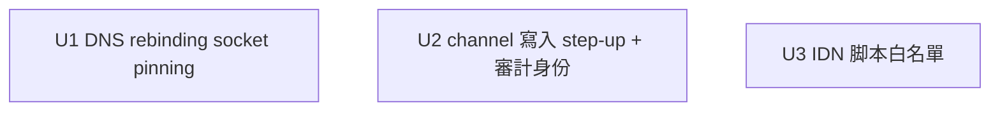

# 安全加固收尾（U6 複查殘留 P1/P2）

## Overview

把多渠道 SSRF 的三項殘留風險堵到生產級。這是個爬任意「操作者新增域名」的工具，三項都直接關乎信任邊界：

1. **DNS rebinding socket pinning**：消除「解析時公網、連線時私網」的 TOCTOU 窗口——把已校驗的公網 IP 釘到實際 socket。
2. **channel 寫入防越權**：目前持 JWT 即可寫 allowlist，且審計欄位形同虛設（JWT 空載荷、`created_by` 永遠是 "operator"）。加入身份審計 + 寫入 step-up（口令重驗），讓被竊 token 單獨不足以開渠道。
3. **IDN 同形脚本白名單**：`isMixedScript` 漏掉純單一非拉丁脚本同形（如純西里爾 `сyberаrt.com`）。改為脚本白名單：允許 ASCII + CJK，拒絕拉丁可混淆脚本。

## Requirements Trace

- R1. `safeFetch` 把每跳校驗通過的公網 IP 釘到 socket 連線；連線端 IP == 校驗端 IP，rebinding 無窗口。→ U1
- R2. 連線時對釘住的 IP 再驗一次私網（縱深）；釘 IP 失敗/變私網即拒。→ U1
- R3. channel 寫入路由要求 step-up：除 JWT 外須通過管理員口令重驗（比對 `JWT_ADMIN_PASSWORD_HASH`），被竊 JWT 單獨無法寫。→ U2
- R4. JWT 載荷帶可審計主體；`created_by` 反映真實身份而非恆為 "operator"。→ U2
- R5. hostname 脚本白名單：允許 ASCII + CJK（Han/Hiragana/Katakana/Hangul），拒絕拉丁可混淆脚本（Cyrillic/Greek/Armenian/Cherokee/Coptic 等）。→ U3

## Scope Boundaries

- **只加固 channel 寫入 step-up**——其他寫路由（gossip/pending/prompt/config）的手勢評估留待後續（見 Deferred）。
- 不改 allowlist 合併邏輯、不改逐跳 redirect 既有語義、不改 `isPublicUnicastIp` 的私網覆蓋（已驗完整）。
- 不引入完整 Unicode confusables 資料庫/第三方庫——用脚本白名單達成（YAGNI）。
- 不做多角色權限模型（單操作者工具）；step-up 用既有口令哈希，不新增使用者系統。
- 誠實記錄殘留：完全被攻陷的 token+口令持有者仍能寫——這是單操作者模型的固有上限。

## Context & Research

### Relevant Code and Patterns

**SSRF / DNS（U1）**
- `packages/backend/src/scraper/ssrf-guard.ts`：`safeFetch(rawUrl, init, maxHopsOrOpts, timeoutMs)`（第 181-218）用**原生 Node fetch**（第 208），`redirect:"manual"` 逐跳 `assertUrlSafe`（第 202）+ `allowlistCheck` 回調（第 203-206）。
- `assertUrlSafe`：`dns/promises` 的 `lookup(host,{all:true,verbatim:true})`（第 149-155）→ `isPublicUnicastIp`（第 126-131，V4/V6 覆蓋完整）。**IP 僅用於校驗、不 pin**，fetch 收到的仍是 hostname → TOCTOU（注釋第 5-14 已坦承）。
- backend `package.json` **無 undici 依賴**；Node 20（內置 fetch 不可注 dispatcher）。
- 測試 `ssrf-guard.resolution.test.ts`：`vi.mock("node:dns/promises")` 注入解析結果——可模擬 rebinding。

**channel 寫入鑑權（U2）**
- `packages/backend/src/routes/channel-routes.ts`：POST `/api/v1/channels`（第 61-121）確認手勢 = header `x-operator-confirm` + body `confirm:true`（第 62-74，僅防誤觸）；`created_by = request.user?.sub ?? "operator"`（第 99-100，sub 永不存在 → 恆 "operator"）。
- `packages/backend/src/middleware/auth-middleware.ts`：`requireAuth`（第 20-42）驗 HS256 + 過期，`request.user = {authenticated:true}`（第 8，**無 sub/role**）。
- `packages/backend/src/routes/auth-routes.ts`：`jwt.sign({}, secret, ...)`（第 50，**空載荷**）；登入比對 `JWT_ADMIN_PASSWORD_HASH`。
- `app.ts` 全局 preHandler（第 166-170）+ `PUBLIC_ROUTES`（channels 不在內 → 受保護）。
- `insertChannel`（channel-store.ts 第 230-272）僅 channel-routes 一個寫入入口。

**IDN（U3）**
- `packages/backend/src/scraper/channel-store.ts`：`normalizeChannelHost`（第 107-169）逐 label 跑 `isMixedScript`（第 75-96）；`domainToASCII` 存 punycode（第 160）。`isMixedScript` 僅 `hasLatin && scripts>=1` 或 `scripts>=2` 才拒 → 純單一非拉丁脚本漏網。
- 同檔 `MAX_DEPTH=50` clamp（第 252-255）為寫入校驗範式參考。

### Institutional Learnings

- U6 P0/P1 修復確立：寫入校驗在 `channel-store`/`channel-routes` 收口，消費端 `fetchListPaged` 有 `MAX_PAGES=50` 硬上限——本輪沿用「不信任配置、消費點兜底 + 寫入點收斂」雙保險。
- 既有 DNS mock 範式（`vi.mock("node:dns/promises")`）可直接用於 rebinding 測試。

### External References

- 無需外部研究。undici 的 `Agent({connect:{lookup}})` 自訂 lookup 是 Node 生態標準 SSRF-pinning 手法；脚本範圍用 Unicode block codepoint，無需庫。

## Key Technical Decisions

- **DNS pin 用 undici Agent + 自訂 `connect.lookup`**：`assertUrlSafe` 解析並選定一個公網 IP → `safeFetch` 對該跳用一個 dispatcher，其 `connect.lookup` 強制回傳這個已校驗 IP（連線時再 `isPublicUnicastIp` 驗一次）。逐跳（redirect:manual）各自釘。原生 fetch 換成 `undici.request`，或對原生 fetch 傳 `dispatcher`（Node fetch 支援 `dispatcher` 選項）。
- **step-up 用既有口令哈希，不建角色系統**：channel 寫入額外要求 body 帶 `adminPassword`（或一次性重驗），後端比對 `JWT_ADMIN_PASSWORD_HASH`；通過才寫。被竊 JWT 無口令 → 寫不了。確認手勢（header+body）保留為 UX 防誤觸。
- **JWT 帶 subject 供審計**：`auth-routes` 簽發時放一個穩定主體（如 `sub:"operator"` 或登入標識），`auth-middleware` 解析進 `request.user.sub`，`created_by` 反映之。即使單操作者，審計欄位也要真實（取證價值）。
- **IDN 改脚本白名單**：hostname 每個 label 只允許 ASCII 與 CJK 區段（Han `一-鿿` 等、Hiragana、Katakana、Hangul）；出現拉丁可混淆脚本（Cyrillic/Greek/Armenian/Cherokee/Coptic…）即拒。目標站幾乎都是 ASCII 或 CJK，此策略乾淨且決定性堵住整脚本同形。保留既有 https/通配/IP-literal/punycode 校驗。

## Open Questions

### Resolved During Planning
- **pin 怎麼做？** → undici Agent 自訂 connect.lookup，逐跳釘已校驗 IP。
- **防越權用角色還是 step-up？** → step-up（口令重驗），不建角色系統。
- **IDN 用庫還是手寫？** → 脚本白名單（ASCII+CJK），無庫。

### Deferred to Implementation
- **step-up 的 UX/傳遞形式**：body 明文 `adminPassword` vs 一次性 server-issued nonce vs header。實作時定，優先複用 auth-routes 既有口令比對工具；前端 GossipView 新增渠道時需提示輸入口令（擴展側小改）。
- **其他寫路由（gossip/pending/prompt/config）是否一併加 step-up**：本輪只做 channel（SSRF 相關）；其餘評估留後續一輪。
- **CJK 之外的合法非拉丁脚本**（如阿拉伯、泰文目標站）：v 此輪假設目標站為 ASCII/CJK；若未來需要再放寬白名單。
- **undici 換用後對既有 timeout/maxHops/header 行為的等價性**：實作時逐一對齊既有測試語義。

## Implementation Units

（三項互相獨立、可並行；都只動 backend。）

- [ ] **Unit 1: DNS rebinding socket pinning**

**Goal:** 消除解析↔連線的 TOCTOU——把每跳校驗通過的公網 IP 釘到 socket，連線端對齊校驗端並再驗私網。

**Requirements:** R1, R2

**Dependencies:** 無（新增 undici 依賴）

**Files:**
- Modify: `packages/backend/src/scraper/ssrf-guard.ts`（`assertUrlSafe` 回傳選定的公網 IP；`safeFetch` 每跳建/用 undici dispatcher，`connect.lookup` 強制該 IP + 連線時 `isPublicUnicastIp` 複驗；redirect 逐跳各釘）
- Modify: `packages/backend/package.json`（加 `undici` 依賴）
- Test: `packages/backend/src/scraper/ssrf-guard.test.ts`、`ssrf-guard.resolution.test.ts`

**Approach:**
- `assertUrlSafe` 從 `lookup{all:true}` 的公網地址中選一個，連同校驗結果回傳（向後相容：既有只關心拋不拋的呼叫點不受影響）。
- `safeFetch` 對當前跳用 undici `Agent`/`Dispatcher`，`connect.lookup(hostname, opts, cb)` 直接 `cb(null, [{address: pinnedIp, family}])`，並在 lookup 內對 pinnedIp 再跑 `isPublicUnicastIp`，私網則 `cb(SsrfError)`。原生 `fetch(current, { ..., dispatcher })` 或改 `undici.request`。
- 逐跳（redirect:manual）：每個新 URL 重新 `assertUrlSafe` → 重新釘其 IP。
- 保持既有 timeout/maxHops/allowlistCheck/header 語義。

**Execution note:** 先寫一個失敗的 rebinding 測試（解析回公網、連線時 lookup 被要求返私網應被拒），再實作 pinning。

**Patterns to follow:** 既有 `assertUrlSafe`/`isPublicUnicastIp`；`vi.mock("node:dns/promises")` 測試範式。

**Test scenarios:**
- Happy：正常公網 host → 連線到釘住的 IP，請求成功（dispatcher.connect.lookup 被以該 IP 調用）。
- Security（rebinding）：`assertUrlSafe` 階段解析回公網 IP 通過，但 socket lookup 階段該 host 解析會變私網——pinning 下連線仍走已釘的公網 IP，且若強制私網則被 `isPublicUnicastIp` 拒。斷言連線目標 == 校驗時的 IP。
- Security：redirect 到另一公網 host → 新跳重新解析+釘新 IP；redirect 到私網 → 拒。
- Edge：IPv6-only host、多 A 記錄取其一、DNS 失敗 → 既有行為不回歸。
- 等價性：既有 timeout/maxHops/allowlistCheck 測試保持綠。

**Verification:** `pnpm --filter publisher-backend test` 綠；新增 rebinding 測試證明連線 IP 被釘且私網被拒；`grep` 確認 fetch 路徑都帶 dispatcher。

---

- [ ] **Unit 2: channel 寫入 step-up + 審計身份**

**Goal:** channel 寫入除 JWT 外要求口令 step-up（被竊 token 單獨寫不了），並讓 JWT 帶可審計主體使 `created_by` 真實。

**Requirements:** R3, R4

**Dependencies:** 無

**Files:**
- Modify: `packages/backend/src/routes/auth-routes.ts`（`jwt.sign` 放入穩定 `sub`）
- Modify: `packages/backend/src/middleware/auth-middleware.ts`（解析 `sub` 進 `request.user`）
- Modify: `packages/backend/src/routes/channel-routes.ts`（POST 加 step-up：比對 body 口令與 `JWT_ADMIN_PASSWORD_HASH`，失敗 401/403；`created_by` 取真實 sub）
- Modify（擴展，最小）：`packages/extension/entrypoints/sidepanel/GossipView.tsx` + `lib/channel-client.ts`（新增渠道時收集並傳口令）
- Test: `packages/backend/src/routes/channel-routes.test.ts`、`auth-routes.test.ts`（如有）、擴展 channel-client 測試

**Approach:**
- 複用 auth-routes 既有口令比對（bcrypt/`JWT_ADMIN_PASSWORD_HASH`）抽成共用校驗，channel POST 寫入前調用。
- 確認手勢（header+body confirm）保留為 UX；安全閘變成口令 step-up。
- JWT 簽發加 `sub`，middleware 透傳，`created_by` 用之（無則仍 "operator" 但帶來源說明）。

**Execution note:** 安全行為改動——先寫「帶 JWT 但無/錯口令 → 寫入被拒、不入庫」的失敗測試再實作。

**Patterns to follow:** auth-routes 登入口令比對；channel-routes 既有手勢校驗與 `err()` 回應；U6 的「寫入點收斂」。

**Test scenarios:**
- Security：帶有效 JWT + 正確口令 + 手勢 → 201 寫入。
- Security：帶有效 JWT 但**無/錯口令** → 拒（403/401），不入庫，不解析 DNS（早退）。
- Security：缺手勢 header/body → 仍 403（既有不回歸）。
- 審計：寫入後 `created_by` 反映 JWT sub（非恆 "operator"）。
- 回歸：爬取管線/LLM 路徑從不調 channel 寫入（既有事實），加 step-up 後仍無法被其觸發。
- Integration：擴展 channel-client 帶口令 → 後端通過；不帶 → 被拒，UI 顯示需口令。

**Verification:** `pnpm -r test` 綠；無口令的 JWT 無法寫 allowlist；`created_by` 有真實值。

---

- [ ] **Unit 3: IDN 同形脚本白名單**

**Goal:** hostname 脚本白名單——允許 ASCII + CJK，拒絕拉丁可混淆脚本，堵住純單一非拉丁脚本同形。

**Requirements:** R5

**Dependencies:** 無

**Files:**
- Modify: `packages/backend/src/scraper/channel-store.ts`（`normalizeChannelHost` 的脚本校驗：用脚本白名單取代/補強 `isMixedScript`）
- Test: `packages/backend/src/scraper/channel-store.test.ts`、`packages/backend/src/routes/channel-routes.test.ts`（端到端拒絕）

**Approach:**
- 逐 label 逐字元判脚本：ASCII（`<0x80`）放行；CJK 區段（Han `一-龯`、擴展、Hiragana `぀-ゟ`、Katakana `゠-ヿ`、Hangul `가-힯` 等）放行；其餘非 ASCII（Cyrillic/Greek/Armenian/Cherokee/Coptic…）即拒，回明確錯誤「不支援的脚本（疑似 IDN homograph）」。
- 保留既有 https/通配/IP-literal 拒絕與 `domainToASCII` punycode 存儲。
- `isMixedScript` 可保留作補充或由白名單覆蓋——以白名單為主判據。

**Patterns to follow:** 既有 `normalizeChannelHost` 逐 label 迴圈與 `NormalizeResult` 錯誤回傳。

**Test scenarios:**
- Happy：純 ASCII（`example.com`）、ASCII+CJK（`吃瓜.com` / `ニュース.jp`）→ 放行並存 punycode。
- Security：純西里爾同形（`сyberаrt.com`，全西里爾）→ 拒（這是 isMixedScript 原本漏的）。
- Security：拉丁+西里爾混用（既有用例）→ 仍拒（不回歸）。
- Security：亞美尼亞/切羅基同形 label → 拒。
- Edge：含 CJK 的合法多 label（`新闻.example.com`）→ 放行；`domainToASCII` 後可比對一致。

**Verification:** `pnpm --filter publisher-backend test` 綠；純單一非拉丁脚本同形被拒；ASCII+CJK 放行；全庫無回歸。

## System-Wide Impact

- **Interaction graph:** U1 改 `safeFetch` 的網路層——所有爬取（generic-adapter、scheduler、discover、web-enricher）經它，需確認 dispatcher 不破壞既有 timeout/redirect/header。U2 改鑑權鏈（auth-routes/middleware/channel-routes）+ 擴展新增渠道流。U3 只在 channel 寫入校驗。
- **Error propagation:** pin 失敗/連線私網 → `SsrfError`（與既有拒絕同類）；step-up 失敗 → 明確 403，不洩漏；不入庫。
- **State lifecycle risks:** step-up 早退須在任何 DNS 解析/寫庫之前，避免無權請求觸發出站解析。
- **API surface parity:** channel POST 契約新增口令欄位——擴展 channel-client 同步；其他既有渠道讀/刪不變。
- **Unchanged invariants:** `isPublicUnicastIp` 私網覆蓋、逐跳 allowlist、fail-closed allowlist、`MAX_PAGES`/`MAX_DEPTH` 上限、punycode 存儲——本輪不改，只在其上加釘 IP / step-up / 脚本白名單。

## Risks & Dependencies

| Risk | Mitigation |
|------|------------|
| undici dispatcher 換用破壞既有 fetch 行為（timeout/header/redirect） | U1 保持既有語義，逐一對齊既有測試；redirect 仍 manual 逐跳 |
| pin 後合法多 IP / IPv6 host 連線失敗 | 從解析結果選可用公網 IP，連線失敗可回退下一個（看實作）；既有多 A 記錄測試守護 |
| step-up 口令 UX 影響操作流 | 確認手勢保留為 UX；口令僅渠道寫入這一高敏動作要求；前端明確提示 |
| 脚本白名單误拒合法非 ASCII 目標站 | 目標站為 ASCII/CJK 假設；放寬留 Deferred；錯誤訊息明確讓操作者知道原因 |
| 殘留：完全被攻陷（token+口令）仍可寫 | 單操作者模型固有上限，已在 Scope/文檔誠實記錄 |

## Sources & References

- **Origin backlog:** docs/v0.2-backlog.md（DNS pinning / confirm 手勢 / IDN 三項）
- 前序安全複查：`docs/plans/2026-06-16-003-feat-guapi-v0.1-rebrand-plan.md`（U6 殘留 P1/P2）
- 代碼：`ssrf-guard.ts`、`channel-routes.ts`、`channel-store.ts`、`auth-middleware.ts`、`auth-routes.ts`
