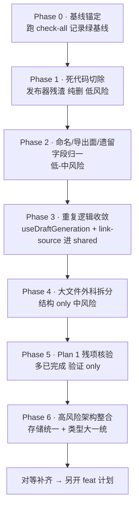

# 51guapi 分阶段 Deep 重构总纲

> **一句话**:重塑(发布器 → 吃瓜)已基本完成,这份总纲做的是**行为保持的外科手术式收尾**——切除发布器概念残渣、收敛重复、拆大文件,最后(用户已选)做高风险的存储统一与领域类型大一统。**所有「补行为」的对等缺口已分流到** [`2026-06-17-008-feat-parity-completion-plan.md`](./2026-06-17-008-feat-parity-completion-plan.md),不混入本总纲。

## 背景与目标

51guapi(吃瓜小帮手)由旧的 **51guapi**(往站点 iframe 表单填发帖)重塑而来,现在**只爬取 URL → AI 提炼吃瓜草稿 → 人工预览/编辑 → 导出 JSON/Markdown,绝不发布/填充/写回任何站点**。重塑在文件级已完成(content script、`body-responder`、`frame-resolve`、`BatchReviewPanel` 等整文件均已删),但留下了**概念残渣**:无调用方的发布器度量/schema/表、悬空的「填充到当前页」快捷键、遗留字段、旧项目名。

本总纲基于一次四路并行 deep research(backend / extension / shared / 计划对账)的发现,目标:

1. **纯重构**:只改结构、不改行为,每一步靠测试与构建证明等价(见「验证基线」)。
2. **外科手术式分阶段**:按 blast radius 从小到大排序,每个相位**独立可验证、独立可合并、独立可回滚**,相位间 `check-all` 必须全绿。
3. **对等补齐分流**:任何需要**改/补行为**的「对等补齐」一律不进本总纲,落到配套 feat 计划。

## 核心原则(纯重构铁律)

- **行为等价**:删除项必须 grep 证明无调用方;移动/拆分项必须保持公开签名与运行时行为不变;测试断言不放水(只增不改语义)。
- **boundary 字段警戒**:凡可能改变**导出 JSON/Markdown 输出形状**或**对外 API 契约**的改动,先验证消费方,否则降级为 feat。
- **遵守 6 条 `docs/solutions` 教训**:尤其 `*Once` mock 队列泄漏要用 `vi.resetAllMocks()`、脱敏闸门假绿(路径锚定)、死参注入缝、vitest `exclude: dist/**` 幻影测试、`--filter` 用对包名(`51guapi-backend` 非 scope)。
- **每相位收尾**:跑全量验证 → 绿 → 单独 commit/PR → 才进下一相位。

## 验证基线(每相位收尾必跑,证明行为等价)

CI 真闸的本地等价(`.github/workflows/ci.yml`):

```bash
pnpm install --frozen-lockfile
bash scripts/check-fixture-secrets.sh            # 脱敏闸门(pre-commit 亦跑)
pnpm --filter @51guapi/shared build               # 必须先 emit dist,否则 backend/extension 缺类型
pnpm -r compile                                   # 拓扑序全包 tsc 类型检查
pnpm lint:ci                                       # biome ci(只读)
pnpm -r test                                       # 全包 vitest(只收 src/,排除 dist/** 与 e2e)
pnpm --filter 51guapi-backend build && pnpm --filter 51guapi-extension build
```

一键等价:`bash scripts/check-all.sh`。额外护航:`pnpm test:preflight`(node 环境跑 `scripts/preflight/**`)。
**纯重构通过判据**:相位前后测试**数量与断言不减**(只允许因删死测试而减少,且减少数 == 删除的死测试数),`compile` 全绿,双端 build 产物校验通过。

## 计划对账(避免重复造轮子)

8 份既有计划中 **6 份已落地**,新总纲只做「真正还没做的」+「本次新挖的」。

| 既有计划 | 状态 | 对本总纲的含义 |
|---|---|---|
| `feat-guapi-v0.1-rebrand` | ✅ done | 发布机器已拆净,勿重复 |
| `feat-v0-2-release-readiness` / `fix-v0.2-release-full` | ✅ done | 审稿流程、host 单一真相、版本同步已完成 |
| `refactor-fewshot-dedup` | ✅ done | fewShot 双真相已消除 |
| `refactor-health-checkup-cleanup` | ✅ done | revisit-job/draft-diff/FieldMapping 死码 + SSRF/CSV bug 已修 |
| `refactor-settings-hook-split` | ✅ done | Settings 拆分已完成 |
| `refactor-maintainability-test-refactor` | ⚠️ 大部 superseded | UI 拆分项随发布机器整删失效;勿照搬 |
| `refactor-comprehensive-system-optimization`(Plan 1) | ✅ **~90% done(代码核验,非 checklist)** | **重大修正**:该计划 frontmatter 仍标 `planned`、checklist 空,但代码显示 `.nvmrc`/`logger`/优雅关闭/request-id/CSS Modules/路由归位/`bodyLimit` **均已实现**。仅余少量待核(见 Phase 5) |

> ⚠️ **教训**:计划文档的 checklist 与代码实况会漂移。本总纲所有「待办」均以**代码核验**为准,不以旧计划 checklist 为准。

## 核验修正(2026-06-17 三路并行代码核验后回写)

本总纲经一次 backend/extension/shared+boundary 三路并行 grep+read 核验。**大部分断言✅符合实况**;以下 6 处漂移已就地修正,列此备查:

| 项 | 计划原述 | 核验实况 | 修正动作 |
|---|---|---|---|
| **P1-7** | 悬空 `onFill` = 纯死代码,可删 | ⚠️ **非死代码**:`onFill` 参数、`Ctrl+Shift+Enter` 分支、`useKeyboardShortcuts.test.ts:46-61` 活测试、`KeyboardShortcutsHelp.tsx` UI 帮助项**全部存活**,仅 `App.tsx:150` 未传参 → 是「半接线 seam」非死物 | **重新归类**:不在 Phase 1 纯删。要么确认彻底放弃 fill→连 UI 帮助项+测试+seam 一起删(纯重构);要么保留为 feat seam(类比 F1)。见下方 P1-7 决策注 |
| **P3-3** | 401 双写「疑似冗余」 | ⚠️ **有意设计**:`api-fetch.ts:8-11` 有明确注释「刻意保留 fail-closed 双写」 | **降级**:非冗余,P3-3 改为「确认注释已存在即关闭」,不动代码 |
| **P4-6** | `as unknown as` 在 `channel-store.ts:175` / `llm.ts:400` | ⚠️ **生产代码无此断言**:extension 端 11 处 `as unknown as` **全在 `.test.ts`**(mock-fetch 强转,合理);`channel-store.ts:175` 不存在 | **基本作废**:P4-6 不作为独立修复项;backend `llm.ts` 拆分时若遇到顺手处理即可 |
| **P2-1** | `PUBLISHER_DATA_DIR` 旧名 5 处 | ⚠️ 实测约 **11–12 处**(含 3 个 store + audit-log + test-setup + 多个 .test.ts) | 改法不变(引 `GUAPI_DATA_DIR` + 读旧名 fallback),但**影响面比预估大**,改时 grep 全量替换 |
| **P2-3** | 删遗留字段 = med boundary 风险 | ✅ **风险其实更低**:`shared/export.ts` 的 `ExportedDraft`/`assembleDraftJSON` **早已不含** `postStatus`/`publishedAt`/`mediaId`,导出产物形状不变。后端 llm.ts 也不能动填,全靠 shared 默认值 pass-through | **降级为 low**:删 `ContentDraft` 字段对**导出产物零影响**。**唯一真 boundary** 是 backend `GenerateDraftResponse` schema(schemas.ts:55-74)仍声明三字段——删它属 API 契约变更,验证扩展端 client 不读这三字段即可(已确认 extension 不消费) |
| **P6-1** | PendingTopic「理想是纯类型收敛」 | ⚠️ **字段冲突比预估严重**:`facts`(extension `Record<string,string>` vs backend `FactsBlock\|GossipFactsBlock`)、`rejectedReason`(enum vs `string`)、`enrichmentText:string` vs `enrichment:EnrichedContext`、`folded`(仅 ext)、`domain`(`"gossip"` vs `"acg"\|"gossip"`) | **加固**:P6-1 不是纯类型收敛,是**真 latent mismatch**。统一前须逐字段决策(facts 用强类型还是 JSON 兼容 dict、rejectedReason 统一 enum、enrichment 语义对齐),每个差异先在往返测试里固化。见下方 P6-1 已扩写 |

**另两处存活性已厘清(深核后定论)**:
- **P1-6** `awaiting-approval`:**移出 Phase 1**——`packages/extension/lib/batch.ts` 的状态机仍被 `entrypoints/background.ts`(`createBatch`/`markFilled`…)+ `scripts/preflight/dryrun-green.ts` 使用,是**活值**,删它破坏活代码。是否退役整个扩展 batch 子系统是独立中风险议题,不在纯删相位。(此前提到的「根目录旧版 batch.ts」即根 `./lib/batch.ts`,已归入新单元 **P1-9** 整体删除,与扩展活 batch 无关。)
- **F2 修正**:`metrics.ts` 的 counters **并非生产全 0**——`recordScraperRun()` 已接入 `gossip-routes`/`scraper-routes` 成功/失败分支;真正孤立的只有 `recordDraft()` 与(死的)`recordBatchCompleted()`。见 feat 计划 F2 已更正。

## 相位总览与依赖



排序逻辑:**先删后改、先小后大、先单包后跨包、高风险垫底**。任一相位都可在此处中止而不留半成品。

---

## Phase 0 · 基线锚定(无代码改动)

跑一遍完整验证基线,记录绿基线(各包测试数、compile 全绿、build 产物)。这是后续每相位「行为等价」的对照锚。
**产出**:一行基线快照(如 `backend ~300 / extension ~670 / compile 绿 / build 绿`)记入 PR 描述。

---

## Phase 1 · 死代码切除(纯删,low risk)

发布器时代残渣,grep 已证无调用方。逐项删除并跑验证。**P1-7 额外价值:消除与「绝不发布/填充」硬约束冲突的误导性 UI。**

| ID | 死物 | 文件:行 | 改法 | risk | effort |
|---|---|---|---|---|---|
| P1-1 | `recordBatchCompleted()` + `batchesCompleted` 输出行 | `backend/src/services/metrics.ts:26-28` | 删函数、删 metrics 输出行、删对应测试 | low | S |
| P1-2 | `CreateBatchBody` schema | `backend/src/utils/schemas.ts:139-150` | 删定义(0 路由引用) | low | S |
| P1-3 | `PublishedPostBody`/`PublishedPostQuery` schema | `backend/src/utils/schemas.ts:194-208` | 删定义(表已被 migration 010 DROP) | low | S |
| P1-4 | `batches` 表(无后端 CRUD) | `backend/src/migrations/runner.ts` | **改法修正(核验)**:迁移**内联在 `runner.ts` 的 `MIGRATIONS` Record**(磁盘 .sql 是残留),应**往 Record 追加 `"011-drop-batches.sql": "DROP TABLE IF EXISTS batches;"` key**,非新建文件。删前 grep 确认后端零访问 | low | S |
| P1-5 | `resolveAdminTabId()` + `ADMIN_PAGE_HOST` | `extension/lib/messaging.ts:64-72` | 删函数与常量,messaging 收窄 | low | S |
| P1-6 | `awaiting-approval` 枚举值 | `extension/lib/batch.ts:13` | 从 `BatchItemStatus` 删 | low | S | **⚠️ 先核**:核验发现**根目录另有一份旧版 `lib/batch.ts`** 仍用该值;确认旧版已弃/无引用后再删扩展包版 |
| ~~P1-7~~ | **已移出 Phase 1**(核验:非死代码,是半接线 seam) | 见下方「P1-7 决策注」 | 需先决策保留/删除,不在纯删相位 | — | — |
| P1-8 | config-client 孤立导出 `syncBatchItemStatus`/`fetchBatchState` | `extension/lib/config-client.ts:14-97` | **先 grep 确认无 UI 调用** → 删;若有调用降级保留 | low | S |
| **P1-9** | **根 `./lib/` 整套旧发布器死码(9 文件)** | `lib/batch.ts`/`messaging.ts`/`publish.ts`/`storage.ts`/`trajectory.ts`/`types.ts` + 3 个 `.test.ts` | **核验新增**:零 import,且不在 `pnpm-workspace`(`packages/*`)内 → 测试 CI 根本不跑。整目录删。`publish.ts`/`trajectory.ts` 与「绝不发布」硬约束直接冲突,优先清。删后**测试总数应不变**(作反证) | low | M |

**验证要点**:删测试时核对测试数减少量 == 删除的死测试数;`*Once` mock 若涉及用 `resetAllMocks`。

> **P1-7 决策注(核验后新增)**:`onFill` 经核验**不是死代码**——参数、`Ctrl+Shift+Enter` 分支、活测试、UI 帮助项全在,仅 `App.tsx:150` 未传参使其运行时 no-op。两条路二选一,**不要当纯死码删**:
> - **(A) 确认彻底放弃 fill 能力** → 连同 `onFill` 参数 + 分支 + `KeyboardShortcutsHelp` 帮助项 + `useKeyboardShortcuts.test.ts:46-61` 测试一起删(这才是行为等价的纯重构,消除误导 UI)。
> - **(B) 保留为未来 seam** → 不删,但因「绝不发布/填充」硬约束,fill 不可能复活到「填写站点表单」语义;若保留须改注释澄清它指向什么。**默认建议 (A)**——与硬约束一致、消除误导。

---

## Phase 2 · 命名 / 导出面 / 遗留字段归一(low–med risk)

| ID | 项 | 文件 | 改法 | risk | 注意 |
|---|---|---|---|---|---|
| P2-1 | `PUBLISHER_DATA_DIR` 旧名(5 处) | `backend/src/scraper/pending-db.ts:11`、`index.ts:9` 等 | 引入 `GUAPI_DATA_DIR`,**保留读旧名作 fallback**(不破坏现有部署),更新 `.env.example` + docs | low | ops-facing,务必兼容旧值 |
| P2-2 | `esc` 导出面过宽 | `shared/src/index.ts`、`post-assembler.ts` | 从 `index.ts` 删 `esc` 导出,内化为 post-assembler 私有 | low | grep 确认外部无 import `esc` |
| P2-3 | 遗留发布器字段 `postStatus`/`publishedAt`/`mediaId` | `shared/src/types.ts`(ContentDraft)、`backend/src/utils/schemas.ts:55-74`(GenerateDraftResponse) | 删字段 | **low**(核验后下调) | **核验已澄清**:`shared/export.ts` 的 `ExportedDraft`/`assembleDraftJSON` **早已不含**这三字段 → 删 `ContentDraft` 字段对**导出产物零影响**(纯类型清理)。**唯一真 boundary** 是 backend `GenerateDraftResponse` schema 仍声明它们;已确认 extension client 不读 → 可一并删。删后 backend 不再 pass-through shared 默认值,核对 `toDraft()` 初始化不依赖 |

> P2-3 即 backend 代理误报的「schema mismatch bug」——根因是 schema 仍带发布器遗留字段,**正解是删字段,不是去填它们**。

---

## Phase 3 · 重复逻辑收敛(low–med risk,DRY)

| ID | 项 | 文件 | 改法 | risk |
|---|---|---|---|---|
| P3-1 | 3 处生成逻辑重复(try/catch + busy/error 骨架) | `App.tsx:73`、`PendingTopicsView.tsx:108,209`、`GossipView.tsx:192` | 抽 `useDraftGeneration()` hook,返回 `{ draft, loading, error, generate }`,三处复用 | med |
| P3-2 | `link-source` 仅 extension 有 | `extension/lib/link-source.ts`(5 函数) | 迁入 shared 成单一真相,extension 改 `import from "@51guapi/shared"`,**行为不变**;新增 `LinkCheck` 类型导出 | med |
| ~~P3-3~~ | ~~401 双写冗余~~ **核验:有意设计,关闭** | `api-fetch.ts:8-11` 已有「刻意 fail-closed 双写」注释 | **不动代码**——非冗余,注释已在。仅留此记录避免后人再次误判 | — |

> P3-2 让 backend 也能复用链接校验(防幻觉 grounding),但 backend **接入** link 校验属「补行为」→ 见 feat 计划 F3。本相位只搬不接。

---

## Phase 4 · 大文件外科拆分(med risk,纯结构)

行为保持的文件拆分,每个独立验证。拆分时顺手修暴露出的 `as unknown as` 断言根因。

| ID | 大文件 | 行数 | 拆法 |
|---|---|---|---|
| P4-1 | `backend/src/services/llm.ts` | 653 | `fetch-backoff.ts` + `draft-gen.ts` + `draft-review.ts` + `draft-rewrite.ts`,共享 `callLlmForJson`(**review/rewrite 保留为 feat seam,只拆不删**) |
| P4-2 | `backend/src/scraper/adapters/generic-adapter.ts` | 493 | `html-extractors.ts`(标题/body/og)+ `list-pagination.ts`(detectNext + fetchListPage) |
| P4-3 | `backend/src/scraper/web-enricher.ts` | 388 | `enrichment-cache.ts`(内存+DB 双层缓存)+ `web-search.ts`(Jina + 结果解析) |
| P4-4 | `extension/.../PendingTopicsView.tsx` | 712 | `TopicListPanel` + `FactsEditorModal` + `GenerateConfirmDialog`,主组件仅编排 |
| P4-5 | `extension/.../GossipView.tsx`(565)、`App.tsx`(478) | — | 抽子视图/子区块,降 setState 密度 |
| ~~P4-6~~ | ~~`as unknown as` 断言根因~~ **核验:基本作废** | extension 11 处全在 `.test.ts`(mock 强转,合理);`channel-store.ts:175` 不存在 | 不作独立项;backend `llm.ts` 拆分时若真遇到强转顺手处理 |

**验证要点**:拆分是最容易被 mock 泄漏坑的环节——遵守 solution `vitest-mock-queue-leak`,域切换后 grep 旧符号串,内联 mock 用 `satisfies` 防缺字段。

---

## Phase 5 · Plan 1 残项核验(多已完成,验证为主)

代码核验显示 Plan 1 绝大多数已落地。本相位**只核验、补缺口**,不照搬旧 checklist。

| ID | 项 | 现状(已核验) | 动作 |
|---|---|---|---|
| P5-1 | TypeBox route 覆盖 | ✅ **核验确认**:auth/gossip/pending/scraper/prompt 已带 `schema:`;`channel-routes`(GET/POST/DELETE 三路由)+ `preflight-routes`(GET)**共 4 路由缺 schema** | 补这 4 个 schema(否则 Fastify 响应字段可能被静默剥除) |
| P5-2 | 三面板 Loading 态 | 未核验 | 抽查 Pending/Gossip/Export 三视图 loading 态是否齐;缺则补 |
| P5-3 | `maxParamLength` 限制 | 仅有 `bodyLimit: 1MB` | 可选:补 `maxParamLength`(low 优先) |

已确认 DONE,**不再做**:`.nvmrc`/`.node-version`、扩展 `logger.ts`、优雅关闭、request-id、Settings CSS Modules、scraper 路由归位、`bodyLimit`。

---

## Phase 6 · 高风险架构整合(垫底,用户已选「含高风险」)

blast radius 最大,放最后单独成 PR,重护航、备回滚。

### P6-1 · PendingTopic 领域类型大一统(high)
- **现状**:`extension/lib/pending-client.ts:5-30` 的 `PendingTopic`(API response 型)与 `backend/src/scraper/pending-store.ts:22-36` 内部 interface 各定义一份,无中心真相。
- **⚠️ 核验修正**:这**不是纯类型收敛**——两侧已有 5 处实质 latent mismatch,统一前每个差异须先决策、再在往返测试里固化:

  | 字段 | extension | backend | 统一决策(执行前定) |
  |---|---|---|---|
  | `facts` | `Record<string,string>` | `FactsBlock \| GossipFactsBlock` | 关键:canonical 用强 union 还是 JSON 兼容 dict?若 API 序列化已扁平化为 dict,强类型会与运行时不符 |
  | `rejectedReason` | `RejectionReason`(enum) | `string` | 统一为 `RejectionReason` enum(backend 收窄) |
  | `enrichmentText` / `enrichment` | `enrichmentText: string` | `enrichment: EnrichedContext`(对象) | 语义+类型都不同,先确认 API 实际传哪个 |
  | `folded` | 有(`boolean`) | 无 | UI-only 状态,canonical 标 optional |
  | `domain` | `"gossip"` 字面量 | `"acg" \| "gossip"` | 取后端宽集 `"acg" \| "gossip"` |

- **改法**:在 `shared/src/types.ts` 定义 canonical `PendingTopic`,前后端改用。**但因上述 mismatch,先写往返测试固化当前实际 API 形状,再收敛**,否则会把运行时不一致掩盖成「编译过」。
- **风险**:`facts` 强类型化若与序列化后的扁平 dict 不符,会造成静默数据损坏(编译绿但运行错)。
- **验证**:全量 `compile` + 前后端 pending 往返测试绿 + 手动 smoke 一条真实 pending 的 facts/enrichment 往返。

### P6-2 · 存储统一 JSON → SQLite(high)
- **现状**:双轨存储——pending/config 用 SQLite,prompt-store 用 JSON 文件。
- **改法**:prompt-store(及任何残留 JSON 轨)迁入 SQLite。**带数据迁移脚本 + 过渡期双读(SQLite 优先,JSON fallback)+ round-trip 校验 + 回滚预案**。
- **风险**:数据迁移正确性是关键;遵守 `docs/solutions` 数据迁移/注入缝教训,迁移脚本要可幂等、可 dry-run。
- **验证**:迁移前后数据 round-trip 一致;`check-all` 全绿;手动 smoke prompt CRUD。

> 若执行到此发现风险/工期超预期,Phase 6 可**整体推迟**而不影响 Phase 1–5 的收益——这正是外科分阶段的价值。

---

## 对等补齐分流(→ 另开 feat 计划,不在本总纲)

以下属「补/改行为」,已分流到 [`2026-06-17-008-feat-parity-completion-plan.md`](./2026-06-17-008-feat-parity-completion-plan.md):

- **F1** 接入 review/rewrite 端点到 UI(AI 二次润色/改写)——对应本总纲 P4-1 保留的 seam
- **F2** metrics counters 生产路径真实递增(+ e2e 断言)——TODOS.md P2 假阳性
- **F3** backend 接入链接校验(防幻觉 grounding parity)——依赖本总纲 P3-2 把 link-source 搬进 shared
- **F4**(待核)off-mode/trajectory 状态命名——重塑后可能已死,先验证再决定

## 风险与回滚

- **每相位独立 PR**:任一相位出问题只回滚该 PR,不污染其余。
- **Phase 1–3 风险最低**(纯删 + DRY),可快速合并先收割「消除发布器残渣」的认知红利。
- **Phase 6 隔离**:类型统一与存储迁移各自独立 PR,带数据迁移回滚脚本。
- **统一判据**:任何相位若 `check-all` 不绿或测试数异常下降,**不合并**。

## Outstanding(交给 /ce:plan 深化)

- [Phase 4][Technical] 各大文件的精确拆分边界与新模块公开面,需 /ce:plan 逐文件展开。
- [Phase 6][Needs research] prompt-store JSON→SQLite 的迁移脚本设计、过渡期双读策略、现网数据量评估。
- [P2-3][User decision] 删遗留字段前,确认导出 JSON 消费方(若有外部脚本读这些字段)。

## Next Steps

→ `/ce:plan` 深化单个相位(建议从 Phase 1 或 Phase 4 开始);或直接按 Phase 0 → 1 顺序执行(Phase 1–3 风险足够低,可直接做)。
