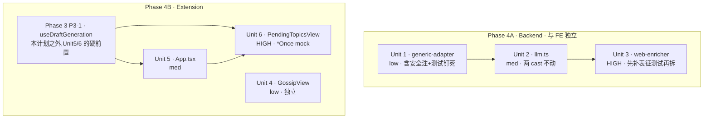

# refactor: Phase 4 大文件外科拆分(纯重构)

## Overview

把 6 个过载文件按职责拆成内聚小模块,**行为保持**。3 个 backend 服务/适配器(`llm.ts` 653、`generic-adapter.ts` 493、`web-enricher.ts` 388)+ 3 个 extension 组件(`PendingTopicsView.tsx` 712、`App.tsx` 478、`GossipView.tsx` 565)。原文件保留为 **re-export 门面**,外部 import 路径与公开 API 一字不变。这是 Deep 重构总纲 Phase 4 的逐文件展开(see origin: `docs/plans/2026-06-17-007-refactor-deep-master-plan.md`)。

> ⚠️ **收益假设(评审 adversarial 提出,需先确认——见 Open Questions「Resolve Before Proceeding」)**:门面 = 调用方零改动 = **对消费者可见收益为 0**;收益(单文件认知负荷↓、blast radius↓)只对「未来要改这些文件的人」兑现,是推测性的;成本即时确定(~9–11 新文件、6 个被拆空成 barrel、多个 PR、git blame 断链、与 feat 008 同碰 llm 文件的潜在冲突)。当前 v0.2.1 active 周期内,**是否全做 6 个、还是先只拆 feat 008 真会碰的 `llm.ts` 其余推迟**,是开工前必须由你拍的板。

## Problem Frame

这些文件职责堆叠(`llm.ts` 同时管退避重试、生成、评审、重写;`PendingTopicsView` 一个组件 13 个 state + 嵌套事实编辑),修改风险高、测试定位难。拆分降低单文件认知负荷与改动 blast radius。

**关于「测试即安全网」的诚实前提(评审修正)**:既有测试是**部分**安全网,不是全覆盖。最高风险的 `web-enricher` 的缓存命中/LRU 驱逐/lazy-init 路径**当前零测试覆盖**——而这正是模块单例搬家最易静默改坏处。故本计划对 Unit 3 要求**拆分前先补这些路径的 characterization 测试**(针对原文件当前行为)作为真基线,否则「拆后全绿」对缓存语义漂移无感(见 Unit 3)。

## Requirements Trace

逐条对应总纲 Phase 4:

- **R1 (P4-1)** `services/llm.ts` → `fetch-backoff.ts` + `draft-gen.ts`(含共享 `callLlmForJson`)+ `draft-review.ts` + `draft-rewrite.ts`;**review/rewrite 只拆不删(保留为 feat seam)**。
- **R2 (P4-2)** `scraper/adapters/generic-adapter.ts` → `html-extractors.ts` + `list-pagination.ts`,SSRF/流控栈留原文件。
- **R3 (P4-3)** `scraper/web-enricher.ts` → `enrichment-cache.ts` + `web-search.ts`。
- **R4 (P4-4)** `PendingTopicsView.tsx` → `TopicListItem` + `FactsEditorModal` + `GenerateConfirmDialog`,主组件仅编排。
- **R5a (P4-5a)** `GossipView.tsx` → 抽子区块(独立单元,无生成逻辑纠缠)。
- **R5b (P4-5b)** `App.tsx` → 抽子视图(**硬依赖 Phase 3 P3-1 先行**,见 Unit 5)。
- **R6(降级)** `llm.ts:400` 与 `channel-store.ts:175` 的 `as unknown as` 强转:**经核验均为承重胶水,纯重构期一律不动**(详见 Key Technical Decisions)。
- **R7(贯穿)** 行为等价:`bash scripts/check-all.sh` + `pnpm test:preflight` 全绿;测试数**按包**守恒(见下方「测试守恒判据」)。

## Scope Boundaries

- **不抽 `useDraftGeneration` hook**——那是总纲 **Phase 3 (P3-1)**。本计划只做组件**展示层拆分**。**但 Unit 5/6 硬依赖 P3-1 先行**(否则会产出「生成状态机留主组件 + 展示子组件」的半成品中间态,Phase 3 来时返工)。
- **不删任何代码**——review/rewrite 只拆不删;不做死代码切除(Phase 1)。
- **不改行为、不改公开 API、不改导出符号名、不动两处 cast**——只搬家 + 加门面 re-export。
- **不碰存储/类型大一统**——Phase 6。
- **不在本计划修 cast 背后的潜在隐患**——`llm.ts:400` 可能藏防幻觉事实注入问题(见 Key Decisions),但「查证 + 修」属另案,不混进纯重构。

## Context & Research

### Relevant Code and Patterns

**已有拆分先例(照抄手法,均经核验在磁盘上)**:
- `Settings.tsx` 已拆 `hooks/useSettingsForm.ts` + `settings/{BackendSettingsCard,LLMSettingsCard,TagsAndReviewCard}.tsx` + `validateSettingsForm` 纯函数(refactor-settings-hook-split,done)——**「主编排 + 受控展示子组件」的活样板**。
- ~~`batch-review/ItemCard`~~ —— **该目录已随 BatchReviewPanel 删除,不在磁盘**;如需其受控卡片形状,从 git history 取,不要让实施者去开一个不存在的文件。**统一锚到 `settings/*Card.tsx`**。
- backend `scraper/` 本就是多小模块(adapters/stores/guards 各一文件)。

**调用方约束(门面必须保留这些导出)**:
- `services/llm.ts`:`chatCompletionsUrl`(被 `fact-extractor.ts`、`gossip-fact-extractor.ts` import)、`generateDraft`(被 `drafts-generate-slots.test.ts` import)、`reviewDraftLlm`(被 `llm.test.ts` 经门面 import)→ **必须从 llm.ts re-export**。
- `web-enricher.ts`:`enrichContext`、`formatEnrichmentForPrompt`、`EnrichedContext`(被 pending-store/enrichment-utils/auto-generate/scraper-routes/pending-routes 共 5+ 处 import,且经 `scraper/index.ts` barrel 再导出)→ **必须从 web-enricher.ts re-export**。
- `generic-adapter.ts`(**核验闭合**):生产代码经 `SiteAdapter` 接口(`site-adapter.ts`)+ `scheduler.ts` 多态调用 `adapter.fetchContent(...)`/`adapter.fetchListPaged(...)`,**无直接 named-import 消费者**(仅测试直接 import 具名导出)。故门面主要为**保测试 import 与 `SiteAdapter` 方法签名稳定**。`fetchContent`/`fetchList`/`fetchListPaged` 方法签名不可变。
- 三组件:仅 `App.tsx` 内部 import `GossipView`/`PendingTopicsView`,无跨包消费。

**核验过的导入拓扑(feasibility 确认,无循环依赖)**:`fetch-backoff`(持 `LlmDeps` + `fetchWithBackoff`,不依赖其余)→ `draft-gen`(持/导出 `callLlmForJson`)→ `draft-review`/`draft-rewrite`(import `callLlmForJson`)。干净 DAG。

### Institutional Learnings(`docs/solutions/`)

- **`vitest-mock-queue-leak-and-stale-mocks-after-refactor`**:`mockResolvedValueOnce` 一次性 FIFO 队列不被 `clearAllMocks` 排空,跨测试泄漏。**适用面(核验)**:
  - **`PendingTopicsView.test.tsx` 确用 `mockResolvedValueOnce` 队列** → **Unit 6 拆测试用 `vi.resetAllMocks()`,内联 mock 用 `satisfies PendingTopic` 防缺字段;先审计该文件全部 `*Once` 用法逐个处理**。
  - backend 三测试(`llm`/`generic-adapter`/`web-enricher`)用闭包序列(`seqFetch`/`idx++`)**非 `*Once` 队列**,该教训不直接适用;backend 真风险是 `web-enricher` 模块单例(见 Unit 3)。
- **`extension-http-client-testability-injection-seam`**:`fetchWithTimeout` 路径下 `vi.stubGlobal("fetch")` 拦不到;拆分后新模块测试沿用原测试 mock 缝。

### 结构测绘要点(实读代码)

- `llm.ts`:`callLlmForJson` 被 review/rewrite 共用 → 留 `draft-gen.ts` 导出,review/rewrite import 它;`LlmDeps` 在 `fetch-backoff.ts` 导出。
- `generic-adapter.ts`:`extractTitle/extractBody/extractOgMeta` 纯 HTML 函数可净拆;`fetchContent` + `enforcePathPrefix`/`readBodyCapped`/`allowlistCheck`/`safeFetch`(SSRF/流控)**留原文件**;**权威跨源拦截 = `fetchListPaged` 的 `nextHost !== startHost` 复检(留原文件)**,`resolveSameHost` 的同源+协议白名单是纵深防御(见 Unit 1 安全注)。**无类型安全问题**。
- `web-enricher.ts` ⚠️ **最高风险**:`memoryCache`(Map)、`_enrichmentTableReady`(lazy flag)是**模块级可变状态**;现有测试**零覆盖缓存命中/LRU/lazy-init**;`web-enricher.test.ts` 无 `beforeEach` 清缓存。`fetchPixivByArtist`/`fetchPixivByWork` 经 `JINA_PREFIX` 外呼,**本就在 SSRF allowlist 之外**(见 Unit 3 安全注)。

## Key Technical Decisions

- **门面 re-export 保 API 不破**:每个原文件拆空后保留为 barrel,re-export 所有原公开符号。外部 import 路径、符号名、签名全不变 = 零回归面、可单文件回滚。
- **模块单例「原样搬家」,不改造成工厂**:`web-enricher` 的 `memoryCache`/`_enrichmentTableReady` 移到 `enrichment-cache.ts` 后**仍是模块单例**(拓扑不变),**不**改 `createCacheManager()` 工厂(那会改缓存拓扑=行为变更)。**单一所有者不变量**:`enrichment-cache.ts` 是 `memoryCache`/`_enrichmentTableReady` 的唯一所有者,所有消费者经同一 module specifier import,**禁止第二份实例**。
- **测试隔离是「有意的、小的、正当的」改动,不归入 R7 纯等价**:Unit 3 新增 `__clearForTest` + `beforeEach` 清缓存 + 拆分前补 characterization 测试,**都是刻意的测试层变更**,与「文件搬家行为等价」是两件事,诚实分列,不混进「R7 守恒」叙述。
- **review/rewrite 拆而不删,且不被 Phase 3 收**:`draft-review.ts`/`draft-rewrite.ts` 独立成文件、仍从 `llm.ts` 门面导出,作为 feat 计划 F1 的 seam。**Phase 3 的 `useDraftGeneration` hook 只收「生成」逻辑,不收 review/rewrite**——二者独立。
- **两处 cast 一律不动(R6 降级,核验后)**:
  - `llm.ts:400` `assembleDraft(slots, facts as unknown as FactsBlock)`:**`GossipFactsBlock` 与 `FactsBlock` 字段集完全不相交**(gossip={當事人,事件摘要,起因,經過,結果,來源連結,發生時間,熱度標籤};facts={作品名,集数,制作,漢化,無修,题材,简介,状态,章节数,标签})。所以**不存在**能「补全成 FactsBlock」的 typed helper(会产全 undefined)。该 cast 是把 gossip 对象喂给 legacy-typed `assembleDraft` 的**承重胶水**,纯重构期**绝不动**。
  - `channel-store.ts:175` `lookup as unknown as LookupAllFn`:`node:dns` `lookup` 重载推导难导致的合理写法,**绝不动**。
  - **遗留隐患另案**:adversarial 指出 `llm.ts:400` 可能藏防幻觉事实注入问题——若 `assembleDraft` 读了 `FactsBlock` 独有字段、而 gossip 路径下恒 undefined,可能事实槽位为空/错位。**这超出纯重构范围**:列为 Deferred 调查项,转独立 fix/investigate 计划,**本计划不碰**。
- **测试拆分策略(scope-guardian 修正,消除「守恒 vs 逐文件建测试」矛盾)**:
  - **纯展示子组件**(值+onChange 来自父、自身无逻辑):**搬移**既有断言到一处(父组件保留的集成测试,或一个 co-located 测试文件),**不**逐个新建测试文件。
  - **真有独立逻辑的子组件**(如 `AddSiteForm` 表单校验/warning 分支、`FactsEditorModal` 事实往返):**才**新建独立测试文件,此处测试数**会净增**——这是合理的,需在该单元显式标注「净增 N 用例(独立逻辑覆盖)」,不假装「只搬不增」。

## 测试守恒判据(R7,核验后精确化)

- **按包分别跟踪,不跨包抵消**:backend 全包测试数 + extension 全包测试数,各自「拆分前后不减」(纯展示搬移)或「显式净增」(独立逻辑子组件)。
- **精确基线(feasibility 实测,开工前用 `grep -cE '^\s*(it|test)\('` 各文件复核,去掉约数)**:`generic-adapter.test.ts=41`、`llm.test.ts=36`、`web-enricher.test.ts=8`(+ Unit 3 拆分前新增的 characterization 用例)、`App.test.tsx=3`、`GossipView.test.tsx=15`、`PendingTopicsView.test.tsx=13`。

## 与 Phase 3 (P3-1 `useDraftGeneration`) 的时序(评审强化为硬约束)

- **Unit 4(GossipView)独立**:其 `handleGenerate` 是「素材→topic」,**不**被 Phase 3 hook 收,无纠缠,可独立先行。
- **Unit 5/6 硬依赖 P3-1 先行**:`App.tsx` 的 `handleGenerate`(进度定时 + `genTokenRef` 防竞态 + logging)、`PendingTopicsView` 的两个生成 handler,都属 Phase 3 hook 范围。**若先做 Unit 5/6、把生成状态机留主组件,只抽展示层,Phase 3 来时要再次改写主组件 + 调整子组件 props 接口 = 明知返工的半成品**。故:**P3-1 未排期 → Unit 5/6 暂缓**(不做半截);P3-1 完成后再做,主组件已薄,拆分干净。

## High-Level Technical Design

> *以下为方向性结构示意,供评审校准拆分边界,非实现规格;实施者按当前代码实际微调,勿照抄。*

**Backend 拆分映射(原文件 = 门面):**

```
services/llm.ts (门面 re-export)
├─ fetch-backoff.ts   fetchWithBackoff, parseRetryAfter, retry 常量, defaultSleep, type LlmDeps
├─ draft-gen.ts       generateDraft, callLlmForJson(导出,供 review/rewrite import), buildRequest,
│                     chatCompletionsUrl, slotsFromParsed, DRAFT_SLOTS_SCHEMA, listModels, 内部 helpers
├─ draft-review.ts    reviewDraftLlm, buildReviewPrompt, extractUsage, DEFAULT_CRITERIA  ──┐ import
└─ draft-rewrite.ts   rewriteDraftLlm, buildRewritePrompt, DIM_LABELS                      ──┘ callLlmForJson from draft-gen

scraper/adapters/generic-adapter.ts (门面 + 安全栈留守)
├─ html-extractors.ts   extractTitle/extractBody/extractOgMeta/extractH1 + 内部 container/density 解析
├─ list-pagination.ts   detectNextPageUrl, currentPageNumber, resolveSameHost(⚠️纵深防御,见安全注)
└─ (留守) fetchContent, fetchList, fetchListPaged, enforcePathPrefix, readBodyCapped,
          allowlistCheck, safeFetch, fetchListPaged 的 nextHost!==startHost 权威跨源复检

scraper/web-enricher.ts (门面 + 编排留守)
├─ enrichment-cache.ts  loadFromDbCache/saveToDbCache/getCacheKey + 模块单例 memoryCache/_enrichmentTableReady(原样,单一所有者)+ __clearForTest(仅清 memoryCache)
├─ web-search.ts        fetchPixivByArtist/fetchPixivByWork/parseJinaContent/buildSearchTasks/executeSearchTask(⚠️JINA_PREFIX 出口,见安全注)
└─ (留守) enrichContext(编排), formatEnrichmentForPrompt, EnrichDeps
```

**Extension 组件拆分映射(主组件 = 编排,state 留主组件):**

```
PendingTopicsView.tsx (主:13 state + 编排)         GossipView.tsx (主:站点/渠道/发现编排)
├─ TopicListItem        受控展示(搬移断言)          ├─ ChannelWhitelistPanel  受控展示(搬移)
├─ FactsEditorModal     事实往返=独立逻辑(新测试)    ├─ AddSiteForm           校验/warning=独立逻辑(新测试)
└─ GenerateConfirmDialog 受控展示(搬移断言)          ├─ SiteCard              受控展示(搬移)
                                                    └─ DiscoveredItemCard    受控展示(搬移)
App.tsx (主:view 路由 + auth + 组装;handleGenerate 待 Phase 3 收走后再拆)
├─ MainHeader / GenerationPanel / DraftActionButtons / LogPanel  受控展示(搬移断言)
```

**单元依赖与建议顺序:**



## Implementation Units

- [ ] **Unit 1: 拆 `generic-adapter.ts`(低风险,先行;含安全钉死)**

**Goal:** 纯 HTML 提取与翻页抽出,SSRF/流控栈留守,原文件变门面。
**Requirements:** R2, R7
**Dependencies:** 无
**Files:**
- Create: `packages/backend/src/scraper/adapters/html-extractors.ts`、`list-pagination.ts`
- Modify: `generic-adapter.ts`(留 `fetchContent`/`fetchList`/`fetchListPaged` + 安全栈 + 从新模块 import)
- Test: `html-extractors.test.ts`、`list-pagination.test.ts`(新);`generic-adapter.test.ts`(基线 41,保留集成用例)
**Approach:**
- `extractTitle/extractBody/extractOgMeta/extractH1` + 内部 container/density 解析 → `html-extractors.ts`(纯函数,与 SSRF 栈零耦合)。
- `detectNextPageUrl/currentPageNumber/resolveSameHost` → `list-pagination.ts`。
- `enforcePathPrefix`/`readBodyCapped`/`allowlistCheck`/`safeFetch`/`fetchListPage` 及 `fetchListPaged` 的 `nextHost!==startHost` 权威跨源复检**留原文件**。
- **调用拓扑已闭合**:生产经 `SiteAdapter` 接口 + scheduler 多态调用,无直接 named-import;门面保测试 import 与方法签名稳定即可。
**安全注(security-lens):**
- `resolveSameHost`(协议白名单拒 `javascript:`/`file:`/`data:` + 严格同源)是**纵深防御**,**逐字搬、禁简化**;它与留守的 `nextHost!==startHost` 权威复检**有意冗余**,不可因「看似多余」删任一层。
- **守卫耦合验证**:拆分后 grep 确认 ——(1) 每个 `safeFetch(` 调用都传 `{ allowlistCheck }`;(2) 每个 fetch 入口先 `enforcePathPrefix`;(3) adapter egress 的 `fetch(`/`safeFetch(` 无新增未守护出口。把「无新增未守护出口」列为显式验收项。
**Test scenarios:**
- Happy path:HTML 提取用例下沉 `html-extractors.test.ts`(og:title→title→h1;容器→og→density)。
- Happy path:翻页 `detectNextPageUrl`(rel=next / ?page=)下沉 `list-pagination.test.ts`。
- Security(新增钉死):`resolveSameHost` 拒 `javascript:`/`data:`/`file:` 与跨源 href —— 把协议/同源层在搬家后钉住。
- Integration:`generic-adapter.test.ts` 保留 `fetchContent`/`fetchListPaged` 端到端(mock `safeFetch`),证门面+安全栈+新模块协同行为不变。
- 守恒:三文件用例数之和 == 原 41(协议钉死用例属新增安全覆盖,如有净增显式标注)。
**Verification:** backend 测试绿;守卫耦合 grep 三项通过;compile 绿;`SiteAdapter` 方法签名不变。

- [ ] **Unit 2: 拆 `llm.ts`(中风险;两 cast 不动)**

**Goal:** 退避基础设施/生成/评审/重写四分,`llm.ts` 变门面;review/rewrite 拆而不删。
**Requirements:** R1, R7
**Dependencies:** 建议 Unit 1 之后
**Files:**
- Create: `services/fetch-backoff.ts`、`draft-gen.ts`、`draft-review.ts`、`draft-rewrite.ts`
- Modify: `services/llm.ts`(门面 re-export:`generateDraft`/`listModels`/`reviewDraftLlm`/`rewriteDraftLlm`/`chatCompletionsUrl`/`LlmDeps`/`ReviewDraftResult`/`RewriteDraftResult`)
- Test: 四个新 `*.test.ts`;`llm.test.ts` 基线 36(拆解或留门面 smoke)
**Approach:**
- `fetchWithBackoff`+`parseRetryAfter`+retry 常量+`defaultSleep`+`type LlmDeps` → `fetch-backoff.ts`。
- `generateDraft`+`callLlmForJson`(导出)+`buildRequest`/`chatCompletionsUrl`/`slotsFromParsed`/`DRAFT_SLOTS_SCHEMA`/`listModels`+内部 helpers → `draft-gen.ts`。
- `reviewDraftLlm`/`buildReviewPrompt`/`extractUsage`/`DEFAULT_CRITERIA` → `draft-review.ts`,import `callLlmForJson`。
- `rewriteDraftLlm`/`buildRewritePrompt`/`DIM_LABELS` → `draft-rewrite.ts`,import `callLlmForJson`。
- **`llm.ts:400` 的 `facts as unknown as FactsBlock` 原样保留**(disjoint 类型承重胶水,无 helper 可替代,见 Key Decisions)。
**feat 008 顺序声明:** 本 Unit 与 feat 008-F1(review/rewrite 接 UI)同碰 review/rewrite 线。**建议重构(本 Unit)先行,008-F1 在新文件结构上接 UI**;若 008 先行,则本 Unit 须重新测绘 review/rewrite 边界。
**Test scenarios:**
- Happy path:`generateDraft` 成功生成 + 组装 ContentDraft。
- Error path:429/5xx → `fetchWithBackoff` 退避重试(沿用闭包 `seqFetch`)。
- Edge:`parseRetryAfter`(秒/HTTP-date/缺失)。
- Happy path:`reviewDraftLlm`/`rewriteDraftLlm` 经 `callLlmForJson` 成功/JSON 解析用例下沉。
- Integration:门面 smoke——从 `services/llm.js` import `generateDraft`/`chatCompletionsUrl`/`reviewDraftLlm` 仍可用。
- 守恒:新测试文件用例之和 == 原 36。
**Verification:** backend 测试绿;`fact-extractor`/`gossip-fact-extractor`/`drafts-generate-slots.test` import 无需改;compile 绿。

- [ ] **Unit 3: 拆 `web-enricher.ts`(高风险;先补表征测试再拆)**

**Goal:** 双层缓存与搜索抽出,`enrichContext` 编排留守;模块单例原样;**先建真安全网**。
**Requirements:** R3, R7
**Dependencies:** 建议 backend 批次最后做
**Files:**
- Create: `scraper/enrichment-cache.ts`、`web-search.ts`
- Modify: `web-enricher.ts`(门面:`enrichContext`/`formatEnrichmentForPrompt`/`EnrichDeps`/`EnrichedContext`/`SearchResult`)
- Test: `enrichment-cache.test.ts`、`web-search.test.ts`(新);`web-enricher.test.ts`(基线 8,补 `beforeEach` 清缓存)
**Execution note(characterization-first,前置 gate):** **拆分前**,先对**当前原文件**补写缺失的 characterization 测试并跑绿,作为真基线——否则现有 8 用例零覆盖缓存路径,「拆后全绿」证明不了等价:
- 缓存命中:同 facts 连调 `enrichContext` 两次 → 断言 `fetchFn` 仅调一次。
- LRU 驱逐:超 `MEMORY_CACHE_SIZE` 后最旧条目被逐。
- `_enrichmentTableReady` 幂等:多次 `initEnrichmentCacheTable()` 只建表一次。
**Approach:**
- `memoryCache`/`_enrichmentTableReady`/`evictLruFromMemoryCache`/`initEnrichmentCacheTable`/`loadFromDbCache`/`saveToDbCache`/`getCacheKey`+TTL/SIZE 常量 → `enrichment-cache.ts`,**仍为该文件模块单例(单一所有者,所有消费者同 specifier import,禁止第二份实例)**。
- `fetchPixivByArtist`/`fetchPixivByWork`/`parseJinaContent`/`buildSearchTasks`/`executeSearchTask`+`UA`/`JINA_PREFIX` → `web-search.ts`。
- `enrichContext`+`formatEnrichmentForPrompt` 留 `web-enricher.ts`,import 两模块。
- **`__clearForTest` 决策**:导出 `__clearForTest` **只清 `memoryCache`**,**不**清 `_enrichmentTableReady`——因为后者生产语义是「进程级一次性」,reset 它会让每用例重跑建表+DELETE 过期 SQL(=行为变更);不清它安全的理由:DB 走临时目录(`src/test-setup.ts`)且 `CREATE TABLE IF NOT EXISTS` 幂等。
**安全注(security-lens):** `web-search.ts` 的 Jina/Pixiv 外呼**本就在 channel SSRF allowlist 之外**(固定第三方 host)。拆出新文件时钉死不变量:**`JINA_PREFIX` 是硬编码出口;query 永远是 `encodeURIComponent` 后的路径段,绝不当 URL;此路径有意不走 allowlist 且必须保持 fixed-prefix**。加 characterization 测试:断言 `fetchFn` 被调用的 URL `startsWith(JINA_PREFIX)`。
**enrichment-cache.test.ts 生命周期(feasibility):** 该文件是首个直接驱动 `enrichment_cache` 表的测试 —— 须继承 `src/test-setup.ts`(临时 `PUBLISHER_DATA_DIR` / `GUAPI_DATA_DIR`);DB 命中/LRU 用例用**每用例唯一 cache key** 或清表,避免 SQLite 行跨用例泄漏。
**Test scenarios:**
- (前置)上述 3 个 characterization 用例先建在原文件并跑绿。
- Happy path:`enrichContext` 内存命中(`beforeEach` 清 memoryCache 后可控)。
- Happy path:DB 命中/写入 round-trip(`enrichment-cache.test.ts`)。
- Edge:LRU 驱逐。
- Security:`fetchPixivByArtist` 出口 URL `startsWith(JINA_PREFIX)`;`parseJinaContent` 解析(`web-search.test.ts`)。
- Integration:门面 smoke——`enrichment-utils`/`auto-generate`/`scraper-routes`/`pending-routes` 经 `web-enricher.js` import 行为不变。
- 隔离回归:连续两用例 `beforeEach` 后互不污染。
**Verification:** backend 全测试绿(尤其真消费方 `auto-generate.test.ts`/`enrichment-utils.test.ts`);compile 绿;单一所有者不变量成立(无第二份 memoryCache 实例)。

- [ ] **Unit 4: 拆 `GossipView.tsx`(低风险,独立,extension 批次先行)**

**Goal:** 渠道/站点/发现抽成子组件,主组件编排。
**Requirements:** R5a, R7
**Dependencies:** 无(与 Phase 3 无纠缠,可独立)
**Files:**
- Create: `sidepanel/gossip/{ChannelWhitelistPanel,AddSiteForm,SiteCard,DiscoveredItemCard}.tsx`(目录名以仓库惯例为准)
- Modify: `GossipView.tsx`(留 state + handler + 组装)
- Test: `AddSiteForm.test.tsx`(新,独立逻辑);受控子组件断言搬移;`GossipView.test.tsx`(基线 15,保留全局流程)
**Approach:**
- state 全留主组件;子组件受控(props:`value + onChange + busy/error`)。
- **生成逻辑(`handleGenerate`:素材→topic)留主组件不动**(Phase 3 不收它)。
- `DUPLICATE_URL` 特判:**实施时按代码实查其语义**(疑为 GossipView 中已发现 URL 的去重/标注状态),不在此预设定义;保留其既有行为。
**Test 策略:** `AddSiteForm`(表单校验 + 白名单 warning 分支)=独立逻辑 → **新建测试**(可净增,显式标注);`ChannelWhitelistPanel`/`SiteCard`/`DiscoveredItemCard` 纯展示 → 断言**搬移**至 `GossipView.test.tsx` 集成或 co-located,不逐个建文件。
**Test scenarios:**
- Happy path/Edge:`AddSiteForm` 表单校验 + warning 分支(新测试文件)。
- Happy path:渠道增删、单站发现、单文章生成(含 `DUPLICATE_URL` 特判)断言搬移保留。
- Integration:`GossipView.test.tsx` 保留「发现→生成→onTopicAdded」全链。
- 守恒:搬移用例 + `AddSiteForm` 净增,合计 ≥ 原 15(净增部分显式标注)。
**Verification:** extension 测试绿;`App.tsx` import 不变;compile 绿。

- [ ] **Unit 5: 拆 `App.tsx`(中风险;硬依赖 Phase 3 P3-1)**

**Goal:** 主视图头部/输入/动作/日志抽出,主组件留 view 路由 + auth + 组装。
**Requirements:** R5b, R7
**Dependencies:** **硬依赖 Phase 3 P3-1 先完成**(`handleGenerate` 被 hook 收走后主组件才薄);**P3-1 未排期则本单元暂缓,不做半截**。
**Files:**
- Create: `sidepanel/main/{MainHeader,GenerationPanel,DraftActionButtons,LogPanel}.tsx`
- Modify: `App.tsx`
- Test: 受控子组件断言搬移;`App.test.tsx`(基线 3,保留视图路由 + 高层集成)
**Approach:**
- `MainHeader`/`GenerationPanel`/`DraftActionButtons`/`LogPanel` 受控展示,props 收回调。
- **前提**:P3-1 已把 `handleGenerate`(进度定时 + `genTokenRef` 防竞态 + logging)收进 hook;本单元只抽展示,不再背生成状态机。
**Test 策略:** 子组件纯展示 → 断言搬移到 `App.test.tsx` 集成或 co-located,不逐个建文件(除非某子组件有独立逻辑)。
**Test scenarios:**
- Happy path:`GenerationPanel` 在 generating 态显进度+取消;非 draft 态显 textarea。
- Happy path:`DraftActionButtons` 按 mode/draft 条件渲三按钮。
- Integration:`App.test.tsx` 保留现有 3 用例(空主题、成功 empty→generating→draft、no-key error)。
- 守恒:搬移后 extension 包总数不减(纯展示无净增)。
**Verification:** extension 测试绿;compile 绿。

- [ ] **Unit 6: 拆 `PendingTopicsView.tsx`(高风险;硬依赖 P3-1;`*Once` mock)**

**Goal:** 选题卡/事实编辑/确认框抽成子组件,主组件留 13 state 编排。
**Requirements:** R4, R7
**Dependencies:** **硬依赖 Phase 3 P3-1**(两个生成 handler 被 hook 收走后再拆);建议 Unit 5 之后
**Files:**
- Create: `sidepanel/pending/{TopicListItem,FactsEditorModal,GenerateConfirmDialog}.tsx`
- Modify: `PendingTopicsView.tsx`
- Test: `FactsEditorModal.test.tsx`(新,独立逻辑);受控子组件断言搬移;`PendingTopicsView.test.tsx`(基线 13)
**Approach:**
- `selected`/`expanded`/`localFacts` 等 state **留主组件**,子组件**严格受控**。
- **localFacts 设计决策(解 coherence 指出的「受控 vs context」矛盾)**:localFacts 的所有变更**只流经主组件 state**,子组件**无自持 facts state**。若 prop drilling 过深,**可用 context 仅作 `localFacts` 切片 + onChange 的传输通道**——注意:context 此处只是「避免逐层传 props 的传输手段」,子组件仍不拥有 state(读 context value、调 context onChange),**仍是受控**,不等于子组件自管缓存。二选一明确:优先 props 直传;drilling 过深才上 context-as-transport。
- **生成 handler 留主组件**(Phase 3 收)。
**Execution note(`*Once` mock):** 先**审计 `PendingTopicsView.test.tsx` 全部 `mockResolvedValueOnce` 用法**(逐个列出),拆测试用 `vi.resetAllMocks()`,内联 topic mock 用 `satisfies PendingTopic`;以伪随机顺序跑一遍证无泄漏。
**Test 策略:** `FactsEditorModal`(事实往返编辑)=独立逻辑 → 新测试(可净增,标注);`TopicListItem`/`GenerateConfirmDialog` 纯展示 → 断言搬移。
**Test scenarios:**
- Happy path:R1 事实编辑往返(`FactsEditorModal.test.tsx`,新)。
- Happy path:R2 封面图、R5 确认框显示/确认/取消 断言搬移。
- Integration:`PendingTopicsView.test.tsx` 保留 R3 抓取、R4 CSV 导出、reject、refresh。
- 隔离:含 `*Once` 的用例在 `resetAllMocks` + 伪随机顺序下不泄漏(显式回归)。
- 守恒:搬移 + `FactsEditorModal` 净增,合计 ≥ 原 13(净增显式标注)。
**Verification:** extension 全测试绿;`App.tsx` import 不变;compile 绿。

*(原 Unit 7「channel-store dns cast」已删除 —— 经核验该 cast 合理且为承重写法,纯重构期不动,无独立工作。)*

## System-Wide Impact

- **Interaction graph:** 改动均为「文件内搬家 + 门面 re-export」。外部:`fact-extractor`/`gossip-fact-extractor`(`chatCompletionsUrl`)、`enrichment-utils`/`auto-generate`/`pending-store`/`scraper-routes`/`pending-routes`(web-enricher 导出)、scheduler(经 `SiteAdapter` 接口调 adapter)、`App.tsx`(两组件)——全部经门面/接口,零改动。
- **Error propagation:** 不变。退避重试、SSRF 拒绝、生成失败分支原样搬运。
- **State lifecycle risks:** `web-enricher` 的 `memoryCache`/`_enrichmentTableReady` 单例跨文件移动——原样保持单例 + 单一所有者不变量;真改善是补了表征测试 + 隔离。extension 组件 state 全留主组件,子组件受控。
- **API surface parity:** 门面保证公开导出、签名、import 路径不变;`pnpm -r compile` 是契约守门。
- **SSRF / 信任边界(security-lens 澄清):** 「Unchanged invariants: SSRF guard」**仅指 channel 爬取栈(generic-adapter)逐字保留**,**不等于「所有出口都受守」**。`web-enricher` 的 Jina/Pixiv 外呼是**既有的、独立的、本就不在 allowlist 内**的信任边界(固定第三方 host);Unit 3 把它显式钉死(fixed-prefix、query 仅 percent-encoded 路径)。新增显式验收项:**拆分不得引入新的未守护 egress,也不得孤立任何已守护调用**(Unit 1/3 grep 闸)。
- **Integration coverage:** 每个 backend 单元保留原文件端到端用例 + 真消费方测试;extension 保留主组件集成用例。
- **Unchanged invariants:** 「绝不发布/填充」硬约束、SSRF 守卫(generic-adapter 栈逐字)、防幻觉事实注入路径、所有公开 API、两处 cast ——本计划**显式不改**。

## Risks & Dependencies

| Risk | Mitigation |
|------|------------|
| web-enricher 缓存/LRU/lazy-init **零既有覆盖**,拆后「全绿」证不了等价 | **拆分前先补 characterization 测试**(cache-hit/LRU/table-once)作真基线(Unit 3 前置 gate) |
| `_enrichmentTableReady` reset 改变 SQL 执行次数 vs 隔离不彻底 | `__clearForTest` **只清 memoryCache 不清 table flag**;靠临时 DB 目录 + `IF NOT EXISTS` 幂等保隔离 |
| 模块单例跨文件出现第二份实例 → 缓存语义裂 | 单一所有者不变量:`enrichment-cache.ts` 唯一持有,消费者同 specifier import;compile + 隔离测试守门 |
| `PendingTopicsView` `*Once` mock 队列泄漏 | 审计全部 `*Once` + `resetAllMocks` + `satisfies` + 伪随机顺序跑 |
| Unit 5/6 半成品(生成状态机留主组件)+ Phase 3 返工 | **硬依赖 P3-1 先行**,否则暂缓 |
| `resolveSameHost` 纵深防御搬家被「简化」 | 逐字搬 + 协议/同源拒绝测试钉死;留守 `nextHost!==startHost` 权威复检 |
| web-search Jina 出口被改成可配置 URL → SSRF 原语 | 钉死 fixed-prefix 不变量 + `startsWith(JINA_PREFIX)` 测试 |
| 与 feat 008-F1 同碰 review/rewrite 文件 merge 冲突 | Phased Delivery 声明:重构先行,008 在新结构接线 |
| 门面为不存在的消费者保留(generic-adapter) | 已闭合:经接口调用,门面保测试 import + 方法签名;不额外造门面文件 |

## Phased Delivery

### Phase 4A · Backend(Units 1→2→3,风险升序,与 4B 独立)
generic-adapter(低,含安全钉死)→ llm(中)→ web-enricher(高,先补表征测试)。每单元独立 PR,`check-all` 绿才进下一个。

### Phase 4B · Extension
**Unit 4(GossipView)独立可先做**。**Unit 5/6 硬依赖 Phase 3 P3-1**:P3-1 未排期则二者暂缓。顺序:(P3-1) → Unit 5 → Unit 6。

### 与 feat 008 顺序
本计划 Unit 2 与 008-F1 同碰 review/rewrite:**重构先行,008 在新结构接 UI**。

## Open Questions

### Resolved Before Proceeding
- **[收益假设 / 范围][已决 2026-06-17]** 用户拍板:**全做 6 个文件拆分**(完整 Phase 4)。adversarial 的「收益推测、成本即时」已知悉并接受。约束:extension 的 **Unit 5/6 仍硬依赖 Phase 3 P3-1 先行**,P3-1 未排期则二者暂缓;backend Unit 1-3 + extension Unit 4 立即可做。执行起点 = Unit 1(generic-adapter)。

### Resolved During Planning
- 是否抽 `useDraftGeneration`?否(Phase 3 P3-1);但 Unit 5/6 硬依赖它先行。
- 模块单例改工厂?否(行为变更),原样 + 单一所有者不变量。
- 两处 cast 怎么办?**都不动**(disjoint 类型承重胶水 / dns 重载合理写法)。
- 测试逐子组件建文件?否——纯展示搬移,独立逻辑子组件才新建。

### Deferred to Implementation / 另案
- **[另案 fix/investigate]** `llm.ts:400` cast 是否藏防幻觉事实丢失(`assembleDraft` 是否读 `FactsBlock` 独有字段、gossip 路径恒 undefined)——超出纯重构,转独立调查,本计划不碰。
- `enrichment_cache` 测试清理接口具体形态(`__clearForTest` 签名)、子组件目录命名——按仓库惯例,实施时定。
- (可选后续,非本计划)web-enricher 缓存工厂化——如未来需实例隔离再开。

## Sources & References

- **Origin:** [docs/plans/2026-06-17-007-refactor-deep-master-plan.md](./2026-06-17-007-refactor-deep-master-plan.md)(Phase 4)
- 配套 feat:[docs/plans/2026-06-17-008-feat-parity-completion-plan.md](./2026-06-17-008-feat-parity-completion-plan.md)(F1)
- Learnings:`docs/solutions/test-failures/vitest-mock-queue-leak-and-stale-mocks-after-refactor-2026-06-17.md`、`docs/solutions/developer-experience/extension-http-client-testability-injection-seam-2026-06-15.md`
- 验证基线:`bash scripts/check-all.sh`、`pnpm test:preflight`
- 本计划经 5 persona 评审(coherence/feasibility/adversarial/security-lens/scope-guardian)综合修订,2026-06-17。
