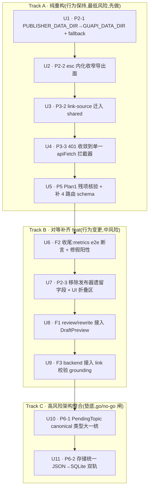

# 51guapi 剩余相位收尾 · 可执行实施计划(Phase 2 / 3余项 / 5 / feat 008 / Phase 6)

> **一句话**:把 Deep 重构总纲(007)还没做的 Phase 2、3余项、5、6,加上对等补齐(008)的 F1/F2/F3,**整合成一条按「依赖 + 风险」排序的执行流水线**。Phase 1、Phase 4、P3-1 已完成并入 main,不在此。

## 计划起源与对账

本计划基于 2026-06-18 一次三路并行**代码实况核验**(非 007 快照),把总纲若干已漂移的断言更正后落成执行单元。核验更正如下(执行前务必以此为准):

| 项 | 007 原述 | 2026-06-18 核验实况 | 处置 |
|---|---|---|---|
| **F2** | `recordDraft` 孤立、draft 维度恒 0 | ❌ **已接线**:`backend/src/app.ts:236/239/242`(成功/失败/异常三路均调) | F2 接线视为**已完成**;本计划只补 e2e 断言 + 修测试假阳性 → **U6** |
| **P2-3** | postStatus/publishedAt/mediaId 为死字段可纯删 | ❌ **是活 UI**:`DraftPreview.tsx:91-117` 表单读写 + backend schema + `llm.ts:277` 白名单合并 | 删=行为变更 → **改 feat track**(用户已决「整段移除」)→ **U7** |
| **P3-3** | 「有意双写,关闭不动」 | ⚠️ **实有冗余 + 不一致**:`gossip-client` 5 处自调 `clearToken`(响应已来自 `apiFetch` 清一次);`channel/pending-client` 反而**不清**(不一致) | 收敛到单一 `apiFetch` 拦截器(删可证冗余),不一致点列为核查 → **U4** |
| **P3-2** | link-source 迁入 shared | ✅ 纯函数零 DOM 依赖,**当前仅被测试引用**(无生产调用方) | 迁移极低风险,只动 import → **U3** |
| **P6-2** | 仅 prompt-store JSON→SQLite | ⚠️ **两条 JSON 轨**:`prompt-store` + `gossip-site-store`(都用 `JsonFileStore<T>`)| 迁移面翻倍,两表一起做 → **U11** |
| **P6-1** | 5 处类型 mismatch | ✅ 证实 + **新增风险**:现网 DB `rejected_reason` 列可能已存旧值(中文/自由串),收窄成 enum 需 backfill | 加迁移/backfill 步 → **U10** |
| **P2-1** | `PUBLISHER_DATA_DIR` 5 处 | ⚠️ ~11–12 处;且 **`.env.example` 里根本没声明** | 全量替换 + 补 `.env.example` 文档 → **U1** |
| **P2-2** | esc 内化 | ✅ 函数 live(内部 8 处)但**对外零 import** → 收窄导出面合法 | 纯重构 → **U2** |

> **总纲已闭合、本计划不重复**:P3-1(`useDraftGeneration`)已完成;P1-7(`onFill`)与 F4(off-mode)是 Phase 1 范畴、不在本计划;P4-6(`as unknown as`)核验作废。

## 信心评审修订(2026-06-18 三路 document-review 整合)

本计划经可行性 / 对抗性 / 范围守卫三路并行评审(均读真实源码)。以下 P0/P1 已就地修进对应单元,列此备查:

| # | 单元 | 评审发现(已修) | 严重度 |
|---|---|---|---|
| 1 | **U9** | `factUrls()`(`shared/facts.ts:168`)只读 ACG 字段 `漢化/無修/简介`,**不读吃瓜 `來源連結`**;`assembleDraft` 也只从 ACG 字段注链接 → 后端吃瓜 body 无程序注入链接。原 grounding 闸对吃瓜**必然 no-op**。U9 改为先扩 `factUrls`/gossip 形状 | **P0** |
| 2 | **U10** | `facts` 序列化假设**方向反了**:`toApiTopic` 纯透传(`pending-routes.ts:29`),`factsToFlatDict` 不存在 → 线上是结构化 `FactsBlock`,扩展 `Record<string,string>` 才是有损视图。真风险=收窄扩展为严格 interface 时 DB 有界外 key → 静默丢失。新增 **facts key 空间审计** | **P0** |
| 3 | **U11** | 现网 `prompts/`、`gossip-sites/` 目录**不存在/从未提交/零默认/纯用户产生** → 迁移 0 行。双读+回滚脚本+dry-run 是镀金。**瘦身**为迁移+幂等 backfill+往返测试+冒烟,JSON 留作廉价回滚;migration key 必须**零填充**(runner 用字典序 sort) | **P0**(过度工程) |
| 4 | **U7** | 三字段在 `schemas.ts` 出现**三处**(`GenerateDraftResponse:68`/`ReviewDraftBody:86`/`RewriteDraftBody:106`);`llm.ts:277` 是**扩展端 `mergeRewriteResult`**(原标错 backend);`dryrun-green.ts:31-33` 是 `test:preflight` fixture。四字段同 `<details>` 块 → 重建单字段块、非删整块 | **P1** |
| 5 | **U4** | `channel/pending-client` **都过 `apiFetch`** → 401 已统一清,**无 bug 可修**;`api-fetch.ts:8-11` 注释保护的是另一种双写(本地/后端 fallback),非 clearToken。U4 缩为"删 5 行冗余(保留 throw)+ 引注驳回 + 关 Outstanding" | **P1** |
| 6 | **U6** | "假阳性"被夸大:`metrics.test.ts:56-61` 已测真实 `recordDraft` 路径;唯一缺口是 HTTP→`/metrics` e2e。U6 缩小 | **P2** |
| 7 | **U10** | DB `rejected_reason` 列**无 CHECK**;backfill 必须**先于**收窄 schema 部署(否则读路径把非枚举串喂给 `RejectionReason` 类型=类型谎言)| **P1** |
| 8 | **U3** | `link-source.test.ts:1-2` 的 `@vitest-environment jsdom` 指令+注释是**陈旧的**(实现纯正则无 DOM)→ 迁 shared 时**丢弃**该指令(shared vitest 是 node 环境)| **P2** |
| 9 | **U8** | rewrite 改 `draft.body`(原始 HTML)。当前 textarea-only 安全;U8「展示改写草稿」是日后加渲染预览处 → 须守住 CLAUDE.md 的正文 HTML 约束(渲染必带消毒)| **P2** |

**评审确认无误(保留)**:U1 fallback 链(12 处/9 文件、`.env.example` 缺口真);U2;U5(channel/preflight 零 schema 真);U10 的 `PendingTopicView`(stored 核 + route 注入 `folded`/`enrichmentText`)分层**有据,非过度抽象**;migration `012/013` 是正确下一槽;Track C 垫底 + go/no-go 闸合理;`ExportedDraft` 确不含三字段 → U7 导出契约安全。

## 执行原则(沿用 007 铁律)

- **纯重构 = 行为等价**:删除项 grep 证明无调用方;移动/拆分保持公开签名;测试断言只增不改语义。每相位前后**测试数与断言不减**。
- **feat = 显式行为变更**:走独立 PR,带新增 UI/路径测试;仍受**「绝不发布/写回任何站点」**硬约束(F1 只改本地草稿)。
- **高风险垫底 + go/no-go 闸**:Phase 6(U10/U11)放最后,各自独立 PR、带数据迁移回滚预案;任一不绿即停,不污染前序收益。
- **遵守 `docs/solutions` 教训**:`*Once` mock 队列泄漏用 `vi.resetAllMocks()` + `satisfies`;脱敏闸路径锚定;`vitest exclude dist/**`;`--filter` 用包名(`51guapi-backend`/`51guapi-extension` 非 scope)。

## 验证基线(每单元收尾必跑)

```bash
pnpm --filter @51guapi/shared build      # 先 emit dist,否则 backend/extension 缺类型
pnpm -r compile                           # 拓扑序全包 tsc
pnpm lint:ci                              # biome ci 只读
pnpm -r test                              # 全包 vitest
bash scripts/check-all.sh                 # 一键等价(含双端 build + 产物校验)
pnpm test:preflight                       # node 环境 preflight
```

**通过判据**:compile 全绿、测试数不异常下降、双端 build 产物校验通过。当前绿基线:backend ~513 / extension ~415。

## 执行顺序总览



排序逻辑:**先纯重构后 feat、先小后大、跨包依赖前置(U3 link-source 进 shared 是 U9 的前置)、高风险垫底**。
- 注:U7 先于 U8(都改 `DraftPreview.tsx`,先删折叠区再加 review/rewrite 入口,避免 diff 冲突)。
- 注:用户列举顺序为「6 + feat 008」,但因 F2 已基本完成、F1/F3 价值高且风险低于存储迁移,**本计划将 feats 排在 Phase 6 之前**(把高风险存储迁移真正放到最末、最可推迟)。如需严格按 6→feat,调换 Track B/C 即可,无依赖冲突。

---

## Track A · 纯重构

### U1 · P2-1 `PUBLISHER_DATA_DIR` → `GUAPI_DATA_DIR`(+ 旧名 fallback)
- **track**:纯重构 · **risk**:low(ops-facing,务必兼容旧部署)
- **改法**:引入 `GUAPI_DATA_DIR`,读取顺序 `process.env.GUAPI_DATA_DIR ?? process.env.PUBLISHER_DATA_DIR ?? <默认>`。**保留旧名 fallback**,不破坏现有部署。
- **文件(4 源读点 + 测试 + 文档)**:
  - 源:`backend/src/scraper/pending-db.ts:14`、`gossip-site-store.ts:18`、`prompt-store.ts:33`、`services/audit-log.ts:11`
  - 测试:`config/test-setup.ts:9`(隔离 hook,改设新名)+ `gossip-site-store.test.ts`、`enrichment-cache.test.ts`、`routes/gossip-routes.test.ts:37`、`services/quality-metrics.test.ts:8`(读处)
  - 文档:**新增** `.env.example` 条目(当前缺)+ 更新 `CLAUDE.md:60`、AGENTS.md(若提及)
- **测试场景**:① 仅设 `GUAPI_DATA_DIR` → 生效;② 仅设旧 `PUBLISHER_DATA_DIR` → fallback 生效(兼容性 pin);③ 两者都设 → 新名优先;④ 全量既有测试仍绿(test-setup 改名后隔离不破)。
- **boundary**:env 名是 ops 契约;fallback 保证零破坏。grep 确认无遗漏读点。

### U2 · P2-2 `esc` 内化(收窄 shared 公共导出面)
- **track**:纯重构 · **risk**:low
- **现状**:`esc()` 定义于 `shared/src/post-assembler.ts:76`,由 `index.ts:31` 对外导出,但**全仓零外部 import**(8 处调用全在 post-assembler 内部,含 XSS 转义关键路径)。
- **改法**:从 `shared/src/index.ts` 删 `esc` 导出,函数留在 post-assembler.ts 作模块私有(**不动函数体**)。
- **测试场景**:① `post-assembler.test.ts` 既有转义/XSS 用例(特殊字符转义、未闭合标签中和、href 引号不突破)全绿 → 证明行为零变;② grep 全仓确认无 `import { esc }` / `from "@51guapi/shared"` 取 esc。
- **boundary**:仅收窄导出面,运行时行为不变。

### U3 · P3-2 `link-source` 迁入 shared(单一真相)
- **track**:纯重构 · **risk**:low(核验:纯函数,当前仅测试引用)
- **现状**:`extension/lib/link-source.ts` 导出 `extractLinks`/`normalizeUrl`/`verifyLinks`/`hasUnsourcedLink` + `interface LinkCheck`,**纯字符串正则、零 DOM/chrome 依赖**;消费方仅 `link-source.test.ts` 与 `post-assembler.test.ts:13`。
- **改法**:文件移入 `shared/src/link-source.ts`,从 `shared/src/index.ts` 导出全部符号(含 `LinkCheck` 类型);extension 改 `import { ... } from "@51guapi/shared"`;测试同步迁入 shared(或改 import 路径)。**行为不变**。
- **⚠️ 评审修正**:`link-source.test.ts:1-2` 的 `// @vitest-environment jsdom` 指令 + 注释「extractLinks 依赖 DOMParser」是**陈旧错误**——`extractLinks`(`link-source.ts:14`)是纯正则零 DOM 依赖。迁 shared 时**丢弃该指令**(shared vitest 是 node 环境,带 jsdom 指令若 shared 无该 devDep 会环境解析失败)。
- **测试场景**:① 四个函数单测从 shared 全绿(**不带** jsdom 指令);② `post-assembler.test.ts` 的 `verifyLinks(body, factUrls(facts))` 不变量用例仍绿;③ shared build 后 extension compile 绿。
- **依赖**:无 · **使能**:U9(F3 backend 复用)。

### U4 · P3-3 删 gossip-client 5 处冗余 `clearToken`(收敛到单一拦截器)
- **track**:纯重构(删可证冗余)· **risk**:low · **范围已缩**(评审:无 bug 可修)
- **现状(评审已厘清)**:`api-fetch.ts:46-47` 中心拦截器在 401 调 `clearToken()`。`gossip-client.ts` 5 处(`fetchGossipSites`/`createGossipSite`/`deleteGossipSite`/`discoverGossipSite`/`fetchGossipTopicFromUrl`)响应来自 `apiFetch` **却又各自再调一次** `clearToken()` → 冗余。`channel-client.ts`(3 处)与 `pending-client.ts`(5 处)**都经 `apiFetch`** → 拦截器已替它们清一次,**现状一致、无 bug**(评审已核实,撤销原"潜在 bug"猜测)。`llm.ts`(4 处)走直接 `fetch` 绕拦截器,其 `clearToken` 是唯一一次(正确,保留)。
- **改法**:
  1. **删** `gossip-client.ts` 5 处冗余 `clearToken()`(`apiFetch` 已清 → 删后行为等价)。**关键**:只删 `clearToken()` 调用,**保留 `if (res.status === 401) throw ...` 控制流**(那是 load-bearing 的 throw 分支,不可连块删)。
  2. **引注驳回**:`api-fetch.ts:8-11` 的「刻意保留 fail-closed 双写」注释保护的是**另一种双写**(本地 PRIMARY / 后端 SECONDARY fallback),**与 clearToken 重复无关** → 故删 clearToken 冗余不违背该设计。在 commit message 引用并澄清,避免后人再误判(回应 007 的"不动代码")。
- **测试场景**:① gossip-client 各函数遇 401 仍清 token 一次(经 apiFetch,断言 storage `removeItem` 被调一次)且仍 throw;② 既有 401 相关测试全绿。
- **注意**:`*Once` mock 涉及时用 `resetAllMocks`。

### U5 · P5 Plan 1 残项核验 + 补路由 schema
- **track**:纯重构/加固 · **risk**:low
- **P5-1**:`channel-routes`(GET/POST/DELETE 三路由)+ `preflight-routes`(GET)**共 4 路由缺 `schema:`** → 补响应 schema(否则 Fastify 静默剥字段)。**执行前先 grep 复核当前是否仍缺**(可能已被并行流补过)。
- **P5-2**:抽查 Pending/Gossip/Export 三视图 loading 态是否齐;缺则补(纯 UI 等价补全)。
- **P5-3**(可选,low 优先):补 `maxParamLength`(现仅 `bodyLimit: 1MB`)。
- **测试场景**:① 补 schema 的 4 路由返回字段不被剥(断言关键字段在响应里);② 既有路由测试全绿。
- **已确认 DONE 不做**:`.nvmrc`/logger/优雅关闭/request-id/Settings CSS Modules/scraper 路由归位/bodyLimit。

---

## Track B · 对等补齐 feat

### U6 · F2 收尾:补 HTTP→`/metrics` e2e 断言
- **track**:feat(收尾)· **risk**:low(接线已完成)· **范围已缩**(评审:单元级已测)
- **现状(评审修正)**:`recordDraft(true/false)` 已接入 `app.ts:236/239/242`;`recordScraperRun` 已接 8 处;`recordBatchCompleted` 不存在。**且 `metrics.test.ts:56-61` 已测真实 `recordDraft(true/false)` 路径**(`:39-50` 的直写是合法的 `getMetrics()` 格式化测试,**非假阳性**)。**唯一真缺口**:`POST /drafts/generate` → `GET /metrics` 的**端到端**路径未被断言。
- **改法**:只加 e2e 断言(不重写既有单元测试):`POST /api/v1/drafts/generate` 成功 → `/metrics` `draftsGenerated` +1;失败(422)/异常(500)→ `draftsFailed` +1。
- **测试场景**:① 成功生成后 `/metrics` draftsGenerated 递增;② 422 后 draftsFailed 递增;③ 500 后 draftsFailed 递增。
- **boundary**:补一道 e2e 覆盖,无对外契约变更。

### U7 · P2-3 移除发布器遗留字段 postStatus/publishedAt/mediaId(用户已决:整段移除)
- **track**:feat(行为变更:删 UI 表单字段)· **risk**:med(**评审:消费点比原估多 3 处**)
- **⚠️ 完整消费点清单(评审补全,缺一即 break)**:
  1. **类型**:`shared/src/types.ts` 的 `ContentDraft` 删 `postStatus`/`publishedAt`/`mediaId`。
  2. **三个 schema(不止一个!)**:`backend/src/utils/schemas.ts` 的 `GenerateDraftResponse:68`、`ReviewDraftBody:86`、`RewriteDraftBody:106` **都声明了这三字段**,**三处都要删**(否则 U8 把 draft 发往 /review、/rewrite 时类型/schema 不匹配)。
  3. **扩展端 `mergeRewriteResult`**:`extension/lib/llm.ts:255-279` 有 `merged.mediaId = original.mediaId`(`:277`)+ doc 注释「id/coverImageUrl/mediaId 始终保留 original」。删 `mediaId` 字段会令此行编译错 → 同步删该合并逻辑。(原计划误标为 backend `llm.ts:277`,实为扩展端。)
  4. **preflight fixture**:`scripts/preflight/checks/dryrun-green.ts:31-33` 构造含三字段的 `ContentDraft` 字面量,**跑在 `pnpm test:preflight`(本计划 verify 闸)**——必须同步更新,否则 verify 直接红。
  5. **draft 初始化**:`extension/.../draft.ts` 删对应默认值赋值。
- **UI(重建块、非删整块)**:四字段(三删 + `coverImageUrl`)同处 `DraftPreview.tsx:83-133` 的同一个 `<details>`「非 AI 字段(人工设定)」块。**`coverImageUrl` 必须留**——它在 `ExportedDraft`(`shared/export.ts:21,46`)里、是导出产物的一部分(这比"语义中性"更硬的留存理由);三字段不在 `ExportedDraft`。故 U7 是**把块重建为仅含 coverImageUrl**,不是删掉整个 `<details>`。
- **测试场景**:① DraftPreview 不再渲染 postStatus/publishedAt/mediaId input,但**仍渲染 coverImageUrl input + `` 预览**;② `ContentDraft` 编译层不再含三字段、仍含 coverImageUrl;③ 导出产物形状不变(`ExportedDraft`/`assembleDraftJSON` 本就不含三字段,加断言锁定;coverImageUrl 仍在);④ 草稿生成+编辑+导出 round-trip 全绿;⑤ 三个 schema 删字段后既有 schema 测试更新绿;⑥ `pnpm test:preflight` 绿(dryrun fixture 已更新);⑦ 审计 backend `generateDraft` 返回对象是否仍填三字段(`GenerateDraftResponse` 同时有 `draft` 与 `slots` 双形,TypeBox 会静默剥 schema 外字段——确认返回对象不再依赖被删字段)。
- **boundary**:删三处 schema 字段属 API 契约变更——已核验 extension client 不读、`ExportedDraft` 不含,安全。

### U8 · F1 接入 review/rewrite 到 DraftPreview UI
- **track**:feat · **risk**:med · **依赖**:U7(先清 DraftPreview 折叠区)
- **现状**:`extension/lib/llm.ts:164-207` `reviewDraft()` + `:210-253` `rewriteDraft()` 已存在、零 UI 调用方;后端 `POST /api/v1/drafts/review`、`/rewrite` 在(P4-1 已拆 `draft-review.ts`/`draft-rewrite.ts` 保留为 seam)。
- **改法**:`DraftPreview.tsx` 加「AI 润色/改写」入口:① 调 `reviewDraft` → 展示 `ReviewResult`(评分/维度反馈);② 对未达标维度调 `rewriteDraft` → 展示改写后草稿 → 用户「采纳」经 `onChange` 应用 / 「放弃」保留原稿;③ loading + error 态。可复用 `useDraftGeneration` 的四态归一思路(但 review/rewrite 是独立 client,非 generate)。
- **测试场景**:① 点「润色」→ 调 reviewDraft → 渲染 ReviewResult;② 点「改写」→ 调 rewriteDraft → 渲染新草稿;③「采纳」→ onChange 收到新 draft;④「放弃」→ 原 draft 不变;⑤ client 返回 `{ok:false}` → 显示 error,不污染草稿;⑥ loading 态;⑦ 401 → 沿用 clearToken 路径。
- **boundary(硬约束)**:review/rewrite **只改本地草稿**,绝不写回任何站点。
- **⚠️ 正文 HTML 护栏(评审)**:rewrite 会改写 `draft.body`(原始 HTML,LLM 产出)。当前 body 仅在 `<textarea>` 以纯文本源码展示 → 无 live XSS。U8 的「展示改写后草稿」是日后有人加**渲染预览**的自然落点——**保持 textarea-only**;若未来加 `dangerouslySetInnerHTML` 等渲染,必须同步引入白名单消毒(DOMPurify),否则即存储型 XSS(见 CLAUDE.md 正文 HTML 约束)。本单元不引入渲染预览。

### U9 · F3 backend 接入 link 校验(防幻觉 grounding parity)
- **track**:feat · **risk**:med · **依赖**:U3(link-source 进 shared)
- **现状**:backend `services/draft-gen.ts`(**注意:在 `services/` 非 `scraper/`**)草稿生成路径**不做** link grounding;不变量「body 的 `<a href>` 必来自 facts URL」仅在 extension 测试里验证、未在生产强制。
- **⚠️ P0 评审修正——现成 `factUrls` 对吃瓜无效**:`factUrls(facts)`(`shared/facts.ts:168`)只读 `URL_FIELDS = ["漢化","無修","简介"]`(`facts.ts:102`,**全是 ACG 漫画字段**);吃瓜的来源链接在 `GossipFactsBlock.來源連結`(`gossip-facts.ts:7`),**factUrls 根本不读**。吃瓜草稿走 `GossipFactsBlock`(`draft-gen.ts:194-203`)→ `factUrls` 返回 `[]` → allowlist 永远空 → `verifyLinks` 要么全放行(body 无链接)要么把任何链接误判 unsourced。**直接套用 = 必然 no-op**。(且 `assembleDraft` 也只从 `漢化/無修` 注链接 → 后端组装的吃瓜 body 本无程序注入链接;闸只对"模型在 prose 里漏写的链接"有意义,正需正确 allowlist 才不误杀合法来源链。)
- **改法(两步)**:
  1. **先补 shared 的 gossip URL 收集**:扩 `factUrls`(或加 `gossipFactUrls`)使其对 `GossipFactsBlock` 收集 `來源連結`(及任何吃瓜 URL 字段),让 allowlist 对吃瓜非空。**先写测试钉死**:真实 `GossipFactsBlock` → `factUrls` 含 `來源連結`。
  2. **再接闸**:backend `import { verifyLinks, hasUnsourcedLink } from "@51guapi/shared"`,在 `draft-gen` 组装 body 后:`verifyLinks(body, factUrls(facts))` 若 `hasUnsourcedLink` → 拒绝/标注未验证链接。
- **依赖说明(U9↔U10)**:U9 用 backend 现有 `FactsBlock|GossipFactsBlock` 类型;U10 只是把该 union 升格为 shared canonical(不改后端形状),故 U9 在 U10 后至多改 import 路径,**无实质 rebind**。
- **测试场景**:① 吃瓜 `factUrls` 含 `來源連結`(P0 修复的回归钉);② body 含未溯源链接 → 被闸标注/拒绝;③ body 仅含 facts 内(含 `來源連結`)链接 → 通过;④ 无链接草稿 → 通过;⑤ ACG 与 gossip 两种 facts 形状各跑一遍。
- **boundary**:多一道生产 grounding 闸 → 行为变更(feat)。

---

## Track C · 高风险架构整合(垫底 · go/no-go 闸)

> **闸门**:进入 Track C 前,Track A/B 全部并入 main 且 CI 绿。U10、U11 **各自独立 PR、带回滚预案**。任一 `check-all` 不绿或 round-trip 不一致 → **停**,不影响已收割的 A/B 收益。

### U10 · P6-1 `PendingTopic` 领域类型大一统
- **track**:重构(高风险:latent mismatch)· **risk**:high
- **现状**:两份独立定义——`backend/src/scraper/pending-store.ts:22-38` 与 `extension/lib/pending-client.ts:5-29`;shared 仅有 `RejectionReason`(`types.ts:72`)。字段漂移矩阵:

  | 字段 | backend | extension | canonical 决策(**已据源码定**) |
  |---|---|---|---|
  | `facts` | `FactsBlock\|GossipFactsBlock` | `Record<string,string>` | **线上是结构化**(已核实:`toApiTopic` 纯 `{...t, enrichmentText}` 透传 `pending-routes.ts:29`,无 `factsToFlatDict`)→ **canonical 用结构化 union;扩展 `Record<string,string>` 是有损视图,要修的是扩展端**(原假设方向反了)。⚠️ **真风险**:把扩展收窄成严格 `FactsBlock` interface 时,若 DB 某行 facts 有界外 key(acg 字段 / 旧自由 key)→ 静默丢失 → 故须先做 **facts key 空间审计**(见改法②) |
  | `rejectedReason` | `string` | `RejectionReason`(**已对齐**)| 扩展端已是 enum(`pending-client.ts:1,20`)→ **只剩 backend 收窄**。`rejected_reason` 列**无 CHECK**(`001-initial.sql`),DB 层不设防 |
  | `domain` | `"acg"\|"gossip"` | `"gossip"?` | 取后端宽集 `"acg"\|"gossip"` |
  | `rawContent` | 内部 `RawContent` | 内联 `{title,body,url,metadata}` | 低影响(扩展不消费),canonical 取一致结构 |
  | `folded`/`enrichmentText` | 无(route 注入)| 有 | ✅ **评审确认有据**:`folded` 由 `pending-routes.ts:94-96` 按 `score<fold_threshold` 现算、`enrichmentText` 由 `:26-29` 现派生,均**不入库**。canonical 分层:`PendingTopic`(stored 核)+ `PendingTopicView = PendingTopic & { folded?; enrichmentText? }`(`toApiTopic` 已是此形) |

- **改法**:① **先写往返表征测试**钉死当前真实 API 形状(结构化 facts / rejectedReason / domain / folded / enrichmentText);② **facts key 空间审计**:扫现网 DB 各行 `facts` 的 key 集,确认是 canonical interface 的子集(否则补 key 或保留宽松索引签名,**禁在审计前把扩展收窄成严格 interface**);③ 在 `shared/src/types.ts` 定义 canonical `PendingTopic` + `PendingTopicView`,从 `index.ts` 导出,前后端改用;④ backend `rejectedReason` 收窄为 `RejectionReason`,`schemas.ts` 的 `UpdatePendingBodySchema`(`:159` 现为 `Type.Optional(Type.String())`)在 HTTP 边界校验 enum;⑤ **DB 决策(执行前定)**:是否给 `rejected_reason` 加 CHECK——SQLite 加 CHECK 需先 backfill 违规行再 table-rebuild;若不加,canonical 只在 TS+HTTP 两层设防。
- **⚠️ 部署顺序(评审 P1)**:`rejected_reason` 的 **backfill 必须先于** `UpdatePendingBodySchema` 收窄上线——否则旧行经读路径(`rowToTopic` → `rejectedReason: row.rejected_reason ?? undefined` `pending-store.ts:94`)把非枚举串喂给 `RejectionReason` 类型 = 编译绿的类型谎言。
- **测试场景**:① 收敛**前**的往返表征 gate(真实 pending → API → 锁结构化 facts/rejectedReason/domain);② facts key 审计脚本(列出现网全部 key);③ canonical 类型前后端 compile 全绿;④ backfill 迁移幂等 + dry-run;⑤ `UpdatePendingBodySchema` 拒非枚举 `rejectedReason`(400);⑥ 手动 smoke:一条真实 pending 的 facts/enrichment 往返一致。
- **教训**:mock 用 `resetAllMocks` + `satisfies` 防缺字段(`vitest-mock-queue-leak`)。

### U11 · P6-2 存储统一 JSON → SQLite(已据数据量瘦身)
- **track**:重构(数据迁移)· **risk**:med(**评审下调**:现网迁移 0 行)
- **⚠️ 数据量已核实(评审,决定性)**:`packages/backend/data/prompts/`、`data/gossip-sites/` 目录**不存在、从未提交 git、零代码默认、100% 用户经 POST 产生** → 当前仓库迁移 **0 行**,真实部署至多个位数。**故砍掉双读 fallback + 独立回滚脚本 + dry-run 这套镀金**;保留"JSON 文件留存至确认"作廉价回滚足矣。
- **现状**:两条 JSON 轨——`prompt-store.ts`(`<DATA_DIR>/prompts/*.json`,`PromptTemplate`)+ `gossip-site-store.ts`(`.../gossip-sites/*.json`,`GossipSiteConfig`),均经 `utils/json-store.ts` 的 `JsonFileStore<T>`。SQLite 侧:`pending-db.ts` 单例 `getDb()` + **`packages/backend/src/migrations/runner.ts`** 的内联 `MIGRATIONS` Record(磁盘 .sql 是残留,现 key 到 `011`)。
- **改法(瘦身版)**:
  1. **建表**:往 `runner.ts` 的 `MIGRATIONS` Record 追加 `"012-prompt-templates.sql"`、`"013-gossip-sites.sql"`(`CREATE TABLE IF NOT EXISTS`)。**⚠️ 硬约束**:runner 用 `Object.keys(MIGRATIONS).sort()` **字典序**(非插入序)执行,故 key **必须零填充三位**(`012`/`013`),不可用 `12`/`13`(会排到 `002` 前、乱序建表)。
  2. **一次性 backfill**:读现有 JSON 文件 → 插入新表,`INSERT OR IGNORE`(键 PK `id`)。幂等。注:`JsonFileStore` 文件名会 sanitize(`json-store.ts:17` 非 `[a-zA-Z0-9_-]`→`_`),而 PK 取 JSON body 的 `id` 字段——零行场景无碰撞面,仍以 body.id 为准。
  3. **切换 + 写路径**:`prompt-store`/`gossip-site-store` 读写改走 SQLite(用**同一 `getDb()` 单例连接**,不另开连接,避免 WAL 下双连接复杂度),与 backfill 同 PR cutover;**不保留 JSON 写路径**(零数据量无双读必要)。
  4. **回滚**:保留旧 JSON 文件 + PR 独立可回退。
- **测试场景**:① 两个新表 migration 幂等(跑两次结果一致);② backfill:构造若干 JSON fixture → 迁移后 SQLite 读出等价;③ `getAllPrompts/savePrompt/deletePrompt` 与 `listGossipSites/saveGossipSite/deleteGossipSite` 经 SQLite 与旧 JSON 行为等价(CRUD round-trip);④ `prompt-store` 的 `fewShotExamples` 旧字段 lazy-migration 在新路径仍兼容;⑤ 手动 smoke prompt CRUD + gossip-site CRUD。
- **风险**:数据迁移正确性。遵守 `docs/solutions` 数据迁移/注入缝教训。**若执行前发现现网真有较大用户数据量**(非本仓 0 行),再补双读过渡——届时按需升级,不预先镀金。

---

## 风险与回滚

- **每单元独立 PR**:出问题只回滚该 PR。Track A(U1–U5)风险最低,可快速合并先收割「消除发布器残渣」红利。
- **U7 API 契约**:删 `GenerateDraftResponse` 三字段前,已核验 extension client 不读;若有外部脚本读导出 JSON 的这三字段——核验已确认 `ExportedDraft` 本就不含,导出产物零影响。
- **Track C 隔离**:U10/U11 各自独立 PR、带数据迁移回滚脚本;U10 的往返表征测试 + U11 的 dry-run/双读是主要护栏。
- **统一判据**:任一单元 `check-all` 不绿或测试数异常下降 → **不合并**。

## Outstanding(执行期解决,非阻塞)

- ~~**[U4][核查]**~~ **已闭合**(评审核实):`channel/pending-client` 都经 `apiFetch` → 拦截器已统一清,无 bug。U4 只删 gossip-client 5 处冗余。
- ~~**[U9/U10][排序耦合]**~~ **已闭合**:U10 只把 backend union 升格为 shared canonical、不改后端 facts 形状 → U9 先行无实质 rebind(至多改 import)。U9 自身的 `factUrls` gossip 修复(P0)与 U10 无关、独立必做。
- **[U10][迁移策略]**(真决策,保留)现网 DB `rejected_reason` 非法值处置(映射 `other` vs 保留+标注)+ 是否加 DB CHECK——执行前抽样现网数据定;backfill 须先于 schema 收窄上线。
- **[U10][facts 审计]**(真决策,保留)收窄扩展 facts 类型前,先扫现网 facts key 空间确认是 canonical 子集(防界外 key 静默丢失)。
- ~~**[U11][数据量]**~~ **已闭合**(评审核实):现网 prompts/gossip-sites 为 0 行 → 机制已瘦身;若日后真有量级再按需补双读。

## Next Steps

→ 按 U1 顺序 `/ce:work` 逐单元执行(Track A 风险足够低,可连续推进);进入 Track C 前确认 A/B 已绿合并。
