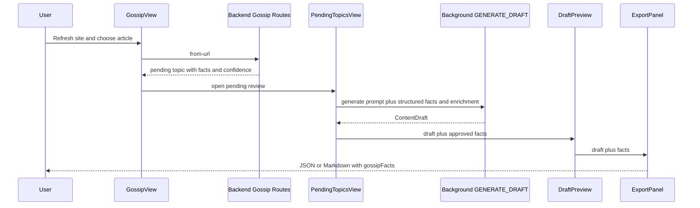

# fix: Restore Main Workflow Pipeline

## Summary

This plan restores the user-visible 51guapi workflow from discovered gossip source to exported draft. The current code already has most pipeline pieces, but structured gossip facts are flattened into prompt text during draft generation and then dropped before export, so the final JSON/Markdown artifact can lose the source facts that made the draft trustworthy.

---

## Problem Frame

The product identity is now URL crawl -> AI fact extraction -> human preview/edit -> JSON/Markdown export. The old publisher/fill path must stay out of scope.

The inspected code shows several v0.2 P0 items already landed: pending review uses `GOSSIP_FACT_KEYS`, approval generates a local draft instead of running a publisher path, DraftPreview includes review/rewrite, and backend draft generation has gossip grounding. The remaining workflow risk is handoff continuity: facts and quality context enter the pending topic but do not consistently travel through sidepanel generation, preview, and export.

---

## Requirements

**Pipeline Contract**

- R1. Approving a pending gossip topic must send its structured facts and enrichment context to the draft generation request, not only embed them in prompt prose.
- R2. A draft created from a pending topic must keep the approved facts available to DraftPreview and ExportPanel until the user clears or replaces the draft.
- R3. Manual topic generation must remain supported and must not inherit stale pending-topic facts.

**User Workflow**

- R4. The pending-topic detail view must expose the quality signals needed before approval: confidence, empty fact fields, cover, raw excerpt, and extraction mode when available.
- R5. Duplicate, LLM failure, no-key, timeout, and unauthorized states must remain friendly and non-crashing across discover, from-url, approve, and export handoffs.
- R6. JSON and Markdown export from a pending-topic draft must include `gossipFacts` and source information when facts exist, and must export `null` facts for manual drafts.

**Verification**

- R7. The main workflow must be covered by focused tests across extension messaging, background handler forwarding, pending approval, App handoff, export serialization, and backend generation facts handling.
- R8. The verification gate must prove no publisher/fill/runBatch path is reintroduced into the main gossip approval flow.

---

## High-Level Technical Design

Key handoff rule: prompt text remains a human-readable constraint, but structured facts are the machine contract. Export reads the machine contract, not a reconstruction from draft body prose.

---

## Key Technical Decisions

- **Keep structured facts beside the prompt:** Extend the existing generate path with optional `facts` and `enrichment` instead of relying on `buildGossipPrompt` text. This lets backend grounding and quality checks evaluate the same facts the user approved.
- **Store draft context in App state:** Add a small draft context state beside `draft` rather than embedding facts into `ContentDraft`. `ContentDraft` remains the generated article shape; source facts remain workflow context for export.
- **Use raw-content metadata for extraction mode:** The extractor already returns `extractionMode`; the least disruptive path is to preserve it in `rawContent.metadata` for display, avoiding a migration for a UI signal.
- **Test the handoffs, not the whole world:** Use focused component and handler tests to prove data crosses each boundary. Browser-level polish and broad storage refactors stay deferred.
- **Preserve the no-publish invariant:** Approval means generate local draft and show preview/export. No unit may revive admin tab resolution, fill, publish, or site writeback behavior.

---

## Scope Boundaries

### In Scope

- Pending gossip approval to local draft generation.
- Structured facts and enrichment forwarding through extension messaging.
- DraftPreview/export access to the approved gossip facts.
- Extraction-mode preservation for pending-topic display.
- Focused tests that lock the main workflow.

### Deferred to Follow-Up Work

- Large storage unification, env var rename, and package cleanup from `docs/plans/2026-06-18-001-refactor-remaining-phases-execution-plan.md`.
- UI redesign of the sidepanel navigation or visual hierarchy beyond the quality signals needed for approval.
- Socket-level DNS rebinding pinning and broader SSRF architecture changes.
- Full browser automation against live external gossip sites.

### Outside This Product's Identity

- Publishing, filling, or writing back to any website.
- Reintroducing content scripts or admin-tab orchestration for the gossip approval path.

---

## Implementation Units

### U1. Forward Structured Facts Through Draft Generation

**Goal:** Ensure approval-generated drafts are created with the exact facts the user reviewed.

**Requirements:** R1, R3, R5, R7, R8

**Dependencies:** None.

**Files:**

- Modify: `packages/extension/lib/messages.ts`
- Modify: `packages/extension/lib/messaging.ts`
- Modify: `packages/extension/entrypoints/background.ts`
- Modify: `packages/extension/entrypoints/sidepanel/hooks/useDraftGeneration.ts`
- Modify: `packages/extension/entrypoints/sidepanel/PendingTopicsView.tsx`
- Test: `packages/extension/lib/background-handlers.test.ts`
- Test: `packages/extension/entrypoints/sidepanel/hooks/useDraftGeneration.test.ts`
- Test: `packages/extension/entrypoints/sidepanel/PendingTopicsView.test.tsx`
- Test: `packages/extension/lib/messaging.ts` callers covered by existing tests

**Approach:** Add optional generation options containing `facts` and `enrichment` to the sidepanel-to-background generate message. Background `handleGenerate` should pass those options into `generateDraftFn` while keeping manual topic generation unchanged. `PendingTopicsView` should pass the edited facts and `enrichmentText` when approving selected or quick-draft topics.

**Execution note:** Start with characterization coverage around the current prompt-only path, then add the optional facts path so manual generation keeps the old behavior.

**Patterns to follow:** `RUN_BATCH` already forwards `facts` and `enrichments` through background generation; use that as the established shape without reviving batch execution for the approval path.

**Test scenarios:**

- Happy path: approving a pending topic with edited `當事人` calls `requestGenerate` with prompt plus structured facts containing the edited value.
- Happy path: quick draft chooses the top topic and forwards its facts and enrichment context to generation.
- Edge case: manual App generation still sends only a prompt and produces a draft with no stale facts.
- Error path: `requestGenerate` returning `kind: "no-key"` still renders the API-key guidance and does not mark the topic approved.
- Error path: background catches a generation exception and returns the existing friendly network error.
- Regression guard: no `RUN_BATCH`, admin tab, fill, or publish call is introduced in `PendingTopicsView`.

**Verification:** The extension tests prove facts reach `generateDraftFn`; manual generation tests prove facts remain optional.

### U2. Preserve Approved Facts Into Preview and Export

**Goal:** Keep approved topic facts available after draft generation so JSON/Markdown export contains `gossipFacts`.

**Requirements:** R2, R3, R6, R7

**Dependencies:** U1.

**Files:**

- Modify: `packages/extension/entrypoints/sidepanel/App.tsx`
- Modify: `packages/extension/entrypoints/sidepanel/PendingTopicsView.tsx`
- Modify: `packages/extension/entrypoints/sidepanel/DraftPreview.tsx`
- Modify: `packages/extension/entrypoints/sidepanel/ExportPanel.tsx`
- Test: `packages/extension/entrypoints/sidepanel/App.test.tsx`
- Test: `packages/extension/entrypoints/sidepanel/PendingTopicsView.test.tsx`
- Test: `packages/extension/entrypoints/sidepanel/DraftPreview.test.tsx`
- Test: `packages/extension/entrypoints/sidepanel/ExportPanel.test.tsx`
- Test: `packages/extension/lib/export.test.ts`

**Approach:** Change the pending approval callback from draft-only to a draft payload that includes approved facts. Store those facts in App state beside the draft and pass them to `DraftPreview`. Clear the facts when a manual draft is generated, when the user starts a new draft, or when there is no pending-topic source.

**Patterns to follow:** `DraftPreview` and `ExportPanel` already accept optional `facts`; this unit wires the existing prop instead of changing export serialization.

**Test scenarios:**

- Happy path: approving a pending topic calls `onDraftReady` with the draft and approved facts.
- Happy path: App receives that payload and renders `DraftPreview` with facts available to `ExportPanel`.
- Happy path: JSON export contains `gossipFacts` with the approved `來源連結`; Markdown export includes the facts section and source line.
- Edge case: manual generation after a pending-topic draft clears the previous facts, so export writes `gossipFacts: null`.
- Edge case: editing the draft title/body does not mutate the stored source facts.
- Error path: failed approval generation leaves prior draft context unchanged.

**Verification:** Component tests prove export receives facts after pending approval and receives no facts after manual generation.

### U3. Preserve and Display Extraction Quality Context

**Goal:** Make approval decisions safer by showing extraction mode alongside existing confidence and empty-field signals.

**Requirements:** R4, R5, R7

**Dependencies:** None.

**Files:**

- Modify: `packages/backend/src/routes/gossip-routes.ts`
- Modify: `packages/backend/src/scraper/pending-store.ts`
- Modify: `packages/shared/src/types.ts`
- Modify: `packages/extension/entrypoints/sidepanel/pending/FactsEditorModal.tsx`
- Test: `packages/backend/src/routes/gossip-routes.test.ts`
- Test: `packages/backend/src/scraper/pending-store.test.ts`
- Test: `packages/extension/entrypoints/sidepanel/pending/FactsEditorModal.test.tsx`

**Approach:** Preserve `extracted.extractionMode` in the pending topic's `rawContent.metadata` or expose it as a derived optional wire field if that pattern is already cleaner after the canonical `PendingTopic` work. The UI should display strict/fallback mode next to confidence and keep highlighting empty fact fields.

**Execution note:** Prefer no-schema-migration metadata preservation unless implementation discovers an existing canonical API field for extraction mode.

**Patterns to follow:** `pending-routes.ts` already derives `enrichmentText` for API consumers; use a similarly narrow derived-field approach if metadata lookup in the component would make the UI shape awkward.

**Test scenarios:**

- Happy path: strict extraction creates a pending topic whose API payload exposes strict mode.
- Happy path: fallback extraction creates a pending topic whose API payload exposes fallback mode.
- Edge case: older pending topics with no extraction mode still render confidence and facts without crashing.
- Edge case: empty fact fields still show the existing "待补充" marker.
- Error path: fact extraction failure still returns the current friendly error and does not create a partial topic.

**Verification:** Route and component tests show the user can distinguish strict vs fallback extraction before approval.

### U4. Lock the Main Workflow With Focused End-to-End Coverage

**Goal:** Add a regression net for the complete in-repo workflow without relying on live websites or real LLM calls.

**Requirements:** R5, R6, R7, R8

**Dependencies:** U1, U2, U3.

**Files:**

- Modify: `packages/backend/src/routes/gossip-routes.test.ts`
- Modify: `packages/backend/src/app.test.ts`
- Modify: `packages/backend/src/services/draft-gen.test.ts`
- Modify: `packages/extension/entrypoints/sidepanel/GossipView.test.tsx`
- Modify: `packages/extension/entrypoints/sidepanel/PendingTopicsView.test.tsx`
- Modify: `packages/extension/entrypoints/sidepanel/App.test.tsx`
- Modify: `packages/extension/lib/export.test.ts`
- Optionally modify: `scripts/preflight/` checks if an existing preflight fixture naturally covers this path

**Approach:** Add a mocked local workflow test matrix: discover returns one item, from-url stores a pending gossip topic, approval sends structured facts to generation, App previews the draft, and export includes facts. Use mocks at existing seams and avoid real network or real LLM calls.

**Patterns to follow:** Keep using injection seams from `docs/solutions/developer-experience/extension-http-client-testability-injection-seam-2026-06-15.md` and `resetAllMocks` discipline from existing component tests.

**Test scenarios:**

- Integration scenario: GossipView from-url success removes the discovered item and opens pending review.
- Integration scenario: pending approval with edited facts generates a draft, marks the topic approved only after generation succeeds, and forwards facts to App.
- Integration scenario: App export after pending approval includes facts; export after manual generation does not.
- Error path: duplicate URL removes the item and routes to pending without creating a scary error.
- Error path: LLM no-key keeps topic pending and offers the settings path.
- Regression guard: static or unit assertion confirms main approval tests do not call `runBatch`.

**Verification:** Backend and extension focused suites pass with no publisher/fill references in the gossip approval path.

---

## System-Wide Impact

- **Extension messaging:** `GENERATE_DRAFT` gains optional context. Existing manual callers remain compatible because the new fields are optional.
- **Backend generation:** Existing grounding and quality checks become meaningful for pending-topic drafts because they receive the same facts the user reviewed.
- **Export contract:** `ExportedDraft.gossipFacts` becomes reliable for pending-topic drafts and remains `null` for manual drafts.
- **Data compatibility:** Older pending topics without extraction mode remain valid.
- **Security posture:** No new site write path is introduced; all outputs stay local export artifacts.

---

## Risks & Dependencies

| Risk | Mitigation |
|---|---|
| Prompt text and structured facts drift | Generate from the same edited facts object used for display and patching; tests assert the edited value is forwarded. |
| Stale facts leak from a pending draft into a manual draft | App clears draft context on manual generation and new-draft reset; tests cover both transitions. |
| Extraction mode persistence becomes a migration distraction | Prefer `rawContent.metadata` or a derived route field; defer schema migration unless implementation proves it is necessary. |
| Tests over-mock the workflow | Place assertions at each boundary: message payload, background forwarding, App state, and export output. |
| Existing dirty shared-contract work changes the exact type surface | Keep implementation compatible with the canonical `PendingTopic` direction already visible in `packages/shared/src/types.ts`; re-check before editing. |

---

## Assumptions

- The current workspace baseline includes shared `PendingTopic` and `gossipFactUrls` work that may not yet be committed.
- `DraftPreview` and `ExportPanel` already support optional facts and should be wired rather than redesigned.
- `reviewDraft` and `rewriteDraft` are already connected to DraftPreview, so this plan does not re-plan AI polish UI.
- The implementation should use small commits or PRs in unit order, because the project memory favors CI-green increments for user-visible workflow changes.

---

## Sources & Research

- Origin requirements: `docs/brainstorms/2026-06-17-v0.2-release-readiness-full-requirements.md`
- Main workflow UI: `packages/extension/entrypoints/sidepanel/GossipView.tsx`, `packages/extension/entrypoints/sidepanel/PendingTopicsView.tsx`, `packages/extension/entrypoints/sidepanel/App.tsx`
- Draft/export surface: `packages/extension/entrypoints/sidepanel/DraftPreview.tsx`, `packages/extension/entrypoints/sidepanel/ExportPanel.tsx`, `packages/shared/src/export.ts`
- Generation messaging: `packages/extension/lib/messaging.ts`, `packages/extension/lib/messages.ts`, `packages/extension/entrypoints/background.ts`
- Backend extraction and generation: `packages/backend/src/routes/gossip-routes.ts`, `packages/backend/src/services/draft-gen.ts`, `packages/backend/src/scraper/gossip-fact-extractor.ts`
- Local learnings: `docs/solutions/best-practices/incremental-pr-adversarial-verification-2026-06-15.md`, `docs/solutions/developer-experience/extension-http-client-testability-injection-seam-2026-06-15.md`
