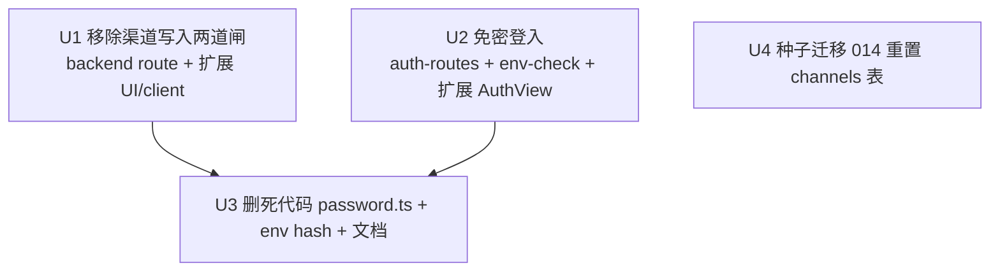

# 自用模式:移除渠道鉴权闸 + 免密登入 + 默认白名单只留 51cg1.com

## Overview

把「吃瓜小帮手」从「带管理员口令的单操作者工具」改为**纯自用、零口令**模式,并把可爬取渠道(SSRF allowlist)的默认值收敛成单条 `51cg1.com`,后续由用户自行增删。三件事:

1. **移除渠道写入的两道闸**——管理员口令 step-up(`adminPassword`)+ 确认手势(`x-operator-confirm` + `confirm`),让加渠道直接进行。
2. **免密登入**——`/login` 不再验密码、直接发 JWT;**保留** 全局 JWT 校验与严格 CORS。注意边界口径:**对浏览器跨源**(恶意网页)边界基本不变(靠 CORS preflight + Bearer 头,详见安全权衡);**对本机进程/CLI** 则从「需口令」降为「零凭证」——任何能连 `localhost:3002` 者一条 `curl /login` 即取 24h token。`verifyAdminPassword` 因此彻底无人调用,连同 `JWT_ADMIN_PASSWORD_HASH` 一并下线。
3. **种子重置白名单**——新增一条迁移:清空 `channels` 表并插入 `51cg1.com`,一次性清掉运行时积累的 `h96.com` 等垃圾数据,得到干净的单条默认。

> ⚠️ **这是一次有意的安全降级**(详见下方「安全权衡」)。本计划撤掉的口令 step-up 正是 `docs/plans/2026-06-17-002-feat-ssrf-hardening-plan.md` 的 R3 防线。**任何后续代码审查/重构看到「渠道写入无口令」时,请勿当 bug 加回——它是本计划按操作者明确决定移除的。**

## 安全权衡(有意为之,务必显式记录)

操作者的判断:**「这是我自用的本地服务」**,以零摩擦换取易用性。两道渠道闸防的是**不同**威胁,本次全部移除:

| 被移除的防线 | 原本防什么 | 移除后的残留风险 |
|---|---|---|
| **管理员口令 step-up**(渠道写入) | 被窃 JWT / XSS 偷 token 后单独写 allowlist(越权) | 持有有效 JWT 即可写 allowlist。这是该单操作者工具**唯一**的防越权闸(出处:`docs/v0.2-backlog.md:8`、`2026-06-17-002` R3) |
| **确认手势**(`x-operator-confirm`+`confirm`) | LLM/爬取管线即便能发 HTTP 也不带这两个常量 → 防 prompt 注入自开渠道(CLAUDE.md 硬约束) | 任何持 JWT 的调用方加渠道无需特殊手势。**注**:爬取管线/LLM 走 `generic-adapter`,**从不调用** `channel-routes`,故实际仍不会自开渠道——降级的是「纵深防御」而非已知活跃路径 |
| **管理员登入密码** | 未知者拿到后端地址也无法登入取 token | 任何能到达 `/login`(受 CORS + localhost 限制内)者可取 token |

**仍然保留的边界**(本计划不动):全局 JWT preHandler、严格 `CORS_ORIGIN`(fail-closed)、强 `JWT_SECRET`(fail-closed)、读取时的完整 SSRF 守卫(`safeFetch`/`resolveAndPin`/私网 IP 拒绝/逐跳 allowlist)、fail-closed allowlist「空即全拒」语义、`/login` 的 `AUTH_RATE_LIMIT`(10/min,免密后是唯一的暴力/滥用闸)。

**两类威胁的边界变化要分开说**(经代码核对,别笼统说「基本不变」):

- **恶意网页跨源 POST `localhost:3002`**:**仍被挡,不是 security theater**。`POST /channels` 是 `application/json` + 需 `Authorization: Bearer` 头 → 强制 preflight `OPTIONS`;严格 `CORS_ORIGIN`(只含扩展 origin)使 preflight 不通过,真正的 POST 根本发不出;且恶意网页拿不到 token。CORS preflight + Bearer 头双重挡死。
- **本机其他进程 / CLI 直连 `localhost:3002`**:**这层边界塌掉了**。`/login` 在 `PUBLIC_ROUTES` 内、零凭证;CORS 对不带 `Origin` 的进程/CLI **完全无效**(它只决定浏览器是否把响应交给页面,从不拒绝请求落地)。免密前这层的真正闸是「密码」,免密后整道消失:`curl -XPOST localhost:3002/api/v1/auth/login` → 拿 token → 打所有路由(含写 allowlist)。

**净判断**:对「恶意网页」是真防护;对「本机进程」是从「需口令」降到「零凭证」。鉴于这是单操作者本地工具、攻击者要先有本机代码执行权才能利用(到那一步整机已失守、该闸意义本就有限),**残留风险可接受**——但文档不粉饰:被削弱的是「本机进程写 allowlist 的门槛」,以及「持 token 者越权写 allowlist」这一层。

## Requirements Trace

- R1. POST `/api/v1/channels` 不再要求 `adminPassword` 与 `x-operator-confirm`/`confirm`;带合法域名即可入库(仍走归一 + DNS 公网解析校验)。→ U1
- R2. `/api/v1/auth/login` 不验密码即发 token;`JWT_SECRET` 仍为签发前提,`CORS_ORIGIN` 仍严格。→ U2
- R3. 扩展端不再向用户索取登入密码或渠道口令;登入自动获取 token,加渠道无口令字段。→ U1、U2
- R4. `verifyAdminPassword`/`password.ts` 与 `JWT_ADMIN_PASSWORD_HASH` 在确认无任何调用方后移除,且不破坏 `JWT_SECRET`/`CORS_ORIGIN` 的 fail-closed 启动校验。→ U3
- R5. 迁移后 `channels` 表**恰好**含一条 `51cg1.com`,且既有 `h96.com` 等行被清除;`ssrf-allowlist.ts` 不引入任何硬编码默认,「空即全拒」语义不变。→ U4

## Scope Boundaries

- **不引入角色/多用户系统**——保持单操作者模型,只是去掉口令。
- **不动读取时的 SSRF 守卫栈**(`ssrf-guard.ts`/`resolveAndPin`/私网拒绝/逐跳 allowlist/IDN 脚本白名单)——这些与登入/渠道写入鉴权正交,逐字保留(见 `.ai-memory/project_51guapi.md` SSRF 不变量)。
- **不动 DELETE `/api/v1/channels/:id`**——它本就只靠 JWT、无口令/手势,行为不变。
- **不拆掉 JWT 鉴权层 / 不改 CORS**——本次是「免密登入,保留 JWT+CORS」,非「彻底无鉴权」(操作者已明确选前者)。
- **不改 `isHostAllowed` 的「`length===0` → 全拒」**——种子走 DB 正常行,不在 allowlist 加硬编码默认绕过 fail-closed。
- **不为种子做 DNS 写入校验绕过的辩护**:`51cg1.com` 是 ASCII、已是 punycode 形态,SQL 直插的 hostname 与 `insertChannel` 存的等价;运行时抓取仍过完整 SSRF 守卫。

## Context & Research

### Relevant Code and Patterns

**渠道写入两道闸(U1)**
- `packages/backend/src/routes/channel-routes.ts`:确认手势在 `:80-92`,口令 step-up 在 `:94-103`(`verifyAdminPassword(request.body?.adminPassword)`);`CONFIRM_HEADER` 常量 `:30`;`CreateBody` 的 `confirm`/`adminPassword` 字段 `:36-37`;顶部注释块 `:18-28` 逐条描述这两道闸,需同步改。
- `packages/extension/lib/channel-client.ts:46-76`:`createChannel` 发 `x-operator-confirm:"1"` 头 + body `confirm:true` + `adminPassword`;`CreateChannelOptions.adminPassword`。
- `packages/extension/entrypoints/sidepanel/GossipView.tsx:80-101`(`handleAddChannel`,含必填口令校验 `:85-88`)+ `gossip/ChannelWhitelistPanel.tsx:45-78`(口令输入框 + 「确认新增」按钮)。

**免密登入(U2)**
- `packages/backend/src/routes/auth-routes.ts:35-57`:`/login` 现验 `adminHash && secret`,再 `verifyAdminPassword(password)`,通过则 `jwt.sign({sub:"operator"}, secret, …)`。保留 `auditLogin` + `AUTH_RATE_LIMIT`。
- `packages/backend/src/config/env-check.ts:28-34`:`JWT_ADMIN_PASSWORD_HASH` 的 fail-closed 块(`HASH_RE`);`JWT_SECRET`(`:20-26`)与 `CORS_ORIGIN`(`:36-43`)块**保留不动**。
- 扩展:`lib/auth-client.ts:12-42`(`login(password)`)、`entrypoints/sidepanel/AuthView.tsx`(密码表单)、`App.tsx:67`(`isAuthenticated()`)+ `:182`(`!authed` 时渲染 `<AuthView>`)。

**死代码 + env 收尾(U3)**
- `packages/backend/src/services/password.ts`:`verifyAdminPassword`/`verifyPassword`。调用方仅 `channel-routes.ts:10/96`(U1 删)与 `auth-routes.ts:4/44`(U2 删)→ U3 时应为零调用。
- `packages/backend/scripts/hash-password.mjs`(口令哈希生成脚本)、`.env.example:28-31`(`JWT_ADMIN_PASSWORD_HASH`)、`.env.example:36`(`ALLOWED_HOSTS` 示例 `dx-999-adm.ympxbys.xyz`)。
- 文档:`CLAUDE.md`(「`JWT_SECRET`/`JWT_ADMIN_PASSWORD_HASH` 弱值/占位值时拒绝启动」)、`AGENTS.md` 同类描述。

**种子迁移(U4)**
- `packages/backend/src/migrations/runner.ts:10-122`:`MIGRATIONS` 纯 SQL 字典,`:146` 按 `Object.keys().sort()` 字典序跑一次,`_migrations` 记录(`:140-153`)。`009-channels.sql:75-87` 建表。**先例**:`004-source-url-unique.sql:50-54` 在迁移里跑 `DELETE`;key 须零填充三位。
- `insertChannel`(`channel-store.ts:228-270`)的列与默认值(`max_depth=1`、`max_bytes=5242880`、`path_prefix='/'`)是种子 SQL 取值参照。
- `ssrf-allowlist.ts:48-71`:allowlist = `env ALLOWED_HOSTS` ∪ `listChannels()`,运行时读;`:73-76` 空即全拒。**种子只进 `channels` 表,不碰此文件。**

### Institutional Learnings

- `docs/plans/2026-06-17-002-feat-ssrf-hardening-plan.md`(completed):口令 step-up = R3,确认手势 = UX 防误触(`:68`);step-up 必须在 DNS 解析/写库前早退(`:198`)。本计划反向移除,需在 commit/计划显式标注「有意撤 R3」。
- `docs/v0.2-backlog.md:8`:「confirm 手势只防误触,不防越权——任何持 JWT 的调用方加两个常量即可写 allowlist」。
- `.ai-memory/project_51guapi.md`:SSRF 不变量逐字保留;fail-closed allowlist 空即全拒、绝不退硬编码默认;`channel-store.ts:175` 的 `as unknown as` 是承重胶水勿动。
- 迭代节奏(CLAUDE.md):`改代码 → pnpm test → pnpm compile → 全绿才提交`;`@51guapi/shared` 须先 build dist。

### External References

- 无需外部研究:改动全在本仓既有鉴权/迁移/SSRF 模式内,无新框架或第三方库。

## Key Technical Decisions

- **保留 JWT + CORS,只去口令**(非拆鉴权层):操作者明确选「免密登入、保留 JWT+CORS」。`/login` 改为「有 `JWT_SECRET` 即发 token」,全局 preHandler 与 CORS 不动 → **浏览器跨源边界**基本不变(对本机进程则从「需口令」降为「零凭证」,见安全权衡),改动面最小。
- **种子用一次性 SQL 迁移 `014-seed-channels.sql`(DELETE + INSERT)**:契合既有迁移系统(`004` 已有 DELETE 先例),`_migrations` 保证只跑一次——既清掉现有 `h96.com` 垃圾,又落地干净默认;之后用户新增的渠道不会被反复重置。**不**用「启动时空表才 seed」的代码路径,因其无法清除既有垃圾且每次启动都要判空。
- **种子直插 SQL 而非过 `insertChannel`**:迁移在启动早期跑、是纯 SQL 字符串(不能跑 JS/`Date.now()`);`51cg1.com` 为 ASCII 已归一,直插 hostname 与 `insertChannel` 等价;`created_at` 用 SQLite `datetime('now')`,`id` 用固定字面量 `'seed-51cg1'`。读取时 SSRF 守卫仍全程生效,故不损安全。
- **`verifyAdminPassword`/`password.ts`/`hash-password.mjs`/`JWT_ADMIN_PASSWORD_HASH` 整组下线**:U1+U2 移除全部调用后它们成死代码;留着只会误导(像还有口令防线)。`env-check` 仅删 `JWT_ADMIN_PASSWORD_HASH` 块,**保留** `JWT_SECRET`/`CORS_ORIGIN` fail-closed。
- **登入 `password` 字段降级为可选/忽略**:扩展 `login()` 可不传或传空;后端 schema 的 `password` 改可选或保留但忽略——优先改最少(实作时定,见 Deferred)。

## Open Questions

### Resolved During Planning

- 渠道两道闸:全移除(操作者决定)。
- 登入密码移除方式:免密登入,保留 JWT + CORS(操作者决定)。
- 种子与清理:种子迁移 + 重置现有表(操作者决定)。
- `h96.com` 在哪:不在代码,是运行时 `channels` 表数据 → 由 U4 迁移 DELETE 清除。
- `verifyAdminPassword` 是否登入复用:是(`auth-routes.ts:44`)→ 必须 U1+U2 都改完才能在 U3 删函数。

### Deferred to Implementation

- **`utils/schemas.ts` 的 `LoginBody` 是否需把 `password` 改可选**:取决于 Fastify schema 是否对缺字段报错;实作时按测试反馈定。
- **扩展登入 UX 的最终形态**:`AuthView` 是改成「连接中…」自动登入视图,还是直接在 `App.tsx` 认证门里自动 `login()` 后不再渲染 `AuthView`。两者皆可,实作时取更简者;`AuthView.test.tsx`/`App.test.tsx` 随之调整。
- **`.env`(本地、未入库)里的 `ALLOWED_HOSTS=https://dx-999-adm.ympxbys.xyz` 与 `JWT_ADMIN_PASSWORD_HASH`**:由操作者在本机手动清理(计划只改入库的 `.env.example`);实作时在 PR/收尾说明里提示。
- **是否一并删 `hash-password.mjs`**:无调用方后建议删;若 setup 脚本仍引用则改 setup,实作时核 `scripts/setup.mjs` 是否依赖。

## High-Level Technical Design

> *以下示意「白名单与鉴权」在改动前后的数据流,供审查校准方向,非实作规格。实作以各单元 Approach 为准。*

```
改动前:加渠道 = JWT ✔ + 确认手势 ✔ + 管理员口令 ✔ + 域名归一 ✔ + DNS公网 ✔ → 入库
改动后:加渠道 = JWT ✔ ───────────────────────────── + 域名归一 ✔ + DNS公网 ✔ → 入库
                 (手势/口令两道闸移除;归一 + DNS 公网校验保留)

改动前:登入 = POST /login {password} → verifyAdminPassword ✔ → 签 JWT
改动后:登入 = POST /login          → (JWT_SECRET 存在?) ──── → 签 JWT   （CORS 仍严格)

白名单来源(不变):ALLOWED_HOSTS(env)  ∪  channels 表(SQLite, 运行时读)
                                              └── U4 迁移:DELETE 全部 → INSERT 51cg1.com
读取时 SSRF 守卫(不变):resolveAndPin + 私网IP拒 + 逐跳 allowlist + 空即全拒
```

## Implementation Units



U1、U2、U4 互相独立可并行;U3 是清死代码的收尾,须在 U1+U2 都移除 `verifyAdminPassword` 调用后做。

- [x] **Unit 1: 移除渠道写入的确认手势 + 管理员口令 step-up**

**Goal:** POST `/api/v1/channels` 去掉手势与口令两道闸,带合法域名即可入库;扩展端去掉口令输入与相关传参/校验。

**Requirements:** R1, R3

**Dependencies:** 无

**Files:**
- Modify: `packages/backend/src/routes/channel-routes.ts`(删 `:80-92` 手势块、`:94-103` step-up 块、`:30` `CONFIRM_HEADER`、`CreateBody` 的 `confirm`/`adminPassword` 字段、`:10` `verifyAdminPassword` import;改顶部注释块 `:18-28` 反映新约束)
- Modify: `packages/extension/lib/channel-client.ts`(删 `x-operator-confirm` 头、body `confirm`/`adminPassword`、`CreateChannelOptions.adminPassword`)
- Modify: `packages/extension/entrypoints/sidepanel/GossipView.tsx`(`handleAddChannel` 去口令必填校验与传参)
- Modify: `packages/extension/entrypoints/sidepanel/gossip/ChannelWhitelistPanel.tsx`(删口令输入框,保留域名输入 + 新增按钮)
- Test: `packages/backend/src/routes/channel-routes.test.ts`、`packages/extension/lib/channel-client.test.ts`、`packages/extension/entrypoints/sidepanel/GossipView.test.tsx`

**Approach:**
- 后端 POST 处理顺序变为:取 `channel` → `normalizeChannelHost` → `assertHostResolvesPublic` → `insertChannel`(`createdBy` 仍取 JWT `sub ?? "operator"`)。归一与 DNS 公网校验**保留**(它们防的是非法/私网域名,与鉴权正交)。
- 扩展 `createChannel(channel, opts)` 仅发 JWT 头(经 `apiFetch`/`getAuthHeaders`)+ body `{channel, displayName?, reason?}`。
- 在改动注释与 commit message 显式写明「有意移除 2026-06-17-002 R3 越权防线 + 确认手势,自用模式」。

**Execution note:** 安全行为改动——先改/删测试断言再改实现,确保「无口令无手势 → 201 入库」是被测试钉死的预期,而非回归漏网。

**Patterns to follow:** `channel-routes.ts` 既有 `err()` 回应与 `toDto`;扩展 `apiFetch` + `getAuthHeaders` 统一调用模式。

**Test scenarios:**
- Happy:带 JWT、不带 `adminPassword`/`confirm`/手势头、合法公网域名 → 201,列表可见(替换原 `:91`/`:107`「无/错口令 → 403」用例)。
- Happy:原 `:142`/`:156`「缺手势 → 403」用例改为「缺手势 → 仍 201」或删除(手势已非约束)。
- 回归(保留):解析到 `169.254.169.254` / `10.x` → 400 拒绝入库(`:166`/`:184` 不动)。
- 回归(保留):IDN 西里尔同形 / 通配 `*.evil.com` / IP literal → 400(`:195`/`:206`/`:221` 不动)。
- 回归(保留):去重 200 deduped、删除后再爬被拒、空/非法 URL 回错不写入(`:235`/`:256`/`:304` 不动)。
- 回归(保留):fail-closed env+渠道皆空全拒、运行时读配置非启动快照(`:276`/`:298` 不动)。
- Integration(扩展):`createChannel` 请求体不含 `adminPassword`/`confirm`、头不含 `x-operator-confirm`;`GossipView` 无口令输入框,填域名 → 调 `createChannel` → 刷新列表(改 `GossipView.test.tsx:261-313`,删「未填口令报错」用例 `:302`)。

**Verification:** `pnpm -r test` 绿;无口令无手势可成功加渠道;私网/IDN/通配/IP-literal 拒绝与去重等 SSRF 写入校验全部保持。

---

- [x] **Unit 2: 免密登入(保留 JWT + CORS)**

**Goal:** `/login` 不验密码即发 token;`env-check` 不再要求 `JWT_ADMIN_PASSWORD_HASH`;扩展不再向用户索取登入密码。

**Requirements:** R2, R3

**Dependencies:** 无

**Files:**
- Modify: `packages/backend/src/routes/auth-routes.ts`(`/login`:**显式删 `:36` `const adminHash = …` 与 `:38` 的 `!adminHash ||` 判断**,只留 `if (!secret) return err(500,"auth not configured")`;删 `:43-47` 的 `verifyAdminPassword(password)` 比对;仅校 `JWT_SECRET` 存在即 `jwt.sign({sub:"operator"}, secret, …)`;保留 `auditLogin("success")` + `AUTH_RATE_LIMIT`;`:4` import 视 U3 一并清)
  - ⚠️ **必查坑**:`:38` 现为 `if (!adminHash || !secret)`。若只删密码比对却漏删 `!adminHash` 半句,而 U3 已把 hash 从 env-check/`.env` 清除 → 每次 `/login` 命中 `!adminHash` → **永久 500「auth not configured」、扩展登不进**。下面的「无 hash + 有 secret → 200」测试就是防这个坑的。
- Modify: `packages/backend/src/config/env-check.ts`(删 `:28-34` `JWT_ADMIN_PASSWORD_HASH` 块与 `HASH_RE`;**保留** `JWT_SECRET`/`CORS_ORIGIN` 块)
- Modify: `packages/extension/lib/auth-client.ts`(`login()` 的 `password` 可选/传空)
- Modify: `packages/extension/entrypoints/sidepanel/AuthView.tsx`(去密码表单,改为自动登入/「连接中…」)或 `packages/extension/entrypoints/sidepanel/App.tsx`(认证门 `:67`/`:182` 自动 `login()` 取 token)
- Test: `packages/backend/src/routes/auth-routes.test.ts`、`packages/backend/src/config/env-check.test.ts`、`packages/extension/lib/auth-client.test.ts`、`packages/extension/entrypoints/sidepanel/AuthView.test.tsx`、`App.test.tsx`

**Approach:**
- `/login`:`if (!secret) return err(500,"auth not configured")`;否则直接签 token 返回。不再读 `adminHash`、不再比对密码。`auditLogin` 仍记 success(取证价值)。
- `env-check`:移除 hash 校验,`JWT_SECRET<32` / 弱值仍拒启动,`CORS_ORIGIN` 缺失或 `*` 仍拒。
- 扩展:认证门发现无 token 时透明 `login()` 取 token 再进主界面;不再渲染密码输入。「无法连接后端」的提示文案可保留(连接失败仍要引导启动后端)。

**Execution note:** 先写「POST /login 无 password → 200 + token」与「env 无 JWT_ADMIN_PASSWORD_HASH 但 JWT_SECRET/CORS 合法 → 启动校验通过」两条测试,再改实现。

**Patterns to follow:** `auth-routes.ts` 既有 `jwt.sign`/`auditLogin`/`err`;`env-check.ts` 既有 `errors.push` 风格;扩展 `auth-client` 的 `setToken`/`getToken`。

**Test scenarios:**
- Happy:POST `/login`(无 body 或空 password)+ 合法 `JWT_SECRET` → 200,返回可验证的 HS256 token(`sub:"operator"`)。
- Error:`JWT_SECRET` 缺失 → 500 "auth not configured"(回归保留)。
- 🔴 **防坑(端到端)**:`unset JWT_ADMIN_PASSWORD_HASH` 且 `JWT_SECRET` 合法 → POST `/login` 仍返回 **200 + 可验证 token**(证明 `!adminHash` 分支确已删,而非只测 `checkEnv` 返回空数组)。
- 限流(保留):>10 次/分 → 限流并 `auditLogin("rate_limited")`。
- env-check:`JWT_ADMIN_PASSWORD_HASH` 缺失但 `JWT_SECRET`(≥32)+ `CORS_ORIGIN`(非空非 `*`)合法 → `checkEnv` 返回空数组(删原「hash 非法 → 报错」用例)。
- env-check(保留):弱 `JWT_SECRET` → 报错;`CORS_ORIGIN` 为 `*` 或缺失 → 报错。
- Integration(扩展):无 token 启动 → 自动 `login()` 取 token → 进入主界面、无密码输入,且 `auth/status` 报 `authenticated:true`(覆盖自动登入与 status 探测的衔接);后端不可达 → 显示连接提示不崩溃。

**Verification:** `pnpm -r test` 绿;无密码可登入取 token;后端在未配 `JWT_ADMIN_PASSWORD_HASH` 时正常启动;弱 `JWT_SECRET`/`CORS_ORIGIN=*` 仍拒启动。

---

- [x] **Unit 3: 移除死代码 `password.ts` + `JWT_ADMIN_PASSWORD_HASH` + 文档收尾**

**Goal:** U1+U2 后 `verifyAdminPassword` 零调用,删除整组口令机制与相关 env/脚本/文档,避免误导后人「还有口令防线」。

**Requirements:** R4

**Dependencies:** U1、U2(必须二者都移除调用后)

**Files:**
- Delete: `packages/backend/src/services/password.ts`、`packages/backend/src/services/password.test.ts`
- Delete: `packages/backend/scripts/hash-password.mjs`(确认 `scripts/setup.mjs` 不再引用,否则改 setup)
- Modify: `packages/backend/.env.example`(删 `JWT_ADMIN_PASSWORD_HASH` 行 `:28-31`;`ALLOWED_HOSTS` 示例 `:36` 清空或改注释说明「默认渠道走迁移种子」)
- Modify: `CLAUDE.md`、`AGENTS.md`(把「`JWT_SECRET`/`JWT_ADMIN_PASSWORD_HASH` 弱值拒启动」改为只提 `JWT_SECRET`/`CORS_ORIGIN`;说明自用免密模式)

**Approach:**
- 先 `grep -rn verifyAdminPassword\|JWT_ADMIN_PASSWORD_HASH packages/` 确认零引用(测试外),再删文件。
- 文档据实更新,并在 PR 说明里提示操作者**手动清理本地 `.env`** 的 `JWT_ADMIN_PASSWORD_HASH` 与遗留 `ALLOWED_HOSTS` 值。

**Execution note:** 纯删除/文档——靠编译与全测保证无悬挂引用,无需新增行为测试。

**Patterns to follow:** 既有 `.env.example` 注释风格;CLAUDE.md/AGENTS.md 既有「后端 fail-closed」段落。

**Test scenarios:**
- Test expectation: none — 删死代码 + 文档/示例改动,无行为单元;由 `pnpm compile` + 既有全测(U1/U2 已覆盖新行为)保证无回归与无悬挂 import。

**Verification:** `pnpm compile` 全绿(无对 `password.ts`/`verifyAdminPassword` 的悬挂引用);`pnpm -r test` 绿;`grep` 确认 `JWT_ADMIN_PASSWORD_HASH`/`verifyAdminPassword` 在源码与文档中清零(本计划文档除外)。

---

- [x] **Unit 4: 种子迁移 `014-seed-channels.sql` — 重置 channels 表为单条 51cg1.com**

**Goal:** 新增一次性迁移:清空 `channels` 表并插入 `51cg1.com`,清掉运行时积累的 `h96.com` 等垃圾,得到干净默认。

**Requirements:** R5

**Dependencies:** 无(只动迁移;与 U1-U3 正交)

**Files:**
- Modify: `packages/backend/src/migrations/runner.ts`(在 `MIGRATIONS` 加 `"014-seed-channels.sql"`,key 零填充三位以保字典序在 `013` 之后)
- Test: `packages/backend/src/migrations/runner.test.ts`

**Approach:**
- 迁移 SQL(示意,非最终实作):
  ```sql
  DELETE FROM channels;
  INSERT INTO channels (id, hostname, display_name, path_prefix, max_depth, max_bytes, created_by, reason, created_at)
  VALUES ('seed-51cg1', '51cg1.com', '51cg1', '/', 1, 5242880, 'seed', '默认种子渠道', datetime('now'));
  ```
- 取值对齐 `insertChannel` 默认(`path_prefix='/'`、`max_depth=1`、`max_bytes=5242880`)。
- 加注释说明:**一次性重置**,有意清除既有渠道(操作者确认现有为垃圾);`_migrations` 保证只跑一次,之后用户新增的渠道不被重置;`hostname` 存 ASCII 形态等价于 `normalizeChannelHost('51cg1.com')`;**不**在 `ssrf-allowlist.ts` 加任何硬编码默认。
- **取舍记录(安全复查提出的替代)**:复查建议改成非破坏幂等形态(`INSERT OR IGNORE 51cg1.com` + 仅 `DELETE ... WHERE hostname IN (点名垃圾)`)以杜绝「误删/重跑」隐患。**本计划仍按操作者明确选择保留无条件 `DELETE FROM channels`**,因为:① 操作者要的是「重置成只剩 51cg1.com」;② 垃圾域名是「很多 h96.com 这种」、并非全部已知,点名删无法清掉未知垃圾,只有全表删能保证干净;③ `_migrations` 已消除「重跑」语义风险(只跑一次)。破坏性已在 Risks 表与 System-Wide Impact 据实标注。

**Execution note:** 先写「跑完迁移后 channels 表恰好一行 51cg1.com」与「迁移前塞入 h96.com,跑后被清除」两条测试,再加 SQL。

**Patterns to follow:** `runner.ts` 既有迁移 SQL 字符串风格;`004-source-url-unique.sql` 的「迁移内 DELETE」先例;`runner.test.ts` 既有迁移断言方式。

**Test scenarios:**
- Happy:全新 DB 跑全部迁移 → `channels` 表恰好一行,`hostname='51cg1.com'`、`path_prefix='/'`、`max_depth=1`、`max_bytes=5242880`。
- 清理:迁移前向 `channels` 手插 `h96.com`/`acgs51.com` 两行 → 跑 `014` 后表只剩 `51cg1.com`。
- 幂等:对已应用 `014` 的 DB 再次 `runMigrations` → 不重复执行(`_migrations` 已记录),用户在 `014` 后新增的渠道不被清除。
- Integration:迁移后 `loadSSRFAllowlist`(env 为空)→ `isHostAllowed(https://51cg1.com/...)` 放行,`isHostAllowed(https://h96.com/...)` 拒绝。

**Verification:** `pnpm --filter 51guapi-backend test` 绿;迁移后白名单恰为 `51cg1.com`;`ssrf-allowlist.ts` 未引入硬编码默认,空即全拒语义不变。

## System-Wide Impact

- **Interaction graph:** U1 改渠道写入路由 + 扩展渠道 UI/client;U2 改鉴权链(auth-routes/env-check + 扩展认证门);U3 删 `password.ts`(被 U1/U2 解耦后);U4 只动迁移。读取时 SSRF 守卫(generic-adapter/scheduler/discover/web-enricher 共用)**不受影响**。
- **Error propagation:** 渠道写入仍对非法域名/私网解析回 400;`/login` 仅在缺 `JWT_SECRET` 回 500;迁移失败会在启动期抛出(`runMigrations` 现有行为)。
- **State lifecycle risks:** U4 是**破坏性一次性重置**——首次跑会清空既有 `channels`(含操作者可能想留的行);已确认现有为垃圾,且 `_migrations` 防重复。需在迁移注释 + PR 说明里写清。
- **API surface parity:** POST `/api/v1/channels` 契约缩小(去 `adminPassword`/`confirm`);`/login` 契约放宽(`password` 可选)——扩展 client 同步;DELETE 渠道、GET 渠道、`/auth/status` 不变。
- **Unchanged invariants:** 全局 JWT preHandler、严格 CORS(fail-closed)、强 `JWT_SECRET`(fail-closed)、读取时 SSRF 守卫栈、fail-closed allowlist「空即全拒」、`channel-store.ts:175` 承重 `as unknown as`——本计划一概不动。

## Risks & Dependencies

| Risk | Mitigation |
|------|------------|
| 移除越权防线被后人误当 bug 加回 | 在「安全权衡」节、迁移/路由注释、commit message 显式标注「有意撤 2026-06-17-002 R3」;呼应项目「账实相符」传统 |
| U3 早于 U1/U2 删 `password.ts` → 编译悬挂引用 | U3 依赖 U1+U2;删前 `grep` 确认零调用,靠 `pnpm compile` 兜底 |
| U4 一次性重置误删操作者想留的渠道 | 操作者已确认现有为垃圾;迁移只跑一次;`51cg1.com` 之外的留存由操作者在 `014` 后通过(现已免口令的)UI 重新添加 |
| 种子 SQL 绕过 `insertChannel` 归一/DNS 校验 | `51cg1.com` 为 ASCII 已归一,直插等价;读取时完整 SSRF 守卫仍生效;不在 allowlist 加硬编码默认,空即全拒不变 |
| 免密 `/login` 沦为「token 自动贩卖机」 | 这是操作者明确选择(自用 + 保留 CORS/JWT 边界);残留风险已在「安全权衡」据实记录 |
| 本地 `.env` 残留旧 `ALLOWED_HOSTS`/hash | U3 只改入库 `.env.example`;PR 说明提示操作者手动清本地 `.env` |

## Documentation / Operational Notes

- 更新 `CLAUDE.md`/`AGENTS.md` 的后端 fail-closed 描述与「新增渠道需人手确认手势」硬约束段落(该硬约束本计划有意解除,文档须据实改,否则与代码不符)。
- PR 说明须包含:① 这是有意的安全降级(自用模式)、② 操作者需手动清理本地 `.env` 的 `JWT_ADMIN_PASSWORD_HASH` 与遗留 `ALLOWED_HOSTS`、③ `014` 迁移会一次性重置渠道表。
- 提交遵循 `改代码 → pnpm test → pnpm compile → 全绿才提交`;`@51guapi/shared` 若报类型缺失先 `pnpm --filter @51guapi/shared build`。

## Sources & References

- 反向对象:[docs/plans/2026-06-17-002-feat-ssrf-hardening-plan.md](2026-06-17-002-feat-ssrf-hardening-plan.md)(R3 口令 step-up 的设计与威胁模型)
- 越权 vs 误触论述:`docs/v0.2-backlog.md:8`
- 手势=防 prompt 注入原始论述:`docs/plans/2026-06-16-003-feat-guapi-v0.1-rebrand-plan.md`
- SSRF 不变量:`.ai-memory/project_51guapi.md`
- 代码:`channel-routes.ts`、`auth-routes.ts`、`env-check.ts`、`ssrf-allowlist.ts`、`channel-store.ts`、`migrations/runner.ts`、`password.ts`;扩展 `auth-client.ts`、`AuthView.tsx`、`App.tsx`、`channel-client.ts`、`GossipView.tsx`、`gossip/ChannelWhitelistPanel.tsx`
