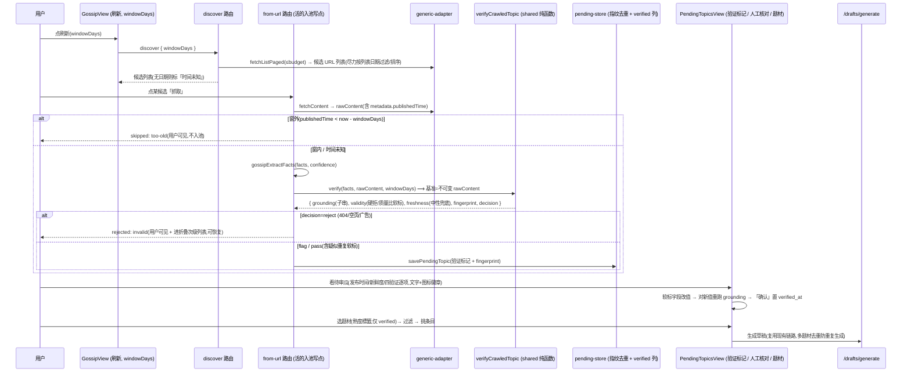
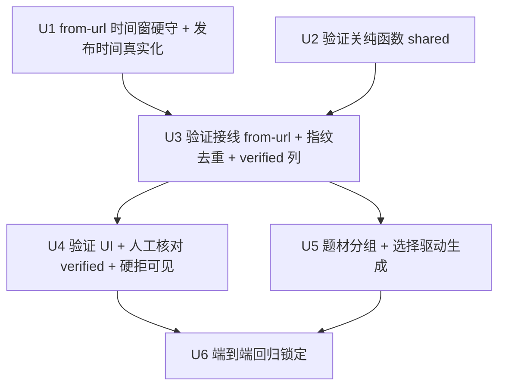

# feat: 时间窗 from-url 守门 + 入池前验证关 + 题材分组选择

> **修订说明(v2,经 6 人格文档复审后实质重写)**:v1 把验证关与时间窗挂在
> `runListDiscovery`/`discover` 路由上。**这是 P0 架构错误**:`runListDiscovery` 是 **cron + ACG**
> 路径(用 ACG `extractFacts`、`domain` 默认 `acg`),吃瓜手动流根本不走它;`POST /sites/:id/discover`
> 只调 `fetchListPaged` 返回 URL 列表给 UI 预览,**不抓正文、不提炼、不入池**。吃瓜的**唯一活的入池路径
> 是 `from-url`**(用户点候选项 → 逐条抓正文 + `gossipExtractFacts` + `savePendingTopic`)。
> 故本版把时间窗硬守 + 验证关挂到 **`from-url`**,`discover` 仅做尽力而为的预览过滤/排序。下文均已据此重写。

## Overview

把现有吃瓜管线从「列表预览 → 逐条抓取直进待审池 → 逐条挑生成」升级为
**「手动刷新(预览按时间尽力排序)→ 逐条抓取时按时间窗硬守 + 四道验证 → 人工二次核对 → 按题材分组挑选 → 生成」**。

这是**接缝工程,不是重写**。仓库已有:站点管理、`fetchListPaged` 翻页发现、`GossipFactsBlock` 八栏事实抽取、
`source_url` 三层去重、`computeScore`/`freshnessDays` 新鲜度打分、`熱度標籤` 题材字段、`draft-gen.ts` 的
草稿端 grounding 关、SSRF allowlist(人手手势加站)。本次只补三块**当前完全缺失**的能力:

1. **时间窗(from-url 硬守 + discover 预览尽力过滤)** — 抓取一条时若发布时间在窗外则跳过并明确反馈;
   预览层尽力按列表日期排序/过滤(不可靠则全列、标「时间未知」)。
2. **入池前验证关** — 在 `from-url` 的「`gossipExtractFacts` → `savePendingTopic`」之间插一道可组合的纯函数
   验证(出处 grounding / 有效性 / 新鲜度 / 内容指纹),硬拒**用户可见**(不静默丢)、软标入池带标记。
3. **题材分组选择** — 用 `熱度標籤` 把**已核对**的瓜聚类,选题材类别 → 过滤 → 挑条目生成。

## Problem Frame

产品定位已锁定:**URL 爬取 → AI 提炼吃瓜事实 → 人工预览/编辑 → 导出 JSON/Markdown。绝不发布/写回任何站点
(硬约束)。**(见 origin 与 `.ai-memory/project_51guapi.md`)

当前痛点:用户在预览里点一条,系统就把它——不论新旧、出处对不对、是否重复、是否广告——直接灌进待审池。
缺三样:**(a)** 只想要「最新」的瓜,但抓取不看时间;**(b)** 想在挑之前先「验」一道,但验证关只长在最后的
草稿生成端,管不到入池;**(c)** 想按题材(出轨/解约/撕逼…)聚类来挑,但题材数据虽在事实里却不可过滤、UI 不暴露。

## Requirements Trace

- **R1**(时间窗硬守 @ from-url). `from-url` 抓取一条后,若其发布时间在 `now - windowDays` 之前,
  **不入池**并返回用户可见的「too-old, skipped」结果(因为是用户主动点的);`windowDays` 缺省退化为旧全量行为。→ U1
- **R2**(发布时间真实化 + 中性兜底). 发布时间从详情页 `metadata.publishedTime` 解析并贯通到打分与 UI;
  **发布时间缺失时不得回退到 `createdAt` 当「最新」**——给中性/降权的 freshness 并标「时间未知」,
  不得排在有日期的新瓜之上。→ U1, U2
- **R3**(验证关·纯函数). `shared/` 纯函数 `verifyCrawledTopic`,组合四道检查:① 出处 grounding
  (事实值作为子串出现在原文——**仅证 token 出处,非命题为真**)② 有效性(404/空页/广告 → 硬拒;
  核心叙事键质量比 → **软标**,见决策)③ 新鲜度(窗内/时间未知中性)④ 内容指纹(供去重)。
  返回逐项判定 + `decision: 'reject'|'flag'|'pass'`。**confidence 不是第四道检查,只作 score 输入,不硬拒。**→ U2
- **R4**(验证关·接线 @ from-url). 在 `from-url` 的「`gossipExtractFacts` 后、`savePendingTopic` 前」跑
  `verifyCrawledTopic`(基准 = 不可变 `rawContent`);硬拒 → 不入池但**用户可见**(返回原因);软标 → 入池带标记;
  每条重抽路径都重跑。→ U3
- **R5**(内容级去重·软标可见). 同瓜换 URL/转载不重复入池;指纹基**不止** `當事人+事件摘要`(避免同人不同瓜
  误杀);**指纹命中 = 软标「疑似重复」呈现给用户**(可恢复),非静默硬拒。现有 `source_url` UNIQUE 保留为兜底。→ U3
- **R6**(人工二次核对 UI). 卡片展示发布时间、新鲜度、四道验证逐项判定(标红/徽章带文字与图标,非纯颜色);
  软标字段可改,**改值后必须对新值重跑 grounding**(不可只清红标,否则 UI 层重演 rewrite 旁路);
  用户「确认」后该瓜 `verified` 标记置位才进入题材池;硬拒项在折叠的次级列表里可见可恢复。→ U4
- **R7**(题材分组选择). pending 列表按 `熱度標籤` 题材过滤/分组(返回题材→计数),**仅含 `verified` 的瓜**;
  查询参数化(better-sqlite3 prepared statement),题材来自 JSON blob 用 `json_extract`/JS 扫描;
  多标签语义明确;UI 题材选择器含空/加载/选中/清除态;选题材 → 过滤 → 挑条目 → 生成(复用 `/drafts/generate`)。→ U5
- **R8**(回归锁定). 全流程用 mock(无真实网络/LLM)端到端测试锁定:from-url 时间窗丢旧瓜、验证关拒无效、
  软标低 grounding/疑似重复、人工确认置 `verified`、题材过滤、生成。验证关类代码用**真关 + 真输入**集成测试
  (不 mock 验证函数本身)。→ U6
- **R9**(不变量守护). 不复活 publish/fill/batch 路径;爬取管线/LLM 不得获得 allowlist 写权限;草稿端既有
  grounding 关不被削弱;两处「同口径」(`computeScore` 与 extractor 字段排除)保持锁步;不改 SSRF 核心。→ 贯穿全程
- **R10**(可选优化,默认不做). 列表页逐项日期解析以支持 discover 预览的过滤/排序——**尽力而为**,
  解析不到退化为「全列 + 时间未知」;**不做翻页早停 / 抓前早跳**(吃瓜活路径无 per-item fetch 循环可省)。→ U1(可选)

## Scope Boundaries

### In Scope
- `from-url` 的时间窗硬守 + 发布时间真实化/中性兜底。
- `shared/` 纯函数验证关(四道检查)+ 在 `from-url` 接线;硬拒用户可见。
- 内容级去重(放宽指纹基,命中=软标可见)。
- 验证结果 UI 暴露 + 人工二次核对(`verified` 标记 + 改值重 grounding);硬拒次级可见列表。
- 题材(`熱度標籤`)分组/过滤(参数化、json 查询、多标签语义、仅 verified)+ 题材选择 UI。
- mock 端到端回归测试。

### Deferred / 明确不做(本次)
- **cron / 后台定时 / per-site 水位线**(用户选「手动刷新+时间窗」);`scheduler.ts` 的 cron 基建与
  `runListDiscovery`(ACG 路径)**不动**。
- **改 SSRF 核心 / 改吃瓜站的「只禁私有 IP」取舍**(见 Key Decisions)。
- **事实真假核验(veracity)**;grounding 只证 token 出处,facts 是信任根(边界已被团队接受)。
- **草稿端 grounding/质量关的搬迁或重写**;留在 `draft-gen.ts` 原位,与入池验证关正交。
- 题材的新分类体系/新表;复用 `熱度標籤` + `pending_topics.domain`。
- **列表页早停/抓前早跳优化**(R10):吃瓜活路径是 discover 返列表 + from-url 逐条,无 per-item fetch 循环可省;
  列表日期仅用于预览排序(可选)。

## Context & Research

### 关键数据流现况(复审实测,务必先读)
- **`POST /sites/:id/discover`**(`gossip-routes.ts`):只调 `fetchListPaged(listUrl, maxDepth)`,返回**至多
  `SCRAPER_LIST_BUDGET`(默认 20)条**列表顺序的候选 URL + 标题给 UI 预览。**不 `fetchContent`、不提炼、不入池。**
  此处只有 `DiscoveredUrl = {url, title?}`,**无 per-item 发布时间**(除非列表页能解析,R10)。
- **`from-url`**(`gossip-routes.ts`):接一个 URL → `generic-adapter.fetchContent()`(此时才得
  `rawContent.metadata.publishedTime`)→ `gossipExtractFacts()`(`GossipFactsBlock`)→ `savePendingTopic`
  (`domain='gossip'`)。**这是吃瓜唯一活的入池写点**,时间窗硬守 + 验证关挂这里。
- **`runListDiscovery`**(`scheduler.ts`):cron 驱动、用 ACG `extractFacts`(`FactsBlock`)、`domain` 不设为
  gossip。**与吃瓜手动流无关,本计划不碰它。**

### Relevant Code and Patterns
- `packages/backend/src/routes/gossip-routes.ts` — `discover`(返候选列表)、`from-url`(抓+提炼+入池)。**主战场**。
- `packages/backend/src/scraper/adapters/generic-adapter.ts` — `fetchContent`;详情页
  `extractOgMeta(html, "article:published_time")` → `rawContent.metadata.publishedTime`(≈`:297,307`)。
- `packages/backend/src/scraper/adapters/html-extractors.ts` — 列表页抽链接+标题(R10 可选:抽逐项日期)。
- `packages/backend/src/scraper/site-adapter.ts` — `DiscoveredUrl={url,title?}`、`RawContent`。
- `packages/backend/src/scraper/gossip-fact-extractor.ts` — `gossipExtractFacts()`;两遍抽取
  (`json_schema strict`→`json_object` fallback,`FALLBACK_CONFIDENCE_CAP=0.6`);confidence=字段填充比例
  (非模型自评),`來源連結` 排除;`熱度標籤` 由「文章情緒/關鍵詞推斷」=**自由文本**。
- `packages/shared/src/gossip-facts.ts` — `GossipFactsBlock`(繁体键,均 `string|null`):
  `當事人, 事件摘要, 起因, 經過, 結果, 來源連結, 發生時間, 熱度標籤`;`GOSSIP_FACT_KEYS`。
  **吃瓜域题材信号 = `熱度標籤`**(出轨/解约/撕逼…),非 ACG `facts.ts:题材`。
- `packages/shared/src/quality-gate.ts` — `evaluateQuality` 纯函数;修正口径:核心叙事键
  `["當事人","事件摘要","起因","經過","結果"]`,pass=比例 ≥0.5,排除机械字段,`DEFAULT_THRESHOLD=0.6`,**信号非硬卡**。
- **迁移机制(复审纠正)**:Schema 在 `packages/backend/src/migrations/runner.ts`,以**内联**
  `MIGRATIONS: Record<string,string>` 对象登记(key 如 `'013-...sql'` 是字符串值,**不是文件**;目录里散落的
  `.sql` 是未用的遗留)。新增迁移 = 往该对象加一个 **三位零填充** key(`Object.keys().sort()` 字典序执行);
  `_migrations` 表自动登记,无需另写注册。**严禁**新建 `.sql` 文件(不会被读)。
- `pending_topics` 列:`created_at`/`updated_at`、`status`(**有 `CHECK(status IN ('pending','approved','rejected'))`**,
  SQLite 不能 ALTER CHECK)、`domain`、`confidence`、`score`、`source_url`(UNIQUE,迁移 `004`)。
  **无发布时间列、无指纹列、无 verified 列。**
- `packages/backend/src/scraper/pending-store.ts` — `savePendingTopic`(命中 UNIQUE 返回 `{inserted:false}`)、
  `pendingTopicExistsBySourceUrl`、`computeScore = fieldCompleteness × exp(-freshnessDays/7) × confidenceFactor`、
  `freshnessDays()` 读 `metadata.publishedTime → facts.發生時間 → createdAt`(**注意末项是我方爬取时间,见 R2 风险**)。
- 路由:`pending-routes.ts` 列表支持 `domain/status/limit`(better-sqlite3 prepared statement),**无题材/时间过滤**。
- 扩展:`sidepanel/GossipView.tsx` + `gossip/DiscoveredItemCard.tsx`/`SiteCard.tsx`/`ChannelWhitelistPanel.tsx`;
  `PendingTopicsView.tsx`(现为**单步**:勾选 → 「批准并生成草稿」/「拒绝」,经 `updatePendingStatus`)+ `pending/`
  (含 `FactsEditorModal.tsx`,展示 confidence/封面/8 字段/原文);`lib/pending-client.ts`/`gossip-client.ts`;
  `hooks/useDraftGeneration.ts`。`ChannelWhitelistPanel` 是 allowlist 人手手势入口(→ `POST /api/v1/channels`)。
- SSRF(复用不改):`ssrf-allowlist.ts` `loadSSRFAllowlist()`=`env.ALLOWED_HOSTS`∪channels(运行时读、fail-closed)、
  `ssrf-guard.ts` `safeFetch()`(每跳查 allowlist + IP pinning + ≤5 跳)、加站 `POST /api/v1/channels` 需
  `x-operator-confirm:1` + `confirm:true` + `adminPassword` 二次验证;**爬取管线/LLM 零写权限**。

### Institutional Learnings(直接塑形本计划)
- **「rewrite 旁路」是本仓最贵的 bug 类(修过三次)**:验证关放在 AI 改写**之后**会被无声击穿。规则:验「AI 动手
  之前的不可变产物」、每条重抽路径重验。→ 入池验证以不可变 `rawContent` 为基准;**且 UI 软标改值后必须重 grounding**
  (R6),否则在 UI 层重演旁路。(`...grounding-gate-rewrite-bypass...`)
- **生成前「硬事实完整度筛」曾被故意否决**;confidence 是信号非硬卡。→ 本关验**源侧产物**(出处/新鲜/去重/有效性)
  且 confidence 不硬拒、人工有最终决定权。**注意切分**:有效性里的「核心叙事键质量比」其实是**抽取完整度**(=被否决
  那道筛的度量),**只因走软标才合法**;严禁未来把它提为硬拒(见 Key Decisions)。(`...rewrite-bypass...` + `...quality-gate-rewrite...`)
- **关键字对错 schema → 质量分恒为 0**:复用修正口径。(`docs/plans/2026-06-17-001-fix-quality-gate-rewrite-plan.md`)
- **验证 evaluate 设为 `shared/` 纯函数**,UI 与编排同口径;关类代码需 **no-mock 集成测试** + 负断言。
- **fail-closed 三问**:「扫了 0 条」必须红、空输入 block、自测通过≠真扫了。(`...fixture-secret-gate-false-green...`)
- **confidence = 填充比例**;`computeScore` 与 extractor 两处排除 `來源連結` 须锁步;correctness(验真假)本次不做。
- **freshness 已用事件时间**,但末项兜底是 `createdAt`(我方时间)——**这是 R2 反噬点**:缺发布时间若回退 `createdAt`
  会让旧瓜 freshness=1.0 排成最新,必须中性兜底。(`pending-store.ts`)
- **测试坑**:`pnpm --filter 51guapi-backend test`(包名≠scope名);改 shared 先 `pnpm --filter @51guapi/shared build`;
  HTTP client 用 `fetchFn?` 注入缝。(`docs/solutions/developer-experience/*`)

### External References
- 不依赖外部框架文档(全为仓内既有模式扩展)。`node-cron` 不在改动面。

## Key Technical Decisions

- **时间窗硬守落 `from-url`,discover 仅预览尽力过滤。** 因 discover 返列表无 per-item 时间、`from-url` 才有
  `publishedTime`。`from-url` 抓后若窗外 → 不入池 + 返回用户可见原因(用户主动点的,不能静默吞)。discover 预览:
  列表页能解析日期则过滤/排序、否则全列标「时间未知」。**这避开了「列表层无时间可筛」与「预算先截断」两个伪命题。**
- **预算 vs 时间窗的已知张力(记录,接受)。** discover 仍返列表顺序前 `SCRAPER_LIST_BUDGET`(20)条;无可靠列表
  日期时,若前 20 条恰好都旧,深处新瓜不会出现在预览——这是接受的局限(`maxDepth` 可调翻页缓解),不在本次扩
  预算逻辑。真正的「最新」保证来自 from-url 硬守(用户点哪条都不会把旧瓜入池)。
- **发布时间缺失 → 中性 freshness,绝不回退 `createdAt`。** 在验证关/打分里:`publishedTime` 缺失的瓜
  freshness 取中性值(不享 `exp(0)=1.0` 满分)并标「时间未知」,排序不得压过有日期的新瓜。需在 `computeScore`/
  `verifyCrawledTopic` 显式处理,加测试守护。
- **confidence 是 score 输入,不是第四道检查、不硬拒。** 四道检查 = grounding/有效性/新鲜度/指纹;confidence 仅排序/标记。
- **grounding = 子串出处,非命题为真(显式承认局限)。** 子串法只能证「这些字符在原文出现过」,挡不住「抄一句无关
  原文句填进字段」或「对的来源放错字段」。**不把它当万能反编造**;加「无关句」测试用例;真假核验明确不做。
- **有效性二分:硬拒只给明确无效(404/空页/广告);质量比走软标。** 质量比是抽取完整度(被否决筛的度量),仅软标合法。
- **内容指纹:基放宽 + 命中=软标可见。** 指纹基不止 `當事人+事件摘要`(加 `起因`/`結果` 或归一化正文 shingle),
  避免同人不同瓜误杀;**命中按「疑似重复」软标呈现给用户**(可恢复),不静默 reject。`source_url` UNIQUE 保留兜底。
- **硬拒不静默:用户可见 + 可恢复。** validity/freshness 的硬拒项不止 log/metric——在 UI 折叠次级列表展示(计数+原因+可恢复),
  保住「人工有最终决定权」对硬拒项也成立。
- **「已核对」用布尔标记/`verified_at` 列,不新增 status 枚举。** status 有 `CHECK` 约束,加 `'verified'` 要整表重建 +
  三处枚举改。改用 `pending_topics` 上可空 `verified_at`(或布尔 `verified`)列 + 过滤。生命周期:
  `pending`(未核对)→ 用户确认 → `verified_at` 置位 → 进题材池;**可逆**(可撤销核对)。
- **「确认」与现有「批准并生成」调和。** 题材池只收 `verified` 项;现有「批准并生成草稿」按钮 = 非题材的手动直生成路径,
  保留但对未 verified 项给提示(或要求先确认)。两按钮职责在 UI 文案/位置上区分清楚(见 U4 IA)。
- **迁移走内联 `MIGRATIONS` 对象**(非 `.sql` 文件),三位零填充 key。
- **题材查询参数化 + json 取值 + 多标签语义。** `熱度標籤`(逗号分隔)按分类 **allow-list** 归一(未知→「其他」,
  在查询前归一、不信任 LLM 自由文本);题材在 JSON blob 用 `json_extract`/JS 扫描(量小,性能非当前瓶颈);
  **多标签瓜在每个匹配题材下出现**,但生成入参去重防同瓜重复生成。所有题材过滤走 prepared statement。
- **windowDays 是输入控制(非仅测试)。** 路由 schema 定可接受范围(如 1..N)并服务端钳制/拒绝;`SCRAPER_LIST_BUDGET`
  仍是每次 from-url 抓取量无关、discover 列表的硬上限。UI 显示默认值并对钳制给反馈。
- **不动 SSRF 姿态。** 「白名单库」= 用户在 `ChannelWhitelistPanel` 管理的源站集合;加新站走既有人手手势;爬取管线零 allowlist 写权限。

## Open Questions

### Resolved During Planning(含复审后定论)
- **验证/时间窗挂哪条路径?** → `from-url`(活路径);`discover` 只预览;`runListDiscovery`(ACG/cron)不碰。
- **时间窗放哪?** → from-url 硬守 + discover 尽力预览过滤;窗口请求期算,零持久游标。
- **publishedTime 缺失怎么算 freshness?** → 中性/降权,**不回退 createdAt**,不得排成最新。
- **「已核对」用状态还是布尔?** → 布尔/`verified_at` 列(避 CHECK 整表重建)。
- **指纹命中是硬拒还是软标?** → 软标可见可恢复;指纹基放宽避免同人误杀。
- **grounding 能防编造吗?** → 仅子串出处,显式承认局限,不当万能反编造。
- **迁移怎么加?** → 内联 `MIGRATIONS` 对象加三位零填充 key,非 `.sql` 文件。
- **题材取哪个字段?** → 吃瓜域 `熱度標籤`(非 ACG `题材`)。
- **「白名单库」要改 SSRF 吗?** → 不改;既有人手手势加站。

### Deferred to Implementation
- **列表页日期解析覆盖度(R10 可选)**:看 fixture 决定支持哪几种 pattern;解析不到退化「全列+时间未知」,不报错。
- **指纹精确基与算法**:归一化用哪些字段(`當事人+事件摘要` + `起因`/`結果`/正文 shingle?)、精确 vs 近似阈值,
  按真实转载样本定;先放宽基 + 精确哈希起步。
- **有效性「无效标记集」**:404/空页/广告的判定特征(状态码、正文长度阈值、广告关键词),看真实坏样本定;先「正文长度下限
  + 明显错误页特征」。需有 reject 率可观测性,防 over-fire 静默吃瓜。
- **中性 freshness 的具体值**:用固定中性常数还是「窗口中点」或排序时单列分组,实现时按 `computeScore` 现状权衡。
- **`windowDays` 默认值与每站可配**:先全局默认(env/常量)+ UI 输入框;每站独立配置视需要再加。
- **`verified` 撤销的 UI/语义**:撤销后回 `pending`、是否清空已编辑字段,实现时定。

## High-Level Technical Design

> *方向性示意,供评审校准「形状」,非实现规格。实现 agent 当作上下文,而非照抄的代码。*

关键契约:**结构化 facts 是机器契约,prompt 散文只给人看**;验证读 facts 与不可变 `rawContent`。
硬拒**用户可见可恢复**,软标 + 人工确认共同保住「人有最终决定权」;时间窗的可靠保证来自 from-url 硬守。

## Implementation Units

- [x] **Unit 1: from-url 时间窗硬守 + 发布时间真实化(后端)**

**Goal:** `from-url` 抓取一条后按 `windowDays` 硬守(窗外不入池 + 用户可见原因);发布时间贯通到打分与 UI;
缺失发布时间给中性 freshness(不回退 createdAt)。discover 预览尽力按列表日期过滤/排序(R10 可选)。

**Requirements:** R1, R2, R10(可选)

**Dependencies:** 无

**Files:**
- Modify: `packages/backend/src/routes/gossip-routes.ts`(`from-url` 读 `windowDays`,fetchContent 后按
  `metadata.publishedTime` 判窗;窗外返回 `{ok:true, skipped:'too-old', publishedTime}` 不入池;`discover` 读
  `windowDays` 做预览过滤/排序;route schema 校验 + 钳制 `windowDays` 范围)
- Modify: `packages/backend/src/scraper/pending-store.ts`(`freshnessDays`/`computeScore`:`publishedTime` 缺失 →
  中性 freshness,不取 `createdAt` 满分)
- Modify(R10 可选): `packages/backend/src/scraper/adapters/html-extractors.ts`、`site-adapter.ts`
  (`DiscoveredUrl` 加可选 `publishedAt?`,列表尽力解析)
- Test: `packages/backend/src/routes/gossip-routes.test.ts`、`packages/backend/src/scraper/pending-store.test.ts`

**Approach:**
- 硬守在 `from-url`(此处才有 `publishedTime`);窗外不入池但**明确反馈**(用户主动点的)。
- 中性 freshness:缺 `publishedTime` 时不享 `exp(0)=1.0`;用固定中性常数或排序单列(实现时定),保证不压过有日期新瓜。
- discover 预览:有 `publishedAt` 则过滤/排序、否则全列标「时间未知」;**不做翻页早停/抓前早跳**(无 per-item 循环可省)。
- `windowDays` 缺省 → 退化旧全量(不回归);非法/超大 → schema 钳制/拒。

**Execution note:** 先对当前 from-url「无时间窗」行为加 characterization 测试,再加硬守,保证缺省不回归。

**Patterns to follow:** `from-url` 既有 fetchContent→extract→save 流程;`metadata.publishedTime` 既有解析;
`computeScore`/`freshnessDays` 现有公式。

**Test scenarios:**
- Happy:from-url 抓一条窗内瓜 → 正常入池。
- Happy(硬守):抓一条 `publishedTime` 在窗前 → 不入池 + 返回 `skipped:'too-old'`(断言未 savePendingTopic)。
- Edge(中性兜底):`publishedTime` 缺失的旧瓜**不**因回退 `createdAt` 得满分 freshness;断言其 score 不高于一条有日期的新瓜。
- Edge:`windowDays` 缺省 → 旧全量行为(不回归);非法(负/超大)→ schema 钳制/拒。
- Edge(discover 预览,R10):列表有日期 → 预览过滤/排序;无日期 → 全列 + 「时间未知」标记,不报错。
- Security:windowDays 钳制在服务端(不只前端);from-url 仍走既有 `safeFetch`/`enforcePathPrefix`,无旁路。

**Verification:** `pnpm --filter 51guapi-backend test` 绿;from-url 窗外不入池且可见、中性兜底不让旧瓜冒充最新、缺省不回归。

---

- [x] **Unit 2: 验证关纯函数(shared)**

**Goal:** `verifyCrawledTopic` 纯函数,组合四道检查,返回逐项判定 + `decision` 分级 + 内容指纹;
显式承认 grounding 局限;质量比走软标;指纹基放宽;时间未知中性。

**Requirements:** R3, R5(指纹), R9(口径锁步)

**Dependencies:** 无

**Files:**
- Create: `packages/shared/src/gossip-verify.ts`(`verifyCrawledTopic(input): VerificationResult`、
  `computeContentFingerprint(facts): string`、类型)
- Modify: `packages/shared/src/index.ts`(导出)
- Modify(如复用): `packages/shared/src/quality-gate.ts`(质量比函数保持与 extractor 字段排除锁步;不改其阈值语义)
- Test: `packages/shared/src/gossip-verify.test.ts`

**Approach(四道检查,纯函数、无 I/O):**
- **① grounding(子串出处,承认局限)**:对核心非机械字段(`當事人/事件摘要/起因/經過/結果`)归一化后查是否
  作为子串出现在 `rawContent`;不出现 → 标「未溯源」。排除 `來源連結/發生時間/熱度標籤`。**只证 token 出处**;
  不试图防「抄无关句」。
- **② 有效性**:正文长度下限 + 明显错误页/广告特征 → `hardFail=true`(明确无效);核心叙事键质量比(复用修正口径
  ≥0.5)→ **软标**(非硬拒;它是抽取完整度,严禁提为硬拒)。
- **③ 新鲜度**:用 `publishedTime`/`發生時間` 对窗口判定;**缺失 → `unknown=true` 中性软标**(调用方传 windowDays;
  纯函数不取 createdAt)。
- **④ 内容指纹**:`computeContentFingerprint` 基放宽(`當事人`+`事件摘要`+`起因`/`結果` 或正文 shingle)的稳定哈希;
  纯函数只产指纹,**不判库**(查重在 store);设计上指纹命中由调用方按**软标**处理。
- 返回 `{ grounding:{perField,ok}, validity:{ok,hardFail,qualityRatio}, freshness:{ok,unknown}, fingerprint,
  decision:'reject'|'flag'|'pass', reasons[] }`。**`decision='reject'` 只在 `validity.hardFail`**(明确无效);
  质量比低/未溯源/疑似重复/时间未知 → `'flag'`。confidence 不入判定。
- **fail-closed**:`rawContent` 缺/facts 全空 → 绝不 pass(reject 或 flag)。

**Execution note:** 真函数 + 真造样本(不 mock 内部);负断言载重。

**Patterns to follow:** `quality-gate.ts` 纯函数风格、`GOSSIP_FACT_KEYS`;extractor 字段排除口径锁步。

**Test scenarios:**
- Happy:各字段在 rawContent 可见、正文足、质量比达标 → pass。
- Edge(grounding 局限):字段填**原文里真实但无关的句子** → 子串能命中 → **仍 pass(记录该已知局限)**;
  字段填原文不存在的编造文本 → 标未溯源、decision≠pass。
- Edge(有效性):正文极短/错误页特征 → `hardFail` → decision='reject';质量比低但有效 → 'flag' 非 reject。
- Edge(新鲜度):窗外 → ok=false;缺失 → unknown=true(中性,不 reject、不满分)。
- Edge(指纹):同瓜不同 URL → 同指纹;**同人不同事件** → 不同指纹(放宽基的关键守护)。
- Edge(fail-closed):rawContent 空 / facts 全 null → 绝不 pass。
- Invariant:confidence 再低不单独 reject。

**Verification:** `pnpm --filter @51guapi/shared build && test` 绿;四检查与分级符合断言;同人不同瓜不撞指纹;grounding 局限有测试记录。

---

- [x] **Unit 3: 验证接线 @ from-url + 指纹去重 + verified 列(后端)**

**Goal:** 在 `from-url` 的「`gossipExtractFacts` 后、`savePendingTopic` 前」跑 `verifyCrawledTopic`(基准=不可变
`rawContent`):硬拒不入池但**用户可见**;软标(含疑似重复)入池带标记;新增 `content_fingerprint` + `verified_at` 列。

**Requirements:** R4, R5, R9

**Dependencies:** U2、U1(窗口与中性 freshness)

**Files:**
- Modify: `packages/backend/src/routes/gossip-routes.ts`(`from-url`:extract 后 verify;`decision='reject'` →
  返回用户可见 `{ok:true, rejected:reason}` 不入池;指纹命中 → 入池带「疑似重复」软标;flag/pass 持久化标记+指纹)
- Modify: `packages/backend/src/scraper/pending-store.ts`(读写 `content_fingerprint` + `verified_at` + 验证标记;
  新增 `pendingTopicExistsByFingerprint`;指纹命中入池为软标,不阻断)
- Modify: `packages/backend/src/migrations/runner.ts`(往**内联 `MIGRATIONS` 对象**加三位零填充 key,如
  `'013-pending-verification.sql'`,值=SQL 字符串:`ALTER TABLE pending_topics ADD COLUMN content_fingerprint TEXT;`
  `ADD COLUMN verified_at TEXT;` + `CREATE INDEX IF NOT EXISTS idx_pending_fingerprint ...`;幂等)
- Modify: `packages/shared/src/types.ts`(`PendingTopic` 加可选 `contentFingerprint?`/`verifiedAt?`/验证标记)
- Test: `packages/backend/src/routes/gossip-routes.test.ts`、`packages/backend/src/scraper/pending-store.test.ts`、
  `packages/backend/src/migrations/runner.test.ts`

**Approach:**
- verify 紧跟 `gossipExtractFacts`、先于 `savePendingTopic`;基准=该次 `rawContent`(不可变);每条重抽路径重跑。
- 硬拒(仅明确无效)→ 不入池 + 返回原因(前端进折叠次级可见列表)。
- 指纹命中 → **入池**并标「疑似重复」(用户可见可恢复),**不**静默丢;`source_url` UNIQUE 仍兜底。
- `verified_at` 默认 NULL(未核对);题材池只收非 NULL。
- 两处「同口径」若被触碰,保持锁步。**爬取管线仍零 allowlist 写权限(R9)。**

**Execution note:** 关类用 **no-mock 集成测试**:真 `verifyCrawledTopic` + 真 store(临时 DB);负断言:无效瓜不入池且响应可见、同人不同瓜不被指纹误杀、疑似重复入池带软标。

**Patterns to follow:** `from-url` 既有流程;`savePendingTopic` UNIQUE 语义;迁移幂等 + 三位零填充;`test-setup.ts` 临时 DB。

**Test scenarios:**
- Happy:有效窗内瓜过 verify → 入池,标记 pass,`verified_at=NULL`。
- Integration(去重):同内容不同 URL 两次 from-url → 第二次入池带「疑似重复」软标(可见),非静默丢。
- Edge(硬拒可见):正文过短/错误页 → 不入池 + 返回 `rejected` 原因(断言响应含原因、未 save)。
- Edge(软标):质量比低/某字段未溯源 → 入池带 flag,标记可被读到。
- Edge(重抽):同 URL 再 from-url → verify 重新跑(不复用旧判定)。
- Edge(迁移):全新库与已有库重复跑迁移均不报错(幂等);旧行 `content_fingerprint/verified_at` 为 NULL 不崩。
- Regression(R9):无 publish/fill/runBatch/allowlist 写调用(静态/断言守护)。

**Verification:** `pnpm --filter 51guapi-backend test` 绿;硬拒可见不入池、疑似重复软标入池、verified 列就位、重抽重验、无写回路径。

---

- [x] **Unit 4: 验证 UI + 人工二次核对(verified)+ 硬拒可见(扩展)**

**Goal:** 卡片展示发布时间/新鲜度/四验证逐项(文字+图标徽章、带图例);软标字段改值后**重跑 grounding**;
「确认」置 `verified_at` 才进题材池;硬拒项折叠次级列表可见可恢复;调和与现有「批准并生成」按钮的关系。

**Requirements:** R6

**Dependencies:** U3

**Files:**
- Modify: `packages/extension/lib/pending-client.ts` / `lib/gossip-client.ts`(透传验证标记 + publishedTime + 新鲜度;
  新增「确认(置 verified)」「撤销」「恢复硬拒项」「对改值重跑 grounding」动作)
- Modify: `packages/extension/entrypoints/sidepanel/PendingTopicsView.tsx`(逐项徽章 + 确认按钮 + 信息层级 +
  硬拒折叠次级列表;明确「确认」vs「批准并生成」职责)
- Modify: `packages/extension/entrypoints/sidepanel/pending/FactsEditorModal.tsx`(未溯源字段标红可改 +
  改值即对新值重 grounding 并反馈是否解除)
- Modify: `packages/backend/src/routes/gossip-routes.ts` 或 `pending-routes.ts`(`verified` 置位/撤销端点 +
  「对编辑后字段重 grounding」端点,基准仍为该 topic 不可变 `rawContent`)
- Modify: `packages/shared/src/types.ts`(验证标记/verified 类型如需共享)
- Test: `PendingTopicsView.test.tsx`、`pending/FactsEditorModal.test.tsx`、`gossip/DiscoveredItemCard.test.tsx`、
  `lib/pending-client.test.ts`、相关后端 route test

**Approach:**
- 徽章:四道检查用**文字+图标**(不纯靠颜色,无障碍),并给图例(红=硬问题、黄=软标、灰=时间未知)。
- 信息层级:验证标记与既有 score/高潜力徽章共存时,定主次(验证红标优先于 score),避免「徽章汤」。
- 软标改值 → 调后端对新值重 grounding(基准=不可变 `rawContent`)→ 反馈是否解除红标;**不只前端清标**(防 UI 层旁路)。
- 「确认」置 `verified_at` → 进题材池(可逆,撤销回 pending);现有「批准并生成」= 非题材手动直生成,
  对未 verified 项给提示(文案/位置区分,见 D2)。
- 硬拒项:折叠次级列表展示计数+原因,可「恢复」(转入正常待审)。

**Patterns to follow:** `PendingTopicsView` 既有勾选/`updatePendingStatus`;`FactsEditorModal` 字段编辑;HTTP 注入缝。

**Test scenarios:**
- Happy:全 pass 瓜卡片无红标、显示发布时间/新鲜度;点确认 → 调 verified 端点、进题材池。
- Happy(重 grounding):改未溯源字段为原文存在的值 → 重 grounding 通过 → 红标解除;改为原文不存在的值 → 红标保留(断言未只清标)。
- Edge:疑似重复/时间未知 → 对应徽章(文字+图标)呈现。
- Edge(硬拒可见):被硬拒项出现在折叠次级列表,可恢复。
- Edge(职责调和):未 verified 项点「批准并生成」→ 给提示/要求先确认(断言不绕过验证)。
- Edge:旧数据无验证标记/verified → 友好降级不崩。
- Error:确认/重 grounding 请求失败 → 友好提示,不误标 verified。
- Regression:无 runBatch/fill/publish 调用。

**Verification:** `pnpm --filter 51guapi-extension test`(+涉及的 backend test)绿;验证逐项可见、改值重 grounding、确认置 verified、硬拒可见、两按钮职责清晰。

---

- [x] **Unit 5: 题材分组 + 选择驱动生成(后端过滤 + UI)**

**Goal:** pending 列表按 `熱度標籤` 题材过滤/分组(题材→计数),**仅 verified**;查询参数化 + json 取值 +
多标签语义明确;UI 题材选择器含空/加载/选中/清除态;选题材 → 过滤 → 挑条目 → 生成(多题材去重)。

**Requirements:** R7

**Dependencies:** U3(verified 列)

**Files:**
- Create: `packages/shared/src/gossip-theme.ts`(从 `熱度標籤` 解析/归一化标签集 + 分类 allow-list 校验)
- Modify: `packages/shared/src/index.ts`(导出)
- Modify: `packages/backend/src/routes/pending-routes.ts`(列表加 `theme` 过滤参数 + 题材计数;**prepared statement**)
- Modify: `packages/backend/src/scraper/pending-store.ts`(按题材查询/聚合:`json_extract`/JS 扫描 `熱度標籤`;
  仅 `verified_at IS NOT NULL` + `domain='gossip'`;多标签瓜在每匹配题材计入)
- Modify: `packages/extension/entrypoints/sidepanel/PendingTopicsView.tsx`(题材选择器:空/加载/选中/「全部」清除态 → 过滤 → 挑条目)
- Modify: `packages/extension/lib/pending-client.ts`(list 加 `theme` + 取题材计数)
- Test: `packages/shared/src/gossip-theme.test.ts`、`pending-routes.test.ts`、`pending-store.test.ts`、`PendingTopicsView.test.tsx`

**Approach:**
- `熱度標籤`(逗号分隔)→ 标签集,**查询前**按 allow-list 归一(未知→「其他」)。
- 后端参数化过滤/计数,仅 verified;题材在 JSON blob 用 `json_extract` 或 JS 扫描(量小);多标签瓜在每匹配题材出现。
- UI:题材选择器(题材+计数)空态(无 verified 瓜 → 引导回核对步骤)、加载态、选中高亮 + 「全部」清除、零计数题材隐藏/提示;
  选中过滤 → 复用既有挑条目 → `generate()` → `/drafts/generate`;**同瓜跨题材只生成一次**(选择集去重)。

**Patterns to follow:** `pending-routes` 既有 `domain/status/limit` 参数化过滤;`computeScore` 排序;`PendingTopicsView` 挑条目→生成链路。

**Test scenarios:**
- Happy:多题材瓜 → 计数正确(仅 verified 计入);选「出轨」→ 列表只剩该题材。
- Happy:选中题材挑一条 → 生成走既有 `/drafts/generate`(入参契约不破)。
- Edge:`熱度標籤` null/空 → 归「其他」;多题材瓜在各题材均出现,但同瓜被选两次只生成一次。
- Edge(安全):题材参数走 prepared statement(断言不拼接 SQL);LLM 未知标签按 allow-list 归一不污染题材集。
- Edge(UI 态):无 verified 瓜 → 空态引导;切换题材 → 选中态/清除态正确。
- Integration:未 verified 瓜不进题材池。

**Verification:** `pnpm -r test` 绿;题材过滤/计数正确且仅 verified、参数化、多标签去重生成、UI 态完整。

---

- [x] **Unit 6: 端到端回归锁定(mock,无真实网络/LLM)**

**Goal:** mock 锁定全流程:from-url 时间窗丢旧瓜 → 验证关硬拒可见/软标低 grounding/疑似重复 → 人工确认置 verified →
题材过滤 → 生成。守护不变量(R9)。

**Requirements:** R8, R9

**Dependencies:** U1, U3, U4, U5

**Files:**
- Modify: `packages/backend/src/routes/gossip-routes.test.ts`、`pending-routes.test.ts`、`migrations/runner.test.ts`
- Modify: `packages/extension/entrypoints/sidepanel/GossipView.test.tsx`、`PendingTopicsView.test.tsx`、`App.test.tsx`
- Optionally: `scripts/preflight/`(若现有 fixture 自然覆盖)
- Test(无新增源,仅扩测试)

**Approach:**
- mock 矩阵:from-url(windowDays)对旧瓜返回 `skipped:'too-old'`;无效瓜 `rejected`(可见);编造/疑似重复 → 软标入池 →
  改值重 grounding → 确认置 verified → 题材过滤 → 生成。验证关断言走 **no-mock**(真 `verifyCrawledTopic`),其余用 mock。

**Patterns to follow:** `docs/plans/2026-06-18-002-fix-main-workflow-pipeline-plan.md` U4 端到端锁定;注入缝 + `resetAllMocks`;包名陷阱。

**Test scenarios:**
- Integration:from-url 窗外 → 不入池 + 可见 skipped;窗内 → 入池。
- Integration:同内容不同 URL → 第二次软标「疑似重复」入池(非静默)。
- Integration:无效瓜 → rejected 可见(折叠列表),可恢复。
- Integration:编造字段瓜入池软标 → 改值重 grounding → 确认 verified → 题材过滤后可生成;多题材去重只生成一次。
- Error:LLM no-key/超时/重复 URL/未授权在 from-url/确认/重 grounding/生成各 handoff 均友好不崩。
- Regression(R9):主流程无 runBatch/fill/publish/allowlist 写;草稿端 grounding 关未被削弱。

**Verification:** `bash scripts/check-all.sh` 绿;全流程被锁;无发布/写回路径复活。

## System-Wide Impact

- **Interaction graph:** `verifyCrawledTopic` 成为 **`from-url`** 路径的新关口(`gossipExtractFacts` 与
  `savePendingTopic` 之间);`runListDiscovery`(ACG/cron)与草稿端 `draft-gen.ts` grounding 关均不变、正交。
- **Error propagation:** from-url 硬守/硬拒**返回用户可见结果**(skipped/rejected),不静默、不崩;沿用既有失败处理。
- **State lifecycle risks:** 新增 `content_fingerprint`/`verified_at` 走内联 `MIGRATIONS` 幂等迁移;旧行两列 NULL,
  跨 URL 去重只对迁移后入库的瓜可靠(历史行指纹 NULL,接受);`verified` 可逆。
- **API surface parity:** `from-url` 增 `windowDays`(可选,缺省退化)+ 返回 skipped/rejected;`discover` 增 `windowDays`
  预览过滤;pending 列表增 `theme`(可选);新增 verified 置位/撤销 + 重 grounding 端点。`/drafts/generate` 入参契约**不变**。
- **Integration coverage:** 全流程由 U6 锁;验证关类 no-mock。
- **Unchanged invariants:** SSRF 栈、爬取管线零 allowlist 写权限、`source_url` UNIQUE、`status` CHECK 枚举(不加 verified 状态)、
  草稿端 grounding 关、两处「同口径」字段排除、不发布/不写回——本次只新增,不改其内部。

## Risks & Dependencies

| Risk | Likelihood | Impact | Mitigation |
|---|---|---|---|
| 子串 grounding 防不住「抄无关句」编造 | 高 | 中 | 显式承认局限、不当万能反编造;加「无关句」测试记录;真假核验明确不做;人工二次核对兜底 |
| publishedTime 缺失反噬时间窗(旧瓜冒充最新) | 高 | 高 | 中性 freshness 不回退 createdAt;测试断言时间未知不压过有日期新瓜 |
| 指纹同人不同瓜误杀 + 静默丢 | 中 | 高 | 放宽指纹基;命中=软标可见可恢复(非硬拒);同人不同瓜测试守护 |
| 硬拒项静默丢违背「人工最终决定权」 | 中 | 中 | 硬拒只给明确无效;折叠次级列表可见可恢复;reject 率可观测防 over-fire |
| 有效性质量比被未来提为硬拒(重蹈被否决筛) | 低 | 中 | 决策显式标注其为抽取完整度、仅软标合法;注释/测试守护 |
| discover 预算先截断使深处新瓜不显 | 中 | 中 | 接受局限(maxDepth 可调);真正保证来自 from-url 硬守;记录于决策 |
| verified 用新 status 触发整表重建 | 低(已规避) | 中 | 用 `verified_at` 列 + 过滤,不加 status 枚举 |
| 题材在 JSON blob 无索引、参数拼接 | 低 | 中 | prepared statement + `json_extract`/JS 扫描;量小性能非当前瓶颈 |
| 列表日期解析覆盖低(R10) | 高 | 低 | 退化「全列+时间未知」,from-url 硬守不依赖它;fixture 驱动 |
| windowDays 成本放大(每条 from-url 触发外呼+LLM) | 中 | 中 | route schema 钳制范围;from-url 逐条(用户主动);discover 列表受 budget 上限 |
| 迁移在已有库重复跑出错 | 低 | 中 | 内联 `MIGRATIONS` 幂等 + 三位零填充 + 新/旧库双测 |
| 改 shared 后类型报错(dist 过时) | 中 | 低 | 改 shared 先 `pnpm --filter @51guapi/shared build` |

### 新接口威胁模型(security-lens 补)
- **成本放大**:authenticated caller 用超大 windowDays / 狂点 from-url 放大外呼+LLM 开销 → route 钳制 + 逐条人触发。
- **压制碰撞**:对手构造内容使指纹撞已有项 → 改软标可见(不静默丢)+ 放宽指纹基 + 可恢复。
- **注入式题材标签**:LLM 从对手页面产出的 `熱度標籤` → 查询前 allow-list 归一 + prepared statement。

## Documentation / Operational Notes
- 落地后开 `/ce:compound` 沉淀:**入池前验证关的快照纪律(对爬取产物 vs 对草稿的切分,及 UI 改值重 grounding)**、
  **「吃瓜时间窗落 from-url 而非 discover」的接缝教训(runListDiscovery 是 ACG/cron 死路径)**、
  **迁移走内联 MIGRATIONS 对象**。
- `windowDays` 默认与范围、reject 率监控阈值,在常量/`.env.example` 注释。

## Sources & References
- **Origin:** `docs/brainstorms/2026-06-12-001-gossip-site-pipeline-requirements.md`
- 相关计划:`docs/plans/2026-06-17-001-feat-crawl-export-loop-plan.md`(翻页/CSV、内容去重曾 out-of-scope)、
  `docs/plans/2026-06-18-002-fix-main-workflow-pipeline-plan.md`(机器契约/端到端锁定模式)、
  `docs/plans/2026-06-17-002-feat-ssrf-hardening-plan.md`(人手手势加站、零写权限)、
  `docs/plans/2026-06-17-001-fix-quality-gate-rewrite-plan.md`(修正质量口径)
- 反幻觉/快照纪律:`docs/brainstorms/2026-06-11-grounding-gate-rewrite-bypass-requirements.md`、
  `docs/brainstorms/2026-06-15-grounding-gate-publish-basis-requirements.md`、
  `docs/brainstorms/2026-06-15-grounding-phase2-full-field-protection-requirements.md`
- 现况源码:`routes/{gossip,scraper,pending}-routes.ts`、`scraper/scheduler.ts`、`adapters/generic-adapter.ts`、
  `html-extractors.ts`、`site-adapter.ts`、`gossip-fact-extractor.ts`、`pending-store.ts`、`migrations/runner.ts`、
  `services/draft-gen.ts`、`shared/src/{gossip-facts,quality-gate,facts,types}.ts`、`ssrf-{allowlist,guard}.ts`、
  `channel-store.ts`、`routes/channel-routes.ts`
- 扩展:`sidepanel/GossipView.tsx`、`gossip/*`、`PendingTopicsView.tsx`、`pending/*`、`lib/{pending,gossip}-client.ts`、
  `hooks/useDraftGeneration.ts`
- 解决方案:`docs/solutions/best-practices/incremental-pr-adversarial-verification-2026-06-15.md`、
  `docs/solutions/developer-experience/extension-http-client-testability-injection-seam-2026-06-15.md`、
  `docs/solutions/security-issues/fixture-secret-gate-false-green-relative-path-2026-06-15.md`
- 项目记忆:`.ai-memory/project_51guapi.md`
- 文档复审(2026-06-18):coherence/feasibility/design-lens/security-lens/scope-guardian/adversarial 六人格,2 P0 + 多 P1 已整合。
