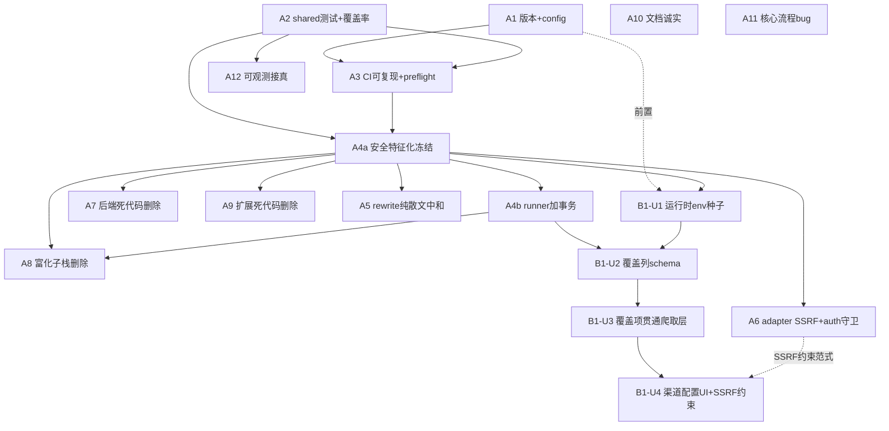

# 51guapi 成熟化地基 + 多站点同类可配置（A + B1）

## Overview

把 51guapi 从「自己用、但拆版拆到一半」打磨成**成熟可信**的自用工具（Phase A），并让操作者**不改源码就能接入更多同类爬取站点**（Phase B1）。A 清理 ACG→吃瓜改版残渣、补 3 个安全洞、让可观测说真话、让版本/构建/测试可复现、文档诚实；B1 把焊死的爬取规则做成每渠道可配置、把种子域名移出破坏性迁移。B2（shared 词表解耦）、C（非开发者分发）、D（发布 shared 公共库）本轮明确不做。

本计划由原始需求文档（见 origin）转化，需求经一次 12 子系统代码勘察 + 7 persona 文档审稿，关键事实已回核源码。

## Problem Frame

地基扎实（SSRF 钉 IP 防重绑、密钥 fail-closed、防幻觉架构、应用层测试量大），但被改版残渣拖累：死模块、空心可观测、主文档教已删的发帖功能、README 谎称不存在的 XSS 消毒器——后两者打脸「绝不写回」承诺。同时被焊死成单租户单题材：种子域名写进会 `DELETE channels` 的迁移、爬取规则是全局常量，换站点结构就静默抓空只能改源码。成熟度评分：安全 4，正确性/可维护/测试/构建 3，**可复用/产品化/文档/可观测 2**。操作者（单人自用）要：**(A) 做扎实可信** + **(B1) 不改源码接更多同类站**（已有一个具体目标站待接）。

## Requirements Trace

需求 ID 沿用 origin 文档 R1–R24。

| 需求 | 实现单元 |
|---|---|
| R15 SemVer 锁步、R19 config 漂移 | A1 |
| R16 shared 测试、R18 覆盖率门、R20 shared README | A2 |
| R17 CI 可复现、R13 接 preflight 闸 | A3 |
| 安全核心特征化测试（origin Success Criteria「行为保持可证伪」） | A4a |
| 迁移 runner 加事务（二轮审稿，支撑 R6/R22 迁移安全） | A4b |
| R2 rewrite 路径 grounding | A5 |
| R3 adapter allowlistCheck、R4 非环回 auth 守卫 | A6 |
| R5 死存储、R8 未用 ACG facts | A7 |
| R6 富化子栈移除（含 schema 迁移） | A8 |
| R7 扩展死代码/死 UI | A9 |
| R1 README/XSS 诚实、R9 过时文档/preflight 残留 | A10 |
| R10 核心流程 bug、R11 from-url 判别字段 | A11 |
| R12 recordQuality 接真、R14 扩展日志持久化 | A12 |
| R22 种子移出破坏性迁移（运行时 env 种子） | B1-U1 |
| R21a 每渠道覆盖列 schema | B1-U2 |
| R21b 覆盖项贯通爬取层、R24 MECHANICAL_FACT_KEYS 收敛 shared | B1-U3 |
| R23 渠道配置 UI + SSRF 约束 + 抓空错误态 | B1-U4 |

## Scope Boundaries

- **不做 B2**：不解耦 shared 的吃瓜词表/事实键成可注入 PRESET（R24 只收敛重复常量，不引入注入抽象）。
- **不做 C**：不做扩展上架/.crx、不把后端 Docker 当成品分发（SemVer 锁步仍做，属成熟度而非分发）。
- **不做 D**：不把 @51guapi/shared 发布成独立 npm 库。
- **不放松任何硬约束**：no-publish、SSRF allowlist fail-closed + 每跳复检、anti-hallucination verbatim 注入是不变量。
- **不纳入低优先项**（除非 planning 后发现阻塞）：`PendingTopicsView` god-component 拆分、export 格式补齐、三处 URL 提取去重、backoff 墙钟预算、CI 重复构建优化。

## Context & Research

### Relevant Code and Patterns

- **迁移系统**：`packages/backend/src/migrations/runner.ts` 把迁移**内联为 `MIGRATIONS: Record<string,string>`**（非磁盘 `.sql`，盘上 `.sql`/`NOTES.md` 是 stale，运行器从不读盘）。键须**零填充 3 位**、`Object.keys().sort()` 字典序执行；`015` 已存在。`_migrations` 账本**按名只进**、无内容哈希——改已应用键的 SQL body 对现有库是 no-op、只影响全新 clone。`014-seed-channels` 是 `DELETE FROM channels` + 单条 seed，已应用一次。新增迁移＝加 `016-` 键、`ALTER TABLE ADD COLUMN`（仿 005/006/015 加列模式）。
- **channel-store**：`packages/backend/src/scraper/channel-store.ts`。`Channel`（camelCase）↔ `ChannelRow`（snake_case）经 `rowToChannel` 映射；`insertChannel` 用具名参数、按 hostname 去重（`{deduped:true}`）、`MAX_CHANNELS=100`、clamp `maxDepth∈[1,50]`。加可选列＝迁移 ADD COLUMN（nullable）+ 扩 `Channel`/`ChannelRow`/`rowToChannel`/`CreateChannelInput`/`insertChannel`。
- **爬取层 channel 已就地解析**：`generic-adapter.ts` 的 `enforcePathPrefix(target)` 调 `getChannelByHostname` 并**返回 `Channel`**；`fetchContent`/`fetchListPage` 已用 `channel?.maxBytes ?? DEFAULT_MAX_BYTES`。覆盖项贯通＝同 idiom `channel?.<override> ?? <常量>`，给 `extractBody(html, containerKeywords?)`、`detectNextPageUrl(html, base, scheme?)` 加可选尾参、`DETAIL_PATH_RE.test` 处读 `channel?.detailPathRe ?? DETAIL_PATH_RE`。**公开入口签名基本不动**（channel 已在手）。
- **SSRF**：`ssrf-guard.ts` `safeFetch(url, init, { allowlistCheck })`，`allowlistCheck` 每跳复检（line 260）。generic-adapter 有模块内 `allowlistCheck = isHostAllowed(url, loadSSRFAllowlist())`（**call-time** 加载 env∪channel），传 options-object 形。demo/template 调 `safeFetch(url,{headers})` **无第三参**＝只剩私网 IP 检查、无 allowlist/path-prefix/byte-cap。
- **recordQuality 接线点**：`services/quality-metrics.ts` `recordQuality` 写 `quality_metrics` 表、**零生产调用**；`getQualityStats` 仅被 `/healthz` 读 → 永远全 0。`draft-gen.ts:346-350` 的 `generateDraft` **已算 `evaluateQuality(draft, facts)`** 但只derive warnings、不持久化——接线点：generateDraft 成功 return 前调 `recordQuality`（fire-and-forget + catch，仿 healthz「quality 失败不破坏请求」），scheduler 后台生成路径同理。
- **shared 测试**：`packages/shared` **无 `test` 脚本、无 vitest config**，`pnpm -r test` 整包跳过。抄 `packages/backend/vitest.config.ts`（精简版：`exclude:["dist/**","node_modules/**"]` + coverage v8 `include:["src/**"]`）**去掉 `setupFiles`**（shared 纯逻辑无 DB）。`vitest`/`@vitest/coverage-v8` 已是 root devDep。
- **版本锁步**：`wxt.config.ts` **不设 `manifest.version`** → 扩展 manifest 版本由 `packages/extension/package.json` 派生。锁步文件：`VERSION`、root `package.json`、三包 `package.json`、`CHANGELOG.md`。当前漂移：VERSION/root=`0.2.2.1`（4 段非法），三包=`0.2.2`。无构建读 `VERSION`。
- **grounding 闸**：`draft-gen.ts:337-343` `if (hasUnsourcedLink(verifyLinks(draft.body, gossipFactUrls(facts)))) return {ok:false, kind:"grounding"}`。`draft-rewrite.ts` 接受模型 `body` verbatim、**不 import 三函数、且签名无 `facts`**；rewrite 路由 schema `RewriteDraftBodySchema` 只 `{draft,failedDims,settings}`——复用闸**必须把 `facts`（或 sourced-URL 集）贯通进路由 body + `rewriteDraftLlm` 签名**。

### Institutional Learnings

- `docs/solutions/.../vitest-excludes-dist-phantom-backend-p0`：vitest 只收 `src/`，包名是 `51guapi-backend` 非 `@51guapi/backend`；**先实跑再「修」任何报错的测试**。shared 配置须排除 `dist/**`。
- `docs/solutions/.../fixture-secret-gate-false-green-relative-path`：脚本相对 cwd + `nullglob` 会**假绿空扫**。接 preflight/守卫脚本进 CI 须锚定 `${BASH_SOURCE[0]}`、空扫＝fail-closed 红、CI 里直接 `bash scripts/...`（勿 `pnpm --filter` 改 cwd）。**每个安全项用「种已知坏输入→确认变红」验证，不信绿。**
- `docs/solutions/.../incremental-pr-adversarial-verification`：一 unit 一 PR、CI 绿再下一个；错误映射**闭合枚举 + 固定文案**、负向断言证无泄漏（`expect(msg).not.toContain("sk-")`）；retry 仅 429/5xx、每次新 `AbortController`；评审子代理的前提当**假设核验**非事实；中途冒出的深层设计问题**砍掉别硬塞**。
- `docs/solutions/.../extension-http-client-testability-injection-seam`：客户端走 shared `fetchWithTimeout` 非裸 `fetch`，`vi.stubGlobal("fetch")` 拦不住；`_fetchFn`（下划线＝死参）注入会打真网络。改动 `gossip-client`/`prompt-client` 时用混合注入缝 + `toHaveBeenCalledOnce()` 断言证缝是活的。
- 既有 preflight checks（`corsId/backendFailClosed/bundleKeyScan/alarmsPermission`，源在 `scripts/preflight/checks/`）已写好，A3 只需接闸非重写。
- AGENTS.md 构建序：**shared 须先 build dist** 才能对 backend/extension 类型检查（`pnpm --filter @51guapi/shared build`）。
- `.ai-memory` codebase-gotchas：pre-commit 只 `compile` 不跑测试；`parseThemes` includes 方向陷阱；改 env-var 牵连两份 env-check 测试。

### External References

- 未做外部研究：本工作全在现有代码库内、本地模式充足（迁移/SSRF/vitest/metrics 均有现成范式）；SemVer / coverage-v8 阈值为成熟约定。

## Key Technical Decisions

- **A 是 B1 前置，按 Phase 串行小步 PR**：每 unit 一 PR、CI 绿再下一个（仿 Theme E）。先打可复现测试地基（A1-A3）→ 安全网（A4a 冻结 + A4b 迁移事务）→ 安全洞（A5-A6）→ 删除（A7-A9，受 A4a 保护；A8 另需 A4b）→ 文档/bug/可观测（A10-A12）→ B1。
- **删除「行为保持」必须可证伪，且分清口径**：A4a 先补特征化测试锁住 SSRF 每跳 allowlistCheck / enforcePathPrefix / grounding（**纯加测试、零运行时改动**），删除前后都必须过——否则闸可绿而安全悄悄退化。「行为保持」指**吃瓜管线 + 安全核心**不变：A7/A9 是纯死代码删除（这层保持）；A8 删 enrichment **功能**（对吃瓜恒 no-op，故吃瓜行为仍保持，但功能本身移除、含 schema DROP），A8 自身不算「行为保持」——勿混。
- **B1 覆盖项＝带回退的可选列**：所有覆盖项 nullable，消费侧 `channel?.<override> ?? <常量>`，零行为变化引入可配置性。公开爬取入口签名尽量不动（channel 已就地解析）。
- **运行时 env 种子 ≠ 迁移**：R22 的「env 门控种子」放 `buildApp()` 内 `initPendingDb()` 之后调 `insertChannel`（已去重、幂等），默认空、保留 fail-closed；**禁止编辑已应用的 014**。迁移编号不撞车：**A8=`016-drop-enrichment.sql`、B1-U2=`017-channel-crawl-overrides.sql`**（A8 先于 B1 落地，lex 序自然）。
- **rewrite 走「纯散文 + 中和」，不依赖任何客户端允许集（二轮审稿 P0 终定）**：rewrite 路由整个 `draft`（含 `body`/合成 `draft_<ts>` id）都来自客户端、**无服务端 ground truth**——故「用客户端 `facts` 当允许集」与「用原草稿 body 链接集当允许集」**都是绕过**（等于让客户端给自己开白名单）。且 grounding verifier（`link-source.ts` 的 `extractLinks`）**只扫 `<a href>`**，裸文本/markdown 链接溜过；真正 sink 是 **verbatim JSON 导出**（`export.ts:47`），非未来页面渲染。**终定方案**：rewrite 视模型为只写散文——把模型返回的 `body`/`title`/`tags` 经与生成路径**同款 `sanitizeToPlainText`+`esc` 中和**（覆盖 anchor/裸文本/markdown 一切链接形式）**后再存储/导出**；grounding 闸退为纯纵深防御（如生成路径）。模型不得产出任何链接，故**无需可信允许集**。若须保留系统注入的来源链接，由服务端从可信来源（贯通 pending-topic id → `loadPendingTopic`）**重新注入**（机制 deferred），但「模型零链接 + 导出前中和」这条安全不变量本轮即定。
- **迁移 runner 加事务（深化 P1）**：runner 当前 `db.exec(MIGRATIONS[name])` **无事务包裹**，多语句迁移第 2 句失败会留下「列已加但账本未写」→ 重跑 duplicate-column。把 `db.exec` 包进 `db.transaction()`（保护 A8 的 016 DROP 与 B1-U2 的 017 多 ADD），并补部分失败回滚测试。详见 A4b 单元。
- **覆盖项优先无正则形态（right-sized，二轮审稿）**：`paginationScheme` 用结构化 enum、`contentContainer` 用关键词列表——消除正则注入/ReDoS 面（B1-U3 另用 `enforcePathPrefix`+`MAX_PAGES` 兜放大）。仅 `detailPathRe` 确需自由正则时用既有限长编译 idiom；不上 re2/结构校验器（单操作者写自己环回后端，ReDoS 是自伤非攻击面），除非将来出现非操作者写入路径。
- **R12 只接 `recordQuality`**：counters 与 `guapi_` 前缀已就绪，**勿重复接线**（scheduler 与 routes 已都调 `recordScraperRun`，再加会双计）。
- **用户正则是 ReDoS 面**：B1-U3 的 `detailPathRe` 覆盖项须限长 + 每次调用编译一次（仿现有 `MAX_OPEN_TAG_LEN` 限界注释），不得无界。

## Open Questions

### Resolved During Planning

- **B1 去留**：保留（操作者已有具体目标站）；R21 schema 由真站 HTML 塑形（见 Deferred 的 User input）。
- **R18 覆盖率门 / R12·R14 可观测**：全做（接真）。
- **种子修复机制**：014 已应用且不可原地改 → 运行时 env 种子 + 新 016 列迁移；已被 014 删的渠道不可恢复（接受，单人自用、防未来）。
- **enrichment 处置**：彻底删除（含 drop `enrichment` 列迁移 + 改 scraper-routes），非保留禁用挂钩。
- **A5 rewrite 安全模型**（二轮审稿终定）：纯散文 + 导出前中和，**不依赖任何客户端允许集**（option a/b 皆因无服务端 ground truth 而否决）。
- **A12 接线点**：`recordQuality` 接 `draft-gen.ts` 成功 return、`topic_id`=draft id；scheduler 无生成路径（删幻影）。
- **迁移编号**：A8=`016-drop-enrichment.sql`、B1-U2=`017-channel-crawl-overrides.sql`；A4b 给 runner 加事务。
- **ReDoS 右尺寸**：覆盖项优先 enum/关键词列表，残余正则仅限长编译（单操作者威胁模型，不上 re2）。

### Deferred to Implementation

- **[User input] 真站样本**：操作者提供真实目标站 URL / HTML 样本，**B1-U2 开工前置**——先做一页可行性 spike 证明 list→detail→body 可由结构化覆盖项表达（不可则 B1 不启动）。
- **覆盖列具体命名与类型 + R23 输入形态（耦合，须一起定）**：`detailPathRe`/`contentContainer`/`paginationScheme` 列名与「结构化 vs 自由正则」；以及操作者输入形态（文本框 vs 引导选取 vs 从当前页粘贴）、编辑入口 IA——若输入形态落到自由正则文本框，ReDoS 成本经 UI 回流，故 B1-U2 类型与 B1-U4 输入形态**应同时决议**。
- **覆盖率阈值具体地板**：shared/scraper 设多少（落地看实测定，先设保守地板防回退）。
- **A5 来源链接重注入机制**：若须保留系统来源链接，服务端经 pending-topic id → `loadPendingTopic` 重注入（需扩展端送 id）；本轮安全不变量（模型零链接 + 导出前中和）已定，重注入机制落地定。

## High-Level Technical Design

> *以下为方向性示意，仅供评审验证思路，非实现规范；实现 agent 应当作上下文而非照抄的代码。*

**(1) 每渠道覆盖项解析（B1-U3）——沿用既有 `?? 常量` 回退 idiom：**

```
// 方向示意，非实现
channel = enforcePathPrefix(url)            // 已返回 Channel|null（现状）
detailRe = compileBounded(channel?.detailPathRe) ?? DETAIL_PATH_RE   // 限长编译，回退常量
body     = extractBody(html, channel?.contentContainer)             // 缺省→模块 CONTENT_CONTAINER_KEYWORDS
next     = detectNextPageUrl(html, base, channel?.paginationScheme)  // 缺省→现有 ?page=/p=/page/N
```

**(2) rewrite 纯散文中和（A5）——模型零链接，不依赖任何客户端允许集：**

```
// rewrite 视模型为只写散文；导出前中和掉一切链接形式（无服务端 ground truth，故不可用允许集）
for (slot of [body, title, ...tags]) slot = esc(sanitizeToPlainText(model[slot]))  // 剥 anchor/裸文本/markdown 链接
// grounding 闸退为纵深防御；真 sink 是 export.ts 的 verbatim JSON 导出
// 若须保留系统来源链接 → 服务端经 pending-topic id → loadPendingTopic 重注入（机制 deferred）
```

**(3) 迁移策略（B1-U1/U2）——只增不改：**

```
MIGRATIONS = { ...,
  "015-...": <已存在>,
  "016-drop-enrichment.sql": "ALTER TABLE pending_topics DROP COLUMN enrichment;",                                  // A8（Phase A，先落）
  "017-channel-crawl-overrides.sql": "ALTER TABLE channels ADD COLUMN detail_path_re TEXT DEFAULT NULL; ALTER TABLE channels ADD COLUMN ...;"  // B1-U2；nullable, 现有行+014 seed 得 NULL=回退常量
}
// 禁止编辑 014。env 种子在启动时（非迁移）：if (SEED_CHANNELS) for(h of parse) insertChannel(...)  // 去重幂等、默认空
```

### 单元依赖图



## Implementation Units

> 分两个 Phase。每 unit ≈ 一个原子提交/一个 CI 绿门 PR。安全 unit 一律用「种已知坏输入→确认变红」的负向断言验证。删除类 unit 受 A4a 特征化测试保护。

### Phase A — 成熟化地基

- [ ] **A1: 版本 SemVer 锁步 + config 漂移清理**

**Goal:** 版本合法自洽；消除 .env/.gitignore/renovate 漂移。
**Requirements:** R15, R19
**Dependencies:** 无
**Files:**
- Modify: `VERSION`、`package.json`、`packages/shared/package.json`、`packages/backend/package.json`、`packages/extension/package.json`、`CHANGELOG.md`
- Modify: `packages/backend/.env.example`、`scripts/setup.mjs`、`.gitignore`、`renovate.json`
**Approach:**
- 选合法 3 段 SemVer（如 `0.2.3`），5 处 `version` + `VERSION` + CHANGELOG 一致（manifest 由 `packages/extension/package.json` 派生）。提供仓库内同步步骤/脚本（`version-sync` 是全局 skill 非仓库脚本，勿依赖）。
- `.env.example`：删重复 `ENRICHMENT_MAX_QUERIES` 行、`JWT_SECRET` 留空（弱占位值会触发 fail-closed）、`CORS_ORIGIN` 默认填钉死扩展 ID 消除二次配置；`.gitignore` 给 `draft.js` 等裸名加锚点；renovate `config:base`→`config:recommended`。
**Patterns to follow:** CHANGELOG Keep-a-Changelog 既有 `[0.2.2.1]` 段格式。
**Test scenarios:**
- Happy path：构建扩展后读 `.output/chrome-mv3/manifest.json` 的 `version` == `packages/extension/package.json` == git tag 设想值。
- Edge：`grep -r "0.2.2.1"` 全仓无残留；`.env.example` 仅一行 `ENRICHMENT_MAX_QUERIES`。
- 其余为配置变更，`Test expectation: none -- 纯配置/版本字符串`（除 manifest 断言外）。
**Verification:** 版本五处一致；新 clone 构建出的 manifest 版本与 root 一致；biome 绿。

- [ ] **A2: shared 测试地基 + 覆盖率门 + shared README**

**Goal:** `pnpm -r test` 不再跳过 shared；为安全关键纯核心补测试；启用覆盖率地板。
**Requirements:** R16, R18, R20
**Dependencies:** 无（但 AGENTS.md 构建序：先 `pnpm --filter @51guapi/shared build`）
**Files:**
- Create: `packages/shared/vitest.config.ts`、`packages/shared/src/post-assembler.test.ts`、`gossip-verify.test.ts`、`link-source.test.ts`、`export.test.ts`、`packages/shared/README.md`
- Modify: `packages/shared/package.json`（加 `"test":"vitest run"`、`"coverage"`）、各包 `vitest.config.ts`（coverage 阈值）、`.github/workflows/ci.yml`
- Move: `packages/extension/lib/{link-source,post-assembler,facts}.test.ts` 等**实测 shared 导出**的文件归位 shared（约 10/20，逐一核 import 来源）
**Approach:** 抄 backend `vitest.config.ts`（去 `setupFiles`、`exclude:["dist/**","node_modules/**"]`、`include:["src/**"]`）。覆盖率门设保守地板（落地看实测定），先覆盖 shared+scraper。归位时核每个 extension/lib 测试的真实 import 来源，只移纯测 shared 的。
**Execution note:** 先实跑 `pnpm --filter @51guapi/shared test` 确认收集到用例再判断绿/红（避免 dist 幻影）。
**Patterns to follow:** `packages/backend/vitest.config.ts`；负向断言风格（`link-source` 测来源/非来源判定，含 query-order/fragment 边界）。
**Test scenarios:**
- Happy path：`pnpm -r test` 输出含 shared 包用例数 >0；`post-assembler` 组装注入 verbatim 事实、prose 槽转义；`gossip-verify` 接受合法草稿/拒缺字段；`export` JSON/Markdown 往返。
- Edge：`link-source` 对 query 顺序不同/带 fragment 的同一来源链接仍判「已注源」（R10 的 normalizeUrl 边界，A11 修复后此处回归锁定）。
- Integration：根 `pnpm test` 在 CI 中触发 shared 包（证 `pnpm -r` 不再跳过）。
**Verification:** `pnpm -r test` 覆盖 shared；覆盖率低于地板时 CI 红。

- [ ] **A3: CI 可复现 + 接 preflight 闸**

**Goal:** 跨机一致构建；已写好的 preflight 真正成闸。
**Requirements:** R17, R13
**Dependencies:** A2（闸要可信先有 shared 测试）
**Files:**
- Modify: `.github/workflows/ci.yml`（`setup-node` 读 `.nvmrc`；接 `pnpm test:preflight`/`pnpm preflight`）、`scripts/check-all.sh`、root `package.json`（加 `engines`/`packageManager`）
**Approach:** CI `node-version-file: .nvmrc`（Node 20，非现行 22）；统一已分叉的产物校验（`ci.yml` 查文件 vs `check-all.sh` 查目录）。接 preflight 进 CI + check-all——**锚定脚本路径、空扫 fail-closed 红、CI 里直接调勿 `pnpm --filter` 改 cwd**（仿 fixture-gate 假绿教训）。
**Patterns to follow:** `docs/ops/release-checklist.md` 列的 preflight checks；fixture-gate 锚路径修复。
**Test scenarios:**
- Happy path：CI run 日志显示 Node 20 与 preflight step 执行且通过。
- Error path（手动核验，CI 行为）：临时让一个 preflight check 该红的条件成立 → CI step 红（证非假绿空跑）。
- `Test expectation: none -- CI/构建配置，靠 CI run 与一次故意置红验证`。
**Verification:** CI 跑 Node 20；preflight 作为闸出现在 ci.yml 与 check-all.sh；故意置红能拦住。

- [ ] **A4a: 安全核心特征化测试（纯冻结基线，零运行时改动）**

**Goal:** 锁住 SSRF/anti-hallucination 不变量，使后续删除「行为保持」可证伪。**本单元不改任何运行时代码**（纯加测试），否则冻结的基线就成了改后基线。
**Requirements:** origin Success Criteria「特征化测试锁安全核心」
**Dependencies:** A2, A3
**Files:**
- Create/Modify: `packages/backend/src/scraper/ssrf-guard.test.ts`（补缺口）、`packages/backend/src/scraper/adapters/generic-adapter.test.ts`、`packages/backend/src/services/draft-gen.test.ts`（grounding 断言若缺）
**Approach:** 补足「该红」用例锁基线：每跳 `allowlistCheck` 拒非 allowlist 重定向目标；`enforcePathPrefix` 拒同 host 越权路径；grounding 闸拒含未注源 `<a href>` 的 body。这些在 A7-A9 删除前后都必须过。
**Execution note:** characterization-first——先让断言在当前代码绿（锁基线），再做删除。
**Patterns to follow:** 现有 ssrf-guard 测试（190+）；runbook 的 CORS 负向核验手势。
**Test scenarios:**
- Error path：重定向到非 allowlist host → `SsrfError`；重定向到私网 IP → 拒；同 host 但越 `pathPrefix` 的 URL → 拒。
- Error path：`hasUnsourcedLink(verifyLinks(bodyWithForeignLink, gossipFactUrls(facts)))` → true → `kind:"grounding"` 拒。
- Edge：allowlist 为空 → 全拒（fail-closed）。
**Verification:** 全部断言在当前 main 绿（无运行时改动）；构成 A7-A9 的回归基线。

- [ ] **A4b: 迁移 runner 加事务（行为改动，冻结后落地）**

**Goal:** 迁移原子化，使多语句迁移部分失败可回滚（A8 DROP、017 多 ADD 依赖此）。
**Requirements:** 支撑 R6/R22 迁移安全（二轮审稿 P1）
**Dependencies:** A4a（先冻结再改）；须早于 A8/B1 迁移
**Files:**
- Modify: `packages/backend/src/migrations/runner.ts`（把 `db.exec(MIGRATIONS[name])` 包进 `db.transaction()`）、`migrations/runner.test.ts`
**Approach:** runner 现 `db.exec(MIGRATIONS[name])` **无事务**，多语句第 2 句失败 → 列已加但账本未写 → 重跑 duplicate-column。包 `db.transaction()`（better-sqlite3 支持 savepoint，现有 014 `DELETE+INSERT`、015 `3×ALTER+INDEX` 正是受益的多语句迁移；无迁移串自带 BEGIN/COMMIT）。**这是行为改动、独立于 A4a 冻结**。
**Test scenarios:**
- Error path：多语句迁移第 2 句失败 → 回滚、账本未写、可安全重跑（非 duplicate-column）。
- Happy path：现有全套迁移在事务下仍正常应用、账本逐条写入。
**Verification:** 部分失败可回滚；现有迁移行为不变。

- [ ] **A5: rewrite 路径 anti-hallucination grounding**

**Goal:** rewrite 输出与 generateDraft 同闸校验，堵防幻觉缺口。
**Requirements:** R2
**Dependencies:** A4a
**Files:**
- Modify: `packages/backend/src/services/draft-rewrite.ts`、`packages/backend/src/app.ts`（rewrite 路由 + `schemas.ts` 的 `RewriteDraftBodySchema`）
- Test: `packages/backend/src/services/draft-rewrite.test.ts`
**Approach（二轮审稿终定，P0）：**
- **纯散文 + 中和，零客户端允许集**：把 `rewriteDraftLlm` 返回的 `body`/`title`/`tags` 经与生成路径同款 `sanitizeToPlainText`+`esc` **中和后再存储/导出**——剥掉模型产出的 anchor/裸文本/markdown 一切链接形式（解决「verifier 只扫 `<a href>`」的可见性盲区）。模型不得产出任何链接，故**不依赖任何允许集**（客户端 `facts`/`draft.body` 都不可信）。grounding 闸退为纯纵深防御。
- **sink 是导出非渲染**：中和须在**存储/导出前**（`export.ts:47` verbatim JSON 导出是真 sink），非寄望未来页面渲染 + DOMPurify。
- **系统来源链接重注入（机制 deferred）**：若须保留来源链接，由服务端贯通 pending-topic id → `loadPendingTopic` 重注入（仿 `pending-routes.ts:276-294` 在不可变 `rawContent` 上 rebase）；该机制落地定，但「模型零链接 + 导出前中和」不变量本轮即定。
- 删除原稿「verbatim 事实不被改写」断言（rewrite 不重组装、未强制该不变量）。
**Execution note:** test-first——先写「rewrite 散文里夹裸文本 `https://evil.com` 必被中和、且不进 JSON/Markdown 导出」失败用例。
**Patterns to follow:** 生成路径的 `sanitizeToPlainText`+`esc`（`post-assembler.ts`）；`pending-routes.ts:276-294` 服务端 rebase（如选来源重注入）。
**Test scenarios:**
- Error path（P0 关键）：rewrite `body` 含 anchor / 裸文本 / markdown 形式的 `evil.com` → 均被中和；客户端把 `evil.com` 塞进 `draft.body` 也无法自我放行。
- Error path（P1）：rewrite 在 `title` 或某 `tags[]` 项返回 URL → 中和。
- Integration（sink）：被中和的 rewrite body **不出现在 JSON 导出（`export.ts`）也不出现在 Markdown 导出**。
- Happy path：rewrite 返回纯散文（无链接）→ 通过、口吻改善。
**Verification:** rewrite 输出零模型链接、导出前已中和；客户端 body 无法自我放行；A4a grounding 断言仍绿。

- [ ] **A6: adapter allowlistCheck 不可绕过 + 非环回 auth 守卫**

**Goal:** 关掉两个安全洞：copy-me adapter 的 SSRF 复检缺失、免密登录的非环回暴露。
**Requirements:** R3, R4
**Dependencies:** A4a
**Files:**
- Modify: `packages/backend/src/scraper/adapters/demo-adapter.ts`、`template-adapter.ts`、`routes/scraper-routes.ts`、`scraper/ssrf-guard.ts`（如需默认收紧）、`routes/auth-routes.ts`、`config/env-check.ts`、`index.ts`
- Test: `demo-adapter.test.ts`/`scraper-routes.test.ts`、`auth-routes.test.ts`/`env-check.test.ts`
**Approach（深化）：**
- R3：**`enforcePathPrefix`/`readBodyCapped` 在 generic-adapter 内、不在 `safeFetch`**——只给 demo/template 加 `{allowlistCheck}` 仍缺 path-prefix 与 byte-cap（P1）。`demoAdapter` 是 live-registered（`app.ts:176`）。修法：若 demo/template 会触达**渠道 host**，则脚手架须同时继承**三者**（allowlistCheck + enforcePathPrefix + readBodyCapped）；若仅作脚手架/永不触达渠道 host，则计划须明示并加守卫/测试证其生产不可达。
- R3 路由层：host 校验覆盖 `config.url` **与每个 discovery 选中 URL**（交给 adapter 前逐一校验），并在**输入层拒 IP-literal**（`resolveAndPin` 允许解析为公网的 IP 字面，IP-literal 拒绝须在路由输入层，勿假设在 `safeFetch` 内）。
- R4：守卫放 **`checkEnv`**（fail-closed throw 路径，被两份 env-check 测试覆盖）；`HOST` 解析为非环回且无 opt-in 时**启动即拒**。opt-in **严格布尔**（`=== "true"`，仿 `env-check.ts:49` 的 `TG_ENABLED` idiom），`false`/`0`/`yes` 不启用；「非环回」须捕 `0.0.0.0`、`::`、`::0` 及任意非环回字面/主机名，非仅 `0.0.0.0`。
**Execution note:** 种坏输入→确认红（仿 fixture-gate 教训）。改 env-var 牵连两份 env-check 测试（.ai-memory gotcha）。
**Patterns to follow:** generic-adapter 的 `{allowlistCheck}`+`enforcePathPrefix`+`readBodyCapped` 三件套；`env-check.ts` 既有 `=== "true"` 严格布尔与 fail-closed 启动拒绝。
**Test scenarios:**
- Error path：注册 demo adapter 抓非 allowlist host → 拒；allowlist host 302→公网非 allowlist → 拒（每跳复检，A4a 特征化）。
- Error path（P1）：demo/template 抓 allowlist **渠道** host 但路径越其 `path_prefix` → 拒（证继承 path-prefix 非仅 allowlist）。
- Error path：`config.url`=公网 IP-literal、以及 discovery pick 指向非 allowlist host → 路由层均拒。
- Error path（P1）：`HOST=0.0.0.0` 或 `HOST=::`，且 `ALLOW_NONLOOPBACK_AUTH` 缺失/`=false`/`=1`/`=yes` → 启动失败；仅 `="true"` → 启动成功。
- Happy path：环回默认 → 正常启动发 token。
**Verification:** A4a SSRF 断言仍绿；新负向断言全红→改后转绿；template 脚手架默认带三件套；guard 在 checkEnv 内。

- [ ] **A7: 后端死代码删除（行为保持）**

**Goal:** 删 JSON→SQLite 残留死存储 + 未用 ACG facts 键。
**Requirements:** R5, R8
**Dependencies:** A4a
**Files:**
- Delete/Modify: `packages/backend/src/utils/json-store.ts`、`services/config-store.ts`（及引用）、`packages/shared/src/facts.ts`/`index.ts`/`types.ts`（未用 ACG facts 键）
**Approach:** 删前对每个目标做**无引用复核（含注释引用）**（.ai-memory：曾有「死模块仍被注释提及」致 grep 不清零）。**R8 更正**：不存在「两个 category 字段碰撞」（category 是单一字符串），本 unit 只删未用 ACG facts 键。删 shared 导出后须 `pnpm --filter @51guapi/shared build` 再 compile 全包。
**Patterns to follow:** Phase 1 死代码切除既有做法（origin 记忆）。
**Test scenarios:**
- Integration：A4a 特征化测试 + 全包 `pnpm -r test` 删除后全绿（证行为保持）。
- Edge：`grep` 各死模块名（含注释）返回空。
- `Test expectation: none -- 纯删除，由 A4a 回归 + 全测试套件守护`。
**Verification:** `pnpm -r compile` + `pnpm -r test` 绿；grep 清零；A4a 仍绿。

- [ ] **A8: 富化子栈删除（协同 schema 迁移）**

**Goal:** 移除 ACG/pixiv 富化（对吃瓜 no-op、有 live 引用、第三方出口）。
**Requirements:** R6
**Dependencies:** A4a（冻结）+ A4b（迁移事务）
**Files（深化扩面，enrichment 散在 11+ 模块）：**
- Delete: `scraper/web-search.ts`、`web-enricher.ts`、`enrichment-cache.ts`、`scraper/enrichment-utils.ts`（`tryEnrich` 包装）
- Modify: `scraper/pending-store.ts`（移 `EnrichedContext` + `row.enrichment` 读 + `@enrichment` 写）、`routes/scraper-routes.ts`（**含 :168-203 的 inline `enrichContext` 第二条 Jina 出口，勿漏**）、`scheduler.ts`（`tryEnrich` 调用 102/114/226/238）、`scraper/auto-generate.ts`、`scraper/index.ts`（re-export）、`app.ts`（GENERATE_DRAFT body 的 `enrichment` 字段 191/218/233）、`utils/schemas.ts`（`enrichment` schema 字段）、`routes/pending-routes.ts`（`enrichmentText`/`formatEnrichmentForPrompt`）、`services/fetch-backoff.ts`、`services/draft-gen.ts`（prompt 拼接 207-208）、`config/env-check.ts`（`ENRICHMENT_MAX_QUERIES`，牵连两份 env-check 测试）、**`packages/shared/src/facts.ts`（:210-213 的 `{{enrichment}}` prompt 拼接 + `enrichment` 参数）**、`.env.example`（移 `ENRICHMENT_*`）。扩展端 `lib/messages.ts`/`lib/llm.ts`/`background.ts`/`PendingTopicsView.tsx` 的 `enrichmentText` 转发删后即死参（吃瓜恒 undefined），随 A9 一并清。
- Migration: 新增键 `016-drop-enrichment.sql`（lex 在 015 后；保留 `.sql` 后缀对齐既有键命名约定）
**Approach（深化更正）：**
- **直接 DROP COLUMN**：`better-sqlite3@12.10.0` 内置 SQLite **3.53.1 支持 `ALTER TABLE pending_topics DROP COLUMN enrichment`**（DROP COLUMN 自 3.35）——**一条语句，无需重建表**。删原稿「保留 vs 重建」纠结与「data-migration 对抗评审」hedge（针对不存在的约束）。「保留列不读」在此**反而不安全**（`rowToTopic` 直读 `row.enrichment`、INSERT 绑 `@enrichment`，留列须保留这些管线），DROP 才能干净删管线。
- **非行为保持 + 协同**：先去所有消费（上列 11+ 模块），再 DROP 列。
- **API parity**：移 `app.ts`/`schemas.ts`/`pending-routes.ts` 的 enrichment 请求/响应字段是 schema 变更、扩展客户端可能读——列入 System-Wide「API surface parity」。
- **事务**：本 DROP 受 runner 事务包裹保护（见 Key Decisions 的 runner 加事务）。
**Execution note:** A8 前置**时间戳备份** `packages/backend/data`（清单门，非软提示）；无 down-migration，唯一 rollback 是 restore-from-backup（接受）。characterization-first：先锁「删富化后 gossip 抓取→提炼→入待审」端到端不变（富化本就 no-op 于吃瓜）。
**Patterns to follow:** §迁移加列范式（反向 DROP 同理）；migration 预存数据存活测试（B1-U1 同款）。
**Test scenarios:**
- Integration：删富化后 gossip 全链路产出与删前等价（no-op 于吃瓜事实键）。
- Error path（存活，P1）：建库至 015、INSERT 一条 **`enrichment` 非空**的 pending 行→跑 016→断言行存活、`PRAGMA table_info` 无 `enrichment`、`facts`/`verification`/`domain` 值不变。
- Error path：含旧 enrichment 数据的库迁移不丢 pending。
**Verification:** grep `jina|enrichContext|{{enrichment}}|pixiv` 在非测试源**全部清零**（证两条 Jina 出口 + prompt 拼接都已除）；pending 数据存活；备份已留；全测试绿。

- [ ] **A9: 扩展死代码 / 死 UI 删除**

**Goal:** 清扩展端改版残渣。
**Requirements:** R7
**Dependencies:** A4a
**Files:**
- Modify/Delete: `lib/storage.ts`（`backendToken`、`ExtensionCounters`/`batchesCompleted`）、**`entrypoints/sidepanel/settings/BackendSettingsCard.tsx`（`value={backendToken}` 输入）+ `hooks/useSettingsForm.ts`（`backendTokenRef`/`getBackendToken`/`saveBackendToken` 5+ 处）**、`entrypoints/background.ts`+`lib/llm.ts`（死 API-key SW 管线 + 失真注释）、`entrypoints/sidepanel/settings/*`（与 `components/` 重复的死目录）、`components/KeyboardShortcutsHelp.tsx`+`hooks/useKeyboardShortcuts.ts`（「填入当前页」快捷键，违 no-inject 约束）、`main/MainHeader.tsx`/`MetricsView.tsx`（残留 batch 标签）、A8 遗下的 `enrichmentText` 转发死参（`lib/messages.ts`/`lib/llm.ts`/`background.ts`/`PendingTopicsView.tsx`）
**Approach（更正）：** 删前无引用复核。`backendToken` **被 Settings UI 读出并显示**（`BackendSettingsCard` `value={backendToken}`）但**从不随任何请求发送**（真 auth 走 `authToken`）——故须连 UI 输入 + `useSettingsForm` ref 链一并删，否则 `grep backendToken 清零` 不过；确认删后登录不受影响。
**Patterns to follow:** 既有组件删除 + storage.test 同步。
**Test scenarios:**
- Happy path：扩展构建 + side panel 加载，渠道/草稿/导出主流程可用。
- Edge：`storage.test.ts` 移除死键断言；grep `backendToken`/`batchesCompleted`/死 settings 目录清零。
- `Test expectation: none for 纯删除项；UI 冒烟由构建+加载守护`。
**Verification:** 扩展构建绿；side panel 主流程冒烟通过；grep 清零。

- [ ] **A10: 文档诚实（README/XSS + 过时文档 + preflight 残留）**

**Goal:** 消除虚假安全声明与教已删产品的文档。
**Requirements:** R1, R9
**Dependencies:** 无（建议在 A8/A9 删除后，文档反映真实现状）
**Files:**
- Modify: `README.md`（删 XSS 消毒器虚假声明、如实写 body 纯文本不渲染 + DOMPurify 前置约束）、`packages/shared/src/post-assembler.ts`（删悬空 `sanitizeBody(DOMPurify)` 注释）、`docs/install-and-usage.md`、`docs/ops-runbook.md`、`docs/ops/release-checklist.md`、`docs/runbooks/first-flight-runbook.md`（删/改教发布器/已删 `hash-password.mjs` 的内容）、`scripts/preflight/checks/index.ts`（`RED_RESIDUALS` 改 export-only 现实）
**Approach:** 改写为吃瓜 export-only 现实；release 文档不再引用已删脚本。R1 的「无 live XSS 面」不变量须**限定到生成路径 body**——并写明 rewrite 路径的模型 HTML 由 A5 在**存储/导出前中和**（真 sink 是 verbatim JSON 导出，非未来页面渲染）；未来若加正文 HTML 渲染仍须同步 DOMPurify。
**Test scenarios:** `Test expectation: none -- 文档/注释；靠 grep 校验`。
- Edge：grep `DOMPurify`/`消毒`/`hash-password`/`webarticle` 在 README+docs 无误导残留；preflight RED_RESIDUALS 不含发布/content-script/layui。
**Verification:** README 安全声明与代码一致；无文档教已删产品；preflight 残留描述与现实一致。

- [ ] **A11: 核心流程 bug 修复**

**Goal:** 修用户可见的日常回路 bug。
**Requirements:** R10, R11
**Dependencies:** A2（normalizeUrl 修复有 shared 测试守护）
**Files:**
- Modify: `entrypoints/sidepanel/App.tsx`（进度条 stale closure）、`lib/messaging.ts`+`lib/llm.ts`（SW 30s vs 请求 60s 超时）、`components/FewShotPairEditor.tsx`（React key 碰撞）、`components/KeyboardShortcutsHelp.tsx`（Esc）、`packages/shared/src/link-source.ts`（normalizeUrl query 顺序/fragment）、`routes/gossip-routes.ts`（from-url 判别字段 + 响应 schema）
**Approach:** 进度条用函数式 `setProgress`；超时对齐（SW ≥ 请求超时）；FewShot 用稳定 id/index 作 key；Esc 绑到可聚焦元素；normalizeUrl 规范化 query 顺序、保留/统一 fragment 处理；from-url 加显式 `outcome` discriminant（created/skipped/rejected）+ 响应 schema（**现状已可由字段存在性区分**，本 unit 加显式字段而非重建逻辑）。
**Patterns to follow:** 既有 React hooks；retry 仅 429/5xx + 每次新 AbortController（学习沉淀）。
**Test scenarios:**
- Happy path：生成时进度条推进至 100%（非卡 10%）。
- Error path：请求超时场景 SW 不早于请求超时报重试（无重复扣费）。
- Edge：两个空白 FewShot pair 不 key 碰撞；`normalizeUrl` 对 query 乱序/带 fragment 的同源链接判「已注源」（A2 已锁回归）。
- Integration：from-url 三结局各返回带 `outcome` 字段的响应，schema 校验通过。
**Verification:** 日常回路冒烟（origin Success Criteria「日常回路可用」）通过；A2 link-source 测试绿。

- [ ] **A12: 可观测接真（recordQuality + 持久化扩展日志）**

**Goal:** 让 /healthz 质量面板与扩展日志反映现实。
**Requirements:** R12, R14
**Dependencies:** A2
**Files:**
- Modify: `packages/backend/src/services/draft-gen.ts`（成功 return 前调 `recordQuality`——此处 `quality` 对象在 scope 内、零重算）、`services/quality-metrics.ts`（`recordQuality` 内的 `CREATE TABLE/INDEX IF NOT EXISTS` 提到启动期 init，勿每次调用重跑 DDL）、`hooks/useErrorLogger.ts`/`useOperationHistory.ts`（持久化 chrome.storage）
- Test: `quality-metrics` 端到端测试、hooks 测试
**Approach（二轮审稿更正）：**
- **topicId 来源**：GENERATE_DRAFT 无 pending-topic 关联、draft id 是合成 `draft_<ts>`，而 `quality_metrics.topic_id NOT NULL`——**用 draft 自身 id 作 topic_id**（质量是 per-draft 度量）。接线点放 **`draft-gen.ts` 成功 return**（`quality` 已在 scope、零重算）。
- **删 scheduler 计分（幻影）**：scheduler **只爬取→提炼→入待审、从不调 `generateDraft`**，无后台生成草稿路径——删原稿「scheduler 后台生成同理」claim，A12 收窄到 GENERATE_DRAFT 单一路径。
- **better-sqlite3 是同步引擎**：`recordQuality` 的 INSERT 在请求线程内**阻塞执行**（async 签名不改这点）——「fire-and-forget」只解耦错误处理、不把工作移出关键路径；要么接受每草稿 <1ms 同步成本（仿 healthz「失败不破坏请求」），要么 `setImmediate` 在响应后写。**勿动 counters/前缀**（已就绪）。扩展日志写 chrome.storage（结构化字段，**绝不写响应体/密钥**）。
**Patterns to follow:** healthz quality 读侧；固定枚举/结构化日志（不回显上游原始错误）。
**Test scenarios:**
- Integration：成功生成一篇草稿后，`/healthz` 的 `quality.totalGenerations` 增 1、`avgScore` 非 0（端到端，证真实调用反映在输出——非测试直改单例）。
- Happy path：扩展产生一条错误日志后刷新 side panel，日志仍在（已持久化）。
- Error path：`recordQuality` 抛错不使生成请求失败。
- Edge：日志不含 endpoint/key 字面（负向断言 `not.toContain`）。
**Verification:** healthz 质量随真实生成变化（topic_id=draft id）；无 scheduler 幻影路径；扩展日志刷新不丢；负向断言证无泄漏。

### Phase B1 — 多站点同类可配置

- [ ] **B1-U1: 运行时 env 种子（移出破坏性迁移）**

**Goal:** 种子域名不再绑在破坏性迁移；默认空、幂等、不丢已有渠道。
**Requirements:** R22
**Dependencies:** A1（版本/配置就绪）、A4（迁移安全有回归）
**Files:**
- Modify: 种子挂载处（**非 `index.ts`**，见下）、`packages/backend/.env.example`（文档化 `SEED_CHANNELS` 默认空）
- Test: `channel-store.test.ts`/`runner.test.ts`（迁移存活）
**Approach（深化更正）：**
- **禁止编辑已应用的 014**。env 种子放运行时（非迁移）：`SEED_CHANNELS` 解析→逐个 `insertChannel`（按 hostname 去重、幂等、默认空、保留 fail-closed）。
- **挂载点更正（二轮审稿）**：DB 是**急加载**——`initPendingDb()` 是 `buildApp()` 首行（`app.ts:36`）显式调用，`getDb()` 是 fail-fast（未 init 即抛，非懒加载）。故种子须挂在 **`buildApp()` 内 `app.ts:36` 之后、路由注册之前**，**不在 `index.ts`**（它从不 init DB、只在 buildApp 之后见到 app），且**勿重复调 `initPendingDb()`**。
- **MAX_CHANNELS（P2）**：`insertChannel` 在 ≥100 时**返回** `{error}` 不抛——种子循环须检查结果并 `log`（勿吞），否则种子静默失败。
- **DNS 校验（P2）**：`insertChannel` 假设已规范化 ASCII hostname、自身不跑 `normalizeChannelHost`/`assertHostResolvesPublic`（那在路由层）。种子路径须复刻路由的 normalize+DNS 校验序，或明示 `SEED_CHANNELS` 绕过 DNS 校验（**不可静默绕过**，否则削弱 SSRF 信任边界）。本轮选：复刻校验。
- 已被 014 删的渠道不可恢复（接受，防未来）。
**Execution note:** characterization-first：在 pre-014 与已迁移两种库快照上跑全套迁移，断言 N 个操作者渠道全数存活。
**Patterns to follow:** `insertChannel` 去重 + 路由层 normalize/DNS 校验；§迁移账本只进。
**Test scenarios:**
- Error path：含 N 个操作者渠道的库跑全套迁移后仍有 N 个（无 DELETE 丢失）。
- Error path：DB 未 init 时调种子 → 抛（证顺序不变量）；init 后调 → 插一次。
- Edge：`SEED_CHANNELS` 空 → 不种（fail-closed）；重复启动不重复种（去重）；库已 100 渠道时种子被拒并 log（非静默）。
- Happy path：`SEED_CHANNELS=example.com` → 启动后存在一次，且经过 DNS/normalize 校验。
**Verification:** 双库迁移测试证渠道存活；顺序不变量成立；默认空、重启幂等、cap 不静默。

- [ ] **B1-U2: 每渠道覆盖列 schema**

**Goal:** Channel 记录新增可选爬取覆盖列。
**Requirements:** R21（schema 部分）
**Dependencies:** B1-U1 + A4b（迁移事务）；**[User input] 真站样本（B1-U2 开工前置，先做一页可行性 spike 证明 list→detail→body 可由结构化覆盖项表达）**
**Files:**
- Modify: `migrations/runner.ts`（新增 `017-channel-crawl-overrides.sql`：`ALTER TABLE channels ADD COLUMN ... TEXT DEFAULT NULL`；编号 017 避开 A8 的 016）、`scraper/channel-store.ts`（扩 `Channel`/`ChannelRow`/`rowToChannel`/`CreateChannelInput`/`insertChannel`）
- Test: `channel-store.test.ts`
**Approach（深化）：**
- 覆盖列**必须 `TEXT DEFAULT NULL`**——SQLite `ADD COLUMN` 禁 `NOT NULL`（除非给非空默认）、禁非常量默认；现有行 + 014 seed 得 NULL=回退常量。沿 §channel-store 完整映射链：snake_case ↔ camelCase，`rowToChannel` 加 `null → undefined`（使 `?? 常量` 回退生效），`insertChannel` 具名参数扩展 + 校验。
- **首选无正则形态（right-sized：单操作者自用，威胁模型轻）**：`paginationScheme` 用**结构化 enum**、`contentContainer` 用**关键词列表**——直接消除正则注入/ReDoS 面（且 B1-U3 已用 `enforcePathPrefix`+`MAX_PAGES` 兜住放大）。**仅当** `detailPathRe` 确需自由正则时，用既有 `MAX_OPEN_TAG_LEN` 同款**限长 + 每调用编译一次**即可；re2/结构校验器不作硬要求（操作者写自己的环回后端，ReDoS 是自伤笔误非攻击面）——除非日后出现非操作者写入路径。校验责任在本 unit（schema/store 层），B1-U4 仅在 UI 呈现。覆盖项形态由 [User input] 真站塑形。
**Patterns to follow:** 005/006/015 ADD COLUMN；既有 `rowToChannel` 映射、`insertChannel` 具名参数；`MAX_OPEN_TAG_LEN` 限长编译 idiom。
**Test scenarios:**
- Happy path：插入带覆盖项的渠道→读回一致；不带→读回 undefined。
- Edge：迁移在含旧渠道库上跑，旧渠道覆盖列 NULL；`ADD COLUMN` 非 `NOT NULL`/非常量默认。
- Edge（若用 enum/关键词列表）：非法 enum 值/空关键词被拒。
- Integration：`listChannels`/`getChannelByHostname` 返回含新字段。
**Verification:** 迁移加列不破坏既有渠道；映射往返一致；覆盖项优先无正则形态，残余正则限长编译。

- [ ] **B1-U3: 覆盖项贯通爬取层 + MECHANICAL_FACT_KEYS 收敛**

**Goal:** 让覆盖项真正改变发现/抽取/翻页行为，缺省回退常量。
**Requirements:** R21（贯通部分）, R24
**Dependencies:** B1-U2
**Files:**
- Modify: `scraper/adapters/generic-adapter.ts`（`DETAIL_PATH_RE.test` 处读 `channel?.detailPathRe`）、`html-extractors.ts`（`extractBody(html, containerKeywords?)`）、`list-pagination.ts`（`detectNextPageUrl(html, base, scheme?)`）、`gossip-fact-extractor.ts`+`pending-store.ts`+`packages/shared/src`（`MECHANICAL_FACT_KEYS` 收敛单一来源）
- Test: `generic-adapter.test.ts`、`html-extractors.test.ts`、`list-pagination.test.ts`、shared 测试
**Approach:** 沿 `channel?.<override> ?? <常量>` idiom（channel 已就地解析）。**覆盖项不能放宽硬上限（深化 P1）**：override 派生的 URL 仍须过 `enforcePathPrefix`（只能在 `path_prefix` 内**收窄**、不能放宽，sibling-path 边界 `startsWith(prefix+"/")`）、且仍受既有 `MAX_PAGED_URLS=200`/`MAX_PAGES=50` 消费点硬上限约束（与现有「不信任 `channel.maxDepth`」同姿态，防站内自指翻页/路径扫描放大）。R24：把重复的 `MECHANICAL_FACT_KEYS`/核心事实键收敛到 shared 单一来源——**只去重常量，不解耦词表（仍 B1 非 B2）**。注意 `parseThemes` includes 方向陷阱（.ai-memory）。
**Execution note:** 用 [User input] 真站样本做 fixture 验证覆盖项生效。
**Patterns to follow:** `channel?.maxBytes ?? DEFAULT_MAX_BYTES`；`enforcePathPrefix`（generic-adapter:37-53）；`MAX_PAGED_URLS`/`MAX_PAGES` 硬上限。
**Test scenarios:**
- Happy path：detailPathRe 覆盖项不同于 `DETAIL_PATH_RE`，对真站 fixture 列表页发现到详情 URL；contentContainer 覆盖项抽到正文。
- Edge：无覆盖项渠道行为与改前完全一致（回退常量）。
- Error path（不能放宽，P1）：override `detailPathRe` 匹配到 `path_prefix` 外路径 → 派生 URL 仍被 `enforcePathPrefix` 拒（证只收窄）。
- Error path（站内放大，P1）：override `paginationScheme` 产生无限/自指翻页链 → 受 `MAX_PAGES`/`MAX_PAGED_URLS` 兜住、爬取终止。
- Integration：真站 fixture 端到端 list→detail→body 仅靠渠道覆盖项跑通，无源码改动；每跳 allowlistCheck 仍生效。
**Verification:** origin「B1 可复用验证」判据对真站满足；A4a SSRF 断言仍绿；override 只收窄不放宽、受硬上限约束；无覆盖项渠道零行为变化。

- [ ] **B1-U4: 渠道配置 UI + SSRF 约束 + 抓空错误态**

**Goal:** 操作者在 side panel 增/改覆盖项；约束在 allowlist 内；抓空可辨。
**Requirements:** R23
**Dependencies:** B1-U3；A6（SSRF 约束范式）
**Files:**
- Modify: `entrypoints/sidepanel/` 渠道管理组件、`lib/channel-client.ts`（若需）、`scraper/channel-store.ts`/相关路由（覆盖项校验）
- Test: 渠道 UI 组件测试、`channel-store` 校验测试
**Approach:** UI 增/改覆盖项；**安全约束**：覆盖项约束在该渠道已 allowlist 的 hostname+path_prefix 内，派生 URL 仍过每跳 `allowlistCheck`+`enforcePathPrefix`（**只收窄不放宽**）+ `MAX_PAGES`/`MAX_PAGED_URLS` 硬上限（防站内放大，深化 P1）；保留新渠道人工确认手势，明确编辑既有渠道覆盖项是否同需确认（见 Deferred）；抓空/容器未匹配错误态与既有「无新素材」空态区分。操作者输入形态（文本框 vs 引导 vs 粘贴）落地定（见 Deferred）。
**Execution note:** 改 `gossip-client`/`prompt-client` 若涉，修死 `_fetchFn` + `toHaveBeenCalledOnce()` 证缝活（学习沉淀）。
**Patterns to follow:** 既有渠道管理组件 + 人工确认手势；A6 的 allowlist 约束。
**Test scenarios:**
- Happy path：UI 新增覆盖项→持久化→爬取用上。
- Error path：覆盖项试图解析到 allowlist 外 host/path → 拒（SSRF 放大防护）。
- Edge：保存后发现 0 条 → 显示「配置抓空」而非「无新素材」；容器选择器未匹配 → 可辨错误态。
- Integration：编辑覆盖项 → 下次爬取行为随之变。
**Verification:** 覆盖项不能越 allowlist；抓空态可辨；人工确认手势保留。

## System-Wide Impact

- **Interaction graph：** A5 在 rewrite 服务端中和模型输出（**不向路由 schema 加 `facts`**；若选来源重注入才加 pending-topic id）；A12 `recordQuality` 仅接 generateDraft 成功路径（无 scheduler 生成路径）；B1 覆盖项流经 `enforcePathPrefix`→`fetchContent`/`fetchListPage`→`extractBody`/`detectNextPageUrl`。
- **Error propagation：** `recordQuality`/日志失败 fire-and-forget + catch，绝不破坏主请求（仿 healthz）；错误映射闭合枚举固定文案，不回显上游原始错误。
- **State lifecycle risks：** A8 `enrichment` 列 + B1 覆盖列均迁移触及 channels/pending 表——SQLite DROP COLUMN 受限，加列 nullable 安全、删列需评估保留 vs 重建；迁移账本只进，禁改已应用键。既有 `packages/backend/data` 渠道/待审数据必须存活。
- **API surface parity：** A5 不改 rewrite 请求 schema（纯散文中和；仅若选来源重注入才加 pending-topic id，届时扩展端 `lib/llm.ts` 同步）；A8 移除 `app.ts`/`schemas.ts`/`pending-routes.ts` 的 `enrichment`/`enrichmentText` 请求/响应字段——扩展客户端若读须同步（破坏性，列为 A8 验收项）；from-url 响应加 `outcome` 字段（A11）对现有客户端向后兼容（加字段非改义）。
- **Integration coverage：** B1-U3 真站 fixture 端到端、A12 healthz 端到端、A5 rewrite 路由端到端——这些 mock 单测证不了，须集成断言。
- **Unchanged invariants：** SSRF 每跳 allowlistCheck/enforcePathPrefix/fail-closed、no-publish、anti-hallucination verbatim 注入、shared 词表（B2 不动）——A4a 特征化测试守护，删除/迁移前后都过。

## Risks & Dependencies

| 风险 | 缓解 |
|------|------|
| 删除误伤仍被引用的「死」模块（含注释引用致 grep 不清零） | A4a 特征化网 + 全测试套件 + 删前逐项无引用复核（含注释） |
| **A5 rewrite 无服务端 ground truth → 任何客户端允许集都可绕（P0）** | rewrite 走纯散文：模型输出 body+title+tags 经 `sanitizeToPlainText`+`esc` **导出前中和**掉一切链接形式（anchor/裸文本/markdown），不依赖允许集；真 sink 是 verbatim JSON 导出；负向断言「裸文本 evil.com 不进 JSON/MD 导出」「客户端 body 无法自我放行」 |
| rewrite verifier 只扫 `<a href>`，裸文本/markdown 链接溜过 | 中和（非仅 verifier）覆盖全链接形式；grounding 闸退为纵深防御 |
| A8 enrichment 删除非行为保持 | SQLite 3.53.1 支持 DROP COLUMN（一条语句）；先去 11+ 消费再 DROP；A8 前备份 + runner 事务保护；存活测试 |
| **demo/template 加 allowlistCheck 仍缺 path-prefix/byte-cap（P1）** | 脚手架继承三件套（allowlistCheck+enforcePathPrefix+readBodyCapped）或证其不触达渠道 host |
| B1 覆盖项 ReDoS + 站内放大 | 优先结构化 scheme enum / 关键词列表；正则则结构校验+逐次超时；override 派生 URL 仍过 enforcePathPrefix（只收窄）+ MAX_PAGES/MAX_PAGED_URLS 硬上限 |
| 迁移在已应用库上「改 014」无效却改全新 clone 行为 | 禁改 014，只加新键；双库（pre-014 + 已迁移）+ 预存数据存活测试 |
| 迁移 runner 无事务 → 多语句部分失败 duplicate-column 重跑 | A4b 把 `db.exec` 包 `db.transaction()` + 部分失败回滚测试 |
| B1-U1 种子挂 `index.ts`（DB 未 init）抛错 | 强制 `initPendingDb()→seed→listen` 顺序；MAX_CHANNELS 错误 log 不吞；种子复刻 DNS 校验 |
| R4 opt-in 被宽松真值绕过 / 漏 `::` | `=== "true"` 严格布尔；非环回捕 0.0.0.0/::/::0；guard 在 checkEnv |
| A6 改 env-var 牵连两份 env-check 测试 | 同步改两份测试（.ai-memory gotcha） |
| 接 preflight/守卫脚本进 CI 假绿空跑 | 锚定脚本路径、空扫 fail-closed 红、CI 直接调（fixture-gate 教训） |
| rewrite 加 `facts` 入参漏改某调用方 | 路由 schema + 扩展调用方 + 测试三处同步；集成测试覆盖 |
| 单人自用、3 安全洞同改 | 一 unit 一 PR、CI 绿再下一个；安全项种坏输入确认红 |

## Phased Delivery

### Phase A（地基，先行）
A1→A2→A3 建可复现测试闸 → A4a 安全证伪网 + A4b 迁移事务 → A5/A6 安全洞 → A7/A8/A9 删除（受 A4a 守护，A8 另需 A4b） → A10/A11/A12 文档/bug/可观测。每 unit 一 CI 绿门 PR。

### Phase B1（多站点，A 之后）
需 [User input] 真站样本。B1-U1 运行时种子 → B1-U2 覆盖列 schema → B1-U3 贯通爬取层（真站 fixture 验证）→ B1-U4 配置 UI + SSRF 约束。

## Documentation / Operational Notes

- A10 同步 README/docs 至 export-only 现实；A1 给 CHANGELOG 加 SemVer 段。
- A8 迁移建议在变更前对 `packages/backend/data` 做时间戳备份（运维提示）。
- 构建序：任何 shared 改动（A2/A7/B1-U3/R24）后 `pnpm --filter @51guapi/shared build` 再全包 compile。
- pre-commit 只 compile 不跑测试——提交前手动 `pnpm -r test` + `bash scripts/check-all.sh`。

## Sources & References

- **Origin document:** [docs/brainstorms/2026-06-22-project-maturity-and-multisite-reuse-requirements.md](docs/brainstorms/2026-06-22-project-maturity-and-multisite-reuse-requirements.md)
- 关键代码：`migrations/runner.ts`（内联 MIGRATIONS）、`scraper/channel-store.ts`、`scraper/adapters/generic-adapter.ts`+`html-extractors.ts`+`list-pagination.ts`、`scraper/ssrf-guard.ts`、`services/draft-gen.ts`/`draft-rewrite.ts`、`services/quality-metrics.ts`、`packages/backend/vitest.config.ts`、`wxt.config.ts`
- 制度经验：`docs/solutions/developer-experience/{vitest-excludes-dist-phantom-backend-p0,extension-http-client-testability-injection-seam}.md`、`docs/solutions/security-issues/fixture-secret-gate-false-green-relative-path.md`、`docs/solutions/best-practices/incremental-pr-adversarial-verification.md`
- preflight：`docs/ops/release-checklist.md`、`scripts/preflight/checks/`
