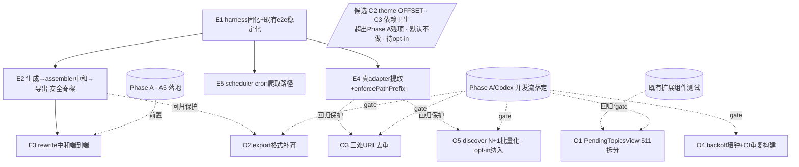

# 吃瓜管线端到端覆盖补全 + Phase A 优化残项

## Overview

把「完整优化 + e2e 测试」这条诉求落到**真正缺口**上，而非重做已在飞的工作。

经勘察确认两件事：(1)「完整优化」已由活跃计划 `2026-06-22-001-feat-maturity-and-multisite-reuse-plan.md`（Phase A 12 单元 + B1）规划且**部分已合入 main、部分由并发 Codex 流在做**——再写一份全覆盖优化会重复甚至撞库；(2) 唯一的 e2e 需求文档 `2026-06-04-iteration-and-e2e-testing-requirements.md` 是**发布器时代产物（填表/Quill/零提交），整条链已随转向删除**，不可作 origin。

故本计划**以 e2e 为主、优化为辅**（用户拍板）：**Phase 1** 补全后端吃瓜管线的端到端覆盖（既有 `gossip-pipeline-e2e.test.ts` 只覆盖中段，漏掉产品两端与防幻觉核心）；**Phase 2** 只补 Phase A 明确**不做**的低优先优化残项，且全程受 Phase 1 的 e2e 回归保护。e2e 既是「先建的安全网」也是「最后的 CI 绿门」，同时满足「最后进行 e2e 测试」的最终验证语义与「先锁后改」的工程稳健。

## Problem Frame

产品命脉是 `锁定 URL → 爬取 → AI 提炼吃瓜草稿 → 预览/编辑 → 导出 JSON/Markdown（绝不发布/写回）`。但唯一的端到端测试 `packages/backend/src/gossip-pipeline-e2e.test.ts` 只锁住**中段**：`from-url 发现 → 窗口过滤 → 验证 → 人工核对 → 题材过滤 → 指纹去重 → 结构性 no-publish 守护`，且 mock 掉网络层（`fetchContent`/`fetchListPaged`）与 LLM（`gossipExtractFacts`）。

它**没有覆盖**：
- **下游导出**——产品的最终产物 `export.ts`（`assembleDraftJSON`/`assembleDraftMarkdown`）端到端零覆盖。而沉淀学习明确指出**防幻觉真正的 sink 是 verbatim JSON 导出**（`export.ts:47`），不是未来页面渲染。
- **中段草稿生成 + assembler 中和 + rewrite 中和（A5）**——防幻觉的心脏。`generateDraft`（`draft-gen.ts:186`）生成路径的真 sink 是 assembler 的 `sanitize+esc` 中和（`post-assembler.ts:124-137`）+ verbatim 导出，**没有**「facts → 生成 → 中和 → 导出」的端到端证明（grounding 闸 `:334` 在此路径结构性恒过、不是 sink，见 Key Decisions）。
- **上游真 adapter 的 HTML 提取**——`fetchContent` 被 mock，真实 `extractBody`/og-meta/列表翻页/SSRF path-prefix 从未被 e2e 走过。
- **e2e 自身的稳定性债**——`Date.now()` 直接驱动窗口边界（flaky 隐患）、`process.env.LLM_*` 改后不还原（跨测试污染）、无独立 `test:e2e` 入口。

受影响的人：维护者（你 + AI 协作）。优化残项（Phase A 标注「不做」的低优先项）则是日常体验与可维护性的长尾。

## Requirements Trace

无现存有效需求文档（旧 e2e 文档已过时），以下 R1–R7 由用户诉求 + 净新缺口分析推导（planning bootstrap）。

| 需求 | 实现单元 |
|---|---|
| R1 导出脊樑端到端锁定（当前 e2e 止于题材池） | E2 |
| R2 防幻觉不变量端到端可证伪（模型注链接 → 闸/中和 → 导出零未注源链接） | E2, E3 |
| R3 上游真 adapter HTML 提取 + 两条爬取入口被覆盖（当前全 mock、scheduler 无端到端） | E4, E5 |
| R4 e2e 确定性 + 可进 CI（注入时钟、还原 env、独立入口与闸） | E1 |
| R5 防假绿（每条 e2e 配「故意改坏→变红」反向验证） | E1, E2, E3, E4, E5 |
| R6 优化残项在 e2e 保护下落地（严格 = Phase A deferred 清单；研究新发现项为 opt-in 候选 C1–C3） | O1, O2, O3, O4 |
| R7 不放松硬约束（no-publish / SSRF fail-closed / verbatim 注入）—— e2e 守护而非削弱 | E1, E2, E4, E5 |

## Scope Boundaries

- **不自动化扩展 side panel UI 的端到端**（用户选「后端管线集成为核心」，且沿用 2026-06-04 决定）；side panel 交互继续由现有 jsdom 组件测试（`App.test.tsx`/`ExportPanel.test.tsx` 等）覆盖。
- **不碰真站、不自动登录抓取、不加主动探针**；e2e 全程无真实网络、无真实 LLM。
- **不新增重型 e2e runner**（无 Playwright / Vitest browser mode）；后端 e2e 是 in-process Fastify + 注入网络/LLM 缝，毫秒级、确定性高、可进 CI。
- **两条爬取入口都在 e2e 范围内**：手动 `from-url`（既有覆盖，E1 稳定化）+ cron `scheduler` 自动爬取（E5 新增）——后者是活路径，不可遗漏；但 cron **触发机制**（node-cron 计时）不测（直接调 scheduler 的 crawl-once 函数，不等真实定时）。
- **不重复 Phase A/B1 已规划的优化**：死代码切除、3 个安全洞、可观测接真、版本/CI 可复现、文档诚实、多站点可配置——这些归 `2026-06-22-001` 计划。本计划优化部分**只补 Phase A 明确不做的残项**（见其 Scope Boundaries 末段）。
- **不放松任何硬约束**：no-publish、SSRF allowlist fail-closed + 每跳复检、anti-hallucination verbatim 注入是不变量。

## Context & Research

### Relevant Code and Patterns

- **既有 e2e 范式**（直接扩展靶子）：`packages/backend/src/gossip-pipeline-e2e.test.ts` —— in-process `Fastify()` + `registerGossipRoutes`/`registerPendingRoutes`，真 `verifyCrawledTopic` + 真 pending-store（临时 DB，`test-setup.ts` 指向），`vi.mock` 掉 `generic-adapter`（`fetchContent`/`fetchListPaged`）与 `gossip-fact-extractor`（`gossipExtractFacts`），用 `app.inject` 驱动。已含结构性 no-publish 断言（`printRoutes()` not.toMatch `/publish|batch|fill|runBatch/i`）。
- **SSRF 守卫 fail-closed 拒私网**：`ssrf-guard.ts:26-27` 拒 `127.0.0.0/8`/`10/8`，`:91-93` 拒 `::`/`::1`。**故 e2e 不能起真本地 server（会被守卫拒）**——必须在 fetch 出口注入 fixture，沿用既有 mock 范式。
- **adapter fetch 出口**：`generic-adapter.ts` 的 `fetchContent`（`:205`）/`fetchListPaged`（`:155`）/`fetchList`（`:136`）走 `safeFetch(url, init, { allowlistCheck })`（`:71/:210/:219`）。真 HTML 提取（`extractBody`/og-meta）在 `safeFetch` 返回之后——E4 的注入点应在 `safeFetch` 边界喂 fixture `Response`，保留提取逻辑真实、绕开真网络。
- **导出纯函数**：`packages/shared/src/export.ts` —— `assembleDraftJSON`（`:31`）/`assembleDraftMarkdown`（`:151`）/`assembleTopicsCSV`（`:105`）/`escapeCsv`（`:88`，已修公式注入）。导出在**扩展端**（`ExportPanel.tsx`/`DraftPreview.tsx`）调用，但逻辑是 shared 纯函数 → e2e 可在后端测试进程直接对 `generateDraft` 产物跑 shared 导出（无需 UI）。已有单测 `export.test.ts`（shared + extension 各一）。
- **草稿生成 + grounding**：`draft-gen.ts:186` `generateDraft` → `:316` `assembleGossipDraft`（散文经 `post-assembler.ts:124-137` `sanitize+esc` 中和）→ `:334` grounding 守卫 `hasUnsourcedLink(verifyLinks(draft.body, …))`——**但 body 已中和、此闸结构性恒过**（`:331` 注释自陈，纵深防御）→ `:343` `evaluateQuality` → `:355` `recordQuality`（A12 **已接线于 main**）。真 sink ＝ assembler 中和 + `export.ts` verbatim 导出。
- **测试基建现状**：`pnpm -r test` 已含该 e2e；shared 已有 `vitest.config.ts` + `test` 脚本（A2 部分已落）；CI（`ci.yml`）已用 `node-version-file: .nvmrc`，流程 = shared build → `pnpm -r compile` → `lint:ci` → `pnpm -r test` → 构建产物，另有 fixture 闸 + `pnpm audit` + gitleaks。无 `test:e2e` 脚本、无 e2e 专属 config。
- **基线成熟度（勘察实测）**：106 测试文件 / **~1289 用例**（backend ~718、extension ~524、shared ~47）+ 5 个 preflight 安全闸；四包 `strict:true`（extension 另开 `noUncheckedIndexedAccess`）；src 中**零** `.skip/.only/.todo`、非测试 src **零** TODO/FIXME；生产碼 escape hatch 仅 2 处（`channel-store.ts:175` DNS、`ssrf-guard.ts:273` dispatcher，均合理）。**publisher 残留已彻底清除**（batch 链路 commit `a88d0640` 删 722 行；`fillForm`/`writeBack`/`submit` 全 0 匹配；扩展权限仅 `storage/sidePanel/alarms` + host 仅 `127.0.0.1:3002`）。**结论：「完整优化」大半已成 → 本计划重心放 e2e 缺口，优化为辅。**
- **两条爬取入口并存（关键，原计划遗漏）**：除手动 `from-url`，`scraper/scheduler.ts` 的 **node-cron 自动爬取是活路径**——`index.ts:33` 开机 `startBackgroundJobs(app)` → `startScheduler` 对 `enabled && cron && url` 站点起 job → 同样走 `crawl → fetchContent → gossipExtractFacts → pending-store`。既有 e2e **只覆盖 from-url**，scheduler 端到端无覆盖（仅 `scheduler.test.ts` 单测）。任何 e2e/优化都须把这条算进去。
- **无浏览器级 e2e**：全仓无 Playwright/Puppeteer/WebDriver；extension `vitest.config.ts` exclude 了 `tests/e2e/**` 但该目录不存在（harness 未实作）；preflight 自承 `extension-load-smoke`/`crawl-target-smoke` **只能手动**。本计划维持后端管线集成层（用户拍板），不补浏览器级。
- **勘察实测 perf 热点**：🔴 discover 端点 `gossip-routes.ts:163-167` 对 `fetchListPaged` 回的最多 200 URL **逐个**跑 `pendingTopicExistsBySourceUrl()` 同步 `.get()`（单请求最多 200 次串行 DB roundtrip）；🟡 theme 端点 `pending-routes.ts:156` 硬编 `listPendingTopics(200)` **无 OFFSET 翻页**（>200 笔后新题材永不可见）；🟡 同步 `.get()/.all()` 标 async 实为 better-sqlite3 同步阻塞、读无超时（WAL 下实务风险低）。已有保护：`MAX_PAGES=50`/`MAX_PAGED_URLS=200`/列表 LIMIT cap 500 + ORDER BY 白名单。
- **依赖/版本卫生**：major 落后 `undici 6→8`/`@fastify/cors 10→11`/`dotenv 16→17`/`@types/node 22→26`/`jsdom 25→29`；**jsdom 版本错位**（root devDep `^25` vs extension `^29.1.1`，影响测试环境一致性）；**Node 版本三处不一致**（本机 22 / CI `.nvmrc` 20 / `release.yml` 硬编 22 / `engines >=20`）。biome 多规则降 warn（`noExplicitAny`/`noNonNullAssertion` 不擋 CI）——型别退化靠 review 把关。

### Institutional Learnings

- `docs/solutions/developer-experience/vitest-excludes-dist-phantom-backend-p0`：vitest 只从 `src/` 收 `*.test.ts`，**先实跑再修任何报错测试**；包名是 `51guapi-backend`（非 scope 名）。
- `docs/solutions/developer-experience/extension-http-client-testability-injection-seam`：注意死参 `_fetchFn`；走 shared `fetchWithTimeout` 时 `vi.stubGlobal("fetch")` 拦不住；注入缝须配 `toHaveBeenCalledOnce()` 证其活。
- `docs/plans/archive/2026-06-04-001-feat-iteration-e2e-testing-plan.md`（completed，发布器时代，**当方法论读**）：**先做净新价值分析**（别建与单测重叠的 do-nothing baseline）；e2e 与单测拓扑分离；contract 从生产配置派生（非手抄）；每条配「故意改坏→变红」；诚实写明 e2e 测不到什么。
- `docs/solutions/best-practices/incremental-pr-adversarial-verification`：错误映射闭合枚举 + **负向断言**（`expect(msg).not.toContain("sk-")`）证泄漏缺席；retry 仅 429/5xx + 每次新 `AbortController`；一 unit 一 PR、CI 绿再下一个。
- `docs/plans/2026-06-22-001`（A4a/A5）：动安全前**先补特征化测试冻结基线**；rewrite 安全模型二轮审稿终定「纯散文 + 导出前 `sanitizeToPlainText`+`esc` 中和，不依赖任何客户端允许集」——**E3 的断言目标即此**。
- **多 agent 同仓并发**（MEMORY.md + 多份计划反复警告）：本仓库多次被「2 个 Claude + 1 Codex」撞库/污染工作树。**Phase 2 动源码前必确认单 agent + git 干净基线 + worktree 隔离**。

### External References

未做外部研究：工作全在现有代码库内、本地范式充足（in-process Fastify e2e、`vi.mock` 注入、shared 导出纯函数、`vi.useFakeTimers` 均有现成用法）。

## Key Technical Decisions

- **e2e 边界 = in-process Fastify + 注入 fetch/LLM 缝，不起真本地 server**：因 SSRF 守卫 fail-closed 拒 `127.x`/私网（`ssrf-guard.ts:26-27`），真本地 server 必被守卫拒；既有 e2e 已用 `vi.mock` 擋网络/LLM，沿用此范式，确定性高、可进 CI。
- **防幻觉脊樑 e2e 直接 import shared 导出函数，不经扩展 UI**：用户选「后端管线集成为核心」。导出虽在扩展端调用，但逻辑是 shared 纯函数 → e2e 对 `generateDraft` 产物直接跑 `assembleDraftJSON`/`assembleDraftMarkdown`，断言 facts verbatim 落入导出 + **零未注源链接**。这是 A5「真 sink 是 verbatim JSON 导出」的端到端证明，也是本计划**最高价值净新覆盖**。
- **e2e 既是安全网（先建）也是最终闸（CI 绿门）**：Phase 1 先把 e2e 建齐并锁住当前行为（characterization），Phase 2 优化残项受其保护，CI 的 e2e 绿是发布闸。如此同时满足「最后进行 e2e 测试」（最终验证语义）与「先锁后改」（工程稳健）——二者不冲突。
- **注入时钟而非裸 `Date.now()`**：用 `vi.useFakeTimers()` + `vi.setSystemTime(固定时刻)` 让**测试与生产代码（窗口过滤）看同一时钟**，消除窗口边界 flaky；`afterEach` 还原 `process.env.LLM_*`（save/restore）消除跨测试污染。这是行为保持的测试加固，零生产改动。
- **不引入重型 e2e config 分离**：既有 e2e 是 in-process 毫秒级，留在主 `test` 套件内；`test:e2e` 仅作 glob 过滤的便捷入口 + CI 专属命名 step（可见性），避免过度工程（与 2026-06-04 的独立 config 不同——彼时担心真 Quill/重型 runner 拖慢，此处无该负担）。
- **优化残项严格 gated 在 Phase A 之后**：Phase A/Codex 并发流未停前**不动 Phase 2 源码**（learnings 多 agent 撞库）；每残项受 Phase 1 e2e 回归保护；动手前确认单 agent + `git status`/`git diff` 干净 + 必要时 worktree 隔离。Phase 1（多为新增测试文件）撞库风险低，可先行。
- **每条 e2e 配「故意改坏→变红」反向验证**：防假绿（沉淀学习铁律）；安全类 e2e 用 `not.toContain` 负向断言证泄漏缺席。

## Open Questions

### Resolved During Planning

- **e2e 深度** → 后端管线集成为核心，不自动化扩展 UI（用户拍板）。
- **e2e 靶子机制** → 注入 fetch/LLM 缝（非真 server；SSRF 拒私网）。
- **旧 e2e 需求文档（2026-06-04）** → stale（发布器时代），不作 origin，仅取其测试方法论。
- **「优化」定位** → 严格只补 Phase A 明确不做的残项（O1–O4 = Phase A deferred 清单逐字项；范围审稿确认）；勘察新发现的非清单项（discover N+1、theme OFFSET、依赖卫生）隔离为 opt-in 候选 C1–C3，默认不做。
- **E2 的真 sink 是 assembler 中和、不是 grounding 闸**（可行性审稿 P0）→ grounding 闸（`draft-gen.ts:334`）在 gossip 路径**结构性恒过**（`:331` 注释自陈），因模型散文先经 `post-assembler.ts:124-137` 的 `sanitize+esc` 中和才进 `body`；故 E2 断言中和、不断言 `kind:"grounding"`。grounding reject 留 `link-source.test.ts` 单测。
- **E4 的 SSRF 覆盖边界**（可行性审稿 P0）→ mock `safeFetch` 仅覆盖 `enforcePathPrefix`(前)+`readBodyCapped`(后)+真提取；allowlist-per-hop/IP-pinning 在 `safeFetch` 内、被绕过、留单测，E4 不声称覆盖。
- **E5 无需生产 seam 改动**（可行性审稿）→ 复用 `scheduler.test.ts:79-82` 的 cron-spy 捕获 callback 范式即可驱动真 crawl-once；mock `./fact-extractor.js`（非 `gossipExtractFacts`）。
- **A12 是否还需接线** → 否，`recordQuality` 已于 main 接入（`draft-gen.ts:355`）；E2 仅做端到端验证。
- **浏览器级 e2e（Playwright/UI 加载）** → **明确不做**（用户选后端管线集成为核心）；扩展 UI 加载 + 真站爬取由 preflight 的手动冒烟兜（现状）。
- **勘察发现但本轮不做的项** → ① metrics counters 未接线（`TODOS.md` P2，部分 counter 回 0）——部分已被 A12 覆盖，残余归 Phase A/后续；② biome 规则偏宽（`noExplicitAny`=warn、`noNonNullAssertion`=off）收紧——会产生大面 churn 且撞 Phase A，本轮不动；③ undici/cors/dotenv major 升级——归 renovate。三项记录在案，非本计划范围。

### Deferred to Implementation

- **[阻塞 E3] A5 落地时点**：E3（rewrite 中和 e2e）的断言目标（rewrite 路径的 `sanitizeToPlainText`+`esc` 中和）须在 Phase A 的 A5 merge 后才存在（rewrite 路径当前不中和、A5 才补）。若 A5 未落地，E3 **降级为 `draft-rewrite.test.ts` 单测层 placeholder**，待 A5 后升级为端到端。
- **[Technical] `test:e2e` 进 CI 形态**：新增独立 step 还是并入现有 `pnpm -r test`（e2e 已在套件内）——倾向并入 + 一个 e2e 专属冒烟 step 名做可见性；落地定。
- **[Technical] E4 列表多页 fixture 设计**：详情页 fixture 直接；列表→详情翻页 fixture 需覆盖 `MAX_PAGES`/`nextHost!==startHost` 复检的多页样例形态，开工时按真站结构塑形。（注入点已定：mock `safeFetch` 返回，见 E4。）
- **[依赖 post-Phase-A 状态] 残项精确行号**：`PendingTopicsView` 行数（勘察=511，Phase A A9 会再改）、三处 URL 提取确切位置——Phase A 正改这些文件，O1–O4 与候选 C 的 file/行号在开工时复核。

## High-Level Technical Design

> *以下为方向性示意，仅供评审验证思路，非实现规范；实现 agent 应当作上下文而非照抄的代码。*

**吃瓜管线 e2e 覆盖地图（绿=已覆盖，红=本计划补）：**

| 管线阶段 | 当前 e2e 覆盖 | 本计划单元 |
|---|---|---|
| URL → `fetchContent`/`fetchListPaged`（真 HTML 提取 / og / 翻页 / SSRF path-prefix） | ❌ 全 mock | **E4** |
| cron `scheduler` 自动爬取入口 → crawl → pending（活路径） | ❌ 仅单测 | **E5** |
| `gossipExtractFacts`（LLM 提炼） | ❌ mock（外部 LLM，保持 mock） | —（边界，不测真 LLM） |
| `from-url` → 窗口过滤 → 验证 → 指纹 → pending-store | ✅ 已覆盖 | E1（稳定化） |
| 人工核对 → 题材池 → 题材过滤 | ✅ 已覆盖 | E1（稳定化） |
| facts → `generateDraft` →（assembler `sanitize+esc` 中和，已在 main）→ quality | ❌ 仅单测 | **E2** |
| rewrite → 中和（rewrite 路径，待 A5 补中和） | ❌ | **E3**（gated on A5） |
| 草稿 → `assembleDraftJSON`/`assembleDraftMarkdown` 导出（真 sink） | ❌ 仅单测 | **E2 / E3** |
| 结构性 no-publish 守护 | ✅ 已覆盖 | E1（保留+延伸） |

**单元依赖图：**

## Implementation Units

> 两个 Phase。Phase 1（e2e，多为新增测试文件，撞库风险低）先行；Phase 2（优化残项，动源码）gated 在 Phase A/Codex 并发流落定 + 单 agent 确认之后。每安全/防幻觉 e2e 用「种坏输入→确认变红」负向断言验证。

### Phase 1 — 端到端覆盖补全（主）

- [x] **E1: e2e harness 固化 + 既有 e2e 稳定化** ✅ 已实现（commit `6e6fc87a`）：`vi.useFakeTimers({toFake:["Date"]})` + `vi.setSystemTime(PINNED_NOW="2026-01-15T12:00:00Z")`（只 fake Date，不影响 Fastify 的 setTimeout/setImmediate，app.close() 不挂）；beforeEach 存 env、afterEach 先 useRealTimers() 再 close() 再还原 env；两处 `Date.now()` 改为 `PINNED_NOW.getTime()` 偏移；`packages/backend/package.json` 加 `test:e2e: vitest run --reporter=verbose e2e`。`pnpm test:e2e` 4 文件 14 测试全绿；全套 56 文件 639 测试零回归。

**Goal:** 消除既有 e2e 的 flaky/污染隐患，建独立 `test:e2e` 入口与 CI 可见性；为 E2–E4 立稳定地基。**零生产代码改动**（纯测试加固 + 脚本/CI 配置）。
**Requirements:** R4, R5, R7
**Dependencies:** 无
**Files:**
- Modify: `packages/backend/src/gossip-pipeline-e2e.test.ts`（注入固定时钟、`afterEach` 还原 `process.env.LLM_*`、窗口边界用相对固定 `now` 计算）
- Modify: `package.json`（root，加 `"test:e2e"`）、`packages/backend/package.json`（加 `"test:e2e": "vitest run gossip-pipeline-e2e"` 类 glob）
- Modify: `.github/workflows/ci.yml`（e2e 可见性 step 名；倾向并入现有 `pnpm -r test` + 命名冒烟）
**Approach:**
- `beforeEach` 加 `vi.useFakeTimers()` + `vi.setSystemTime(固定 ISO)`，让窗口过滤（生产 `verifyCrawledTopic` 的 `Date.now`）与测试 `recent/old` 计算看同一钟；`afterEach` `vi.useRealTimers()`。
- 保存/还原 `process.env.LLM_ENDPOINT`/`LLM_API_KEY`（`afterEach` 复原原值），消除对其他测试文件的污染。
- 窗口边界确定化：构造「恰在窗内边缘」与「恰在窗外边缘」两点，证边界判定可重现。
**Execution note:** characterization-first——加固后既有 3 个用例须**仍全绿**（证纯加固、行为不变）。先实跑确认收集到用例（避免 dist 幻影）。
**Patterns to follow:** 既有 e2e 的 `app.inject` 范式；`test-setup.ts` 临时 DB 隔离。
**Test scenarios:**
- Happy path：既有 3 用例在 fake timers 下全绿。
- Edge：窗口恰在边缘的两点（窗内/窗外）判定可重现（非依赖真实墙钟）。
- Integration（防污染）：e2e 跑完后 `process.env.LLM_*` 还原为运行前值（断言）。
- Anti-false-green：把某「窗内」用例的 `windowDays` 调到使其落窗外 → 期望 `skipped: "too-old"`（证窗口逻辑真在判）。
**Verification:** `pnpm test:e2e` 独立可跑；既有用例全绿；env 不泄漏；窗口边界确定。

- [x] **E2: 生成 → grounding → 导出 安全脊樑 e2e（最高价值）** ✅ 已实现（commit `0dbe82fb`）：`draft-export-e2e.test.ts`，真 generateDraft + 真 shared assembler，经 LlmDeps.fetchFn 注入，4 测试绿。Finding：`titleSuffix` 绕过 sanitizeToPlainText（post-assembler.ts:107），模型可在标题后缀夹 URL 进导出物 verbatim——待独立修复。

**Goal:** 端到端锁住「facts → `generateDraft` →（生成路径 assembler 中和）→ 导出 JSON/Markdown」，证 **facts verbatim 落入导出 + 模型在散文里夹的任何链接被 assembler 中和、绝不进导出物**（防幻觉真 sink = verbatim 导出）。
**Requirements:** R1, R2, R5, R7
**Dependencies:** E1
**Files:**
- Create: `packages/backend/src/draft-export-e2e.test.ts`
- Test 驱动：真 `generateDraft`（`draft-gen.ts:186`，live 路由 `POST /api/v1/drafts/generate` `app.ts:241`）+ 真 shared `assembleDraftJSON`/`assembleDraftMarkdown`；经 `LlmDeps.fetchFn` 注入受控 LLM 响应（真注入缝，参照 `routes/drafts-generate-slots.test.ts:29-58`）
**Approach（按可行性审稿 P0 更正）：**
- **真 sink 是 assembler 中和，不是 grounding 闸**：`draft.body` 是 `assembleGossipDraft`→`toDraft` 的**产物**，模型散文经 `sanitizeToPlainText`+`esc`（`post-assembler.ts:124-137`，**已在 main**）剥链接/转义后才进 body。故 grounding 闸（`draft-gen.ts:334`）对已中和的 body **结构性恒过**（其 `:331` 注释自陈「结构性恒过,作纵深防御」）——`kind:"grounding"` 在 gossip 路径**不可达**。**勿断言 grounding reject**（不可达＝假绿陷阱）。
- Happy：facts（含合法 `來源連結`）+ mock LLM 纯散文 body → `generateDraft` ok → 导出 JSON 含 facts 各字段（当事人/事件摘要/…）**verbatim** + 系统从 `facts.來源連結` verbatim 注入的来源链接（模型碰不到）；Markdown 往返一致。
- 安全（P0，更正）：mock LLM 散文夹 anchor / 裸文本 / markdown 三形态 `evil.com` → 经 assembler 中和 → 断言三形态均**不进 `draft.body`、不进 JSON/Markdown 导出**（`not.toContain`）。
- grounding 闸的 reject 行为留**单测层**（`packages/shared/src/link-source.test.ts:49` 已存在，可喂裸 `body` 含 live anchor）——本端到端不重复。
- A12 交叉验证（可选）：成功生成后 `/healthz` `quality.totalGenerations` +1。
**Execution note:** test-first——先写「散文里 evil.com 三形态必被中和、不进导出」失败用例。**这是已 shipped 机制（生成路径中和在 main）**，与 E3 的 rewrite 路径中和（待 A5）是不同 sink，勿混。
**Patterns to follow:** `post-assembler.ts:124-137` 的 `sanitizeToPlainText`+`esc`；负向断言 `not.toContain`（incremental-pr 学习）；`export.test.ts` 导出断言。
**Test scenarios:**
- Happy path：合法 facts + 纯散文 body → 导出 JSON 含 facts verbatim + 系统注入的来源链接；Markdown 往返一致。
- Error path（P0）：散文夹 anchor/裸文本/markdown 形式 evil.com → assembler 中和 → 三形态均不进 `draft.body` 与 JSON/Markdown 导出。
- Integration：成功生成使 `/healthz` quality 计数 +1（A12 端到端）。
- Anti-false-green：临时移除 assembler 中和（模拟回退）→ evil.com 漏进导出 → 用例变红（证中和真在生效，而非 grounding 闸）。
**Verification:** facts verbatim 入导出；模型链接经 assembler 中和、零进导出（负向断言）；**不**误判 grounding 闸为 reject 路径；A12 计数反映真实生成。

- [x] **E3: rewrite 中和 端到端（A5）** ✅ 已实现（commit `54019dcd`，A5 f2879cef 先合入 main）：`draft-rewrite-e2e.test.ts`，vi.stubGlobal("fetch") 拦截全局 fetch，rewriteDraftLlm 走真实实现，4 测试绿；覆盖 anchor 链接中和、omit-path P0（模型省略 body 时客户端裸文本 URL 仍被无条件中和）、happy path、failedDims 空→400；anti-false-green 验过（翻转 omit-path 断言 → 变红）。与 draft-rewrite.test.ts 的差异：本单元走 HTTP 路由层（POST /api/v1/drafts/rewrite），彼单元直测服务函数（fetchFn 注入）。

**Goal:** 端到端证 rewrite 路径模型输出经「纯散文 + 导出前中和」后，任何形式链接（anchor / 裸文本 / markdown）均不进导出物，客户端无法自我放行。**与 E2 的关键区别**：生成路径（E2）的 assembler 中和**已在 main**；rewrite 路径（`draft-rewrite.ts`）当前**接受模型 body verbatim、不中和**——A5 才补上中和。故 E3 的 A5 gate **是实的**（中和逻辑确实尚不存在于 rewrite 路径），非冗余。
**Requirements:** R2, R5
**Dependencies:** E2；**Phase A 的 A5 必须已 merge**（rewrite 路径中和逻辑由 A5 引入，A5 前不存在）
**Files:**
- Create/Modify: `packages/backend/src/draft-rewrite-e2e.test.ts`（A5 后）；A5 未落地时退至 `services/draft-rewrite.test.ts` 单测 placeholder
**Approach:**
- rewrite body 夹 anchor / 裸文本 / markdown 三形态 `evil.com` → 经 A5 的 `sanitizeToPlainText`+`esc` 中和 → 断言三形态均被中和、且导出 JSON/Markdown 零 evil.com。
- 证「客户端把 evil.com 塞进 `draft.body` 也无法自我放行」（无服务端 ground truth → 不依赖任何客户端允许集，A5 终定）。
**Execution note:** gated——A5 未 merge 则本单元只落单测 placeholder，PR 描述注明「待 A5 升级为端到端」。test-first。
**Patterns to follow:** A5 单元的中和范式（`post-assembler.ts` 的 `sanitizeToPlainText`+`esc`）；E2 的导出负向断言。
**Test scenarios:**
- Error path（P0）：rewrite body 含 anchor/裸文本/markdown 形式 evil.com → 均被中和、不进导出。
- Error path（P1）：rewrite 在 `title` 或某 `tags[]` 返回 URL → 中和。
- Happy path：rewrite 返回纯散文（无链接）→ 通过、导出正常。
- Anti-false-green：移除中和（模拟回退）→ 用例变红（证中和真在生效）。
**Verification:** rewrite 三形态链接零进导出；客户端无法自我放行；A5 不变量端到端可证伪。

- [x] **E4: 真 adapter HTML 提取 e2e（上游缺口）** ✅ 已实现（commit 待标）：`adapter-extraction-e2e.test.ts` + 4 个合成 fixture，端到端覆盖 extractContainerText 配平 / extractByDensity / 流式 CJK 重组 / enforcePathPrefix；4 测试绿、anti-false-green 验过。**勘误**：`check-fixture-secrets.sh` 闸路径硬锚 extension/，**不扫** backend `__fixtures__/`，脱敏靠合成内容本身保证。

**Goal:** 覆盖当前被 mock 掉的真实提取层——`fetchContent`/`fetchListPaged` 的 `extractBody`/og-meta/列表翻页，外加 `enforcePathPrefix`（路径前缀）+ `readBodyCapped`（字节上限），在 fetch 出口注入 fixture HTML（绕真网络）。
**Requirements:** R3, R5, R7
**Dependencies:** E1
**Files:**
- Create: `packages/backend/src/adapter-extraction-e2e.test.ts`、`packages/backend/src/__fixtures__/`（脱敏的样例详情页 + 列表页 HTML）
**Approach（按可行性审稿 P0 更正——明确 SSRF 覆盖边界）：**
- mock `safeFetch` 返回 fixture `Response` → 跑**真** `fetchContent`/`fetchListPaged`。**三件套不同层、mock safeFetch 后只剩两件可端到端测**：
  - ✅ `enforcePathPrefix` 跑在 `safeFetch` **之前**（`generic-adapter.ts:207`/`:63`）→ **存活**，可端到端测路径越权拒。
  - ✅ `readBodyCapped` 跑在 `safeFetch` **之后**（`:228`/`:90`）→ **存活**。
  - ❌ `allowlistCheck` 每跳复检在 `safeFetch` **内部**（`ssrf-guard.ts:260`）、私网 IP-pinning 亦在内部（`:257-285`）→ **被 mock 绕过，本单元不覆盖**；这两件仍由 `ssrf-guard.test.ts`/`guarded-fetch.test.ts` 单测 + A4a 特征化守护（**勿在 E4 声称端到端覆盖它们**——那正是 mock 掉的函数）。
- 断言 `RawContent`（title/body/og publishedTime）提取正确；`fetchListPaged` 对 fixture 列表发现 URL + `nextHost!==startHost` 跨源复检（host 比较，不依赖 safeFetch 内部，存活）。
- fixture HTML **必须脱敏**（无 token/cookie/PII），顶部注释记录来源/日期。
**Execution note:** 注入点取 mock `safeFetch` 返回（最简，覆盖提取 + path-prefix + byte-cap）。若将来要端到端测 allowlist/pinning，须在真 `safeFetch` **下方**打桩 undici（更难，本轮不做）。
**Patterns to follow:** 既有 `generic-adapter.test.ts`/`guarded-fetch.test.ts` 注入；脱敏 fixture（`check-fixture-secrets.sh` 闸会扫）。
**Test scenarios:**
- Happy path：fixture 详情页 → `fetchContent` 提取正确 title/body/publishedTime。
- Edge：fixture 列表多页 → `fetchListPaged` 发现 URL 且尊重 `MAX_PAGES`；`nextHost!==startHost` 跨源链接被复检拒。
- Error path：fixture URL 越 `path_prefix` → `enforcePathPrefix` 拒（piece 1，存活，端到端可测）。
- Anti-false-green：改坏 fixture 关键容器 → body 提取断言变红。
**Verification:** 真提取层 + `enforcePathPrefix` + `readBodyCapped` 端到端覆盖；**allowlist-per-hop / IP-pinning 明确不在本单元**（留单测，避免假声称）；fixture 脱敏过闸。

- [x] **E5: scheduler（cron）自动爬取路径 e2e** ✅ 已实现（commit 待标）：`scheduler-pipeline-e2e.test.ts`，cron-spy 捕获 callback + **真 pending-store（临时 DB）**，4 测试绿、anti-false-green 验过。**P0 勘误（计划原声称不成立，已按实改正）**：scheduler 经通用 `extractFacts`、build topic **不设 domain** → 入池 `domain='acg'`（**非** from-url 的 `'gossip'`），facts 亦是 ACG 形状 `FactsBlock`。故「与 from-url 产出一致 / domain='gossip'」**为假**；本单元改为**特征化当前 'acg' 行为**并断言之。**新 finding（待定）**：cron 自动爬取的选题永不进吃瓜池（pending 视图过滤 `domain='gossip'`）——ACG 时代排程管线未随吃瓜化迁移，修复属生产改动、留作独立单元。

**Goal:** 覆盖第二条活爬取入口——`scheduler` 的自动爬取 → `crawl → 提炼 → pending-store`，证其与 from-url 同样守 no-publish、入池正确。当前仅 `scheduler.test.ts` 单测，无端到端。
**Requirements:** R3, R5, R7
**Dependencies:** E1（harness 稳定）。**零生产碼改动**（可行性审稿确认：seam 已存在，见下）。
**Files:**
- Create: `packages/backend/src/scheduler-pipeline-e2e.test.ts`
- 驱动：真 scheduler 的 crawl-once（经 cron-spy 捕获，**不等 node-cron 定时**）+ 真 pending-store（临时 DB）；mock 网络/LLM 出口
**Approach（按可行性审稿更正——无需暴露内部 seam）：**
- **复用 `scheduler.test.ts:79-82` 既有范式**：`vi.mock("node-cron")` 使 `cron.schedule` 成 spy → `startScheduler(deps)` → 从 spy 取回注册的 callback（`return calls[0][1]`）→ 手动 `await` 它。该 callback **就是** crawl-once 入口（`scheduler.ts:287-301`），跑真 `runListDiscovery`/`runSingleUrl`。`runListDiscovery`/`runSingleUrl` 虽未导出，但经此捕获即可驱动，**零生产改动**。
- **mock 目标更正**：scheduler 经 `extractFacts`（`fact-extractor.ts:66`）提炼，**不是** gossip 路由的 `gossipExtractFacts`——E5 须 mock `./fact-extractor.js`（同 `scheduler.test.ts:23`）+ `fetchContent`。
- 断言入池、`domain='gossip'`、verification/指纹齐备，与 from-url 路径产出一致；**不测真实 cron 计时触发**（边界）。
**Patterns to follow:** `scheduler.test.ts:16-20/79-82` 的 cron-spy 捕获 + await callback；`gossip-pipeline-e2e.test.ts` 的 in-process + 临时 DB。
**Test scenarios:**
- Happy path：捕获的 callback await 一次 → pending 入池，字段与 from-url 路径等价。
- Edge：`enabled=false` 或无 `cron`/`url` 的站点不注册 job（`startScheduler` filter，`scheduler.ts:267`）。
- Integration（no-publish）：scheduler 路径全程无 publish/写回（结构性 + 行为断言）。
- Anti-false-green：mock fetch 返回空/过短正文 → 不入池（证 scheduler 也走 verify 闸）。
**Verification:** scheduler 自动爬取入口端到端覆盖（零生产改动）；mock `extractFacts` 非 `gossipExtractFacts`；与 from-url 产出一致；no-publish 守护在两条入口都生效。

### Phase 2 — Phase A 残项（辅，gated；严格 = `2026-06-22-001` 的「不做」清单）

> 全部 gated 在 Phase A/Codex 并发流落定 + 单 agent 确认 + `git` 干净基线之后；每单元受 Phase 1 e2e/既有测试回归保护（characterization）。**严格对齐 Phase A 计划的 deferred 清单**（范围审稿确认逐字项）：PendingTopicsView 拆分 / export 格式补齐 / 三处 URL 去重 / backoff 墙钟预算 / CI 重复构建。勘察新发现的**非清单**项（discover N+1、theme OFFSET、依赖卫生）移到下方「候选」小节，**默认不做、待你 opt-in**——守住你「优化只补 Phase A 残项」的边界。开工时复核 file/行号（Phase A 正改这些文件）。

- [ ] **O1: `PendingTopicsView` god-component 拆分** *(Phase A 清单逐字项)*

**Goal:** 把超大组件（勘察实测 **511 LOC、11 个 `useState`**、approve / quick-draft **两条平行工作流逻辑重复**、fetch+LLM+CSV export+题材过滤+事实编辑+验证全挤一处）按既有 `pending/` 子组件范式拆分，降可维护负担。**行为保持**。
**Requirements:** R6
**Dependencies:** Phase A 的 A9（扩展死代码删除，**同改此文件区域**）merge；单 agent 确认。**回归保护＝既有扩展组件测试**（非 E2——E2 是后端，保护不到扩展 UI；coherence 审稿更正）。
**Files:**
- Modify/Create: `packages/extension/entrypoints/sidepanel/PendingTopicsView.tsx`（511 LOC）→ `pending/` 子组件（镜像前次 U6 拆分 `PendingTopicsView 716→482 → pending/ 3 子组件` 的范式）
**Approach:** 门面保 API（公开导出/props 不变）；纯结构拆分，state 编排不变（仿 Deep 重构 U5/U6）。优先把 approve / quick-draft 两条重复工作流抽成共用 hook/子组件（重复是主要可维护负担）。**注意 A9 也改本文件**——必在 A9 merge 后、单 agent、worktree 隔离下做。
**Execution note:** characterization-first——拆前跑既有组件测试捕现行行为；worktree 隔离避免撞 Phase A。
**Patterns to follow:** 既有 `pending/`/`main/`/`gossip/` 子组件拆分；门面 re-export 不变量。
**Test scenarios:**
- Happy path：扩展构建 + side panel 加载，待审/核对/题材主流程可用。
- Integration：既有 `PendingTopicsView` 相关组件测试拆分前后全绿（行为保持）。
- `Test expectation: 行为保持，由既有组件测试 + 构建冒烟守护`。
**Verification:** 组件测试全绿；side panel 冒烟通过；公开 props/导出不变。

- [ ] **O2: export 格式补齐** *(Phase A 清单逐字项)*

**Goal:** 补全 `export.ts` 的格式覆盖缺口（Phase A 列为「不做」的低优先项）。
**Requirements:** R6
**Dependencies:** Phase A 落定；**E2**（facts-verbatim 脊樑保护——E2 已锁 facts 逐字落入导出，补格式不可破坏此不变量）
**Files:**
- Modify: `packages/shared/src/export.ts`、`packages/shared/src/export.test.ts`
**Approach:** 开工时枚举具体缺口（字段/schema version/边界）；纯增量、不破坏 E2 锁住的 facts-verbatim 不变量。
**Patterns to follow:** 既有 `assembleDraftJSON`/`assembleDraftMarkdown`/`escapeCsv`；`EXPORT_SCHEMA_VERSION` 版本约定。
**Test scenarios:**
- Happy path：新增格式/字段往返正确。
- Edge：CSV 公式注入/特殊字符（`escapeCsv` 已有，回归锁定）；空/缺字段降级。
- Integration：E2 的 facts-verbatim + 模型链接零进导出断言不被破坏。
**Verification:** 导出格式缺口补齐；E2 脊樑断言仍绿。

- [ ] **O3: 三处 URL 提取去重** *(Phase A 清单逐字项)*

**Goal:** 把散在三处的 URL 提取逻辑收敛到一个 shared/通用 helper，消重复。
**Requirements:** R6
**Dependencies:** Phase A 落定；E1/E4（提取路径回归）
**Files:**
- Modify: 三处 URL 提取调用点（**开工时 grep 定位复核**——Phase A 正改这些文件）、收敛入既有 shared 工具（或新建纯函数 + 单测）
**Approach:** 抽公共 helper、三处改调；保持各调用点现行输出等价（characterization）。
**Patterns to follow:** shared 纯函数 + 单测；`link-source.ts` 的 `normalizeUrl` 边界处理。
**Test scenarios:**
- Happy path：helper 对三处各自输入产出与去重前等价。
- Edge：query 乱序/带 fragment 的同源 URL 归一一致（与 A11 normalizeUrl 修复对齐）。
- Integration：E4 真提取路径与既有提取测试全绿。
**Verification:** 三处共用一 helper；提取行为等价；测试全绿。

- [ ] **O4: backoff 墙钟预算 + CI 重复构建优化** *(Phase A 清单逐字项，两件可拆两 PR)*

**Goal:** 给 `fetch-backoff` 加墙钟总预算上限；消 CI 重复构建。
**Requirements:** R6
**Dependencies:** Phase A 落定（A3 已动 CI，须在其后复核避免撞改）
**Files:**
- Modify: `packages/backend/src/services/fetch-backoff.ts`（+ 注入 sleep 测试）、`.github/workflows/ci.yml` / `scripts/check-all.sh`（避免重复 build）
**Approach:** backoff 累计墙钟 ≥ 预算即停（仿 `MAX_PAGES` 限界），retry 仍仅 429/5xx + 每次新 `AbortController`（学习不变量）；CI build 仅一次（A3 统一产物校验后复核）。
**Patterns to follow:** 既有 backoff retry 不变量；A3 的 CI 产物校验统一。
**Test scenarios:**
- Happy path（backoff）：注入 sleep，断言总墙钟受预算 clamp、retry 次数符合预期。
- Error path（backoff）：仅 429/5xx 触发 retry，4xx 不重试；每次新 AbortController（无旧 signal 误 abort）。
- `Test expectation: CI 部分为配置，靠 CI run 验证仅构建一次`。
**Verification:** backoff 墙钟有界（注入时间单测证）；CI 不重复 build；retry 语义不变。

- [ ] **O5: discover 端点 N+1 查询 → 批量化** *(用户 opt-in 纳入；研究新发现的 net-new perf，非 Phase A 残项)*

**Goal:** 消除 discover 端点的 O(n) 串行 DB 查询（勘察 🔴）——单请求最多 200 次 `pendingTopicExistsBySourceUrl()` 同步 `.get()` 改为一次批量 `WHERE source_url IN (...)`。
**Requirements:** R6（opt-in 扩展）
**Dependencies:** Phase A 落定；**E4**（真 adapter/discover 路径已有 e2e 回归）
**Files:**
- Modify: `packages/backend/src/routes/gossip-routes.ts`（`:163-167` 的 per-URL 查询循环）、`packages/backend/src/scraper/pending-store.ts`（新增批量存在性查询 `pendingTopicsExistingBySourceUrls(urls[])`，仿 `:313-331` 的动态 WHERE + 绑定数组 idiom）、对应单测
**Approach:** 收集 `fetchListPaged` 回的 URL 集 → 一次 `IN (...)` 查询得已存在集合 → 内存过滤。`MAX_PAGED_URLS=200` 远低于 SQLite 参数上限（≥3.32 为 32766）；保持去重语义与现行逐个查询**完全等价**。**风险低**：去重是优化非完整性边界——`savePendingTopic` 写时另查 `source_url`（`pending-store.ts:224-230`），漏判只多一次 `fetchContent`、**不会重复入池**。
**Execution note:** characterization-first——先用 e2e/单测捕现行 discover 输出（哪些 URL 判已存在/新），批量化后逐字等价。
**Patterns to follow:** `pending-store` 既有具名参数 + 动态 WHERE 绑定数组（`:313-331`）；ORDER BY/LIMIT 白名单。
**Test scenarios:**
- Happy path：混合「已存在 + 新」URL 集 → discover 结果与逐个查询版本逐字等价。
- Edge：空 URL 集、单 URL、200 URL（上限）→ 一次查询、结果正确。
- Performance：spy `.get`/`.all` 调用计数，断言从 O(n) 降为 O(1)。
- Anti-false-green：构造一个「已存在」URL，批量版若漏判则结果含重复 → 用例变红。
**Verification:** discover 单请求 DB roundtrip 从最多 200 降为 1；去重结果等价；E4 回归绿。

### Phase 2+ — 仍为候选（**超出 Phase A 残项清单，默认不做，需你 opt-in**）

> 以下两项由本轮代码勘察新发现，**不在** Phase A 的 deferred 清单上。按你「优化只补 Phase A 残项」的边界**默认不纳入**；若 opt-in 我升为正式单元。（C1 discover N+1 已 opt-in → 上方 **O5**。）

- **C2: theme 端点 OFFSET 分页**（🟡，`pending-routes.ts:156` 硬编 `listPendingTopics(200)`、无翻页 → >200 笔后新题材永不可见）。中等价值；做法＝可选 `offset`（默认 0、clamp、向后兼容），`listPendingTopics` 加 offset 参数。
- **C3: 依赖/版本卫生**（jsdom root `^25` vs extension `^29.1.1` 归一——影响测试环境一致；Node 版本三处不一致 `release.yml` 22 vs CI `.nvmrc` 20；major undici/cors/dotenv 归 renovate）。低风险卫生，逐项小 PR。

## System-Wide Impact

- **Interaction graph:** Phase 1 e2e 触及 `gossip-routes`/`pending-routes`/`generateDraft`/`scheduler`/shared `export`/`post-assembler`，均为**只读断言 + 新增测试文件**，爆炸半径极小。Phase 2 触及扩展 UI（O1）、shared（O2 export、O3 URL helper）、backend+CI（O4 backoff+CI）、backend 路由+store（O5 discover/pending-store）。候选 C2 才另触及 pending-routes（theme OFFSET）。
- **Error propagation:** e2e 必须覆盖错误路径（too-old skip、too-short reject、path-prefix 拒、scheduler 空正文不入池、模型链接被中和），非仅 happy path——否则只锁了乐观分支。（注意 grounding 闸在 gossip 路径结构性恒过，**不是**可断言的 reject 路径。）
- **State lifecycle:** e2e 用临时 DB（`test-setup.ts`）+ `resetPendingDb` per test；**fake timers 必须 `afterEach` 还原**，否则污染后续测试文件的真实时间依赖。pending-store 写走 `pendingWriteQueue` 序列化（O5/C2 的读改动不碰写序列化）。
- **API surface parity:** Phase 1 不改任何 API；O2 export 格式补齐是**增量**（不破坏 `EXPORT_SCHEMA_VERSION` 既有契约）；O3 URL helper 收敛不改公开签名；O1 拆分保公开 props/导出；候选 C2 theme OFFSET 为向后兼容增量、C1 新增 `pending-store` 批量查询函数（纯增）。
- **Integration coverage（单测证不到的）:** 「facts 上游注入 → 经 assembler 中和 → verbatim 落入导出物」「真 adapter 提取 + enforcePathPrefix → 入管线」「scheduler 自动爬取 → 入池」均是跨层行为，正是 E2/E4/E5 的价值；单测的 mock 边界证不到。
- **Unchanged invariants（blast-radius 保证）:** no-publish（E1 保留并延伸 `printRoutes` 结构性守护）、SSRF `enforcePathPrefix`+`readBodyCapped`（E4 端到端证；allowlist-per-hop / IP-pinning **仍由 `ssrf-guard.test.ts`/`guarded-fetch.test.ts` 单测 + A4a 守护**，E4 不端到端覆盖）、anti-hallucination verbatim 注入 + assembler 中和（E2/E3 端到端证）——本计划**守护而非改动**这些不变量；Phase 2 全部「行为保持」。

## Risks & Dependencies

| 风险 | 缓解 |
|------|------|
| Phase 2 动源码与 Phase A/Codex 并发流撞库/污染工作树（本仓库多次踩坑） | Phase 2 gated 在 Phase A 落定 + 单 agent 确认 + `git` 干净基线；worktree 隔离；只精确 stage 自己的文件 |
| **E2 误把 grounding 闸当 reject 路径**（可行性审稿 P0：gossip 路径结构性恒过、不可达，会写出不可达/假绿用例） | E2 已重构：断言 **assembler `sanitize+esc` 中和**（真 sink，已在 main）而非 grounding reject；grounding reject 留 `link-source.test.ts` 单测层 |
| **E4 mock `safeFetch` 绕过 allowlist/IP-pinning，却声称端到端测 SSRF 三件套**（可行性审稿 P0） | E4 已收窄：仅声称覆盖 `enforcePathPrefix`(前)+`readBodyCapped`(后)+真提取；allowlist-per-hop/IP-pinning **明示不覆盖**、留单测 |
| E3 依赖 A5（Phase A P0）未落地 | gate：A5 未 merge 则 E3 降级为 `draft-rewrite` 单测 placeholder，A5 后升级端到端（rewrite 路径中和确由 A5 引入，非冗余） |
| e2e 假绿（mock 太松 / 断言太弱） | 每条配「故意改坏→变红」反向验证；安全类用 `not.toContain` 负向断言 |
| e2e 与既有单测重叠成 do-nothing baseline | 已先做净新价值分析：E2/E4/E5 覆盖单测 mock 边界证不到的跨层行为，非重复 |
| fixture HTML 夹机密入仓 | E4 fixture 强制脱敏；`check-fixture-secrets.sh` 闸（CI 已有）扫拦 |
| fake timers 泄漏污染其他测试文件 | `afterEach` `useRealTimers` + env 还原；E1 加防污染断言 |
| Phase 2 动源码与 Phase A/Codex 并发流撞库（O1 与 A9 同改 `PendingTopicsView`） | Phase 2 gated 在 Phase A 落定 + 单 agent + `git` 干净基线 + worktree；只精确 stage 自己的文件 |
| 候选 C 项被误当残项混入（范围越界） | C1–C3 已隔离为 opt-in 小节、默认不做；纳入需你有意识批准 |

## Documentation / Operational Notes

- 在 `docs/` 留一句「e2e 测什么、不测什么」边界说明（沿用 2026-06-04 诚实边界精神）：覆盖后端管线脊樑 + 真提取层 + 防幻觉 sink；**不覆盖**扩展 UI 端到端（jsdom 组件测试兜）、不碰真站、不测真 LLM 提炼质量。
- `test:e2e` 入口与 CI 闸落地后，更新 `CLAUDE.md`/`AGENTS.md` 的迭代节奏段（`改代码 → pnpm test → pnpm compile → 全绿才提交` 增补 e2e 闸）。
- Phase 2 各残项遵循「一 unit 一 PR、CI 绿再下一个」。

## Sources & References

- **无 origin 文档**（旧 e2e 需求 `docs/brainstorms/2026-06-04-iteration-and-e2e-testing-requirements.md` 已过时，仅取方法论）。
- 相关在飞计划：`docs/plans/2026-06-22-001-feat-maturity-and-multisite-reuse-plan.md`（Phase A/B1，本计划优化部分的边界来源 + A5/A12 依赖）。
- 既有 e2e 靶子：`packages/backend/src/gossip-pipeline-e2e.test.ts`（仅覆盖 from-url 中段）。
- 导出真 sink：`packages/shared/src/export.ts`；生成/grounding：`packages/backend/src/services/draft-gen.ts:186/:334/:355`。
- SSRF 守卫：`packages/backend/src/scraper/ssrf-guard.ts`（`:26-27` 拒私网）；adapter：`packages/backend/src/scraper/adapters/generic-adapter.ts`。
- 第二爬取入口：`packages/backend/src/scraper/scheduler.ts`（cron 活路径，`index.ts:33` 启动）。
- 勘察实测 perf 热点：discover N+1 `routes/gossip-routes.ts:163-167`；theme 无 OFFSET `routes/pending-routes.ts:156`；oversized 组件 `PendingTopicsView.tsx`(511)/`App.tsx`(334)/`GossipView.tsx`(292)。
- 基线：~1289 用例 / strict 全开 / publisher 残留已清（commit `a88d0640`）；依赖/Node 版本卫生见 Context。
- 沉淀学习：`docs/solutions/developer-experience/{vitest-excludes-dist-phantom-backend-p0, extension-http-client-testability-injection-seam}`、`docs/solutions/best-practices/incremental-pr-adversarial-verification`、`docs/plans/archive/2026-06-04-001-feat-iteration-e2e-testing-plan.md`（方法论）。
