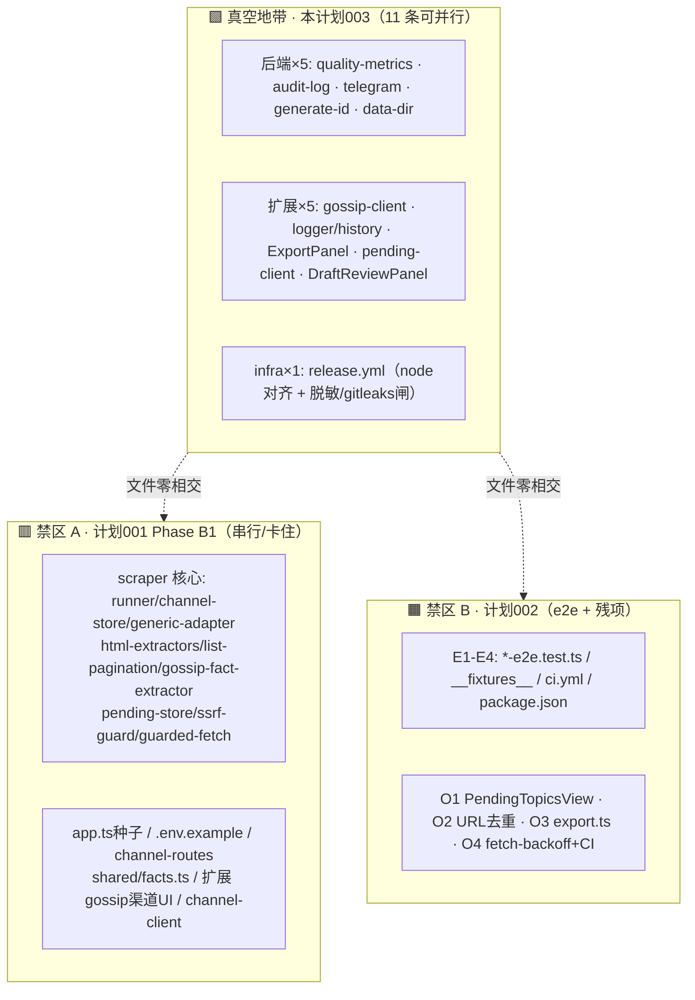

# 不撞车的并行优化清单（避开 B1 + 计划 002 的真空地带）

## Overview

**一句话结论**：现在 main 是干净的（Phase A 的 A1–A12 全部已并入、零未合分支、零 worktree、零开着的 PR），剩下两条已规划但尚未动工的「在途意图」会瓜分掉大部分热门文件——**计划 001 的 Phase B1**（多站点可配置，串行链、卡在等真站样本）和**计划 002**（吃瓜管线 e2e + Phase A 没做的低优先残项）。本计划做的事，是把这两条意图当成「禁区」，从代码库里挑出**两边都没碰、彼此也不碰、且经对抗式核验确认有价值**的优化点，整理成 **11 条可同时开工的独立工作流**，让你可以放心地把它们分给并行 agent（Claude / Codex）而不会撞库。

「这就像」三个人要在同一栋房子里装修：B1 包了厨房和承重墙（爬取/迁移/SSRF 核心），计划 002 包了客厅和水电验收（导出、PendingTopicsView、e2e）。本计划找的是**没人认领的那几间房**——书房、储藏室、阳台——你可以同时叫人进去施工，互不挡道。

本计划由一次结构化勘察生成：6 路并行侦察 agent 扫遍冷区，再对每个候选跑**对抗式撞车核验**（默认判「会撞」，除非能证明隔离）；33 个原始候选 → 17 个确认撞车安全 → 再叠加计划 002 的 footprint 二次过滤 → 13 个真空候选（合并同文件后 11 条工作流）。

## Problem Frame

操作者（单人自用）担心的核心是「撞车」——本仓库被记忆与多份计划反复记录为「2 个 Claude + 1 Codex 同仓并发，撞过库、污染过工作树」（见 `.ai-memory/project_51guapi.md` §多工作流并发现实）。所以问题不是「有哪些优化」，而是「**哪些优化现在可以并行做、且保证不和已规划的工作或彼此撞车**」。

撞车的本质是**两条工作流编辑了同一个文件**（或改了被对方依赖的公开签名/barrel）。因此「不撞车」= 编辑的文件集两两不相交，且不碰高扇入的共享面（shared barrel/types、utils/schemas）。本计划把「不撞车」做成可证伪的判据，逐候选核验。

## Requirements Trace

本计划无上游需求文档（直接由「找不撞车的并行优化」诉求 + 代码勘察推导）。判据 P1–P5：

| 判据 | 含义 | 落实 |
|---|---|---|
| P1 不撞 B1 | 编辑文件集与计划 001 Phase B1 的 NO-GO 集零相交 | 全 11 单元逐一核验 |
| P2 不撞计划 002 | 编辑文件集与计划 002 的 E1–E4 + O1–O4 footprint 零相交 | 二次过滤剔除 4 个被 002 认领项 |
| P3 彼此不撞 | 11 单元两两编辑文件不相交（含合并同文件项） | §并行批次矩阵 |
| P4 不碰高扇入共享面 | 不改 shared barrel/types、utils/schemas 公开签名 | 核验通过（改 barrel 的候选已剔除） |
| P5 真有价值且未做 | 经对抗式核验确认非「已完成/低值」 | 17 确认项均 value≥medium |

## Scope Boundaries

- **不做 B1（计划 001 Phase B1）**：爬取覆盖项、渠道 schema 迁移、env 种子、渠道配置 UI——全归计划 001，是本计划的禁区。
- **不重复计划 002**：吃瓜管线 e2e（E1–E4）与它认领的 4 个低优先残项（O1 PendingTopicsView 拆分、O2 URL 去重、O3 export 补齐、O4 backoff 墙钟 + CI 重复构建）——归计划 002。本计划**不碰**这些，仅在 §次级桶里标注「B1 安全但 002 已认领」供你决定。
- **不放松任何硬约束**：no-publish、SSRF allowlist fail-closed + 每跳复检、anti-hallucination verbatim 注入是不变量；本计划所有项**只收紧或中性**，绝不削弱（release.yml 加闸是收紧、telegram SSRF 测试是固化）。
- **不碰高扇入共享面**：不改 `packages/shared/src/index.ts`(barrel)、`types.ts`、`utils/schemas.ts` 的公开导出/签名（改它们会涟漪到全仓 = 高撞车）。
- **不做需要协调的跨流改动**：任何「抽公共 helper 进 shared 再被两端 import」的去重（如完整版 URL 去重）都因要动 barrel 或动 B1 核心而排除。

## Context & Research

### 当前地面实况（git 实测，非记忆）

- 本地仅 `main`、与 `origin/main` 平齐于 `21813942`（A6-R3）；**零未合分支、零额外 worktree、零开着的 PR、工作树干净**。记忆里「A9–A12 Codex 在做、PR #33 在 worktree」**已全部落地**——那批 Phase A 在途工作从 git 看已着陆。
- Phase A 的 A1–A12 全部并入 main（PR #33/#34/#35 + Codex 流 `d099bc00` + A6-R3 `21813942`）。A6-R3 已把 SSRF 三件套集中进 `scraper/adapters/guarded-fetch.ts`，所有 adapter（含 demo/template）共用——R3 已完成。

### 两条「在途意图」的精确 footprint（= 禁区）

**计划 001 · Phase B1**（`docs/plans/2026-06-22-001`，串行 U1→U2→U3→U4，卡在「等操作者真站 HTML 样本」）——NO-GO 集：

| B1 单元 | 编辑文件 |
|---|---|
| U1 env 种子 | `app.ts`(buildApp 种子挂载区)、`.env.example` |
| U2 覆盖列 schema | `migrations/runner.ts`、`scraper/channel-store.ts` |
| U3 贯通爬取层 | `scraper/adapters/generic-adapter.ts`、`adapters/html-extractors.ts`、`adapters/list-pagination.ts`、`scraper/gossip-fact-extractor.ts`、`scraper/pending-store.ts`、`packages/shared/src/facts.ts`(MECHANICAL_FACT_KEYS) |
| U4 渠道配置 UI | `routes/channel-routes.ts`/`scraper-routes.ts`(渠道校验)、`scraper/ssrf-guard.ts`+`guarded-fetch.ts`、扩展 `sidepanel/gossip/*`(渠道管理:AddSiteForm/ChannelWhitelistPanel/SiteCard)、`GossipView.tsx`、`lib/channel-client.ts` |

**计划 002 · e2e + 残项**（`docs/plans/2026-06-22-002`）——footprint：

| 002 单元 | 编辑/新建文件 |
|---|---|
| E1 harness 固化 | `gossip-pipeline-e2e.test.ts`、root+backend `package.json`、`.github/workflows/ci.yml` |
| E2/E3/E4 新 e2e | `draft-export-e2e.test.ts`、`draft-rewrite-e2e.test.ts`、`adapter-extraction-e2e.test.ts`、`__fixtures__/` |
| O1 | `PendingTopicsView.tsx` + `pending/` |
| O2 | URL 提取三处（= generic-adapter/list-pagination/ssrf-guard，**见下方关键发现**） |
| O3 | `packages/shared/src/export.ts` + `export.test.ts` |
| O4 | `services/fetch-backoff.ts`、`ci.yml`/`check-all.sh` |

### 关键发现（反面结论，必须告知）

- **计划 002 的 O2「三处 URL 提取去重」其实不能跟 B1 并行**：对抗核验确认，那有价值的「三处」正是 `generic-adapter.fetchListPage`、`list-pagination.resolveSameHost`、`ssrf-guard.resolveAndPin`——**全在 B1 的 NO-GO 集且都是 SSRF 安全核心文件**；唯一撞车安全的只剩 4 个边角 host 助手（scheduler/telegram/draft-gen/DiscoveredItemCard），但它们各做各的事（查 host/脱敏/协议判定/路径取名），合并几乎无去重收益，且要么动 shared barrel 要么逐包复制。结论：**O2 整体在 B1 活着时不可并行**，计划 002 也应把它排到 B1 之后。
- **计划 002 的 O4 CI 半、`ci-coverage-visibility`、`script-consolidation`** 都撞 `ci.yml`/`check-all.sh`（E1/O4 已认领）→ 本计划不碰这些，CI 优化留给 002。
- **`structured-logging-backoff`** 撞 `app.ts`（B1 种子区）→ 排除。**`dead-barrel-fingerprint`** 撞 shared barrel（P4 + B1 R24）→ 排除。

### 制度经验（落地须遵守）

- `docs/solutions/.../vitest-excludes-dist-phantom-backend-p0`：vitest 只从 `src/` 收 `*.test.ts`；**先实跑再修任何报错测试**；后端包名是 `51guapi-backend`（非 `@51guapi/backend`，filter 写错会静默跑 0 测试）；改 shared 后先 `pnpm --filter @51guapi/shared build`。
- `docs/solutions/.../fixture-secret-gate-false-green-relative-path`：脚本相对 cwd + nullglob 会假绿空扫；安全闸用「种已知坏输入→确认变红」验证（直接影响 §U11 的 release 加闸）。
- `docs/solutions/.../extension-http-client-testability-injection-seam`：扩展 client 走 shared `fetchWithTimeout`，`vi.stubGlobal("fetch")` 拦不住；注入缝须配 `toHaveBeenCalledOnce()` 证缝活（影响 gossip/pending-client 改动）。
- `.ai-memory` §多工作流并发：动 git 前确认单 agent；**只精确 `git add <具体文件>`，绝不 `git add .`**；要在脏树上隔离改动用独立 `git worktree`；pre-commit 只 compile 不跑测试——提交前手动 `pnpm -r test`。

## Key Technical Decisions

- **把两条在途意图都当成已承诺的禁区**（假设，已告知）：即便计划 002 尚未动工（git 干净），仍视其 footprint 为不可侵入，避免你日后启动 002 时回头撞车。被 002 认领但 B1 安全的 4 项单独列 §次级桶，不进主清单。
- **合并「同文件互撞」候选**：`pending-client-error-helper` + `dead-scraper-client-fns` 都改 `pending-client.ts` → 合并为单元 U9；`release-node-drift` + `release-secret-gates` 都改 `release.yml` → 合并为单元 U11。合并后 11 单元编辑文件两两不相交（P3 成立）。
- **优先级**：U11（release 加脱敏/gitleaks 闸）value=**high**——它堵的是真 fail-open（PR 必过两道安全闸、`v*` tag 发布却绕过），先做。其余 value=medium，可任意顺序/并行。
- **测试类单元也算优化**：`audit-log`（安全相邻、零测试）、`shared-export-test-gaps`（导出盲区）是纯补测试——对单人自用工具，安全相邻覆盖是成熟度刚需，保留。
- **`generate-id` 严格钉死范围**：只改 `utils/generate-id.ts` + 新测试；对抗核验提到的「移除 channel-store 内联重复」**属 B1 NO-GO，本单元禁止触碰**（否则撞 B1-U2）。
- **`quality-metrics` 的行为微调要标注**：DDL 记忆化是纯行为保持；但顺带把 `getQualityStats` 误导性 try/catch 收窄会让错误浮现（小行为变化）——只影响错误路径，计划 002 E2 的 /healthz 是 happy-path 断言，不受影响。

## Open Questions

### Resolved During Planning

- **B1 与 002 是否当禁区** → 是，都当已承诺禁区（见 Key Decisions）。
- **O2 URL 去重能否并行** → 否，高价值部分全在 B1 安全核心；已从主清单排除并在 §关键发现说明。
- **被 002 认领的 4 项怎么处理** → 列 §次级桶，标注「B1 安全但 002 已认领，勿重复分配」。
- **11 单元彼此能否同时跑** → 能，编辑文件两两不相交（§并行批次矩阵）。

### Deferred to Implementation

- **[确认型] `dead-scraper-client-fns`（U9 后半）**：删 `triggerScrape`/`fetchAdapters` 前确认无「计划中的 ACG opt-in 回路」会重新引入调用方；若有保留计划则跳过这半（删除是确认型，非强制）。
- **[协调型] `gossip-client` vs `channel-client`**：`gossip-client.ts`（吃瓜站数据）与 B1-U4 的 `channel-client.ts`（渠道 allowlist）是不同文件，撞车安全；但二者语义相邻，若 B1-U4 落地时顺手改了 gossip-client 错误处理，需口头对齐（低风险）。
- **各单元具体行号**：勘察基于当前 main；开工时复核行号（虽无并发改这些冷文件，仍按惯例核）。

## High-Level Technical Design

> *以下为方向性示意，仅供评审验证「撞车地图」，非实现规范。*

**三块领地 + 真空地带（本计划 = 真空）：**



**撞车安全的判定链（每单元都过这条）：**

```
候选编辑文件集 F
  ∩ B1_NOGO == ∅ ?            → 否则 撞 B1，排除
  ∩ 002_footprint == ∅ ?      → 否则 撞 002，移入次级桶
  ∩ 其他单元 F == ∅ ?          → 否则 合并为同一单元
  改 shared barrel/types/schemas 公开面 ? → 是则 高扇入，排除
全 ∅ → 撞车安全，进主清单
```

## Implementation Units

> 11 条独立单元，分 3 批（后端 / 扩展 / infra）。**批内、批间、与 B1、与 002 的 e2e 全部可并行**（文件两两不相交）。每条 ≈ 一个原子 PR。安全类用「种坏输入→确认红」验证。除 U11(high) 外无强制顺序。

### 批次 1 — 后端冷区（5 条，文件互不相交）

- [ ] **U1: quality-metrics DDL 记忆化 + 错误不再静默吞**

**Goal:** 停止每次 `recordQuality`/`getQualityStats` 都重跑 `CREATE TABLE/INDEX` DDL；收窄 `getQualityStats` 的误导性 try/catch 使真错误浮现。
**Requirements:** P1–P5
**Dependencies:** 无
**Files:** Modify `packages/backend/src/services/quality-metrics.ts`、`quality-metrics.test.ts`
**Approach:** 模块内布尔 memo 标志，DDL 仅首次执行；加 `__resetForTest()` 使 memo 可重置。公开签名 `recordQuality(metric)`/`getQualityStats()` 不变（draft-gen.ts:355、app.ts:131 的消费零改动）。
**Patterns to follow:** 既有 `initQualityMetricsTable` lazy-create；healthz「失败不破坏请求」。
**Test scenarios:**
- 行为不变（回归）：既有套件全绿——写行/统计/空库归零/recentScores cap 10/A12 集成。
- memo 触发一次：spy `db.exec`，N≥3 次调用后 DDL 恰执行一次。
- reset 钩子：调 `__resetForTest()` 后新库能重建表并插入成功（证 memo per-process 可重置）。
- 错误浮现：模拟 stats 查询 DB 失败 → 抛出/传播而非被吞。
**Verification:** DDL 仅一次；公开签名不变；错误不再静默；既有断言全绿。

- [ ] **U2: audit-log 安全相邻写入器补单测（当前零测试）**

**Goal:** 给 `services/audit-log.ts`（33 行、登录审计写入器、唯一无测试的 service）补测试。
**Requirements:** P1–P5
**Dependencies:** 无
**Files:** Create `packages/backend/src/services/audit-log.test.ts`（零生产代码改动）
**Approach:** 覆盖无密钥泄漏的记录形状、逐行 append、枚举往返、swallow-all 契约、`GUAPI_DATA_DIR`/legacy 路径派生（后者需 `vi.resetModules()` + 动态 import，因 `AUDIT_LOG_PATH` 在 import 期冻结）。
**Patterns to follow:** peer service 测试（telegram/metrics/draft-gen 等均有 `.test.ts`）；负向断言 `not.toContain`。
**Test scenarios:**
- 无泄漏形状：`auditLogin('success','203.0.113.7')` → 末行 JSON keys 恰 `{t,ip,result}`、无 password/token 键。
- 逐行 append：连调两次 → 文件恰增 2 行、各自独立 `JSON.parse`。
- 枚举往返：`['success','invalid_password','rate_limited','not_configured']` 各自 `result===r`。
- swallow-all 契约：`appendFileSync`/`mkdirSync` 抛错时 `auditLogin` **不抛**。
- 路径派生：`resetModules` + 设 `GUAPI_DATA_DIR`/`PUBLISHER_DATA_DIR` → `AUDIT_LOG_PATH` 解析正确。
**Verification:** 写入器全路径有测试；密钥泄漏负向断言绿；swallow-all 不抛。

- [ ] **U3: telegram SSRF 姿态固化 + token 泄漏面测试**

**Goal:** 锁住 `sendAlert` 的 `redirect:"error"` 重定向链防护与 `assertUrlSafe` 短路；证 catch 日志不泄漏 `TG_BOT_TOKEN`。
**Requirements:** P1–P5
**Dependencies:** 无
**Files:** Modify `packages/backend/src/services/telegram.ts`、`telegram.test.ts`
**Approach:** 补断言 `fetch` init 含 `redirect:'error'`（当前未断言）；`assertUrlSafe` reject 时 `fetch` 未被调用；catch 路径 `console.warn` 不含 token。可选：把 catch 收窄为只 stringify `e.message`（不整对象）。
**Patterns to follow:** 既有 `assertUrlSafe` mock；env-check 的 fail-closed 测试风格。
**Test scenarios:**
- `redirect==='error'` 被传入 fetch（锁 SSRF 重定向防护）。
- `assertUrlSafe` reject → `sendAlert` 不抛且 fetch 未调用（守卫短路）。
- reject 错误信息含 URL 时 → warn 字符串 **不含** token（泄漏回归）。
- fetch reject（过 assertUrlSafe 后）→ sendAlert 解析 undefined 且不泄漏 token。
**Verification:** redirect:error 被锁；守卫短路；token 永不进日志（负向断言）。

- [ ] **U4: generate-id 同毫秒碰撞硬化**

**Goal:** 把 `${prefix}_${Date.now()}_${Math.random()...slice(2,8)}`（~31bit 后缀）硬化，消除同毫秒高频碰撞风险。
**Requirements:** P1–P5
**Dependencies:** 无
**Files:** Modify `packages/backend/src/utils/generate-id.ts`、Create `generate-id.test.ts`
**Approach:** 加宽后缀熵（如 `crypto.randomUUID()` 片段或更长 base36 + 进程内单调计数）；**保持返回形状 `prefix_数字_后缀`**（scheduler/routes 依赖此前缀契约）。
**Execution note:** **严格只改 `generate-id.ts` + 测试；禁止触碰 `channel-store.ts` 的内联重复**（那是 B1-U2 的 NO-GO 文件，碰即撞车）。
**Patterns to follow:** 既有单参 `generateId(prefix)` 签名；prefix 透传。
**Test scenarios:**
- 紧循环 10万次 → `Set.size===100000`（无碰撞）。
- 形状保持：`/^discovered_\d+_/`；任意 prefix 透传（`pending_`/`site_`）。
- 同毫秒回归：mock `Date.now` 固定 → 1万 id 后缀全异（证不依赖时钟前进）。
- 签名稳定：返回 `string`、单参；调用方零改动。
**Verification:** 同毫秒无碰撞；形状/签名不变；范围未越界到 channel-store。

- [ ] **U5: data-dir legacy 回退 warn-once + 优先级测试**

**Goal:** `GUAPI_DATA_DIR || PUBLISHER_DATA_DIR` 命中 legacy 时打印一次性弃用警告；补优先级测试。
**Requirements:** P1–P5
**Dependencies:** 无
**Files:** Modify `packages/backend/src/config/data-dir.ts`、Create `data-dir.test.ts`
**Approach:** 模块内 warn-once 标志，仅「只有 legacy 变量」路径 `console.warn`。保持 `||` 空串视为未设的现有语义。（注意真正的 dataDirEnv 消费者是 `scraper/pending-db.ts` 而非 NO-GO 的 `pending-store.ts`，无 B1 文件 import data-dir。）
**Patterns to follow:** env-check 的 fail-closed/警告风格；`resetModules` 重载技法。
**Test scenarios:**
- legacy-only 调两次 → 路径正确两次 + warn 恰一次。
- 设 `GUAPI_DATA_DIR` → 返回新值 + 不警告。
- 空串视未设：`GUAPI_DATA_DIR='' + PUBLISHER_DATA_DIR='/tmp/x'` → 返回 legacy；两者皆空 → undefined。
- 既有四态优先级矩阵不变。
**Verification:** 仅 legacy-only 警告一次；优先级矩阵保持；无 B1 文件受影响。

### 批次 2 — 扩展冷区（5 条，文件互不相交）

- [ ] **U6: gossip-client 收敛重复的 401/HTTP 错误样板**

**Goal:** `gossip-client.ts` 5 处重复的「401 抛 Unauthorized + clearToken」与「非 ok 取 data.error 回退」收敛为一个 helper。
**Requirements:** P1–P5
**Dependencies:** 无
**Files:** Modify `packages/extension/lib/gossip-client.ts`
**Approach:** 抽 `handleGossipResponse`，5 个函数共用；保留 `fetchGossipTopicFromUrl` 的 409→`DUPLICATE_URL` 特例先于通用非 ok 分支。**纯重构，行为保持**。（`gossip-client.ts` 是吃瓜站数据客户端，区别于 B1-U4 的 `channel-client.ts`。）
**Patterns to follow:** `lib/api-fetch.ts` 集中注入缝；`toHaveBeenCalledOnce()` 证缝活（注入缝学习）。
**Test scenarios:**
- 重构后 `lib/gossip-client.test.ts` 既有 happy/401/500/edge 全绿（零测试改动 = 回归守护）。
- 5 函数遇 401 各抛 `Unauthorized` 并触发 `clearToken`。
- 500 带 `error` 抛该文案；无 error 抛 `HTTP 500`；409 抛 `DUPLICATE_URL`。
- 省略 `fetchFn` 时各走 `fetchWithTimeout` 且 timeoutMs 分级不变（10/30/60s）。
**Verification:** 5 处共用 helper；行为等价；注入缝仍活。

- [ ] **U7: 修 useErrorLogger / useOperationHistory 的丢记录竞态**

**Goal:** 修同一 render cycle 内两次写入互相覆盖（React state 与 chrome.storage 双双丢失）的 stale-closure lost-update bug。
**Requirements:** P1–P5
**Dependencies:** 无
**Files:** Modify `useErrorLogger.ts`、`useOperationHistory.ts`、`useErrorLogger.test.ts`、`useOperationHistory.test.ts`
**Approach:** 改函数式更新（`setX(prev => [item, ...prev].slice(0,100))`）并把 storage.set 移到读最新值的位置；deps 改 `[]`（既有测试 L63 已留 `// 已知竞态` 注释，即此 bug）。
**Patterns to follow:** React 函数式 setState；既有 fakeBrowser 持久化测试。
**Test scenarios:**
- 竞态回归：单 `act()` 内连调两次 `logError(A)`/`logError(B)` → `logs` 长度 2 含两者（修复前只剩 1）。
- 同上 for `recordOperation`。
- 持久化不被覆盖：同周期双写后 remount → `retrieveLogs`/`retrieveHistory` 两条都在。
- 顺序保持 `[B,A]`（newest-first）；cap 100 从最新数组算；既有清空/导出/持久化测试全绿。
**Verification:** 同周期双写不丢；storage 持久两条；既有行为不退化。

- [ ] **U8: ExportPanel flash setTimeout 未清理 → unmount 后 setState**

**Goal:** 修 `flash()` 的 `setTimeout(()=>setHint(""),2000)` 无 `clearTimeout`/无 cleanup，组件在 2s 窗口内卸载（切视图/清 draft）时 setState-after-unmount 警告。
**Requirements:** P1–P5
**Dependencies:** 无
**Files:** Modify `ExportPanel.tsx`、`ExportPanel.test.tsx`
**Approach:** 用 `useRef` 存 timer + `useEffect` cleanup（`return () => clearTimeout(timer)`），仿 `Toast.tsx` L17-21 范式。
**Patterns to follow:** `components/Toast.tsx` 的 timer cleanup。
**Test scenarios:**
- 卸载-时-pending-timer（bug 回归）：render → 点导出 → unmount → `advanceTimersByTime(2000)` → 无 setState-after-unmount 警告。
- 快速重 flash：点导出 JSON → 1000ms → 点复制 → hint 仍在（旧 timer 已清）。
- 正常 hint 生命周期不变（2000ms 后消失）；既有 3 测试（导出 MD/JSON/复制）全绿。
**Verification:** 卸载后无残留工作；hint 行为不变。

- [ ] **U9: pending-client 收敛错误样板 + 删 dead 函数**

**Goal:** 把 `pending-client.ts` 7 个导出函数重复的 try/apiFetch/401/非ok/catch+logger.warn 样板收敛；删除零调用方的 `triggerScrape`/`fetchAdapters`。
**Requirements:** P1–P5
**Dependencies:** 无（U9 内含两个合并项，同改 `pending-client.ts`，故合并为一单元防自撞）
**Files:** Modify `packages/extension/lib/pending-client.ts`、`pending-client.actions.test.ts`
**Approach:** 抽 `requestWithFallback(fnName, fallback, …)`，**保留 fallback 类型分歧**（数组函数回退 `[]`、布尔函数回退 `false`）与 `logger.warn('pending-client','<fn> failed',{error})` 的 fnName 标签。删 `triggerScrape`(L122-140)/`fetchAdapters`(L145-161) 及其测试。
**Execution note:** 删前确认无「计划中的 ACG opt-in」会重新引入 `/api/v1/scraper/trigger` 调用方（确认型，见 Deferred）。
**Patterns to follow:** 既有 401→clearToken 模式；fnName 标签 threading。
**Test scenarios:**
- 纯重构回归：`pending-client.test.ts` + `pending-client.actions.test.ts` + `PendingTopicsView.test.tsx` 全绿。
- fallback 分歧守护：数组函数 401/非ok/网络错仍回 `[]`，布尔函数仍回 `false`。
- 重载契约：`fetchPendingTopics({status})` 与 `('pending')` 仍产出相同 query。
- 删除回归：`pnpm --filter 51guapi-extension compile` 零错（证无残留 import）。
**Verification:** 样板共用；fallback 类型不变；dead 函数 grep 清零；编译绿。

- [ ] **U10: DraftReviewPanel 错误态 a11y + review/rewrite 重试**

**Goal:** 给 `DraftReviewPanel` 唯一缺 `role="alert"` 的错误块补上；给 review/rewrite 失败加「重试」入口。
**Requirements:** P1–P5
**Dependencies:** 无
**Files:** Modify `DraftReviewPanel.tsx`、`DraftReviewPanel.test.tsx`
**Approach:** 错误块加 `role="alert"`（对齐全仓其他 6 处错误面）；review/rewrite 失败渲染「重试」按钮，仿 `ErrorDisplay`/`PendingTopicsView` 的 onRetry。
**Patterns to follow:** `components/ErrorDisplay.tsx`、`PendingTopicsView.tsx:465` 重试范式。
**Test scenarios:**
- review 失败 → 错误节点 `role='alert'` 含文案。
- rewrite 失败 → `role='alert'` 且 phase 回 'reviewed'（行为保持）。
- 重试：review 失败后点重试 → 重调 `reviewDraft`（toHaveBeenCalledTimes(2)）并清旧错。
- 既有 4 个 happy-path 测试（评审/改写/放弃/全通过）不变。
**Verification:** 错误态可达；重试可用；成功路径不退化。

### 批次 3 — infra（1 条）

- [ ] **U11: release.yml 与 CI 对齐 + 补脱敏/gitleaks 闸（value=high，优先）**

**Goal:** 消 `release.yml` 硬编 Node 22 与 CI（`.nvmrc`=20）的漂移；给发布路径补上 PR 必过、tag 发布却绕过的脱敏 + gitleaks 闸（堵 fail-open）。
**Requirements:** P1–P5（P5：高价值——发布产物用未验证 runtime + 绕过两道安全闸）
**Dependencies:** 无（两项同改 `release.yml`，合并为一单元）
**Files:** Modify `.github/workflows/release.yml`
**Approach:** ① `setup-node` 改 `node-version-file: ".nvmrc"`（与 ci.yml 单一来源）；② build-and-verify job 加 `bash scripts/check-fixture-secrets.sh` step + 独立 gitleaks job（`fetch-depth:0` 全史扫，复用 ci.yml 既有 step/job 形态）。**只收紧不削弱**（方向与硬约束一致）。
**Execution note:** 安全闸用「种坏输入→确认红」验证（fixture-gate 假绿教训）。
**Patterns to follow:** `ci.yml` 既有的 `Check fixture secrets` step 与 gitleaks job。
**Test scenarios:**
- 干净 tag 推送仍产出 extension.zip + Release（新闸不误拦）。
- tree 含非空 hidden value / Bearer/eyJ/长 hex 的 fixture → build-and-verify 在新 fixture step **失败**。
- 历史中曾引入泄漏的 commit → gitleaks job（fetch-depth:0）**失败**阻断 Release。
- Node 单一来源：改 `.nvmrc` 主版本 → ci.yml 与 release.yml 同时解析到新版本。
**Verification:** 发布路径不再用未验证 Node；脱敏/gitleaks 闸在 tag 路径生效；坏输入能拦住；干净仓通过。

## 并行批次矩阵（P3：彼此不撞 + 与禁区不撞）

11 单元编辑文件**两两不相交**，故可任意组合同时开工。下表给出可安全并发的分配（每格一条 agent 流）：

| 流 | 单元 | 唯一编辑文件根 | 与 B1 | 与 002 | 与其他流 |
|---|---|---|---|---|---|
| S1 | U1 quality-metrics | `services/quality-metrics.ts` | ✅ | ✅ | ✅ |
| S2 | U2 audit-log 测试 | `services/audit-log.test.ts`(新) | ✅ | ✅ | ✅ |
| S3 | U3 telegram | `services/telegram.ts` | ✅ | ✅ | ✅ |
| S4 | U4 generate-id | `utils/generate-id.ts` | ✅ | ✅ | ✅ |
| S5 | U5 data-dir | `config/data-dir.ts` | ✅ | ✅ | ✅ |
| S6 | U6 gossip-client | `lib/gossip-client.ts` | ✅ | ✅ | ✅ |
| S7 | U7 logger/history | `hooks/useErrorLogger+useOperationHistory.ts` | ✅ | ✅ | ✅ |
| S8 | U8 ExportPanel | `sidepanel/ExportPanel.tsx` | ✅ | ✅ | ✅ |
| S9 | U9 pending-client | `lib/pending-client.ts` | ✅ | ✅ | ✅ |
| S10 | U10 DraftReviewPanel | `sidepanel/DraftReviewPanel.tsx` | ✅ | ✅ | ✅ |
| S11 | U11 release.yml ⭐ | `.github/workflows/release.yml` | ✅ | ✅(002 碰 ci.yml 非 release.yml) | ✅ |

**操作纪律（来自反复踩坑的并发教训，强制）：**
- 每条流**只精确 `git add <自己的文件>`，绝不 `git add .`**；一流一分支一 PR、CI 绿再合。
- 共享构建产物注意：改 shared 的单元（本计划仅 U6/U7/U8/U9 是扩展、无人改 shared/src 源，**本计划零 shared 源改动**故无 dist 重建争用）。
- 若要在被其他流实时写的脏树上跑，用独立 `git worktree add`。
- 提交前手动 `pnpm -r test`（pre-commit 只 compile）。

## 次级桶 — B1 安全但已被计划 002 认领（勿重复分配）

以下 4 项撞车安全 vs B1，但属计划 002 的 O1/O3/O4，**仅当你决定不跑 002 的 Phase 2 时**才可纳入本批；否则会与 002 撞车：

| 项 | 文件 | 002 归属 | 备注 |
|---|---|---|---|
| backoff 墙钟预算 | `services/fetch-backoff.ts` | O4 | DoS 放大防御，medium |
| PendingTopicsView 拆分 | `PendingTopicsView.tsx` + `hooks/usePendingApproval.ts` | O1 | god-component，medium/medium-risk |
| Markdown 导出补字段 | `shared/src/export.ts` + `export.test.ts` | O3 | category/coverImageUrl/status |
| export 测试盲区 | `shared/src/export.test.ts` | O3 | facts 段/来源行/htmlToPlain |

## System-Wide Impact

- **Interaction graph：** 全 11 单元改的是叶子文件（service 内部、util、hook、单组件、CI yaml），无一改公开 barrel/路由 schema/迁移；爆炸半径极小。U1 的 `getQualityStats` 错误浮现是唯一行为微调（错误路径），happy-path 不变。
- **Error propagation：** U3/U2 强化「错误不泄漏密钥」；U1 让 stats 错误浮现而非吞——均收紧可观测，不破坏主请求。
- **State lifecycle：** U7 修 chrome.storage lost-update（数据完整性正向）；U8 修 unmount 后 setState（无状态泄漏）。
- **API surface parity：** 零 API/schema 改动；U4 保持 id 前缀契约；U6/U9 纯重构保签名；U11 纯 CI 配置。
- **Unchanged invariants（blast-radius 保证）：** no-publish、SSRF fail-closed + 每跳复检、anti-hallucination verbatim 注入——本计划**守护或收紧**（U3 固化 SSRF redirect、U11 加发布闸），绝不改动；B1 的爬取/迁移核心与 002 的 e2e/导出**一字不碰**。

## Risks & Dependencies

| 风险 | 缓解 |
|------|------|
| 多 agent 同仓并发再次撞库/污染工作树（本仓库多次踩坑） | 11 单元文件两两不相交；一流一分支、只精确 stage 自己文件、worktree 隔离；提交前 `pnpm -r test` |
| U4 越界改 channel-store 的内联重复 → 撞 B1-U2 | 单元 Execution note 钉死：只改 generate-id.ts + 测试 |
| U9 删 `triggerScrape`/`fetchAdapters` 误伤未来 ACG opt-in | 删前确认无计划回路（确认型，见 Deferred） |
| 计划 002 启动后回头撞次级桶 4 项 | 4 项隔离在 §次级桶，默认不分配 |
| U1 错误浮现改动影响 002 E2 的 /healthz 断言 | E2 是 happy-path（生成+1），错误路径不触；仅在错误时浮现 |
| 改测试时「dist 幻影」假失败 | 先实跑确认收集到用例；后端 filter 用 `51guapi-backend` 非 scope 名 |
| U11 安全闸假绿空扫 | 「种坏输入→确认红」验证；锚定脚本路径、CI 直接 `bash scripts/...` |
| gossip-client(U6) 与 B1-U4 的 channel-client 语义相邻 | 不同文件、撞车安全；若 B1-U4 顺手改 gossip-client 错误处理则口头对齐（低风险，见 Deferred） |

## Documentation / Operational Notes

- 本计划零 shared 源改动、零迁移、零 API schema 改动——无需 `pnpm --filter @51guapi/shared build` 争用、无数据迁移风险。
- U11 落地后 `release.yml` 与 `ci.yml` 安全闸对齐，发布路径不再 fail-open。
- 每单元遵循「一 unit 一 PR、CI 绿再下一个」；并发时严守 §并行批次矩阵的操作纪律。

## Sources & References

- **撞车地图来源（在途禁区）：** `docs/plans/2026-06-22-001-feat-maturity-and-multisite-reuse-plan.md`（Phase B1 NO-GO）、`docs/plans/2026-06-22-002-test-e2e-pipeline-coverage-plan.md`（E1–E4 + O1–O4 footprint）
- **当前实况：** `git`（本地仅 main、零未合分支/worktree/PR、Phase A 全并入 `21813942`）
- **候选来源：** 6 路并行侦察 + 逐候选对抗式撞车核验（33→17 确认→13 真空，workflow `wf_cb2ee61d-3a0`）
- **关键冷文件：** `services/{quality-metrics,audit-log,telegram,fetch-backoff}.ts`、`utils/generate-id.ts`、`config/data-dir.ts`、`lib/{gossip-client,pending-client}.ts`、`hooks/{useErrorLogger,useOperationHistory}.ts`、`sidepanel/{ExportPanel,DraftReviewPanel}.tsx`、`.github/workflows/release.yml`
- **制度经验：** `docs/solutions/developer-experience/{vitest-excludes-dist-phantom-backend-p0,extension-http-client-testability-injection-seam}`、`docs/solutions/security-issues/fixture-secret-gate-false-green-relative-path`、`.ai-memory/project_51guapi.md`（多工作流并发现实）
