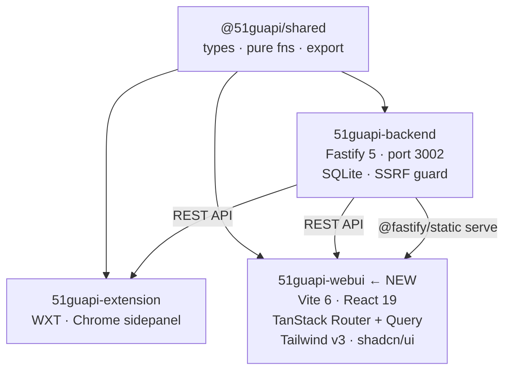
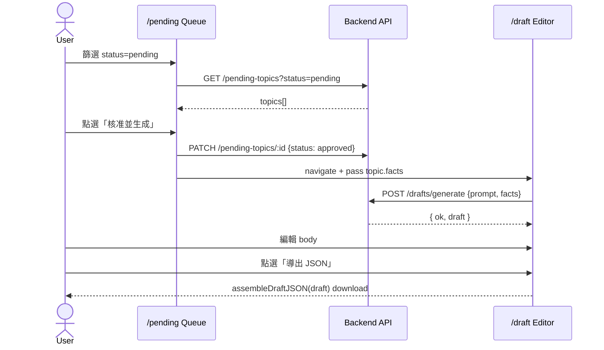
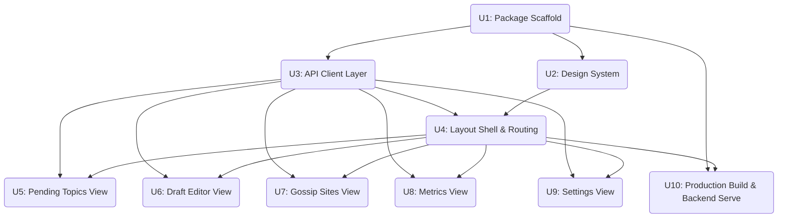

# feat: Add packages/webui — Standalone Content Dashboard SPA

## Overview

新增 `packages/webui`，一個可在瀏覽器直接使用的獨立 React SPA，不需要 Chrome 擴充套件。功能對齊現有 extension sidepanel 的五個 view（待審選題、草稿編輯、站點管理、指標、設定），採用 shadcn/ui + Tailwind v3 的現代 Dashboard 風格。生產環境透過 `@fastify/static` 掛在現有 Fastify backend（port 3002）。

## Problem Frame

現有 UI 是 Chrome extension sidepanel，有三個限制：
1. **平台鎖定**：只能在 Chromium 使用，無法在 Firefox、Safari 或行動端使用
2. **空間受限**：sidepanel 寬度 ≤480px，無法做資料密集的列表視圖（如 Pending Topics 的表格篩選）
3. **分發障礙**：別人要用需要載入擴充套件，直接存取 `http://localhost:3002` 更快

Web UI 解決以上問題，並能充分利用桌面寬螢幕做更豐富的資料視覺化。

## Requirements Trace

- R1. 新增 `packages/webui/` 作為 pnpm workspace 成員，零破壞現有 extension 和 backend
- R2. 覆蓋五個 view：Pending Queue / Draft Editor / Gossip Sites / Metrics / Settings
- R3. 複用 `@51guapi/shared` 型別與純函數（export 格式、theme 解析、draft 組裝等）
- R4. 硬約束繼承：只導出 JSON/Markdown，絕不寫回任何外部站點
- R5. HTML 正文預覽必須 DOMPurify 消毒（CLAUDE.md 安全約束）
- R6. 生產環境：`@fastify/static` 從 `packages/webui/dist/` serve，SPA fallback
- R7. 開發環境：Vite dev server port 5173，backend 設 `CORS_ORIGIN=http://localhost:5173`
- R8. 深色模式：繼承現有 CSS token 系統，`prefers-color-scheme: dark` 自動切換

## Scope Boundaries

- **不新增**後端 API：所有功能都有現存 endpoint，webui 只呼叫
- **不移除** extension：兩個 client 並存，共用 backend
- **不做** SSR 或 WebSocket：TanStack Query polling 已足夠
- **不做** 行動端最佳化（responsive 版型但不特別針對手機）
- **不做** 帳號/多使用者（個人自用工具，v0.2.5 已移除 JWT）

## Context & Research

### Relevant Code and Patterns

- `packages/extension/entrypoints/sidepanel/index.css` — 完整 design token 系統（`:root` CSS vars + dark mode）可搬移至 webui
- `packages/extension/entrypoints/sidepanel/App.tsx` — view 切換邏輯 → 轉換為 TanStack Router 路由
- `packages/extension/lib/*-client.ts` — API 呼叫模式（`apiFetch()`，無 Authorization header）
- `packages/shared/src/` — `ContentDraft`, `PendingTopic`, `GossipFactsBlock`, `Settings`, `assembleDraftJSON`, `assembleDraftMarkdown`, `assembleTopicsCSV`, `parseThemes`
- `packages/backend/src/routes/` — 完整 API endpoint 集（詳見下方 API 清單）

### API Endpoints（webui 需呼叫）

```
Health/Preflight:
  GET  /api/v1/healthz         → { ok, uptime, scheduler, database, memory, quality }
  GET  /api/v1/preflight       → { ok, checks:[{id,label,pass}] }

LLM/Draft:
  GET  /api/v1/models          → 模型列表
  POST /api/v1/drafts/generate → { prompt, settings, facts? } → { ok, draft, qualityWarnings? }
  POST /api/v1/drafts/review   → { draft, settings } → { ok, result:ReviewResult }
  POST /api/v1/drafts/rewrite  → { draft, failedDims, settings } → { ok, draft }

Gossip Sites:
  GET    /api/v1/gossip/sites
  POST   /api/v1/gossip/sites         → { name, listUrl }
  DELETE /api/v1/gossip/sites/:id
  POST   /api/v1/gossip/sites/:id/discover
  POST   /api/v1/gossip/topics/from-url → { url, siteName, windowDays? }

Pending Topics:
  GET    /api/v1/pending-topics  ?limit&status&sort_by&domain&theme&verified
  GET    /api/v1/pending-topics/themes
  GET    /api/v1/pending-topics/:id
  POST   /api/v1/pending-topics
  PATCH  /api/v1/pending-topics/:id → { status?, rejectedReason?, verified? }
  DELETE /api/v1/pending-topics/:id

Channels (SSRF allowlist):
  GET    /api/v1/channels
  POST   /api/v1/channels       → { channel, displayName? }
  DELETE /api/v1/channels/:id

Prompt Templates:
  GET/POST   /api/v1/prompts
  GET/PUT/DELETE /api/v1/prompts/:id
```

### Institutional Learnings

- **硬約束**：只導出，不寫回任何站點（`.ai-memory/project_51guapi.md`）
- **HTML 渲染 = XSS 面**：`draft.body` 如需 HTML 預覽必須 DOMPurify（CLAUDE.md）
- **API 調用**：無 Authorization header（JWT v0.2.5 已移除），`apiFetch()` 模式
- **錯誤訊息不回顯**：上游錯誤映射為固定枚舉，不洩漏 API key 或 endpoint（`docs/solutions/`）
- **CORS_ORIGIN fail-closed**：缺失或 `*` 則 backend 拒絕啟動，dev 時需顯式設定

### External References

- TanStack Router v1 file-based routing（官方文件建議 `routeTree.gen.ts` 要 commit 進 repo）
- shadcn/ui stable（`npx shadcn@latest init` 需在 `packages/webui/` 下執行）
- `@fastify/static` wildcard: false + `setNotFoundHandler` → SPA fallback 標準模式

## Key Technical Decisions

- **路由：TanStack Router v1**（而非 React Router v7）：TanStack Router v1 提供 exhaustive 編譯期型別安全（route params、search params、`<Link to>` 全部）；React Router v7 SPA mode 的 search param 型別覆蓋不完整，而本計劃 `/draft?topicId=...` 一類 search param 密集的流程型別守衛弱則會在執行期靜默出錯（打錯路徑 TypeScript 直接報錯）。
- **樣式：Tailwind v3 + shadcn/ui stable**（而非 Tailwind v4）：shadcn 對 v4 支援在 2026-06 仍 canary，不夠穩定；Tailwind v3 可直接對接現有 CSS variable 系統。
- **資料獲取：TanStack Query v5**（而非 SWR）：支援 `refetchInterval` 輪詢 + mutation invalidation + DevTools，SWR 在 CRUD mutation 場景過於簡單。
- **Design System 策略**：將 extension 的 `:root` CSS variables **搬入** `packages/webui/src/index.css`，再透過 `tailwind.config.ts` 的 `theme.extend.colors` 對接，讓 shadcn CSS vars 和 tailwind 工具類都能使用同一套 token。
- **生產 serve**：`@fastify/static` 掛 `packages/webui/dist/`，必須在所有 `/api` 路由 **之後** 註冊，`wildcard: false` + `setNotFoundHandler` 返回 `index.html`。
- **API client base URL**：存在 localStorage 的 `backendUrl`，預設 `http://localhost:3002`，Settings view 可覆寫。

## Open Questions

### Resolved During Planning

- **是否複用 extension CSS**：是，將 `:root` CSS vars 整體搬入 webui，避免兩份 token 分叉（R8）
- **是否新增 backend API**：否，現有 API 已完整覆蓋所有需求
- **Tailwind v4 vs v3**：v3，shadcn 穩定版仍依賴 v3（見 Technical Decisions）
- **batch approve/reject**：納入 U5 Pending Topics view，UI checkbox 多選 + 批量 PATCH

### Deferred to Implementation

- **Prometheus 文字格式解析**：`/metrics` 回傳純文字，需在實作時決定是否用 prom-client 型別 library 或 regex parse 關鍵 KPI
- **Draft body 預覽模式**：是否預設 HTML 渲染（需 DOMPurify）或純文字 textarea，由 UX 測試後決定
- **Prompt template 編輯器**：是否用 Monaco Editor 或簡單 `<textarea>`，取決於 bundle size 考量

## High-Level Technical Design

> *這是方向性設計，供審閱驗證，不是實作規格。實作時應按 repo 實際模式調整。*

### 包依賴關係



### 路由樹

```
/ ──redirect──▶ /pending
/pending            待審選題 Queue (Table + filter)
/pending/$id        Topic 詳情 + 一鍵生成草稿
/draft              草稿編輯器 (生成 + 編輯 + AI評審 + 導出)
/sites              Gossip 站點 + 渠道 allowlist 管理
/metrics            健康狀態 + 品質指標 tiles
/settings           Backend URL · 模型 · Prompt 模板
```

### Layout Shell

```
┌─────────────────────────────────────────────────────────────┐
│  TopBar: 吃瓜小帮手   ●後端: 連線中     v0.2.5             │
├───────────────┬─────────────────────────────────────────────┤
│  Sidebar      │  Main Content Area                          │
│  ◉ 待審選題   │                                             │
│  ○ 草稿編輯   │  (TanStack Router <Outlet/>)                │
│  ○ 站點管理   │                                             │
│  ○ 指標       │                                             │
│  ○ 設定       │                                             │
└───────────────┴─────────────────────────────────────────────┘
```

### 資料流（Pending → Draft）



## Implementation Units

### Dependency Graph



---

- [ ] **U1: Package Scaffold**

**Goal:** 建立 `packages/webui/` 基礎結構，可執行 `pnpm dev:webui` / `pnpm build:webui`。

**Requirements:** R1, R7

**Dependencies:** 無

**Files:**
- Create: `packages/webui/package.json`
- Create: `packages/webui/vite.config.ts`
- Create: `packages/webui/tsconfig.json`
- Create: `packages/webui/vitest.config.ts`
- Create: `packages/webui/index.html`
- Create: `packages/webui/src/main.tsx`
- Modify: `package.json` (root) — 新增 `dev:webui`, `build:webui` scripts
- Modify: `tsconfig.json` (root) — `references` 陣列加入 `{"path": "packages/webui"}`

**Approach:**
- `package.json` name: `51guapi-webui`，`"@51guapi/shared": "workspace:*"` 依賴，scripts 必須含 `"compile": "tsc --noEmit"`（讓 `pnpm -r compile` 含入 webui，否則 CI type-check 靜默跳過）
- Vite 6 config：`@vitejs/plugin-react` + `@tanstack/router-plugin/vite`（router 插件必須在 react 之前）
- `tsconfig.json`：repo 根目錄沒有 `tsconfig.base.json`（根目錄 `tsconfig.json` 是 project-references 檔，不可繼承）；需從頭寫完整 compiler options：`{ target: ESNext, module: ESNext, moduleResolution: bundler, jsx: react-jsx, strict: true, noUncheckedIndexedAccess: true, skipLibCheck: true }`
- `vitest.config.ts`：`{ test: { environment: 'jsdom', globals: true, setupFiles: ['./src/test-setup.ts'] }, coverage: { provider: 'v8', thresholds: { lines: 60 } } }`（React 元件測試需 jsdom）
- Biome 配置：根目錄 `biome.json` 已有規則，無需另設，僅確認 `packages/webui/src/` 在掃描路徑

**Test scenarios:**
- Happy path: `pnpm dev:webui` 啟動無報錯，`http://localhost:5173` 返回 HTML
- Happy path: `pnpm build:webui` 產出 `packages/webui/dist/index.html`
- Edge case: `import { ContentDraft } from '@51guapi/shared'` 在 webui TypeScript 可解析（需先 `pnpm --filter @51guapi/shared build`）

**Verification:** `pnpm compile`（含 webui）全綠；`pnpm build:webui` 有 dist 產物

---

- [ ] **U2: Design System**

**Goal:** 建立 Tailwind v3 + shadcn/ui 配置，將現有 extension CSS token 對接到 webui，支援 dark mode。

**Requirements:** R8

**Dependencies:** U1

**Files:**
- Create: `packages/webui/tailwind.config.ts`
- Create: `packages/webui/postcss.config.js`
- Create: `packages/webui/components.json` (shadcn 配置)
- Create: `packages/webui/src/index.css` (移植 extension `:root` token + shadcn vars)
- Create: `packages/webui/src/components/ui/` (shadcn 基礎元件)
- Create: `packages/webui/src/components/ui/button.tsx`, `card.tsx`, `badge.tsx`, `input.tsx`, `textarea.tsx`, `dialog.tsx`, `table.tsx`, `tabs.tsx`, `select.tsx`, `toast.tsx`

**Approach:**
- `src/index.css`：直接複製 extension `index.css` 的 `:root` + dark mode block，補上 shadcn 需要的 `--background`, `--foreground`, `--primary` 等 mapping（對接到現有 `--color-primary` 等 token）
- ⚠️ **Google Fonts CSP 衝突**：extension `index.css` 的 `@import url('https://fonts.googleapis.com/...')` 如直接複製，會被 backend CSP（`default-src 'self'`）阻擋。解決方案二選一：(a) 改用 system font stack（`font-family: system-ui, sans-serif`）或 (b) 在 `packages/backend/src/app.ts` 的 CSP header 加 `font-src https://fonts.googleapis.com https://fonts.gstatic.com`
- `tailwind.config.ts`：**決定使用 HSL companion 變數路徑**：在 `index.css` 為核心品牌色補 HSL channel 版本（如 `--color-primary-hsl: 243 75% 59%`），shadcn 的 `--primary` 映射到 `var(--color-primary-hsl)`，Tailwind 的 `theme.extend.colors.primary` 設為 `hsl(var(--color-primary-hsl))`。這樣 dark mode（R8）與 shadcn opacity 修飾詞（`bg-primary/50`）都能正常運作。不採用「直接 extend 寫固定色值」路徑，否則 dark mode token 系統失效。
- shadcn init 互動式問答預設答案（需在 `packages/webui/` 目錄下執行）：framework: Vite、TypeScript: Yes、tailwind config: `tailwind.config.ts`、tailwind CSS: `src/index.css`、base color: slate、CSS variables: Yes（cssVariables: true）、components alias: `@/components`、utils alias: `@/lib/utils`
- shadcn init 後 `components.json`：`tailwind.cssVariables: true`
- 安裝 shadcn 元件：Button, Card, Badge, Input, Textarea, Dialog, Table, Tabs, Select, Sonner (toast)

**Patterns to follow:**
- `packages/extension/entrypoints/sidepanel/index.css` — 現有 token 名稱與值直接沿用

**Test scenarios:**
- Happy path: 頁面在 `prefers-color-scheme: dark` 下正確切換到暗色 token
- Happy path: `<Button variant="default">` 呈現 `--color-primary` 顏色
- Test expectation: none for visual snapshot — 人工確認即可（無截圖測試基礎設施）

**Verification:** 啟動 `pnpm dev:webui`，瀏覽器開 `http://localhost:5173`，shadcn Button、Badge 元件渲染正常；切換系統深色模式，背景/文字色正確變換

---

- [ ] **U3: API Client Layer**

**Goal:** 建立型別安全的 API client 模組，所有後端呼叫統一入口，不散落在元件裡。

**Requirements:** R1, R4

**Dependencies:** U1

**Files:**
- Create: `packages/webui/src/lib/api-client.ts` — base `apiFetch()` + base URL from localStorage
- Create: `packages/webui/src/api/pending.ts`
- Create: `packages/webui/src/api/gossip.ts`
- Create: `packages/webui/src/api/draft.ts`
- Create: `packages/webui/src/api/metrics.ts`
- Create: `packages/webui/src/api/channels.ts`
- Create: `packages/webui/src/api/prompts.ts`
- Test: `packages/webui/src/api/*.test.ts`

**Approach:**
- `api-client.ts`：`getBaseUrl()` 讀 localStorage `guapi_backend_url`，fallback `http://localhost:3002`；`apiFetch<T>(path, init?)` → 含 `Content-Type: application/json`，無 Authorization（對齊 extension 的 `apiFetch()`）
- 錯誤處理：HTTP 非 2xx 時拋出帶 status 的 `ApiError`；上游錯誤訊息映射為 enum，不回顯原始 message（對齊 `docs/solutions/` 安全規範）
- 每個 API 模組導出函數：`listPendingTopics(params)`, `patchPendingTopic(id, body)`, `generateDraft(body)`, `listGossipSites()`, `getHealthz()` 等——回傳型別直接用 `@51guapi/shared` 型別

**Patterns to follow:**
- `packages/extension/lib/pending-client.ts` — 函數簽名和 error 處理模式

**Test scenarios:**
- Happy path: `listPendingTopics({ status: 'pending' })` 呼叫 `GET /api/v1/pending-topics?status=pending`，返回解析後型別
- Error path: 後端 500 時，`apiFetch` 拋 `ApiError`（message 不含上游 raw message）
- Error path: 後端離線時，`apiFetch` 拋 `NetworkError`（不回顯 connection URL）
- Edge case: `getBaseUrl()` fallback 到 `http://localhost:3002` 當 localStorage 無值

**Verification:** `npx vitest run src/api/` 全綠

---

- [ ] **U4: Layout Shell & Routing**

**Goal:** 建立 TanStack Router 路由樹與 sidebar + topbar 的 Dashboard 版型。

**Requirements:** R1, R2

**Dependencies:** U2, U3

**Files:**
- Create: `packages/webui/src/routes/__root.tsx` — 根 layout (sidebar + topbar + `<Outlet/>`)
- Create: `packages/webui/src/routes/index.tsx` — redirect to `/pending`
- Create: `packages/webui/src/routes/pending/index.tsx` — placeholder
- Create: `packages/webui/src/routes/pending/$id.tsx` — placeholder
- Create: `packages/webui/src/routes/draft.tsx` — placeholder（**必須在此聲明 search param schema**：`validateSearch: (search) => ({ topicId: search.topicId as string | undefined })`，否則 U6 的 topicId 讀取在 TypeScript 層不可用）
- Create: `packages/webui/src/routes/sites.tsx` — placeholder
- Create: `packages/webui/src/routes/metrics.tsx` — placeholder
- Create: `packages/webui/src/routes/settings.tsx` — placeholder
- Create: `packages/webui/src/components/layout/Sidebar.tsx`
- Create: `packages/webui/src/components/layout/TopBar.tsx`
- Create: `packages/webui/src/routeTree.gen.ts` (TanStack Router 自動生成，要 commit)

**Approach:**
- `__root.tsx`：`<div class="flex h-screen">` → `<Sidebar/>` (w-52 fixed) + `<main class="flex-1 overflow-auto">` + `<Outlet/>`
- `TopBar`：左：app 名稱 "吃瓜小帮手"，版本號從 `GET /api/v1/healthz` 回傳的 `version` 欄位讀取（避免 hardcode，確保顯示 backend 版本）；右：後端連線狀態 pill（同一 `getHealthz()` 呼叫，每 30s 輪詢；**注意：U4 的 TopBar 健康 pill 用簡單 `useEffect + fetch + setInterval` 實作，不引入 QueryClientProvider——QueryClientProvider 在 U5 第一次出現 mutation 時才設定**）
- `Sidebar`：5 個 nav items，用 TanStack Router `<Link>` + active state 樣式；icon 用 lucide-react（shadcn 已內建）
- router 插件在 `vite.config.ts` dev 模式下自動更新 `routeTree.gen.ts`，CI 需 `tsc --noEmit` 驗證型別

**Patterns to follow:**
- TanStack Router 官方 `createFileRoute` 模式

**Test scenarios:**
- Happy path: 訪問 `/` 自動 redirect 到 `/pending`
- Happy path: sidebar 各連結點擊後 URL 和 active 樣式正確更新
- Integration: TopBar 後端狀態 pill 在 `getHealthz()` 失敗時顯示「離線」badge（紅色）

**Verification:** `pnpm dev:webui`，在瀏覽器手動驗證 6 條路由可訪問，sidebar active 狀態正確

---

- [ ] **U5: Pending Topics View**

**Goal:** 待審選題的核心工作流 — 篩選、預覽、核准/拒絕、一鍵生成草稿、批量操作。

**Requirements:** R2, R3, R4

**Dependencies:** U4, U3

**Files:**
- Modify: `packages/webui/src/routes/pending/index.tsx`
- Modify: `packages/webui/src/routes/pending/$id.tsx`
- Create: `packages/webui/src/components/pending/TopicsTable.tsx`
- Create: `packages/webui/src/components/pending/TopicFilters.tsx`
- Create: `packages/webui/src/components/pending/TopicDetailSheet.tsx`
- Create: `packages/webui/src/components/pending/RejectDialog.tsx`
- Create: `packages/webui/src/hooks/usePendingTopics.ts` (TanStack Query)
- Test: `packages/webui/src/hooks/usePendingTopics.test.ts`

**Approach:**
- `usePendingTopics(params)` — `useQuery({ queryKey: ['pending', params], queryFn: () => listPendingTopics(params), refetchInterval: 5_000 })`
- 篩選 bar：shadcn `<Tabs>` 切換 status（pending/approved/rejected/全部）+ theme pills（來自 `GET /pending-topics/themes`）+ search input（client-side filter on title）
- Table：shadcn `<Table>`；欄位：checkbox | 標題 | 站點 | 分數 | 狀態 badge | 建立時間 | 操作；行展開 or 右側 Sheet 顯示 facts detail
- 核准：`useMutation({ mutationFn: approve, onSettled: invalidate })` → 更新 status + 可選 navigate to `/draft?topicId=:id`
- 拒絕：`<RejectDialog>` 選 rejectedReason（DropdownMenu），PATCH status=rejected
- 批量操作：選中 rows 後浮現 action bar（approve all / reject all / delete all）；**實作為 `Promise.allSettled` over N 個 `PATCH /pending-topics/:id` 呼叫**（後端無 bulk endpoint，scope boundary 也不新增 API）；部分失敗時顯示「M/N 成功」toast，不回滾已成功的操作（個人工具可接受）
- CSV 導出：client-side `assembleTopicsCSV(selectedTopics)` + `URL.createObjectURL()`（此為直接移植 extension `lib/export.ts` 的同名函數，非新邏輯）

**Patterns to follow:**
- `packages/extension/entrypoints/sidepanel/PendingTopicsView.tsx` — 現有 UX 邏輯參考
- `@51guapi/shared` 的 `assembleTopicsCSV`, `parseThemes`, `countThemes`

**Test scenarios:**
- Happy path: `usePendingTopics({ status: 'pending' })` 返回 topic 列表，Table 正確渲染
- Happy path: 點「核准」→ PATCH `/pending-topics/:id` → query invalidate → 列表更新
- Happy path: CSV 導出按鈕對選中 topics 產出正確 CSV 格式（用 `assembleTopicsCSV`）
- Edge case: topics 為空時顯示 empty state（"目前無待審選題"）
- Error path: PATCH 失敗時 toast 顯示錯誤，不更新列表狀態
- Integration: 拒絕後 status badge 立即從 pending 變為 rejected（optimistic update 或 invalidate 皆可）

**Verification:** 手動在 dev 環境核准 / 拒絕數筆 topic，列表實時更新；CSV 下載內容格式正確

---

- [ ] **U6: Draft Editor View**

**Goal:** LLM 草稿生成、文字編輯、AI 品質評審、JSON/Markdown 導出。

**Requirements:** R2, R3, R4, R5

**Dependencies:** U4, U3

**Files:**
- Modify: `packages/webui/src/routes/draft.tsx`
- Create: `packages/webui/src/components/draft/DraftEditor.tsx`
- Create: `packages/webui/src/components/draft/DraftPreview.tsx` (DOMPurify HTML render)
- Create: `packages/webui/src/components/draft/QualityReviewPanel.tsx`
- Create: `packages/webui/src/components/draft/ExportPanel.tsx`
- Create: `packages/webui/src/hooks/useDraftGeneration.ts`
- Test: `packages/webui/src/components/draft/DraftEditor.test.tsx`

**Approach:**
- 路由接收 `topicId` search param（來自 pending view navigate），自動 `GET /pending-topics/:topicId` 預填 topic 和 facts
- 生成面板：主題 input + 設定摘要（model/backend URL from settings） + 「生成草稿」button（disabled when generating）
- 生成狀態：shadcn Skeleton 佔位 + Progress bar，`useMutation` + `POST /drafts/generate`
- 草稿編輯：`<textarea>` 顯示 `draft.body`（純文字模式）；若使用者切換到「HTML 預覽」tab，則用 DOMPurify.sanitize(draft.body) 後 `dangerouslySetInnerHTML`（R5）
- AI 評審：`POST /drafts/review` → `<QualityReviewPanel>` 顯示各 dimension 的 pass/fail badge + reason；失敗 dims 可觸發 `POST /drafts/rewrite`
- 導出：`assembleDraftJSON(draft)` / `assembleDraftMarkdown(draft)` 後 `URL.createObjectURL()` 觸發下載
- localStorage 自動儲存（`useEffect` debounced 1s）

**Patterns to follow:**
- `packages/extension/entrypoints/sidepanel/DraftPreview.tsx` — **`DraftPreview.tsx` 是此 extension 元件的直接 port（移除 chrome.storage 依賴即可），非全新邏輯**；DOMPurify 消毒路徑必須與 extension 版本保持一致，code review 時應與原始元件 diff 確認，而非當作全新實作 review
- `packages/extension/entrypoints/sidepanel/ExportPanel.tsx` — 導出邏輯（`assembleDraftJSON`）
- `@51guapi/shared` 的 `assembleDraftJSON`, `assembleDraftMarkdown`

**Test scenarios:**
- Happy path: `useDraftGeneration()` 呼叫 `POST /drafts/generate`，success 時設 draft state
- Happy path: `assembleDraftJSON(draft)` 輸出符合 `ExportedDraft` schema 的 JSON
- Happy path: 「HTML 預覽」mode — DOMPurify.sanitize 移除 `<script>` 標籤，不拋錯
- Error path: 生成失敗（no-key / backend offline）時顯示 toast，不更新 draft
- Edge case: `topicId` search param 無效（404）時顯示警告，仍可手動輸入主題
- Integration: 導出 JSON 後用 `JSON.parse` 驗證 `schemaVersion` 欄位存在

**Verification:** 完整跑一次「Pending → 核准 → 生成 → 編輯 → 導出 JSON」流程

---

- [ ] **U7: Gossip Sites View**

**Goal:** Gossip 站點 CRUD 管理 + 渠道（SSRF allowlist）管理。

**Requirements:** R2

**Dependencies:** U4, U3

**Files:**
- Modify: `packages/webui/src/routes/sites.tsx`
- Create: `packages/webui/src/components/sites/GossipSitesTable.tsx`
- Create: `packages/webui/src/components/sites/AddSiteDialog.tsx`
- Create: `packages/webui/src/components/sites/ChannelsTable.tsx`
- Create: `packages/webui/src/components/sites/AddChannelDialog.tsx`
- Test: `packages/webui/src/routes/sites.test.tsx`

**Approach:**
- 兩個並排 Card：「Gossip 站點」+ 「渠道 Allowlist」；版型：`xl:grid-cols-2`（桌面並排），`<xl` 改 `flex-col`（單欄堆疊）
- Gossip 站點 table：name, listUrl, 「觸發發現」button（POST /gossip/sites/:id/discover → success toast 顯示 discovered count）, 刪除
- 渠道 table：hostname, displayName, 建立時間, 刪除
- Add dialogs：InputField 驗證 + submit mutation + invalidate
- 頁面顯示渠道說明文字：「渠道是 SSRF allowlist，只有在此列的域名才可爬取」

**Test scenarios:**
- Happy path: `listGossipSites()` 返回站點列表，table 正確渲染
- Happy path: 「觸發發現」→ POST → success toast 顯示「已發現 N 條選題」
- Error path: 新增無效 URL（非 https）→ backend 400 → Dialog 內顯示 inline error
- Edge case: 渠道列表為空時顯示 empty state + 新增引導
- Security: `POST /api/v1/channels` 呼叫**只能**由 `AddChannelDialog` 的明確使用者手勢觸發，不能由爬取 pipeline 或 LLM 回傳資料觸發（對齊 CLAUDE.md：爬取管線/LLM 不可觸發 allowlist 寫入）

**Verification:** 手動新增站點 + 渠道，觸發發現，確認選題出現在 `/pending`

---

- [ ] **U8: Metrics View**

**Goal:** 系統健康狀態與品質指標可視化（tiles + check list）。

**Requirements:** R2

**Dependencies:** U4, U3

**Files:**
- Modify: `packages/webui/src/routes/metrics.tsx`
- Create: `packages/webui/src/components/metrics/HealthTiles.tsx`
- Create: `packages/webui/src/components/metrics/PreflightChecks.tsx`

**Approach:**
- `GET /api/v1/healthz` — 展示 uptime、scheduler status、memory、quality（每 30s 輪詢）
- `GET /api/v1/preflight` — checks 列表，每項顯示 pass/fail badge
- metrics tile：4 欄 grid（類似 extension 的 `stats-grid`），數字大字 + 標籤小字；**載入狀態**：資料返回前用 shadcn `<Skeleton>`（每個 tile：`<Skeleton className="h-16 w-full" />`）
- Prometheus 文字格式（`GET /metrics`）：選擇性顯示，或跳過直接用 healthz 的 quality 欄位

**Test scenarios:**
- Happy path: `getHealthz()` 返回後正確渲染 uptime tile（秒→分鐘轉換）
- Edge case: scheduler 為 stopped 時顯示警告 badge
- Error path: backend 離線時整個 metrics view 顯示「後端離線」空態

**Verification:** dev 環境確認 healthz + preflight 資料正確顯示

---

- [ ] **U9: Settings View**

**Goal:** 管理 backend URL、LLM 設定、Prompt 模板，儲存在 localStorage 供其他 view 讀取。

**Requirements:** R2

**Dependencies:** U4, U3

**Files:**
- Modify: `packages/webui/src/routes/settings.tsx`
- Create: `packages/webui/src/components/settings/BackendSection.tsx`
- Create: `packages/webui/src/components/settings/LLMSection.tsx`
- Create: `packages/webui/src/components/settings/PromptSection.tsx`
- Create: `packages/webui/src/lib/settings-store.ts` (localStorage read/write)

**Approach:**
- Backend 區塊：URL input + 「測試連線」button（GET /healthz + 顯示 ok/error）
- LLM 區塊：model select（GET /api/v1/models + `<Select>`）、fallback model
- Prompt 模板區塊：`GET /api/v1/prompts` 列表 + 選擇 + inline 編輯 `<Textarea>` + PUT
- 所有設定按「儲存」後同時寫入 localStorage 和觸發相關 API（prompt 模板 PUT）
- `settings-store.ts`：`getSettings()` / `saveSettings()` — key-value store on `localStorage`
- ⚠️ **與 extension 設定完全獨立**：`settings-store.ts` 儲存在 browser `localStorage`，extension 使用 `chrome.storage`（key: `local:settings`），兩者**不同步**。在 webui 改動 backend URL 或 model，不會影響 extension 讀取的值，反之亦然。這是設計如此（兩個獨立 client）。

**Test scenarios:**
- Happy path: 輸入有效 URL + 測試連線 → `getHealthz()` 成功 → 「✓ 連線正常」badge
- Error path: 測試連線失敗（後端離線）→ 顯示「✗ 無法連線」，URL 不儲存
- Happy path: 選擇模型後 localStorage 正確更新，重新整理頁面後 model select 顯示已選值
- Integration: Settings 改 backend URL → `getBaseUrl()` 下次呼叫立即使用新 URL

**Verification:** 修改 backend URL → 回到 /metrics → 確認 healthz 呼叫打到新 URL

---

- [ ] **U10: Production Build & Backend Serve**

**Goal:** `pnpm build:webui` 產物由 Fastify backend serve，single-origin 無 CORS 問題。

**Requirements:** R6

**Dependencies:** U1（prod build），U4（完整路由 SPA）

**Files:**
- Modify: `packages/backend/src/index.ts` — 新增 `@fastify/static` 掛載 + SPA fallback
- Modify: `packages/backend/package.json` — 新增 `@fastify/static` 依賴
- Modify: `packages/backend/.env.example` — 新增 `SERVE_WEBUI=true` 說明
- Modify: `package.json` (root) — 新增 `build:webui` script（`pnpm --filter 51guapi-webui build`）
- Modify: `scripts/check-all.sh` — 在 build check 加入 `pnpm build:webui` + 產物驗證
- Modify: `.github/workflows/ci.yml` — Build step 加入 webui build（`pnpm --filter 51guapi-webui build`）+ 產物斷言（`test -f packages/webui/dist/index.html`）
- Modify: `CLAUDE.md` — 新增 `dev:webui` 和生產訪問說明

**Approach:**
- `@fastify/static` 必須在所有 `/api` 路由之後 register
- **dist 存在守衛**：register 前先 `fs.existsSync(webuiDistPath)` 確認；不存在則 `server.log.warn('webui dist not found, skipping static serve')` 跳過，不 crash（dev 環境在 build:webui 前可正常啟動）
- `wildcard: false` + **`setNotFoundHandler` 需 URL 前綴判斷**（否則 `/api/*` 404 靜默返回 HTML 200 會破壞 extension client）：
  ```
  if (req.url.startsWith('/api/')) {
    reply.code(404).send({ ok: false, error: 'Not Found' })
  } else {
    reply.sendFile('index.html')
  }
  ```
- index.html `maxAge: 0`，hashed assets 可 `maxAge: '30d'`
- 開發模式（`NODE_ENV=development`）跳過靜態 serve（或設 `SERVE_WEBUI` env 控制）
- `scripts/check-all.sh` 加 webui 產物驗證：`if [ ! -f 'packages/webui/dist/index.html' ]; then echo 'Error: webui artifact missing!'; exit 1; fi`

**Execution note:** 先確認 `packages/backend/src/index.ts` 的路由注冊順序再改，避免靜態服務攔截 API 路由。

**Test scenarios:**
- Happy path: `pnpm build:webui && pnpm dev:backend` → `curl http://localhost:3002/` 返回 `index.html`
- Happy path: `curl http://localhost:3002/api/v1/healthz` 仍正常（靜態 serve 不攔截 /api）
- Integration: `curl http://localhost:3002/pending` 返回 `index.html`（SPA fallback）
- Edge case: `packages/webui/dist/` 不存在時，backend 正常啟動但記錄警告（不 crash）

**Verification:** 訪問 `http://localhost:3002/` 看到 webui，`/api/v1/healthz` 仍正常回應

---

## System-Wide Impact

- **Interaction graph:** Backend CORS 白名單需加 `http://localhost:5173`（dev）；生產同 origin 無影響。`@fastify/static` 的 `setNotFoundHandler` 會覆蓋 Fastify 預設 404，需確認不影響 `/api/*` 404 回應。
- **Error propagation:** webui 的 `apiFetch` 捕捉 HTTP 錯誤映射為 `ApiError`；上游錯誤 message 不回顯（只用 status code + 固定 enum）
- **State lifecycle risks:** Draft 自動儲存在 localStorage，跨 tab 可能有狀態衝突（個人自用工具，暫接受）
- **API surface parity:** extension 和 webui 呼叫完全相同的後端 API，後端無需改動
- **Integration coverage:** Pending → Draft 跨 view 導航（URL search param `topicId`）是最重要的跨層整合點，需手動測試完整流程
- **Unchanged invariants:** 後端所有現有 API endpoint 的 request/response schema 不變；extension 的所有功能和行為不受影響；`@51guapi/shared` 不增加任何新型別（webui 只消費，不貢獻）

## Risks & Dependencies

| Risk | Mitigation |
|------|------------|
| shadcn/ui 某版本元件與 Tailwind v3 config 相容問題 | init 時鎖定版本，若 issue 改用 Radix UI 原始元件 |
| `routeTree.gen.ts` 過期，CI type-check 靜默對舊樹跑（誤以為通過） | CI 中 `tsc --noEmit` 前先執行 `pnpm --filter 51guapi-webui exec tsr generate`，再 `git diff --exit-code packages/webui/src/routeTree.gen.ts`；不一致則 fail（防止 stale gen 蒙混過關） |
| `@fastify/static` + SPA fallback 攔截 `/api` 路由 | route 注冊順序：`api routes` → `static`；integration test 驗證 `/api/v1/healthz` 不受影響 |
| DOMPurify 未加入但加入 HTML 預覽 | U6 的 `DraftPreview.tsx` 在 `dangerouslySetInnerHTML` 之前強制 `DOMPurify.sanitize()`；code review 必查 |
| `@51guapi/shared` build 順序：webui `import` 前 shared 必須先 emit `dist/` | pnpm `-r` 已有拓扑序，加入 `build:webui` 時確認 `pnpm --filter @51guapi/shared build` 先跑 |

## Documentation / Operational Notes

- `packages/backend/.env.example` 更新 CORS_ORIGIN（**附加**，不是取代）：`CORS_ORIGIN=chrome-extension://iljimdgfajpgnmanklehhmapojbcjecd,http://localhost:5173`（逗號分隔，兩個值**必須同時存在**；生產模式可移除 `,http://localhost:5173` 後綴，但 `chrome-extension://` 前綴**必須保留**，否則 extension client 被 CORS 封鎖；若兩個值都移除則 backend fail-closed 拒絕啟動）
- `CLAUDE.md` 新增開發命令：`pnpm dev:webui`（port 5173）；`pnpm build:webui`（產出 dist/）；訪問 `http://localhost:3002`（生產 serve）
- 構建順序說明：`@51guapi/shared build` → `webui build`

## Sources & References

- Related code: `packages/extension/entrypoints/sidepanel/` (功能對照)
- Related code: `packages/extension/lib/*-client.ts` (API client 模式)
- Related code: `packages/backend/src/routes/` (API endpoint 完整集)
- External docs: TanStack Router v1 file-based routing (route tree commit pattern)
- External docs: shadcn/ui monorepo setup (`init` 需在子包目錄執行)
- External docs: `@fastify/static` wildcard: false + SPA fallback pattern
